multiclass\_classification
================
Ilya
10/25/2019

\#\#based on code here: <https://rpubs.com/mharris/multiclass_xgboost>

\#\#\#\#\#install packages

    ## Loading required package: lattice

    ## Loading required package: ggplot2

    ## 
    ## Attaching package: 'dplyr'

    ## The following object is masked from 'package:xgboost':
    ## 
    ##     slice

    ## The following objects are masked from 'package:stats':
    ## 
    ##     filter, lag

    ## The following objects are masked from 'package:base':
    ## 
    ##     intersect, setdiff, setequal, union

    ## randomForest 4.6-14

    ## Type rfNews() to see new features/changes/bug fixes.

    ## 
    ## Attaching package: 'randomForest'

    ## The following object is masked from 'package:dplyr':
    ## 
    ##     combine

    ## The following object is masked from 'package:ggplot2':
    ## 
    ##     margin

    ## Loaded gbm 2.1.5

    ## Loading required package: gplots

    ## 
    ## Attaching package: 'gplots'

    ## The following object is masked from 'package:stats':
    ## 
    ##     lowess

    ## Loading required package: rquery

    ## 
    ## Attaching package: 'rquery'

    ## The following object is masked from 'package:ggplot2':
    ## 
    ##     arrow

    ## Loading required package: Matrix

    ## Loading required package: foreach

    ## Loaded glmnet 2.0-18

Here is where we:

Load the RBGlass1 dataset convert the variable Site from a factor to
numeric Simulate a third class (furnace) from the data Bind the new
class to the original data Subtract 1 from the Site names so they start
at 0 Print out a summary() The XGBoost algorithm requires that the class
labels (Site names) start at 0 and increase sequentially to the maximum
number of classes. This is a bit of an inconvenience as you need to keep
track of what Site name goes with which label. Also, you need to be very
careful when you add or remove a 1 to go from the zero based labels to
the 1 based labels.

The simulated class is created by taking the data from Site == 1,
creating an offset ./10 and adding that back to the same value with some
random normal noise rnorm(1,.,.\*0.1) proportional to the value. You can
pretty much ignore this.

``` r
# set random seed
set.seed(717)
data(RBGlass1)
dat <- RBGlass1 
dat$Site <- as.numeric(dat$Site)
dat_add <- dat[which(dat$Site == 1),] %>%
  rowwise() %>%
  mutate_each(funs(./10 + rnorm(1,.,.*0.1))) %>%
  mutate_each(funs(round(.,2))) %>%
  mutate(Site = 3)
```

    ## Warning: funs() is soft deprecated as of dplyr 0.8.0
    ## Please use a list of either functions or lambdas: 
    ## 
    ##   # Simple named list: 
    ##   list(mean = mean, median = median)
    ## 
    ##   # Auto named with `tibble::lst()`: 
    ##   tibble::lst(mean, median)
    ## 
    ##   # Using lambdas
    ##   list(~ mean(., trim = .2), ~ median(., na.rm = TRUE))
    ## This warning is displayed once per session.

``` r
dat <- rbind(dat, dat_add) %>%
  mutate(Site = Site - 1)

summary(dat)
```

    ##       Site         Al              Fe               Mg        
    ##  Min.   :0   Min.   :2.060   Min.   :0.3200   Min.   :0.3900  
    ##  1st Qu.:0   1st Qu.:2.330   1st Qu.:0.4900   1st Qu.:0.5300  
    ##  Median :1   Median :2.450   Median :0.6550   Median :0.5500  
    ##  Mean   :1   Mean   :2.479   Mean   :0.6626   Mean   :0.5594  
    ##  3rd Qu.:2   3rd Qu.:2.592   3rd Qu.:0.8200   3rd Qu.:0.5800  
    ##  Max.   :2   Max.   :3.120   Max.   :1.3600   Max.   :0.7200  
    ##        Ca               Na              K                Ti        
    ##  Min.   : 4.890   Min.   :13.66   Min.   :0.4800   Min.   :0.0600  
    ##  1st Qu.: 6.360   1st Qu.:17.36   1st Qu.:0.6700   1st Qu.:0.0800  
    ##  Median : 6.825   Median :18.34   Median :0.7200   Median :0.1000  
    ##  Mean   : 6.998   Mean   :18.57   Mean   :0.7349   Mean   :0.0978  
    ##  3rd Qu.: 7.503   3rd Qu.:19.68   3rd Qu.:0.7725   3rd Qu.:0.1100  
    ##  Max.   :10.620   Max.   :24.58   Max.   :1.5400   Max.   :0.1600  
    ##        P                Mn               Sb               Pb         
    ##  Min.   :0.0900   Min.   :0.0700   Min.   :0.0000   Min.   :0.01000  
    ##  1st Qu.:0.1100   1st Qu.:0.2500   1st Qu.:0.0850   1st Qu.:0.02000  
    ##  Median :0.1300   Median :0.2800   Median :0.2700   Median :0.03000  
    ##  Mean   :0.1282   Mean   :0.3244   Mean   :0.2225   Mean   :0.03073  
    ##  3rd Qu.:0.1400   3rd Qu.:0.3825   3rd Qu.:0.3200   3rd Qu.:0.04000  
    ##  Max.   :0.2200   Max.   :0.9000   Max.   :0.5300   Max.   :0.09000

\#\#\#\#train and test split

``` r
# Make split index
train_index <- sample(1:nrow(dat), nrow(dat)*0.75)
# Full data set
data_variables <- as.matrix(dat[,-1])
data_label <- dat[,"Site"]
data_matrix <- xgb.DMatrix(data = as.matrix(dat), label = data_label)
# split train data and make xgb.DMatrix
train_data   <- data_variables[train_index,]
train_label  <- data_label[train_index]
train_matrix <- xgb.DMatrix(data = train_data, label = train_label)
# split test data and make xgb.DMatrix
test_data  <- data_variables[-train_index,]
test_label <- data_label[-train_index]
test_matrix <- xgb.DMatrix(data = test_data, label = test_label)
```

\#\#\#\#K-folds Cross-validation to Estimate Error set the objective to
multi:softprob and the eval\_metric to mlogloss. These two parameters
tell the XGBoost algorithm that we want to to probabilistic
classification and use a multiclass logloss as our evaluation metric.
Use of the multi:softprob objective also requires that we tell is the
number of classes we have with num\_class

``` r
numberOfClasses <- length(unique(dat$Site))
xgb_params <- list("objective" = "multi:softprob",
                   "eval_metric" = "mlogloss",
                   "num_class" = numberOfClasses)
nround    <- 50 # number of XGBoost rounds
cv.nfold  <- 5

# Fit cv.nfold * cv.nround XGB models and save OOF predictions
cv_model <- xgb.cv(params = xgb_params,
                   data = train_matrix, 
                   nrounds = nround,
                   nfold = cv.nfold,
                   verbose = FALSE,
                   prediction = TRUE)
```

\#\#\#\#Assess Out-of-Fold Prediction Error

``` r
OOF_prediction <- data.frame(cv_model$pred) %>%
  mutate(max_prob = max.col(., ties.method = "last"),
         label = train_label + 1)
head(OOF_prediction)
```

    ##           X1          X2          X3 max_prob label
    ## 1 0.08967378 0.019084143 0.891242146        3     2
    ## 2 0.03876708 0.957451046 0.003781835        2     2
    ## 3 0.40387401 0.005780077 0.590345919        3     3
    ## 4 0.74101967 0.241375476 0.017604856        1     3
    ## 5 0.80737162 0.187277868 0.005350541        1     2
    ## 6 0.40329969 0.428810209 0.167890161        2     2

#### confusion matrix

``` r
# confusion matrix
confusionMatrix(factor(OOF_prediction$max_prob),
                factor(OOF_prediction$label),
                mode = "everything")
```

    ## Confusion Matrix and Statistics
    ## 
    ##           Reference
    ## Prediction  1  2  3
    ##          1 34  6  5
    ##          2  7 25  1
    ##          3  4  2 39
    ## 
    ## Overall Statistics
    ##                                           
    ##                Accuracy : 0.7967          
    ##                  95% CI : (0.7148, 0.8639)
    ##     No Information Rate : 0.3659          
    ##     P-Value [Acc > NIR] : <2e-16          
    ##                                           
    ##                   Kappa : 0.6922          
    ##                                           
    ##  Mcnemar's Test P-Value : 0.9142          
    ## 
    ## Statistics by Class:
    ## 
    ##                      Class: 1 Class: 2 Class: 3
    ## Sensitivity            0.7556   0.7576   0.8667
    ## Specificity            0.8590   0.9111   0.9231
    ## Pos Pred Value         0.7556   0.7576   0.8667
    ## Neg Pred Value         0.8590   0.9111   0.9231
    ## Precision              0.7556   0.7576   0.8667
    ## Recall                 0.7556   0.7576   0.8667
    ## F1                     0.7556   0.7576   0.8667
    ## Prevalence             0.3659   0.2683   0.3659
    ## Detection Rate         0.2764   0.2033   0.3171
    ## Detection Prevalence   0.3659   0.2683   0.3659
    ## Balanced Accuracy      0.8073   0.8343   0.8949

\#\#\#Train Full Model and Assess Test Set Error

``` r
bst_model <- xgb.train(params = xgb_params,
                       data = train_matrix,
                       nrounds = nround)

# Predict hold-out test set
test_pred <- predict(bst_model, newdata = test_matrix)
test_prediction <- matrix(test_pred, nrow = numberOfClasses,
                          ncol=length(test_pred)/numberOfClasses) %>%
  t() %>%
  data.frame() %>%
  mutate(label = test_label + 1,
         max_prob = max.col(., "last"))
# confusion matrix of test set
confusionMatrix(factor(test_prediction$max_prob),
                factor(test_prediction$label),
                mode = "everything")
```

    ## Confusion Matrix and Statistics
    ## 
    ##           Reference
    ## Prediction  1  2  3
    ##          1 13  2  0
    ##          2  1 10  2
    ##          3  0  1 12
    ## 
    ## Overall Statistics
    ##                                           
    ##                Accuracy : 0.8537          
    ##                  95% CI : (0.7083, 0.9443)
    ##     No Information Rate : 0.3415          
    ##     P-Value [Acc > NIR] : 1.862e-11       
    ##                                           
    ##                   Kappa : 0.7804          
    ##                                           
    ##  Mcnemar's Test P-Value : NA              
    ## 
    ## Statistics by Class:
    ## 
    ##                      Class: 1 Class: 2 Class: 3
    ## Sensitivity            0.9286   0.7692   0.8571
    ## Specificity            0.9259   0.8929   0.9630
    ## Pos Pred Value         0.8667   0.7692   0.9231
    ## Neg Pred Value         0.9615   0.8929   0.9286
    ## Precision              0.8667   0.7692   0.9231
    ## Recall                 0.9286   0.7692   0.8571
    ## F1                     0.8966   0.7692   0.8889
    ## Prevalence             0.3415   0.3171   0.3415
    ## Detection Rate         0.3171   0.2439   0.2927
    ## Detection Prevalence   0.3659   0.3171   0.3171
    ## Balanced Accuracy      0.9272   0.8310   0.9101

\#\#\#Variable Importance

``` r
# get the feature real names
names <-  colnames(dat[,-1])
# compute feature importance matrix
importance_matrix = xgb.importance(feature_names = names, model = bst_model)
head(importance_matrix)
```

    ##    Feature       Gain      Cover Frequency
    ## 1:      Na 0.19451014 0.16795320 0.1216407
    ## 2:      Ca 0.18628258 0.16455912 0.1456860
    ## 3:      Mg 0.18501053 0.14465977 0.1287129
    ## 4:      Fe 0.15362100 0.13760940 0.1216407
    ## 5:      Mn 0.10301000 0.10585287 0.1159830
    ## 6:      Al 0.08572768 0.09785265 0.1202263

``` r
# plot
gp = xgb.ggplot.importance(importance_matrix)
print(gp) 
```

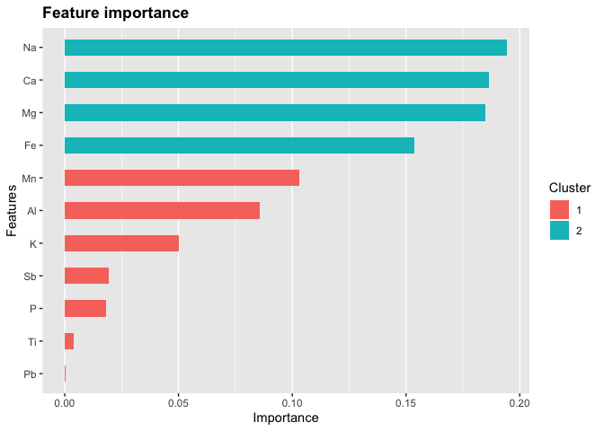<!-- -->
\#\#\#load and merge the 1) rodent trait data and 2) rodent - disease
data 3) disease – tx mode data 4) climate data

``` r
traits = read.csv("dfPanRodent_imputed.csv")
names(traits)
```

    ##  [1] "X"                             "X5.1_AdultBodyMass_g"         
    ##  [3] "X13.1_AdultHeadBodyLen_mm"     "X2.1_AgeatEyeOpening_d"       
    ##  [5] "X18.1_BasalMetRate_mLO2hr"     "X9.1_GestationLen_d"          
    ##  [7] "X22.1_HomeRange_km2"           "X15.1_LitterSize"             
    ##  [9] "X16.1_LittersPerYear"          "X5.3_NeonateBodyMass_g"       
    ## [11] "X21.1_PopulationDensity_n.km2" "X23.1_SexualMaturityAge_d"    
    ## [13] "X24.1_TeatNumber"              "X25.1_WeaningAge_d"           
    ## [15] "X26.1_GR_Area_km2"             "MSW05_Order"                  
    ## [17] "MSW05_Family"                  "MSW05_Genus"                  
    ## [19] "MSW05_Species"                 "MSW05_Binomial"

``` r
traits$Pan = paste(traits$MSW05_Genus,
                   traits$MSW05_Species,
                   sep = "_")

#host - rodent-disease pairs from GIDEON.csv
dx_host = read.csv("host - rodent-disease pairs from GIDEON.csv")

dx_host_traits = merge(traits, dx_host)

#host - rodent-disease transmission modes_20190413.csv
modes = read.csv("host - rodent-disease transmission modes_20190413.csv")
names(modes)[names(modes)=="Zoonoses.with.rodent.reservoirs"]="Matches"
modes = modes[,c("Matches",
                 "transmission.mode.to.humans.simplified")]
dx_modes_host_traits = merge(dx_host_traits,
                             modes, by = "Matches")

dx_modes_host_traits$Pan = str_replace(string = dx_modes_host_traits$Pan,pattern = "_",
            replacement = " ")

load("climate_envelope.rdata")

#these are the same length
length(intersect(xclim_all$binomial,dx_modes_host_traits$Pan))
```

    ## [1] 134

``` r
length(intersect(xclim_all$IUCN_binom,dx_modes_host_traits$Pan))
```

    ## [1] 134

``` r
names(xclim_all)[names(xclim_all)=="binomial"]="Pan"

dx_modes_host_traits_climate = merge(dx_modes_host_traits,xclim_all)
#remove fields no longer needed
rm = c("Matches", "Pan", "X",
       "MSW05_Order", "MSW05_Family","MSW05_Genus",                           
 "MSW05_Species","MSW05_Binomial","Flag" , "IUCN_binom")
keep = setdiff(names(dx_modes_host_traits_climate),rm)
dat = dx_modes_host_traits_climate[,keep]
```

\#\#change classes from 0 to n-1–
rodents

``` r
dat$transmission.mode.to.humans.simplified.numeric = as.numeric(factor(dat$transmission.mode.to.humans.simplified))
#direct: 1
#environmental: 2
#vector: 3
rm = c("transmission.mode.to.humans.simplified")
keep = setdiff(names(dat), rm)
dat = dat[,keep]
dat <- dat %>%
  mutate(transmission.mode.to.humans.simplified.numeric =  transmission.mode.to.humans.simplified.numeric- 1)

summary(dat)
```

    ##  X5.1_AdultBodyMass_g X13.1_AdultHeadBodyLen_mm X2.1_AgeatEyeOpening_d
    ##  Min.   :    6.99     Min.   : 59.0             Min.   : 0.00         
    ##  1st Qu.:   28.00     1st Qu.:100.7             1st Qu.:10.79         
    ##  Median :   67.99     Median :129.5             Median :14.19         
    ##  Mean   :  779.26     Mean   :173.3             Mean   :13.27         
    ##  3rd Qu.:  143.88     3rd Qu.:182.5             3rd Qu.:15.92         
    ##  Max.   :13406.27     Max.   :647.1             Max.   :31.50         
    ##                                                                       
    ##  X18.1_BasalMetRate_mLO2hr X9.1_GestationLen_d X22.1_HomeRange_km2
    ##  Min.   :  17.08           Min.   : 15.00      Min.   :0.0000667  
    ##  1st Qu.:  49.71           1st Qu.: 22.97      1st Qu.:0.0018191  
    ##  Median :  90.69           Median : 26.72      Median :0.0029109  
    ##  Mean   : 264.54           Mean   : 35.81      Mean   :0.0514994  
    ##  3rd Qu.: 154.91           3rd Qu.: 36.38      3rd Qu.:0.0066403  
    ##  Max.   :2746.80           Max.   :116.24      Max.   :0.7400000  
    ##                                                                   
    ##  X15.1_LitterSize X16.1_LittersPerYear X5.3_NeonateBodyMass_g
    ##  Min.   :0.970    Min.   : 1.000       Min.   :  0.770       
    ##  1st Qu.:2.520    1st Qu.: 2.098       1st Qu.:  2.500       
    ##  Median :3.392    Median : 3.019       Median :  3.799       
    ##  Mean   :3.505    Mean   : 3.261       Mean   : 42.092       
    ##  3rd Qu.:4.334    3rd Qu.: 3.867       3rd Qu.:  8.051       
    ##  Max.   :9.010    Max.   :10.000       Max.   :674.770       
    ##                                                              
    ##  X21.1_PopulationDensity_n.km2 X23.1_SexualMaturityAge_d X24.1_TeatNumber
    ##  Min.   :    6.32              Min.   : 13.57            Min.   : 3.790  
    ##  1st Qu.:  406.14              1st Qu.: 55.66            1st Qu.: 5.070  
    ##  Median :  674.58              Median : 84.81            Median : 6.160  
    ##  Mean   : 2020.46              Mean   :155.75            Mean   : 6.292  
    ##  3rd Qu.: 1837.13              3rd Qu.:152.55            3rd Qu.: 7.050  
    ##  Max.   :57067.85              Max.   :832.16            Max.   :16.000  
    ##                                                                          
    ##  X25.1_WeaningAge_d X26.1_GR_Area_km2       rf_Jan.V1     
    ##  Min.   :  8.45     Min.   :       2   Min.   :  1.29428  
    ##  1st Qu.: 23.17     1st Qu.:  424193   1st Qu.: 17.27286  
    ##  Median : 26.50     Median : 1097471   Median : 40.73360  
    ##  Mean   : 33.65     Mean   : 2456399   Mean   : 67.88814  
    ##  3rd Qu.: 32.11     3rd Qu.: 2493994   3rd Qu.: 93.44435  
    ##  Max.   :140.00     Max.   :18177352   Max.   :291.26840  
    ##                                        NA's   :1          
    ##       rf_Feb.V1          rf_Mar.V1           rf_Apr.V1     
    ##  Min.   :  0.91589   Min.   :  0.9902   Min.   :  0.21537  
    ##  1st Qu.: 15.39338   1st Qu.: 18.0890   1st Qu.: 23.48535  
    ##  Median : 36.16549   Median : 43.4557   Median : 44.03786  
    ##  Mean   : 61.46320   Mean   : 66.8400   Mean   : 67.55737  
    ##  3rd Qu.: 87.05641   3rd Qu.:104.9288   3rd Qu.:100.37049  
    ##  Max.   :301.02956   Max.   :319.9042   Max.   :266.12497  
    ##  NA's   :1           NA's   :1          NA's   :1          
    ##      rf_May.V1          rf_Jun.V1          rf_Jul.V1     
    ##  Min.   :  0.4042   Min.   :  0.1731   Min.   :  0.0171  
    ##  1st Qu.: 25.6636   1st Qu.: 26.5810   1st Qu.: 21.6361  
    ##  Median : 57.6512   Median : 58.6600   Median : 63.3298  
    ##  Mean   : 74.7024   Mean   : 81.7676   Mean   : 81.8082  
    ##  3rd Qu.:109.4927   3rd Qu.:120.0944   3rd Qu.:121.5557  
    ##  Max.   :347.3494   Max.   :414.2209   Max.   :395.5782  
    ##  NA's   :1          NA's   :1                            
    ##      rf_Aug.V1          rf_Sep.V1           rf_Oct.V1     
    ##  Min.   :  0.3537   Min.   :  0.3266   Min.   :  0.99362  
    ##  1st Qu.: 21.9235   1st Qu.: 26.6529   1st Qu.: 27.93551  
    ##  Median : 59.9326   Median : 56.3662   Median : 62.17851  
    ##  Mean   : 79.3716   Mean   : 79.9602   Mean   : 74.98394  
    ##  3rd Qu.:115.0148   3rd Qu.:117.7014   3rd Qu.:113.84933  
    ##  Max.   :370.6045   Max.   :342.9955   Max.   :266.09721  
    ##  NA's   :1          NA's   :1          NA's   :1          
    ##       rf_Nov.V1           rf_Dec.V1          rf_min         
    ##  Min.   :  1.03614   Min.   :  1.36195   Min.   :  0.01708  
    ##  1st Qu.: 19.84766   1st Qu.: 18.20516   1st Qu.:  5.60273  
    ##  Median : 51.08243   Median : 46.40158   Median : 20.41488  
    ##  Mean   : 68.40918   Mean   : 68.67415   Mean   : 28.98079  
    ##  3rd Qu.:109.80601   3rd Qu.:111.98526   3rd Qu.: 38.54648  
    ##  Max.   :250.01563   Max.   :244.65937   Max.   :156.81687  
    ##  NA's   :1           NA's   :1                              
    ##      rf_max           rf_mean            lst_Jan.V1     
    ##  Min.   :  1.867   Min.   :  1.867   Min.   :-26.88057  
    ##  1st Qu.: 64.972   1st Qu.: 33.937   1st Qu.:  3.51145  
    ##  Median :112.826   Median : 58.197   Median : 22.79524  
    ##  Mean   :129.052   Mean   : 72.396   Mean   : 15.67719  
    ##  3rd Qu.:191.133   3rd Qu.:106.297   3rd Qu.: 27.09480  
    ##  Max.   :414.221   Max.   :224.089   Max.   : 39.11428  
    ##                                      NA's   :1          
    ##      lst_Feb.V1          lst_Mar.V1          lst_Apr.V1    
    ##  Min.   :-23.27797   Min.   :-11.84861   Min.   :-1.37943  
    ##  1st Qu.:  6.83354   1st Qu.: 15.66428   1st Qu.:21.46083  
    ##  Median : 25.11674   Median : 26.66366   Median :25.82604  
    ##  Mean   : 17.61102   Mean   : 21.73921   Mean   :25.40631  
    ##  3rd Qu.: 28.17777   3rd Qu.: 29.68423   3rd Qu.:30.53653  
    ##  Max.   : 37.16087   Max.   : 39.25930   Max.   :45.38999  
    ##  NA's   :1           NA's   :1           NA's   :1         
    ##      lst_May.V1         lst_Jun.V1         lst_Jul.V1    
    ##  Min.   : 6.27075   Min.   : 1.89611   Min.   : 1.13235  
    ##  1st Qu.:23.24088   1st Qu.:24.52414   1st Qu.:24.59162  
    ##  Median :26.80737   Median :27.33964   Median :27.32254  
    ##  Mean   :27.60368   Mean   :28.61668   Mean   :29.07742  
    ##  3rd Qu.:31.12978   3rd Qu.:32.71567   3rd Qu.:34.42063  
    ##  Max.   :46.64552   Max.   :49.01211   Max.   :50.30423  
    ##  NA's   :1          NA's   :1          NA's   :2         
    ##      lst_Aug.V1         lst_Sep.V1         lst_Oct.V1    
    ##  Min.   : 3.47325   Min.   : 8.43120   Min.   :-4.01378  
    ##  1st Qu.:25.56972   1st Qu.:24.25955   1st Qu.:21.02343  
    ##  Median :27.91266   Median :27.82496   Median :26.66772  
    ##  Mean   :29.41525   Mean   :28.28848   Mean   :25.29385  
    ##  3rd Qu.:34.14683   3rd Qu.:31.94050   3rd Qu.:29.60187  
    ##  Max.   :51.10323   Max.   :48.28849   Max.   :43.18612  
    ##  NA's   :1          NA's   :1          NA's   :1         
    ##      lst_Nov.V1          lst_Dec.V1         lst_min           lst_max     
    ##  Min.   :-17.88531   Min.   :-25.21473   Min.   :-26.881   Min.   : -Inf  
    ##  1st Qu.: 13.35497   1st Qu.:  5.12436   1st Qu.:  2.831   1st Qu.:28.68  
    ##  Median : 24.55517   Median : 23.06760   Median : 17.915   Median :31.91  
    ##  Mean   : 20.66755   Mean   : 16.68506   Mean   :    Inf   Mean   : -Inf  
    ##  3rd Qu.: 28.98519   3rd Qu.: 27.73395   3rd Qu.: 24.615   3rd Qu.:36.52  
    ##  Max.   : 40.77923   Max.   : 39.30150   Max.   :    Inf   Max.   :51.10  
    ##  NA's   :1           NA's   :1                                            
    ##     lst_mean         sh_Jan            sh_Feb            sh_Mar      
    ##  Min.   :-2.51   Min.   : 0.6861   Min.   : 0.9473   Min.   : 1.660  
    ##  1st Qu.:19.74   1st Qu.: 3.2638   1st Qu.: 3.4635   1st Qu.: 4.017  
    ##  Median :26.03   Median : 6.1282   Median : 6.4110   Median : 6.957  
    ##  Mean   :23.84   Mean   : 8.0371   Mean   : 8.2238   Mean   : 8.650  
    ##  3rd Qu.:28.42   3rd Qu.:13.1616   3rd Qu.:13.5275   3rd Qu.:13.599  
    ##  Max.   :40.36   Max.   :18.1005   Max.   :18.0408   Max.   :18.427  
    ##  NA's   :1       NA's   :9         NA's   :9         NA's   :9       
    ##      sh_Apr           sh_May           sh_Jun           sh_Jul      
    ##  Min.   : 2.478   Min.   : 3.391   Min.   : 4.114   Min.   : 3.908  
    ##  1st Qu.: 4.989   1st Qu.: 5.847   1st Qu.: 6.882   1st Qu.: 7.965  
    ##  Median : 7.797   Median : 9.041   Median : 9.928   Median :10.402  
    ##  Mean   : 9.192   Mean   : 9.802   Mean   :10.580   Mean   :11.029  
    ##  3rd Qu.:13.675   3rd Qu.:13.282   3rd Qu.:13.924   3rd Qu.:14.262  
    ##  Max.   :18.184   Max.   :18.212   Max.   :20.417   Max.   :20.663  
    ##  NA's   :9        NA's   :9        NA's   :9        NA's   :9       
    ##      sh_Aug           sh_Sep           sh_Oct           sh_Nov      
    ##  Min.   : 3.987   Min.   : 3.874   Min.   : 2.480   Min.   : 1.418  
    ##  1st Qu.: 7.939   1st Qu.: 6.803   1st Qu.: 5.547   1st Qu.: 4.513  
    ##  Median : 9.998   Median :10.268   Median : 9.894   Median : 7.916  
    ##  Mean   :10.992   Mean   :10.354   Mean   : 9.667   Mean   : 8.811  
    ##  3rd Qu.:14.728   3rd Qu.:13.763   3rd Qu.:13.027   3rd Qu.:13.592  
    ##  Max.   :20.625   Max.   :19.588   Max.   :17.936   Max.   :17.617  
    ##  NA's   :9        NA's   :9        NA's   :9        NA's   :9       
    ##      sh_Dec            sh_min            sh_max          sh_mean      
    ##  Min.   : 0.8159   Min.   : 0.6861   Min.   : 5.697   Min.   : 3.266  
    ##  1st Qu.: 3.5329   1st Qu.: 3.3381   1st Qu.: 8.858   1st Qu.: 5.821  
    ##  Median : 6.4133   Median : 5.9238   Median :13.495   Median : 9.523  
    ##  Mean   : 8.2424   Mean   :    Inf   Mean   :   Inf   Mean   :   Inf  
    ##  3rd Qu.:13.7204   3rd Qu.:10.5277   3rd Qu.:16.425   3rd Qu.:13.528  
    ##  Max.   :18.0589   Max.   :    Inf   Max.   :   Inf   Max.   :   Inf  
    ##  NA's   :9                                                            
    ##     tair_Jan           tair_Feb          tair_Mar          tair_Apr     
    ##  Min.   :-21.2263   Min.   :-18.739   Min.   :-10.920   Min.   :-2.467  
    ##  1st Qu.: -0.5049   1st Qu.:  1.055   1st Qu.:  5.279   1st Qu.:10.100  
    ##  Median : 14.6227   Median : 16.205   Median : 17.523   Median :19.034  
    ##  Mean   : 10.6739   Mean   : 11.736   Mean   : 14.128   Mean   :16.724  
    ##  3rd Qu.: 22.6198   3rd Qu.: 22.954   3rd Qu.: 23.255   3rd Qu.:23.213  
    ##  Max.   : 27.9785   Max.   : 27.983   Max.   : 28.276   Max.   :31.225  
    ##  NA's   :9          NA's   :9         NA's   :9         NA's   :9       
    ##     tair_May        tair_Jun         tair_Jul          tair_Aug     
    ##  Min.   : 4.11   Min.   : 1.763   Min.   : 0.9713   Min.   : 1.712  
    ##  1st Qu.:14.68   1st Qu.:17.778   1st Qu.:18.5729   1st Qu.:18.422  
    ##  Median :18.95   Median :20.191   Median :22.3445   Median :21.996  
    ##  Mean   :18.73   Mean   :20.459   Mean   :21.4224   Mean   :21.499  
    ##  3rd Qu.:23.62   3rd Qu.:24.010   3rd Qu.:24.4549   3rd Qu.:24.615  
    ##  Max.   :34.75   Max.   :36.377   Max.   :38.1293   Max.   :37.876  
    ##  NA's   :9       NA's   :9        NA's   :9         NA's   :9       
    ##     tair_Sep         tair_Oct         tair_Nov          tair_Dec      
    ##  Min.   : 3.589   Min.   :-2.137   Min.   :-11.920   Min.   :-18.502  
    ##  1st Qu.:16.802   1st Qu.:12.416   1st Qu.:  7.131   1st Qu.:  1.587  
    ##  Median :19.978   Median :18.781   Median : 16.553   Median : 15.343  
    ##  Mean   :19.841   Mean   :17.279   Mean   : 13.959   Mean   : 11.470  
    ##  3rd Qu.:24.168   3rd Qu.:23.429   3rd Qu.: 22.442   3rd Qu.: 22.652  
    ##  Max.   :34.289   Max.   :29.352   Max.   : 27.281   Max.   : 27.932  
    ##  NA's   :9        NA's   :9        NA's   :9         NA's   :9        
    ##     tair_min          tair_max        tair_mean          sm_Jan     
    ##  Min.   : 0.6861   Min.   : 5.697   Min.   : 3.266   Min.   : 7.81  
    ##  1st Qu.: 3.3381   1st Qu.: 8.858   1st Qu.: 5.821   1st Qu.:21.13  
    ##  Median : 5.9238   Median :13.495   Median : 9.523   Median :26.69  
    ##  Mean   :    Inf   Mean   :   Inf   Mean   :   Inf   Mean   :26.04  
    ##  3rd Qu.:10.5277   3rd Qu.:16.425   3rd Qu.:13.528   3rd Qu.:31.40  
    ##  Max.   :    Inf   Max.   :   Inf   Max.   :   Inf   Max.   :40.79  
    ##                                                      NA's   :9      
    ##      sm_Feb           sm_Mar           sm_Apr           sm_May      
    ##  Min.   : 7.583   Min.   : 7.053   Min.   : 6.721   Min.   : 6.893  
    ##  1st Qu.:20.603   1st Qu.:20.316   1st Qu.:20.037   1st Qu.:20.907  
    ##  Median :25.942   Median :25.924   Median :26.541   Median :25.339  
    ##  Mean   :25.930   Mean   :25.557   Mean   :25.190   Mean   :24.715  
    ##  3rd Qu.:31.294   3rd Qu.:31.306   3rd Qu.:30.008   3rd Qu.:29.811  
    ##  Max.   :42.122   Max.   :41.258   Max.   :40.836   Max.   :37.962  
    ##  NA's   :9        NA's   :9        NA's   :9        NA's   :9       
    ##      sm_Jun           sm_Jul           sm_Aug           sm_Sep     
    ##  Min.   : 7.646   Min.   : 6.079   Min.   : 5.637   Min.   : 5.83  
    ##  1st Qu.:19.538   1st Qu.:17.348   1st Qu.:16.320   1st Qu.:16.95  
    ##  Median :24.823   Median :23.841   Median :22.968   Median :23.57  
    ##  Mean   :24.501   Mean   :23.901   Mean   :23.350   Mean   :23.62  
    ##  3rd Qu.:31.038   3rd Qu.:31.764   3rd Qu.:31.372   3rd Qu.:30.92  
    ##  Max.   :37.577   Max.   :37.223   Max.   :36.848   Max.   :37.86  
    ##  NA's   :9        NA's   :9        NA's   :9        NA's   :9      
    ##      sm_Oct           sm_Nov           sm_Dec          sm_min      
    ##  Min.   : 7.551   Min.   : 7.406   Min.   : 7.66   Min.   : 5.637  
    ##  1st Qu.:19.028   1st Qu.:19.941   1st Qu.:20.80   1st Qu.:15.026  
    ##  Median :24.996   Median :26.831   Median :27.34   Median :19.662  
    ##  Mean   :24.430   Mean   :25.321   Mean   :25.85   Mean   :   Inf  
    ##  3rd Qu.:31.141   3rd Qu.:30.655   3rd Qu.:30.61   3rd Qu.:25.272  
    ##  Max.   :37.380   Max.   :37.884   Max.   :40.26   Max.   :   Inf  
    ##  NA's   :9        NA's   :9        NA's   :9                       
    ##      sm_max         sm_mean     
    ##  Min.   :11.97   Min.   :11.97  
    ##  1st Qu.:25.89   1st Qu.:25.89  
    ##  Median :31.71   Median :31.71  
    ##  Mean   :  Inf   Mean   :  Inf  
    ##  3rd Qu.:35.46   3rd Qu.:35.46  
    ##  Max.   :  Inf   Max.   :  Inf  
    ##                                 
    ##  transmission.mode.to.humans.simplified.numeric
    ##  Min.   :0.000                                 
    ##  1st Qu.:1.000                                 
    ##  Median :1.000                                 
    ##  Mean   :1.291                                 
    ##  3rd Qu.:2.000                                 
    ##  Max.   :2.000                                 
    ## 

``` r
#direct: 0
#environmental: 1
#vector: 2
```

\#\#\#\#train and test split– rodents

``` r
# Make split index
train_index <- sample(1:nrow(dat), nrow(dat)*0.7)
# Full data set
label_col = which(names(dat)== "transmission.mode.to.humans.simplified.numeric")
data_variables <- as.matrix(dat[,-label_col])
data_label <- dat[,"transmission.mode.to.humans.simplified.numeric"]
data_matrix <- xgb.DMatrix(data = as.matrix(dat), label = data_label)
# split train data and make xgb.DMatrix
train_data   <- data_variables[train_index,]
train_label  <- data_label[train_index]
train_matrix <- xgb.DMatrix(data = train_data, label = train_label)
# split test data and make xgb.DMatrix
test_data  <- data_variables[-train_index,]
test_label <- data_label[-train_index]
test_matrix <- xgb.DMatrix(data = test_data, label = test_label)
```

\#\#\#\#K-folds Cross-validation to Estimate Error– rodents set the
objective to multi:softprob and the eval\_metric to mlogloss. These two
parameters tell the XGBoost algorithm that we want to to probabilistic
classification and use a multiclass logloss as our evaluation metric.
Use of the multi:softprob objective also requires that we tell is the
number of classes we have with
num\_class

``` r
numberOfClasses <- length(unique(dat$transmission.mode.to.humans.simplified.numeric))
xgb_params <- list("objective" = "multi:softprob",
                   "eval_metric" = "mlogloss",
                   "num_class" = numberOfClasses)
nround    <- 50 # number of XGBoost rounds
cv.nfold  <- 5

# Fit cv.nfold * cv.nround XGB models and save OOF predictions
cv_model <- xgb.cv(params = xgb_params,
                   data = train_matrix, 
                   nrounds = nround,
                   nfold = cv.nfold,
                   verbose = FALSE,
                   prediction = TRUE)
```

\#\#\#\#Assess Out-of-Fold Prediction Error– rodents

``` r
OOF_prediction <- data.frame(cv_model$pred) %>%
  mutate(max_prob = max.col(., ties.method = "last"),
         label = train_label + 1)
head(OOF_prediction)
```

    ##            X1        X2          X3 max_prob label
    ## 1 0.607808471 0.3251713 0.067020193        1     3
    ## 2 0.003221139 0.9929199 0.003859009        2     2
    ## 3 0.008040609 0.4222774 0.569681942        3     2
    ## 4 0.004968290 0.9713011 0.023730567        2     2
    ## 5 0.032687664 0.1280962 0.839216113        3     3
    ## 6 0.155002907 0.3529012 0.492095888        3     2

#### confusion matrix– rodents

``` r
# confusion matrix
confusionMatrix(factor(OOF_prediction$max_prob),
                factor(OOF_prediction$label),
                mode = "everything")
```

    ## Confusion Matrix and Statistics
    ## 
    ##           Reference
    ## Prediction  1  2  3
    ##          1  2  1  2
    ##          2  5 48 17
    ##          3  1 16 23
    ## 
    ## Overall Statistics
    ##                                           
    ##                Accuracy : 0.6348          
    ##                  95% CI : (0.5399, 0.7226)
    ##     No Information Rate : 0.5652          
    ##     P-Value [Acc > NIR] : 0.07839         
    ##                                           
    ##                   Kappa : 0.3055          
    ##                                           
    ##  Mcnemar's Test P-Value : 0.38698         
    ## 
    ## Statistics by Class:
    ## 
    ##                      Class: 1 Class: 2 Class: 3
    ## Sensitivity           0.25000   0.7385   0.5476
    ## Specificity           0.97196   0.5600   0.7671
    ## Pos Pred Value        0.40000   0.6857   0.5750
    ## Neg Pred Value        0.94545   0.6222   0.7467
    ## Precision             0.40000   0.6857   0.5750
    ## Recall                0.25000   0.7385   0.5476
    ## F1                    0.30769   0.7111   0.5610
    ## Prevalence            0.06957   0.5652   0.3652
    ## Detection Rate        0.01739   0.4174   0.2000
    ## Detection Prevalence  0.04348   0.6087   0.3478
    ## Balanced Accuracy     0.61098   0.6492   0.6574

\#\#\#Train Full Model and Assess Test Set Error– rodents

``` r
bst_model <- xgb.train(params = xgb_params,
                       data = train_matrix,
                       nrounds = nround)

# Predict hold-out test set
test_pred <- predict(bst_model, newdata = test_matrix)
test_prediction <- matrix(test_pred, nrow = numberOfClasses,
                          ncol=length(test_pred)/numberOfClasses) %>%
  t() %>%
  data.frame() %>%
  mutate(label = test_label + 1,
         max_prob = max.col(., "last"))
# confusion matrix of test set
confusionMatrix(factor(test_prediction$max_prob),
                factor(test_prediction$label),
                mode = "everything")
```

    ## Confusion Matrix and Statistics
    ## 
    ##           Reference
    ## Prediction  1  2  3
    ##          1  0  2  0
    ##          2  3 18  4
    ##          3  2  6 15
    ## 
    ## Overall Statistics
    ##                                           
    ##                Accuracy : 0.66            
    ##                  95% CI : (0.5123, 0.7879)
    ##     No Information Rate : 0.52            
    ##     P-Value [Acc > NIR] : 0.0320          
    ##                                           
    ##                   Kappa : 0.3942          
    ##                                           
    ##  Mcnemar's Test P-Value : 0.4575          
    ## 
    ## Statistics by Class:
    ## 
    ##                      Class: 1 Class: 2 Class: 3
    ## Sensitivity            0.0000   0.6923   0.7895
    ## Specificity            0.9556   0.7083   0.7419
    ## Pos Pred Value         0.0000   0.7200   0.6522
    ## Neg Pred Value         0.8958   0.6800   0.8519
    ## Precision              0.0000   0.7200   0.6522
    ## Recall                 0.0000   0.6923   0.7895
    ## F1                        NaN   0.7059   0.7143
    ## Prevalence             0.1000   0.5200   0.3800
    ## Detection Rate         0.0000   0.3600   0.3000
    ## Detection Prevalence   0.0400   0.5000   0.4600
    ## Balanced Accuracy      0.4778   0.7003   0.7657

\#\#\#Variable Importance– rodents

``` r
# get the feature real names
label_col = which(names(dat)== "transmission.mode.to.humans.simplified.numeric")
names <-  colnames(dat[,-label_col])
# compute feature importance matrix
importance_matrix = xgb.importance(feature_names = names, model = bst_model)
head(importance_matrix)
```

    ##                      Feature       Gain      Cover  Frequency
    ## 1:                  tair_Aug 0.07191795 0.05579411 0.03395062
    ## 2:                  lst_mean 0.07073743 0.03180607 0.01080247
    ## 3:                    rf_Nov 0.05570408 0.03223266 0.02160494
    ## 4:                    sm_May 0.05287974 0.03803149 0.02469136
    ## 5: X18.1_BasalMetRate_mLO2hr 0.04921744 0.02499279 0.02777778
    ## 6:                  tair_Jul 0.04421333 0.03838124 0.03240741

``` r
# plot
gp = xgb.ggplot.importance(importance_matrix, top_n = 20)
print(gp) 
```

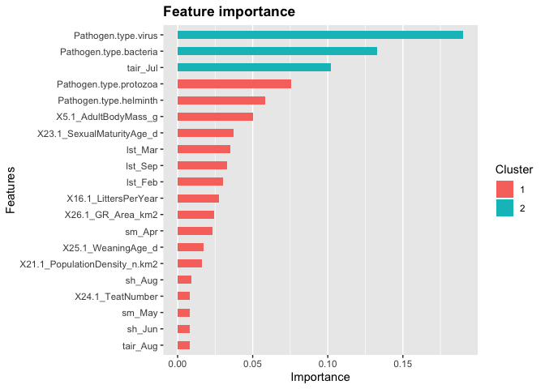<!-- -->

\#\#\#randomForest

``` r
#dat = subset(dat, transmission.mode.to.humans.simplified.numeric!=0)

#remove rows which have empty values
row.has.na <- apply(dat, 1, function(x){any(is.na(x))})
predictors_no_NA <- dat[!row.has.na, ]
dat = predictors_no_NA
dat$transmission.mode.to.humans.simplified.numeric=factor(dat$transmission.mode.to.humans.simplified.numeric)
# get the feature real names
label_col = which(names(dat)== "transmission.mode.to.humans.simplified.numeric")

names <-  colnames(dat[,-label_col])
y_col = label_col


model<-as.formula(paste(colnames(dat)[y_col], "~",
                        paste(names,collapse = "+"),
                        sep = ""))


#get train and test
DP =createDataPartition(y = dat$transmission.mode.to.humans.simplified.numeric, 
                        p = 0.8,
                        list = FALSE)
Train = dat[DP,]
Test = dat[-DP,]

model.rf = randomForest(model, data=Train, ntree=5000, mtry=15, importance=TRUE)
print(model.rf)
```

    ## 
    ## Call:
    ##  randomForest(formula = model, data = Train, ntree = 5000, mtry = 15,      importance = TRUE) 
    ##                Type of random forest: classification
    ##                      Number of trees: 5000
    ## No. of variables tried at each split: 15
    ## 
    ##         OOB estimate of  error rate: 33.07%
    ## Confusion matrix:
    ##   0  1  2 class.error
    ## 0 0  7  4   1.0000000
    ## 1 1 58 13   0.1944444
    ## 2 1 16 27   0.3863636

``` r
#get predicted
Test$pred = predict(model.rf, Test, type="response")

table(Test$transmission.mode.to.humans.simplified.numeric, 
      Test$pred)
```

    ##    
    ##      0  1  2
    ##   0  1  1  0
    ##   1  0 11  6
    ##   2  0  6  4

``` r
varImpPlot(model.rf,type=2, n.var = 20)
```

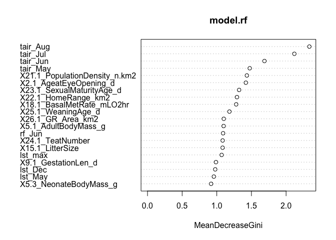<!-- -->

\#\#\#randomForest with only more abundant classes, sampsize
proportional

``` r
dat_backup = dat
#remove rows which have empty values
row.has.na <- apply(dat, 1, function(x){any(is.na(x))})
predictors_no_NA <- dat[!row.has.na, ]
dat = predictors_no_NA
dat = subset(dat, transmission.mode.to.humans.simplified.numeric!=0)

dat$transmission.mode.to.humans.simplified.numeric=factor(dat$transmission.mode.to.humans.simplified.numeric)

# get the feature real names
label_col = which(names(dat)== "transmission.mode.to.humans.simplified.numeric")

names <-  colnames(dat[,-label_col])
y_col = label_col


model<-as.formula(paste(colnames(dat)[y_col], "~",
                        paste(names,collapse = "+"),
                        sep = ""))


#get train and test
DP =createDataPartition(y = dat$transmission.mode.to.humans.simplified.numeric, 
                        p = 0.8,
                        list = FALSE)
Train = dat[DP,]
Test = dat[-DP,]

mySampSize <- ceiling(table(Train$transmission.mode.to.humans.simplified.numeric) * 0.632)

model.rf = randomForest(model, data=Train, ntree=5000, mtry=15, importance=TRUE,
                        sampsize = mySampSize,
                        # strata=as.factor(Train[,"transmission.mode.to.humans.simplified.numeric"])
                        )
print(model.rf)
```

    ## 
    ## Call:
    ##  randomForest(formula = model, data = Train, ntree = 5000, mtry = 15,      importance = TRUE, sampsize = mySampSize, ) 
    ##                Type of random forest: classification
    ##                      Number of trees: 5000
    ## No. of variables tried at each split: 15
    ## 
    ##         OOB estimate of  error rate: 34.48%
    ## Confusion matrix:
    ##    1  2 class.error
    ## 1 56 16   0.2222222
    ## 2 24 20   0.5454545

``` r
#get predicted
Test$pred = predict(model.rf, Test, type="response")

table(Test$transmission.mode.to.humans.simplified.numeric, 
      Test$pred)
```

    ##    
    ##      1  2
    ##   1 15  2
    ##   2  4  6

``` r
varImpPlot(model.rf,type=2, n.var = 20)
```

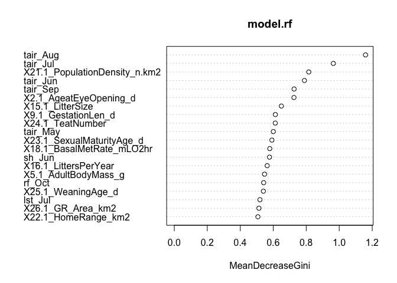<!-- -->

\#\#\#randomForest with only more abundant classes, sampsize equal

``` r
dat = dat_backup
#remove rows which have empty values
row.has.na <- apply(dat, 1, function(x){any(is.na(x))})
predictors_no_NA <- dat[!row.has.na, ]
dat = predictors_no_NA
dat = subset(dat, transmission.mode.to.humans.simplified.numeric!=0)

dat$transmission.mode.to.humans.simplified.numeric=factor(dat$transmission.mode.to.humans.simplified.numeric)

# get the feature real names
label_col = which(names(dat)== "transmission.mode.to.humans.simplified.numeric")

names <-  colnames(dat[,-label_col])
y_col = label_col


model<-as.formula(paste(colnames(dat)[y_col], "~",
                        paste(names,collapse = "+"),
                        sep = ""))


#get train and test
DP =createDataPartition(y = dat$transmission.mode.to.humans.simplified.numeric, 
                        p = 0.8,
                        list = FALSE)
Train = dat[DP,]
Test = dat[-DP,]

mySampSize <- c(15,15)

model.rf = randomForest(model, data=Train, ntree=5000, mtry=15, importance=TRUE,
                        sampsize = mySampSize,
                        # strata=as.factor(Train[,"transmission.mode.to.humans.simplified.numeric"])
                        )
print(model.rf)
```

    ## 
    ## Call:
    ##  randomForest(formula = model, data = Train, ntree = 5000, mtry = 15,      importance = TRUE, sampsize = mySampSize, ) 
    ##                Type of random forest: classification
    ##                      Number of trees: 5000
    ## No. of variables tried at each split: 15
    ## 
    ##         OOB estimate of  error rate: 31.9%
    ## Confusion matrix:
    ##    1  2 class.error
    ## 1 50 22   0.3055556
    ## 2 15 29   0.3409091

``` r
#get predicted
Test$pred = predict(model.rf, Test, type="response")

table(Test$transmission.mode.to.humans.simplified.numeric, 
      Test$pred)
```

    ##    
    ##      1  2
    ##   1 12  5
    ##   2  4  6

``` r
varImpPlot(model.rf,type=2, n.var = 20)
```

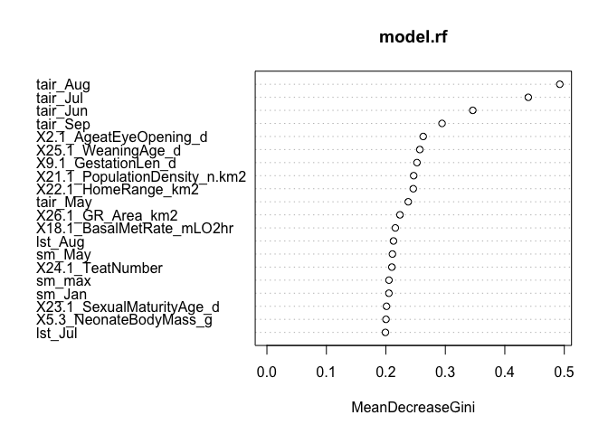<!-- -->

\#\#\#randomForest with all classes, classwt proportional

``` r
dat = dat_backup
#remove rows which have empty values
row.has.na <- apply(dat, 1, function(x){any(is.na(x))})
predictors_no_NA <- dat[!row.has.na, ]
dat = predictors_no_NA
# dat = subset(dat, transmission.mode.to.humans.simplified.numeric!=0)

dat$transmission.mode.to.humans.simplified.numeric=factor(dat$transmission.mode.to.humans.simplified.numeric)

tab = table(dat$transmission.mode.to.humans.simplified.numeric)
tab_frac = tab/dim(dat)[1]
tab_frac= c(tab_frac)
# get the feature real names
label_col = which(names(dat)== "transmission.mode.to.humans.simplified.numeric")

names <-  colnames(dat[,-label_col])
y_col = label_col


model<-as.formula(paste(colnames(dat)[y_col], "~",
                        paste(names,collapse = "+"),
                        sep = ""))


#get train and test
DP =createDataPartition(y = dat$transmission.mode.to.humans.simplified.numeric, 
                        p = 0.8,
                        list = FALSE)
Train = dat[DP,]
Test = dat[-DP,]

mySampSize <- c(15,15)

model.rf = randomForest(model, data=Train, ntree=5000, mtry=15, importance=TRUE,
                        classwt = tab_frac,
                        # strata=as.factor(Train[,"transmission.mode.to.humans.simplified.numeric"])
                        )
print(model.rf)
```

    ## 
    ## Call:
    ##  randomForest(formula = model, data = Train, ntree = 5000, mtry = 15,      importance = TRUE, classwt = tab_frac, ) 
    ##                Type of random forest: classification
    ##                      Number of trees: 5000
    ## No. of variables tried at each split: 15
    ## 
    ##         OOB estimate of  error rate: 39.37%
    ## Confusion matrix:
    ##   0  1  2 class.error
    ## 0 1  6  4   0.9090909
    ## 1 0 55 17   0.2361111
    ## 2 1 22 21   0.5227273

``` r
#get predicted
Test$pred = predict(model.rf, Test, type="response")

table(Test$transmission.mode.to.humans.simplified.numeric, 
      Test$pred)
```

    ##    
    ##      0  1  2
    ##   0  0  1  1
    ##   1  0 11  6
    ##   2  0  3  7

``` r
varImpPlot(model.rf,type=2, n.var = 20)
```

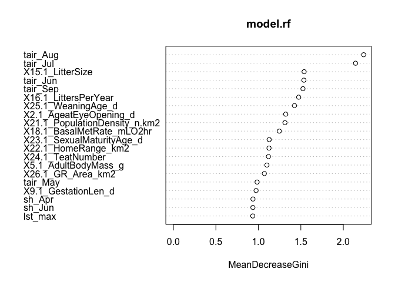<!-- -->

\#\#\#randomForest with all classes, classwt inversely proportional

``` r
dat = dat_backup
#remove rows which have empty values
row.has.na <- apply(dat, 1, function(x){any(is.na(x))})
predictors_no_NA <- dat[!row.has.na, ]
dat = predictors_no_NA
# dat = subset(dat, transmission.mode.to.humans.simplified.numeric!=0)

dat$transmission.mode.to.humans.simplified.numeric=factor(dat$transmission.mode.to.humans.simplified.numeric)

tab = table(dat$transmission.mode.to.humans.simplified.numeric)
tab_frac = tab/dim(dat)[1]
tab_frac= c(tab_frac)
# get the feature real names
label_col = which(names(dat)== "transmission.mode.to.humans.simplified.numeric")

names <-  colnames(dat[,-label_col])
y_col = label_col


model<-as.formula(paste(colnames(dat)[y_col], "~",
                        paste(names,collapse = "+"),
                        sep = ""))


#get train and test
DP =createDataPartition(y = dat$transmission.mode.to.humans.simplified.numeric, 
                        p = 0.8,
                        list = FALSE)
Train = dat[DP,]
Test = dat[-DP,]

mySampSize <- c(15,15)

model.rf = randomForest(model, data=Train, ntree=5000, mtry=15, importance=TRUE,
                        classwt = c(tab_frac[3], tab_frac[2], tab_frac[1]),
                        # strata=as.factor(Train[,"transmission.mode.to.humans.simplified.numeric"])
                        )
print(model.rf)
```

    ## 
    ## Call:
    ##  randomForest(formula = model, data = Train, ntree = 5000, mtry = 15,      importance = TRUE, classwt = c(tab_frac[3], tab_frac[2],          tab_frac[1]), ) 
    ##                Type of random forest: classification
    ##                      Number of trees: 5000
    ## No. of variables tried at each split: 15
    ## 
    ##         OOB estimate of  error rate: 33.86%
    ## Confusion matrix:
    ##   0  1  2 class.error
    ## 0 2  8  1   0.8181818
    ## 1 0 59 13   0.1805556
    ## 2 0 21 23   0.4772727

``` r
#get predicted
Test$pred = predict(model.rf, Test, type="response")

table(Test$transmission.mode.to.humans.simplified.numeric, 
      Test$pred)
```

    ##    
    ##      0  1  2
    ##   0  0  2  0
    ##   1  1 13  3
    ##   2  1  4  5

``` r
varImpPlot(model.rf,type=2, n.var = 20)
```

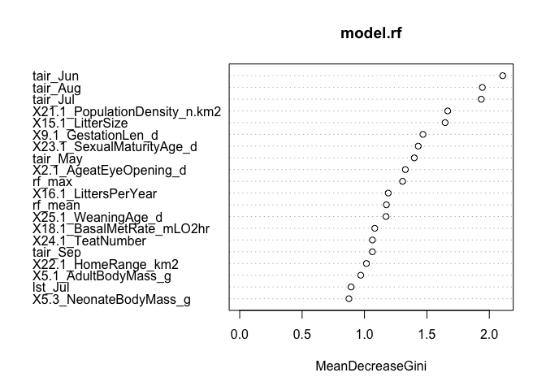<!-- -->

\#\#\#GBM with two most common classes

``` r
dat = dat_backup

dat = subset(dat, transmission.mode.to.humans.simplified.numeric!=0)

ind1 = which(dat$transmission.mode.to.humans.simplified.numeric==1)
dat$transmission.mode.to.humans.simplified.numeric[ind1]=0

ind2 = which(dat$transmission.mode.to.humans.simplified.numeric==2)
dat$transmission.mode.to.humans.simplified.numeric[ind2]=1

# get the feature real names
label_col = which(names(dat)== "transmission.mode.to.humans.simplified.numeric")

names <-  colnames(dat[,-label_col])
y_col = label_col


model<-as.formula(paste(colnames(dat)[y_col], "~",
                        paste(names,collapse = "+"),
                        sep = ""))


#get train and test
dat$transmission.mode.to.humans.simplified.numeric = as.numeric(as.character(dat$transmission.mode.to.humans.simplified.numeric))
DP =createDataPartition(y = dat$transmission.mode.to.humans.simplified.numeric, 
                        p = 0.8,
                        list = FALSE)
Train = dat[DP,]
Test = dat[-DP,]

ptm<-proc.time()

n.trees = 10000
shrinkage = 0.001#final version should be 0.001
cv.folds = 10#final version should be 10
gbmtest<- gbm(model,
              data=Train,
              distribution="bernoulli",
              n.trees=n.trees,
              shrinkage=shrinkage,
              interaction.depth=3,
              bag.fraction=0.50,
              train.fraction=1,
              n.minobsinnode=5,
              cv.folds=cv.folds,
              keep.data=TRUE,
              verbose=TRUE,
              n.cores=NULL)
```

    ## Iter   TrainDeviance   ValidDeviance   StepSize   Improve
    ##      1        1.3121             nan     0.0010    0.0002
    ##      2        1.3114             nan     0.0010    0.0001
    ##      3        1.3106             nan     0.0010    0.0002
    ##      4        1.3097             nan     0.0010    0.0002
    ##      5        1.3090             nan     0.0010    0.0003
    ##      6        1.3083             nan     0.0010    0.0001
    ##      7        1.3076             nan     0.0010    0.0002
    ##      8        1.3068             nan     0.0010    0.0002
    ##      9        1.3060             nan     0.0010    0.0001
    ##     10        1.3053             nan     0.0010    0.0002
    ##     20        1.2985             nan     0.0010    0.0001
    ##     40        1.2845             nan     0.0010    0.0002
    ##     60        1.2711             nan     0.0010    0.0003
    ##     80        1.2577             nan     0.0010    0.0002
    ##    100        1.2447             nan     0.0010    0.0001
    ##    120        1.2331             nan     0.0010    0.0002
    ##    140        1.2208             nan     0.0010   -0.0001
    ##    160        1.2090             nan     0.0010    0.0001
    ##    180        1.1974             nan     0.0010    0.0001
    ##    200        1.1857             nan     0.0010    0.0001
    ##    220        1.1742             nan     0.0010    0.0001
    ##    240        1.1632             nan     0.0010    0.0002
    ##    260        1.1525             nan     0.0010    0.0001
    ##    280        1.1422             nan     0.0010    0.0001
    ##    300        1.1315             nan     0.0010    0.0001
    ##    320        1.1218             nan     0.0010    0.0001
    ##    340        1.1120             nan     0.0010   -0.0001
    ##    360        1.1029             nan     0.0010   -0.0000
    ##    380        1.0937             nan     0.0010    0.0001
    ##    400        1.0845             nan     0.0010    0.0001
    ##    420        1.0754             nan     0.0010    0.0002
    ##    440        1.0664             nan     0.0010    0.0001
    ##    460        1.0576             nan     0.0010   -0.0000
    ##    480        1.0495             nan     0.0010    0.0001
    ##    500        1.0411             nan     0.0010    0.0001
    ##    520        1.0326             nan     0.0010    0.0000
    ##    540        1.0242             nan     0.0010    0.0001
    ##    560        1.0158             nan     0.0010    0.0000
    ##    580        1.0083             nan     0.0010    0.0001
    ##    600        1.0001             nan     0.0010    0.0000
    ##    620        0.9920             nan     0.0010    0.0001
    ##    640        0.9844             nan     0.0010   -0.0001
    ##    660        0.9766             nan     0.0010    0.0000
    ##    680        0.9694             nan     0.0010    0.0001
    ##    700        0.9623             nan     0.0010    0.0001
    ##    720        0.9556             nan     0.0010    0.0000
    ##    740        0.9486             nan     0.0010    0.0001
    ##    760        0.9416             nan     0.0010   -0.0001
    ##    780        0.9343             nan     0.0010   -0.0000
    ##    800        0.9278             nan     0.0010   -0.0000
    ##    820        0.9216             nan     0.0010   -0.0001
    ##    840        0.9146             nan     0.0010    0.0000
    ##    860        0.9079             nan     0.0010    0.0000
    ##    880        0.9012             nan     0.0010   -0.0000
    ##    900        0.8946             nan     0.0010    0.0001
    ##    920        0.8888             nan     0.0010    0.0001
    ##    940        0.8826             nan     0.0010    0.0001
    ##    960        0.8767             nan     0.0010    0.0000
    ##    980        0.8707             nan     0.0010    0.0001
    ##   1000        0.8649             nan     0.0010   -0.0001
    ##   1020        0.8589             nan     0.0010    0.0000
    ##   1040        0.8537             nan     0.0010   -0.0001
    ##   1060        0.8484             nan     0.0010   -0.0000
    ##   1080        0.8429             nan     0.0010   -0.0000
    ##   1100        0.8373             nan     0.0010   -0.0000
    ##   1120        0.8316             nan     0.0010    0.0001
    ##   1140        0.8264             nan     0.0010   -0.0000
    ##   1160        0.8207             nan     0.0010    0.0001
    ##   1180        0.8153             nan     0.0010   -0.0000
    ##   1200        0.8101             nan     0.0010   -0.0000
    ##   1220        0.8047             nan     0.0010   -0.0000
    ##   1240        0.8000             nan     0.0010    0.0000
    ##   1260        0.7947             nan     0.0010    0.0000
    ##   1280        0.7899             nan     0.0010   -0.0000
    ##   1300        0.7851             nan     0.0010    0.0000
    ##   1320        0.7802             nan     0.0010    0.0000
    ##   1340        0.7752             nan     0.0010   -0.0000
    ##   1360        0.7705             nan     0.0010   -0.0000
    ##   1380        0.7654             nan     0.0010   -0.0000
    ##   1400        0.7606             nan     0.0010   -0.0000
    ##   1420        0.7560             nan     0.0010    0.0000
    ##   1440        0.7512             nan     0.0010    0.0000
    ##   1460        0.7462             nan     0.0010    0.0000
    ##   1480        0.7413             nan     0.0010   -0.0001
    ##   1500        0.7367             nan     0.0010   -0.0001
    ##   1520        0.7322             nan     0.0010    0.0001
    ##   1540        0.7276             nan     0.0010   -0.0001
    ##   1560        0.7230             nan     0.0010   -0.0000
    ##   1580        0.7184             nan     0.0010   -0.0000
    ##   1600        0.7142             nan     0.0010   -0.0001
    ##   1620        0.7103             nan     0.0010   -0.0000
    ##   1640        0.7059             nan     0.0010    0.0000
    ##   1660        0.7015             nan     0.0010   -0.0000
    ##   1680        0.6973             nan     0.0010    0.0001
    ##   1700        0.6931             nan     0.0010   -0.0001
    ##   1720        0.6889             nan     0.0010   -0.0000
    ##   1740        0.6844             nan     0.0010   -0.0000
    ##   1760        0.6805             nan     0.0010   -0.0000
    ##   1780        0.6761             nan     0.0010   -0.0000
    ##   1800        0.6717             nan     0.0010    0.0000
    ##   1820        0.6679             nan     0.0010   -0.0000
    ##   1840        0.6639             nan     0.0010    0.0000
    ##   1860        0.6601             nan     0.0010    0.0000
    ##   1880        0.6563             nan     0.0010   -0.0000
    ##   1900        0.6523             nan     0.0010   -0.0000
    ##   1920        0.6485             nan     0.0010   -0.0000
    ##   1940        0.6446             nan     0.0010   -0.0000
    ##   1960        0.6407             nan     0.0010   -0.0000
    ##   1980        0.6371             nan     0.0010   -0.0000
    ##   2000        0.6332             nan     0.0010   -0.0001
    ##   2020        0.6296             nan     0.0010   -0.0001
    ##   2040        0.6256             nan     0.0010   -0.0000
    ##   2060        0.6220             nan     0.0010    0.0000
    ##   2080        0.6182             nan     0.0010    0.0000
    ##   2100        0.6148             nan     0.0010   -0.0000
    ##   2120        0.6114             nan     0.0010    0.0000
    ##   2140        0.6083             nan     0.0010   -0.0000
    ##   2160        0.6049             nan     0.0010    0.0000
    ##   2180        0.6015             nan     0.0010   -0.0001
    ##   2200        0.5980             nan     0.0010   -0.0001
    ##   2220        0.5947             nan     0.0010   -0.0001
    ##   2240        0.5910             nan     0.0010    0.0000
    ##   2260        0.5876             nan     0.0010   -0.0000
    ##   2280        0.5844             nan     0.0010   -0.0000
    ##   2300        0.5810             nan     0.0010   -0.0000
    ##   2320        0.5779             nan     0.0010   -0.0001
    ##   2340        0.5745             nan     0.0010   -0.0000
    ##   2360        0.5711             nan     0.0010   -0.0000
    ##   2380        0.5679             nan     0.0010   -0.0000
    ##   2400        0.5649             nan     0.0010   -0.0001
    ##   2420        0.5616             nan     0.0010   -0.0001
    ##   2440        0.5584             nan     0.0010   -0.0000
    ##   2460        0.5555             nan     0.0010   -0.0000
    ##   2480        0.5527             nan     0.0010    0.0000
    ##   2500        0.5497             nan     0.0010    0.0000
    ##   2520        0.5470             nan     0.0010   -0.0000
    ##   2540        0.5441             nan     0.0010   -0.0000
    ##   2560        0.5413             nan     0.0010   -0.0001
    ##   2580        0.5381             nan     0.0010   -0.0001
    ##   2600        0.5354             nan     0.0010    0.0001
    ##   2620        0.5326             nan     0.0010    0.0000
    ##   2640        0.5299             nan     0.0010   -0.0000
    ##   2660        0.5271             nan     0.0010   -0.0000
    ##   2680        0.5244             nan     0.0010   -0.0000
    ##   2700        0.5215             nan     0.0010    0.0000
    ##   2720        0.5188             nan     0.0010   -0.0000
    ##   2740        0.5161             nan     0.0010    0.0000
    ##   2760        0.5132             nan     0.0010   -0.0000
    ##   2780        0.5103             nan     0.0010   -0.0000
    ##   2800        0.5074             nan     0.0010    0.0000
    ##   2820        0.5046             nan     0.0010    0.0000
    ##   2840        0.5019             nan     0.0010   -0.0001
    ##   2860        0.4992             nan     0.0010   -0.0000
    ##   2880        0.4966             nan     0.0010   -0.0000
    ##   2900        0.4941             nan     0.0010   -0.0000
    ##   2920        0.4914             nan     0.0010   -0.0000
    ##   2940        0.4887             nan     0.0010    0.0000
    ##   2960        0.4862             nan     0.0010    0.0000
    ##   2980        0.4835             nan     0.0010   -0.0000
    ##   3000        0.4808             nan     0.0010    0.0000
    ##   3020        0.4784             nan     0.0010   -0.0000
    ##   3040        0.4760             nan     0.0010   -0.0000
    ##   3060        0.4736             nan     0.0010   -0.0000
    ##   3080        0.4713             nan     0.0010    0.0000
    ##   3100        0.4690             nan     0.0010    0.0000
    ##   3120        0.4667             nan     0.0010   -0.0001
    ##   3140        0.4645             nan     0.0010   -0.0000
    ##   3160        0.4620             nan     0.0010   -0.0000
    ##   3180        0.4598             nan     0.0010   -0.0000
    ##   3200        0.4572             nan     0.0010    0.0000
    ##   3220        0.4549             nan     0.0010   -0.0000
    ##   3240        0.4528             nan     0.0010   -0.0000
    ##   3260        0.4505             nan     0.0010    0.0000
    ##   3280        0.4483             nan     0.0010   -0.0000
    ##   3300        0.4463             nan     0.0010   -0.0000
    ##   3320        0.4443             nan     0.0010   -0.0000
    ##   3340        0.4421             nan     0.0010   -0.0000
    ##   3360        0.4397             nan     0.0010   -0.0000
    ##   3380        0.4372             nan     0.0010    0.0000
    ##   3400        0.4349             nan     0.0010   -0.0000
    ##   3420        0.4326             nan     0.0010    0.0000
    ##   3440        0.4306             nan     0.0010    0.0000
    ##   3460        0.4284             nan     0.0010    0.0000
    ##   3480        0.4264             nan     0.0010   -0.0001
    ##   3500        0.4245             nan     0.0010   -0.0000
    ##   3520        0.4223             nan     0.0010   -0.0000
    ##   3540        0.4203             nan     0.0010   -0.0001
    ##   3560        0.4181             nan     0.0010    0.0000
    ##   3580        0.4162             nan     0.0010   -0.0000
    ##   3600        0.4142             nan     0.0010   -0.0000
    ##   3620        0.4122             nan     0.0010   -0.0000
    ##   3640        0.4102             nan     0.0010    0.0000
    ##   3660        0.4081             nan     0.0010   -0.0000
    ##   3680        0.4064             nan     0.0010   -0.0000
    ##   3700        0.4045             nan     0.0010   -0.0000
    ##   3720        0.4025             nan     0.0010   -0.0000
    ##   3740        0.4005             nan     0.0010   -0.0000
    ##   3760        0.3986             nan     0.0010   -0.0000
    ##   3780        0.3967             nan     0.0010   -0.0000
    ##   3800        0.3948             nan     0.0010   -0.0000
    ##   3820        0.3928             nan     0.0010   -0.0000
    ##   3840        0.3908             nan     0.0010   -0.0000
    ##   3860        0.3888             nan     0.0010    0.0000
    ##   3880        0.3868             nan     0.0010   -0.0001
    ##   3900        0.3849             nan     0.0010   -0.0000
    ##   3920        0.3829             nan     0.0010    0.0000
    ##   3940        0.3810             nan     0.0010   -0.0000
    ##   3960        0.3792             nan     0.0010   -0.0000
    ##   3980        0.3774             nan     0.0010   -0.0000
    ##   4000        0.3755             nan     0.0010   -0.0000
    ##   4020        0.3738             nan     0.0010   -0.0001
    ##   4040        0.3718             nan     0.0010   -0.0000
    ##   4060        0.3701             nan     0.0010   -0.0000
    ##   4080        0.3685             nan     0.0010   -0.0000
    ##   4100        0.3668             nan     0.0010   -0.0001
    ##   4120        0.3650             nan     0.0010   -0.0001
    ##   4140        0.3630             nan     0.0010    0.0000
    ##   4160        0.3614             nan     0.0010    0.0000
    ##   4180        0.3597             nan     0.0010   -0.0000
    ##   4200        0.3579             nan     0.0010    0.0000
    ##   4220        0.3560             nan     0.0010   -0.0000
    ##   4240        0.3543             nan     0.0010   -0.0000
    ##   4260        0.3525             nan     0.0010   -0.0000
    ##   4280        0.3508             nan     0.0010   -0.0000
    ##   4300        0.3493             nan     0.0010   -0.0000
    ##   4320        0.3475             nan     0.0010    0.0000
    ##   4340        0.3457             nan     0.0010   -0.0000
    ##   4360        0.3440             nan     0.0010   -0.0000
    ##   4380        0.3422             nan     0.0010   -0.0000
    ##   4400        0.3408             nan     0.0010   -0.0000
    ##   4420        0.3392             nan     0.0010   -0.0000
    ##   4440        0.3378             nan     0.0010   -0.0000
    ##   4460        0.3363             nan     0.0010   -0.0000
    ##   4480        0.3345             nan     0.0010   -0.0000
    ##   4500        0.3330             nan     0.0010   -0.0000
    ##   4520        0.3315             nan     0.0010   -0.0000
    ##   4540        0.3299             nan     0.0010   -0.0000
    ##   4560        0.3284             nan     0.0010   -0.0000
    ##   4580        0.3269             nan     0.0010   -0.0000
    ##   4600        0.3254             nan     0.0010   -0.0000
    ##   4620        0.3240             nan     0.0010   -0.0000
    ##   4640        0.3224             nan     0.0010   -0.0000
    ##   4660        0.3207             nan     0.0010   -0.0000
    ##   4680        0.3192             nan     0.0010   -0.0000
    ##   4700        0.3177             nan     0.0010   -0.0000
    ##   4720        0.3162             nan     0.0010   -0.0000
    ##   4740        0.3148             nan     0.0010   -0.0000
    ##   4760        0.3135             nan     0.0010   -0.0000
    ##   4780        0.3122             nan     0.0010   -0.0000
    ##   4800        0.3106             nan     0.0010    0.0000
    ##   4820        0.3092             nan     0.0010   -0.0000
    ##   4840        0.3078             nan     0.0010   -0.0000
    ##   4860        0.3064             nan     0.0010   -0.0000
    ##   4880        0.3051             nan     0.0010   -0.0000
    ##   4900        0.3037             nan     0.0010    0.0000
    ##   4920        0.3023             nan     0.0010   -0.0000
    ##   4940        0.3008             nan     0.0010    0.0000
    ##   4960        0.2995             nan     0.0010   -0.0000
    ##   4980        0.2981             nan     0.0010   -0.0000
    ##   5000        0.2968             nan     0.0010    0.0000
    ##   5020        0.2956             nan     0.0010   -0.0000
    ##   5040        0.2943             nan     0.0010   -0.0000
    ##   5060        0.2928             nan     0.0010    0.0000
    ##   5080        0.2915             nan     0.0010   -0.0000
    ##   5100        0.2901             nan     0.0010    0.0000
    ##   5120        0.2889             nan     0.0010    0.0000
    ##   5140        0.2876             nan     0.0010    0.0000
    ##   5160        0.2863             nan     0.0010   -0.0000
    ##   5180        0.2850             nan     0.0010   -0.0000
    ##   5200        0.2838             nan     0.0010   -0.0000
    ##   5220        0.2825             nan     0.0010   -0.0000
    ##   5240        0.2814             nan     0.0010   -0.0000
    ##   5260        0.2803             nan     0.0010   -0.0000
    ##   5280        0.2790             nan     0.0010   -0.0000
    ##   5300        0.2778             nan     0.0010   -0.0000
    ##   5320        0.2765             nan     0.0010   -0.0000
    ##   5340        0.2753             nan     0.0010    0.0000
    ##   5360        0.2741             nan     0.0010   -0.0000
    ##   5380        0.2728             nan     0.0010   -0.0000
    ##   5400        0.2715             nan     0.0010   -0.0000
    ##   5420        0.2702             nan     0.0010   -0.0000
    ##   5440        0.2691             nan     0.0010   -0.0000
    ##   5460        0.2679             nan     0.0010    0.0000
    ##   5480        0.2671             nan     0.0010   -0.0001
    ##   5500        0.2659             nan     0.0010   -0.0000
    ##   5520        0.2647             nan     0.0010   -0.0000
    ##   5540        0.2635             nan     0.0010   -0.0000
    ##   5560        0.2624             nan     0.0010   -0.0000
    ##   5580        0.2610             nan     0.0010    0.0000
    ##   5600        0.2599             nan     0.0010   -0.0000
    ##   5620        0.2589             nan     0.0010   -0.0000
    ##   5640        0.2577             nan     0.0010   -0.0000
    ##   5660        0.2566             nan     0.0010    0.0000
    ##   5680        0.2555             nan     0.0010    0.0000
    ##   5700        0.2543             nan     0.0010    0.0000
    ##   5720        0.2531             nan     0.0010   -0.0000
    ##   5740        0.2519             nan     0.0010   -0.0000
    ##   5760        0.2508             nan     0.0010   -0.0000
    ##   5780        0.2497             nan     0.0010    0.0000
    ##   5800        0.2485             nan     0.0010   -0.0000
    ##   5820        0.2474             nan     0.0010   -0.0000
    ##   5840        0.2464             nan     0.0010   -0.0000
    ##   5860        0.2452             nan     0.0010   -0.0000
    ##   5880        0.2442             nan     0.0010   -0.0000
    ##   5900        0.2432             nan     0.0010   -0.0000
    ##   5920        0.2423             nan     0.0010   -0.0000
    ##   5940        0.2412             nan     0.0010   -0.0000
    ##   5960        0.2402             nan     0.0010   -0.0000
    ##   5980        0.2392             nan     0.0010   -0.0000
    ##   6000        0.2382             nan     0.0010   -0.0000
    ##   6020        0.2372             nan     0.0010   -0.0000
    ##   6040        0.2363             nan     0.0010   -0.0000
    ##   6060        0.2352             nan     0.0010   -0.0000
    ##   6080        0.2342             nan     0.0010   -0.0000
    ##   6100        0.2332             nan     0.0010   -0.0000
    ##   6120        0.2321             nan     0.0010   -0.0000
    ##   6140        0.2311             nan     0.0010   -0.0000
    ##   6160        0.2301             nan     0.0010   -0.0000
    ##   6180        0.2290             nan     0.0010   -0.0000
    ##   6200        0.2280             nan     0.0010   -0.0000
    ##   6220        0.2270             nan     0.0010   -0.0000
    ##   6240        0.2260             nan     0.0010   -0.0000
    ##   6260        0.2250             nan     0.0010    0.0000
    ##   6280        0.2240             nan     0.0010   -0.0000
    ##   6300        0.2231             nan     0.0010   -0.0000
    ##   6320        0.2221             nan     0.0010   -0.0000
    ##   6340        0.2212             nan     0.0010   -0.0000
    ##   6360        0.2203             nan     0.0010   -0.0000
    ##   6380        0.2193             nan     0.0010   -0.0000
    ##   6400        0.2184             nan     0.0010   -0.0000
    ##   6420        0.2175             nan     0.0010   -0.0000
    ##   6440        0.2165             nan     0.0010   -0.0000
    ##   6460        0.2157             nan     0.0010   -0.0000
    ##   6480        0.2148             nan     0.0010   -0.0000
    ##   6500        0.2138             nan     0.0010   -0.0000
    ##   6520        0.2129             nan     0.0010   -0.0000
    ##   6540        0.2119             nan     0.0010   -0.0000
    ##   6560        0.2111             nan     0.0010   -0.0000
    ##   6580        0.2103             nan     0.0010   -0.0000
    ##   6600        0.2094             nan     0.0010   -0.0000
    ##   6620        0.2086             nan     0.0010   -0.0000
    ##   6640        0.2075             nan     0.0010   -0.0000
    ##   6660        0.2067             nan     0.0010   -0.0000
    ##   6680        0.2058             nan     0.0010    0.0000
    ##   6700        0.2049             nan     0.0010   -0.0000
    ##   6720        0.2041             nan     0.0010   -0.0000
    ##   6740        0.2032             nan     0.0010    0.0000
    ##   6760        0.2023             nan     0.0010   -0.0000
    ##   6780        0.2015             nan     0.0010   -0.0000
    ##   6800        0.2006             nan     0.0010   -0.0000
    ##   6820        0.1999             nan     0.0010   -0.0000
    ##   6840        0.1991             nan     0.0010   -0.0000
    ##   6860        0.1982             nan     0.0010    0.0000
    ##   6880        0.1974             nan     0.0010   -0.0000
    ##   6900        0.1966             nan     0.0010   -0.0000
    ##   6920        0.1957             nan     0.0010   -0.0000
    ##   6940        0.1950             nan     0.0010   -0.0000
    ##   6960        0.1942             nan     0.0010    0.0000
    ##   6980        0.1934             nan     0.0010   -0.0000
    ##   7000        0.1926             nan     0.0010   -0.0000
    ##   7020        0.1918             nan     0.0010   -0.0000
    ##   7040        0.1910             nan     0.0010   -0.0000
    ##   7060        0.1902             nan     0.0010   -0.0000
    ##   7080        0.1894             nan     0.0010   -0.0000
    ##   7100        0.1886             nan     0.0010    0.0000
    ##   7120        0.1878             nan     0.0010   -0.0000
    ##   7140        0.1870             nan     0.0010   -0.0000
    ##   7160        0.1862             nan     0.0010   -0.0000
    ##   7180        0.1854             nan     0.0010   -0.0000
    ##   7200        0.1846             nan     0.0010   -0.0000
    ##   7220        0.1838             nan     0.0010   -0.0000
    ##   7240        0.1831             nan     0.0010   -0.0000
    ##   7260        0.1822             nan     0.0010   -0.0000
    ##   7280        0.1815             nan     0.0010   -0.0000
    ##   7300        0.1807             nan     0.0010   -0.0000
    ##   7320        0.1800             nan     0.0010   -0.0000
    ##   7340        0.1792             nan     0.0010   -0.0000
    ##   7360        0.1785             nan     0.0010   -0.0000
    ##   7380        0.1778             nan     0.0010   -0.0000
    ##   7400        0.1771             nan     0.0010   -0.0000
    ##   7420        0.1763             nan     0.0010   -0.0000
    ##   7440        0.1756             nan     0.0010   -0.0000
    ##   7460        0.1748             nan     0.0010   -0.0000
    ##   7480        0.1742             nan     0.0010   -0.0000
    ##   7500        0.1735             nan     0.0010   -0.0000
    ##   7520        0.1728             nan     0.0010   -0.0000
    ##   7540        0.1720             nan     0.0010   -0.0000
    ##   7560        0.1713             nan     0.0010   -0.0000
    ##   7580        0.1706             nan     0.0010   -0.0000
    ##   7600        0.1699             nan     0.0010   -0.0000
    ##   7620        0.1692             nan     0.0010   -0.0000
    ##   7640        0.1686             nan     0.0010    0.0000
    ##   7660        0.1679             nan     0.0010   -0.0000
    ##   7680        0.1673             nan     0.0010   -0.0000
    ##   7700        0.1665             nan     0.0010   -0.0000
    ##   7720        0.1659             nan     0.0010   -0.0000
    ##   7740        0.1653             nan     0.0010   -0.0000
    ##   7760        0.1646             nan     0.0010   -0.0000
    ##   7780        0.1638             nan     0.0010   -0.0000
    ##   7800        0.1632             nan     0.0010    0.0000
    ##   7820        0.1625             nan     0.0010   -0.0000
    ##   7840        0.1619             nan     0.0010   -0.0000
    ##   7860        0.1613             nan     0.0010   -0.0000
    ##   7880        0.1606             nan     0.0010   -0.0000
    ##   7900        0.1600             nan     0.0010   -0.0000
    ##   7920        0.1594             nan     0.0010   -0.0000
    ##   7940        0.1588             nan     0.0010    0.0000
    ##   7960        0.1583             nan     0.0010   -0.0000
    ##   7980        0.1576             nan     0.0010   -0.0000
    ##   8000        0.1571             nan     0.0010   -0.0000
    ##   8020        0.1565             nan     0.0010   -0.0000
    ##   8040        0.1558             nan     0.0010   -0.0000
    ##   8060        0.1552             nan     0.0010   -0.0000
    ##   8080        0.1546             nan     0.0010   -0.0000
    ##   8100        0.1540             nan     0.0010   -0.0000
    ##   8120        0.1533             nan     0.0010   -0.0000
    ##   8140        0.1526             nan     0.0010   -0.0000
    ##   8160        0.1521             nan     0.0010   -0.0000
    ##   8180        0.1515             nan     0.0010   -0.0000
    ##   8200        0.1508             nan     0.0010   -0.0000
    ##   8220        0.1502             nan     0.0010   -0.0000
    ##   8240        0.1496             nan     0.0010   -0.0000
    ##   8260        0.1490             nan     0.0010   -0.0000
    ##   8280        0.1484             nan     0.0010   -0.0000
    ##   8300        0.1477             nan     0.0010   -0.0000
    ##   8320        0.1472             nan     0.0010   -0.0000
    ##   8340        0.1465             nan     0.0010   -0.0000
    ##   8360        0.1460             nan     0.0010   -0.0000
    ##   8380        0.1454             nan     0.0010   -0.0000
    ##   8400        0.1449             nan     0.0010   -0.0000
    ##   8420        0.1444             nan     0.0010   -0.0000
    ##   8440        0.1439             nan     0.0010   -0.0000
    ##   8460        0.1433             nan     0.0010   -0.0000
    ##   8480        0.1427             nan     0.0010   -0.0000
    ##   8500        0.1421             nan     0.0010   -0.0000
    ##   8520        0.1415             nan     0.0010   -0.0000
    ##   8540        0.1410             nan     0.0010   -0.0000
    ##   8560        0.1405             nan     0.0010   -0.0000
    ##   8580        0.1399             nan     0.0010   -0.0000
    ##   8600        0.1393             nan     0.0010   -0.0000
    ##   8620        0.1388             nan     0.0010    0.0000
    ##   8640        0.1383             nan     0.0010   -0.0000
    ##   8660        0.1377             nan     0.0010   -0.0000
    ##   8680        0.1372             nan     0.0010   -0.0000
    ##   8700        0.1366             nan     0.0010   -0.0000
    ##   8720        0.1361             nan     0.0010   -0.0000
    ##   8740        0.1355             nan     0.0010   -0.0000
    ##   8760        0.1349             nan     0.0010   -0.0000
    ##   8780        0.1344             nan     0.0010    0.0000
    ##   8800        0.1338             nan     0.0010    0.0000
    ##   8820        0.1333             nan     0.0010   -0.0000
    ##   8840        0.1327             nan     0.0010   -0.0000
    ##   8860        0.1321             nan     0.0010   -0.0000
    ##   8880        0.1316             nan     0.0010   -0.0000
    ##   8900        0.1311             nan     0.0010   -0.0000
    ##   8920        0.1306             nan     0.0010   -0.0000
    ##   8940        0.1300             nan     0.0010   -0.0000
    ##   8960        0.1295             nan     0.0010   -0.0000
    ##   8980        0.1290             nan     0.0010   -0.0000
    ##   9000        0.1285             nan     0.0010   -0.0000
    ##   9020        0.1280             nan     0.0010    0.0000
    ##   9040        0.1274             nan     0.0010    0.0000
    ##   9060        0.1269             nan     0.0010   -0.0000
    ##   9080        0.1265             nan     0.0010   -0.0000
    ##   9100        0.1259             nan     0.0010   -0.0000
    ##   9120        0.1254             nan     0.0010   -0.0000
    ##   9140        0.1249             nan     0.0010   -0.0000
    ##   9160        0.1244             nan     0.0010   -0.0000
    ##   9180        0.1239             nan     0.0010   -0.0000
    ##   9200        0.1234             nan     0.0010   -0.0000
    ##   9220        0.1230             nan     0.0010   -0.0000
    ##   9240        0.1225             nan     0.0010   -0.0000
    ##   9260        0.1220             nan     0.0010   -0.0000
    ##   9280        0.1215             nan     0.0010   -0.0000
    ##   9300        0.1211             nan     0.0010   -0.0000
    ##   9320        0.1206             nan     0.0010   -0.0000
    ##   9340        0.1201             nan     0.0010   -0.0000
    ##   9360        0.1196             nan     0.0010   -0.0000
    ##   9380        0.1191             nan     0.0010   -0.0000
    ##   9400        0.1187             nan     0.0010   -0.0000
    ##   9420        0.1182             nan     0.0010   -0.0000
    ##   9440        0.1177             nan     0.0010   -0.0000
    ##   9460        0.1173             nan     0.0010   -0.0000
    ##   9480        0.1168             nan     0.0010   -0.0000
    ##   9500        0.1163             nan     0.0010    0.0000
    ##   9520        0.1159             nan     0.0010   -0.0000
    ##   9540        0.1154             nan     0.0010   -0.0000
    ##   9560        0.1150             nan     0.0010   -0.0000
    ##   9580        0.1146             nan     0.0010   -0.0000
    ##   9600        0.1141             nan     0.0010   -0.0000
    ##   9620        0.1137             nan     0.0010   -0.0000
    ##   9640        0.1133             nan     0.0010    0.0000
    ##   9660        0.1129             nan     0.0010   -0.0000
    ##   9680        0.1125             nan     0.0010   -0.0000
    ##   9700        0.1121             nan     0.0010   -0.0000
    ##   9720        0.1117             nan     0.0010   -0.0000
    ##   9740        0.1112             nan     0.0010   -0.0000
    ##   9760        0.1108             nan     0.0010   -0.0000
    ##   9780        0.1103             nan     0.0010   -0.0000
    ##   9800        0.1099             nan     0.0010   -0.0000
    ##   9820        0.1095             nan     0.0010   -0.0000
    ##   9840        0.1090             nan     0.0010   -0.0000
    ##   9860        0.1086             nan     0.0010   -0.0000
    ##   9880        0.1082             nan     0.0010   -0.0000
    ##   9900        0.1078             nan     0.0010   -0.0000
    ##   9920        0.1073             nan     0.0010   -0.0000
    ##   9940        0.1069             nan     0.0010   -0.0000
    ##   9960        0.1065             nan     0.0010   -0.0000
    ##   9980        0.1060             nan     0.0010   -0.0000
    ##  10000        0.1056             nan     0.0010   -0.0000

``` r
save(gbmtest, file = "gbmtest.Rdata")
#check performance using 5-fold cross-validation
best.iter <- gbm.perf(gbmtest,method="cv",plot.it=FALSE) #this gives you the optimal number of trees based on cv performance, other methods will over or under predict
print(best.iter)
```

    ## [1] 2087

``` r
gbm_error = data.frame(train.error = gbmtest$train.error,
                       trees = seq(1,n.trees))
plot <- ggplot(gbm_error, aes(x = trees, y = train.error))+
  geom_line()
plot
```

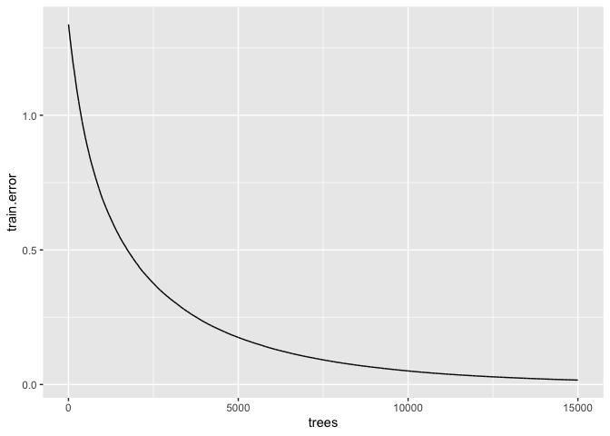<!-- -->

``` r
ggsave(filename = "deviance_enviro_vector.jpg",
       plot = plot)
```

    ## Saving 7 x 5 in image

``` r
#Stop the clock
(proc.time()-ptm)/60
```

    ##        user      system     elapsed 
    ## 0.087400000 0.002666667 0.304350000

``` r
load("gbmtest.Rdata")
best.iter <- gbm.perf(gbmtest,method="cv",plot.it=FALSE) #this gives you the optimal number of trees based on cv performance, other methods 
# output predictions on the TRAINING SET
output<-predict(gbmtest, 
                newdata=Train, 
                n.trees=best.iter, 
                type="response") 

output<-cbind(output,Train$transmission.mode.to.humans.simplified.numeric)
colnames(output)<-c("output","data")
rownames(output)<-rownames(Train)
output<-output[order(-output[,1]),]

# # AUC for Bernoulli distributed responses
par(mar = c(1,1,1,1))
auc=colAUC(output[,1],output[,2],
           plotROC = TRUE)
```

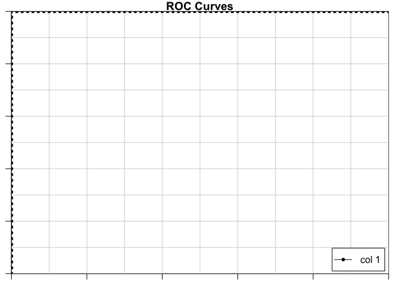<!-- -->

``` r
print(auc)
```

    ##              [,1]
    ## 0 vs. 1 0.9915199

``` r
pred<-prediction(output[,1],output[,2])
perf<-performance(pred,"tpr","fpr")

par(mar = c(1,1,1,1))
plot(perf,colorize=TRUE,main="ROC full model")
abline(a=0, b= 1)
```

<!-- -->

``` r
# output predictions on the Test SET
```

\#\#\#plot relative influence

``` r
load("gbmtest.Rdata")
x = summary(gbmtest)
```

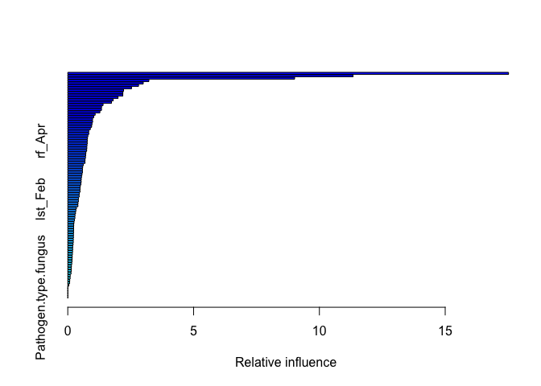<!-- -->

``` r
# 
x.df= data.frame(variable = x$var,
                 relative.influence = x$rel.inf)

x.df.0 = subset(x.df, relative.influence==0)
dim(x.df.0)[1]
```

    ## [1] 4

``` r
x.df = subset(x.df, relative.influence>=1)#take only interesting variables

x.df$variable = factor(x.df$variable, levels = x.df$variable[order(x.df$relative.influence)])
save(x.df, file = "x.df.Rdata")
ggplot(data = x.df, aes(x = variable, y =relative.influence))+
  ylab("relative influence (%)")+
  xlab("variable")+
  geom_bar(stat="identity")+
  coord_flip()
```

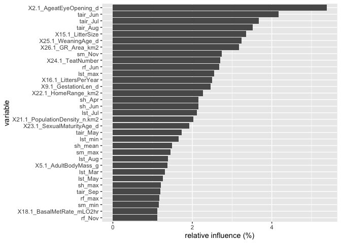<!-- -->

``` r
# 
ggsave("Figure.relative.influence.jpg")
```

    ## Saving 7 x 5 in image

\#\#\#prepare data with vtreat

``` r
dat = dat_backup
dat$random = factor(sample(c(0,1), size = dim(dat)[1], replace = TRUE))
transform_design = vtreat::mkCrossFrameMExperiment(
    d = dat,                                         # data to learn transform from
    vars = setdiff(colnames(dat), c('transmission.mode.to.humans.simplified.numeric')),     # columns to transform
    y_name = 'transmission.mode.to.humans.simplified.numeric'# outcome variable
)
transform <- transform_design$treat_m
d_prepared <- transform_design$cross_frame
score_frame <- transform_design$score_frame
score_frame$recommended <- score_frame$varMoves & (score_frame$sig < 1/nrow(score_frame))

knitr::kable(score_frame)
```

| varName                           | varMoves |       rsq |       sig | outcome\_level | needsSplit | extraModelDegrees | origName                        | code  | recommended |
| :-------------------------------- | :------- | --------: | --------: | :------------- | :--------- | ----------------: | :------------------------------ | :---- | :---------- |
| lst\_Apr                          | TRUE     | 0.0007395 | 0.7969841 | 0              | FALSE      |                 0 | lst\_Apr                        | clean | FALSE       |
| lst\_Aug                          | TRUE     | 0.0060295 | 0.4625994 | 0              | FALSE      |                 0 | lst\_Aug                        | clean | FALSE       |
| lst\_Dec                          | TRUE     | 0.0000038 | 0.9852695 | 0              | FALSE      |                 0 | lst\_Dec                        | clean | FALSE       |
| lst\_Feb                          | TRUE     | 0.0000018 | 0.9897703 | 0              | FALSE      |                 0 | lst\_Feb                        | clean | FALSE       |
| lst\_Jan                          | TRUE     | 0.0001995 | 0.8937135 | 0              | FALSE      |                 0 | lst\_Jan                        | clean | FALSE       |
| lst\_Jul                          | TRUE     | 0.0043209 | 0.5340470 | 0              | FALSE      |                 0 | lst\_Jul                        | clean | FALSE       |
| lst\_Jun                          | TRUE     | 0.0030493 | 0.6013986 | 0              | FALSE      |                 0 | lst\_Jun                        | clean | FALSE       |
| lst\_Mar                          | TRUE     | 0.0002868 | 0.8727159 | 0              | FALSE      |                 0 | lst\_Mar                        | clean | FALSE       |
| lst\_max                          | TRUE     | 0.0045841 | 0.5218435 | 0              | FALSE      |                 0 | lst\_max                        | clean | FALSE       |
| lst\_May                          | TRUE     | 0.0021003 | 0.6646152 | 0              | FALSE      |                 0 | lst\_May                        | clean | FALSE       |
| lst\_mean                         | TRUE     | 0.0015493 | 0.7096259 | 0              | FALSE      |                 0 | lst\_mean                       | clean | FALSE       |
| lst\_min                          | TRUE     | 0.0001872 | 0.8970109 | 0              | FALSE      |                 0 | lst\_min                        | clean | FALSE       |
| lst\_Nov                          | TRUE     | 0.0003583 | 0.8578873 | 0              | FALSE      |                 0 | lst\_Nov                        | clean | FALSE       |
| lst\_Oct                          | TRUE     | 0.0052325 | 0.4937819 | 0              | FALSE      |                 0 | lst\_Oct                        | clean | FALSE       |
| lst\_Sep                          | TRUE     | 0.0115186 | 0.3099635 | 0              | FALSE      |                 0 | lst\_Sep                        | clean | FALSE       |
| random\_lev\_x\_0                 | TRUE     | 0.0829814 | 0.0064280 | 0              | FALSE      |                 0 | random                          | lev   | FALSE       |
| random\_lev\_x\_1                 | TRUE     | 0.0829814 | 0.0064280 | 0              | FALSE      |                 0 | random                          | lev   | FALSE       |
| rf\_Apr                           | TRUE     | 0.0075938 | 0.4097279 | 0              | FALSE      |                 0 | rf\_Apr                         | clean | FALSE       |
| rf\_Aug                           | TRUE     | 0.0158043 | 0.2343316 | 0              | FALSE      |                 0 | rf\_Aug                         | clean | FALSE       |
| rf\_Dec                           | TRUE     | 0.0583667 | 0.0222849 | 0              | FALSE      |                 0 | rf\_Dec                         | clean | FALSE       |
| rf\_Feb                           | TRUE     | 0.0400404 | 0.0583621 | 0              | FALSE      |                 0 | rf\_Feb                         | clean | FALSE       |
| rf\_Jan                           | TRUE     | 0.0573737 | 0.0234544 | 0              | FALSE      |                 0 | rf\_Jan                         | clean | FALSE       |
| rf\_Jul                           | TRUE     | 0.0193635 | 0.1880415 | 0              | FALSE      |                 0 | rf\_Jul                         | clean | FALSE       |
| rf\_Jun                           | TRUE     | 0.0198630 | 0.1824446 | 0              | FALSE      |                 0 | rf\_Jun                         | clean | FALSE       |
| rf\_Mar                           | TRUE     | 0.0188759 | 0.1936989 | 0              | FALSE      |                 0 | rf\_Mar                         | clean | FALSE       |
| rf\_max                           | TRUE     | 0.0401536 | 0.0580072 | 0              | FALSE      |                 0 | rf\_max                         | clean | FALSE       |
| rf\_May                           | TRUE     | 0.0146054 | 0.2529240 | 0              | FALSE      |                 0 | rf\_May                         | clean | FALSE       |
| rf\_mean                          | TRUE     | 0.0430894 | 0.0495626 | 0              | FALSE      |                 0 | rf\_mean                        | clean | FALSE       |
| rf\_min                           | TRUE     | 0.0417726 | 0.0531770 | 0              | FALSE      |                 0 | rf\_min                         | clean | FALSE       |
| rf\_Nov                           | TRUE     | 0.0309047 | 0.0963015 | 0              | FALSE      |                 0 | rf\_Nov                         | clean | FALSE       |
| rf\_Oct                           | TRUE     | 0.0225347 | 0.1555779 | 0              | FALSE      |                 0 | rf\_Oct                         | clean | FALSE       |
| rf\_Sep                           | TRUE     | 0.0255231 | 0.1307030 | 0              | FALSE      |                 0 | rf\_Sep                         | clean | FALSE       |
| sh\_Apr                           | TRUE     | 0.0005469 | 0.8249143 | 0              | FALSE      |                 0 | sh\_Apr                         | clean | FALSE       |
| sh\_Aug                           | TRUE     | 0.0172460 | 0.2141134 | 0              | FALSE      |                 0 | sh\_Aug                         | clean | FALSE       |
| sh\_Dec                           | TRUE     | 0.0039686 | 0.5512053 | 0              | FALSE      |                 0 | sh\_Dec                         | clean | FALSE       |
| sh\_Feb                           | TRUE     | 0.0018960 | 0.6803949 | 0              | FALSE      |                 0 | sh\_Feb                         | clean | FALSE       |
| sh\_Jan                           | TRUE     | 0.0040714 | 0.5460924 | 0              | FALSE      |                 0 | sh\_Jan                         | clean | FALSE       |
| sh\_Jul                           | TRUE     | 0.0175519 | 0.2100950 | 0              | FALSE      |                 0 | sh\_Jul                         | clean | FALSE       |
| sh\_Jun                           | TRUE     | 0.0130035 | 0.2806959 | 0              | FALSE      |                 0 | sh\_Jun                         | clean | FALSE       |
| sh\_Mar                           | TRUE     | 0.0006117 | 0.8150122 | 0              | FALSE      |                 0 | sh\_Mar                         | clean | FALSE       |
| sh\_max                           | TRUE     | 0.0096633 | 0.3523998 | 0              | FALSE      |                 0 | sh\_max                         | clean | FALSE       |
| sh\_May                           | TRUE     | 0.0040527 | 0.5470160 | 0              | FALSE      |                 0 | sh\_May                         | clean | FALSE       |
| sh\_mean                          | TRUE     | 0.0063934 | 0.4494021 | 0              | FALSE      |                 0 | sh\_mean                        | clean | FALSE       |
| sh\_min                           | TRUE     | 0.0041743 | 0.5410670 | 0              | FALSE      |                 0 | sh\_min                         | clean | FALSE       |
| sh\_Nov                           | TRUE     | 0.0028132 | 0.6158392 | 0              | FALSE      |                 0 | sh\_Nov                         | clean | FALSE       |
| sh\_Oct                           | TRUE     | 0.0069015 | 0.4319268 | 0              | FALSE      |                 0 | sh\_Oct                         | clean | FALSE       |
| sh\_Sep                           | TRUE     | 0.0133012 | 0.2752567 | 0              | FALSE      |                 0 | sh\_Sep                         | clean | FALSE       |
| sm\_Apr                           | TRUE     | 0.0113920 | 0.3126371 | 0              | FALSE      |                 0 | sm\_Apr                         | clean | FALSE       |
| sm\_Aug                           | TRUE     | 0.0301887 | 0.1002433 | 0              | FALSE      |                 0 | sm\_Aug                         | clean | FALSE       |
| sm\_Dec                           | TRUE     | 0.0504278 | 0.0336397 | 0              | FALSE      |                 0 | sm\_Dec                         | clean | FALSE       |
| sm\_Feb                           | TRUE     | 0.0444593 | 0.0460768 | 0              | FALSE      |                 0 | sm\_Feb                         | clean | FALSE       |
| sm\_Jan                           | TRUE     | 0.0616700 | 0.0188107 | 0              | FALSE      |                 0 | sm\_Jan                         | clean | FALSE       |
| sm\_Jul                           | TRUE     | 0.0318192 | 0.0915112 | 0              | FALSE      |                 0 | sm\_Jul                         | clean | FALSE       |
| sm\_Jun                           | TRUE     | 0.0274157 | 0.1172623 | 0              | FALSE      |                 0 | sm\_Jun                         | clean | FALSE       |
| sm\_Mar                           | TRUE     | 0.0264805 | 0.1237019 | 0              | FALSE      |                 0 | sm\_Mar                         | clean | FALSE       |
| sm\_max                           | TRUE     | 0.0449029 | 0.0450041 | 0              | FALSE      |                 0 | sm\_max                         | clean | FALSE       |
| sm\_May                           | TRUE     | 0.0155587 | 0.2380009 | 0              | FALSE      |                 0 | sm\_May                         | clean | FALSE       |
| sm\_mean                          | TRUE     | 0.0449029 | 0.0450041 | 0              | FALSE      |                 0 | sm\_mean                        | clean | FALSE       |
| sm\_min                           | TRUE     | 0.0304857 | 0.0985873 | 0              | FALSE      |                 0 | sm\_min                         | clean | FALSE       |
| sm\_Nov                           | TRUE     | 0.0296523 | 0.1033112 | 0              | FALSE      |                 0 | sm\_Nov                         | clean | FALSE       |
| sm\_Oct                           | TRUE     | 0.0271175 | 0.1192748 | 0              | FALSE      |                 0 | sm\_Oct                         | clean | FALSE       |
| sm\_Sep                           | TRUE     | 0.0284691 | 0.1104495 | 0              | FALSE      |                 0 | sm\_Sep                         | clean | FALSE       |
| tair\_Apr                         | TRUE     | 0.0026304 | 0.6275453 | 0              | FALSE      |                 0 | tair\_Apr                       | clean | FALSE       |
| tair\_Aug                         | TRUE     | 0.0024793 | 0.6376106 | 0              | FALSE      |                 0 | tair\_Aug                       | clean | FALSE       |
| tair\_Dec                         | TRUE     | 0.0042844 | 0.5357784 | 0              | FALSE      |                 0 | tair\_Dec                       | clean | FALSE       |
| tair\_Feb                         | TRUE     | 0.0031916 | 0.5930385 | 0              | FALSE      |                 0 | tair\_Feb                       | clean | FALSE       |
| tair\_Jan                         | TRUE     | 0.0046751 | 0.5177416 | 0              | FALSE      |                 0 | tair\_Jan                       | clean | FALSE       |
| tair\_Jul                         | TRUE     | 0.0014557 | 0.7181438 | 0              | FALSE      |                 0 | tair\_Jul                       | clean | FALSE       |
| tair\_Jun                         | TRUE     | 0.0023259 | 0.6482234 | 0              | FALSE      |                 0 | tair\_Jun                       | clean | FALSE       |
| tair\_Mar                         | TRUE     | 0.0027050 | 0.6227082 | 0              | FALSE      |                 0 | tair\_Mar                       | clean | FALSE       |
| tair\_max                         | TRUE     | 0.0096633 | 0.3523998 | 0              | FALSE      |                 0 | tair\_max                       | clean | FALSE       |
| tair\_May                         | TRUE     | 0.0024432 | 0.6400685 | 0              | FALSE      |                 0 | tair\_May                       | clean | FALSE       |
| tair\_mean                        | TRUE     | 0.0063934 | 0.4494021 | 0              | FALSE      |                 0 | tair\_mean                      | clean | FALSE       |
| tair\_min                         | TRUE     | 0.0041743 | 0.5410670 | 0              | FALSE      |                 0 | tair\_min                       | clean | FALSE       |
| tair\_Nov                         | TRUE     | 0.0048555 | 0.5097715 | 0              | FALSE      |                 0 | tair\_Nov                       | clean | FALSE       |
| tair\_Oct                         | TRUE     | 0.0039833 | 0.5504715 | 0              | FALSE      |                 0 | tair\_Oct                       | clean | FALSE       |
| tair\_Sep                         | TRUE     | 0.0027719 | 0.6184415 | 0              | FALSE      |                 0 | tair\_Sep                       | clean | FALSE       |
| X13\_1\_AdultHeadBodyLen\_mm      | TRUE     | 0.0005476 | 0.8247982 | 0              | FALSE      |                 0 | X13.1\_AdultHeadBodyLen\_mm     | clean | FALSE       |
| X15\_1\_LitterSize                | TRUE     | 0.0185087 | 0.1980912 | 0              | FALSE      |                 0 | X15.1\_LitterSize               | clean | FALSE       |
| X16\_1\_LittersPerYear            | TRUE     | 0.0045113 | 0.5251703 | 0              | FALSE      |                 0 | X16.1\_LittersPerYear           | clean | FALSE       |
| X18\_1\_BasalMetRate\_mLO2hr      | TRUE     | 0.0024023 | 0.6428859 | 0              | FALSE      |                 0 | X18.1\_BasalMetRate\_mLO2hr     | clean | FALSE       |
| X2\_1\_AgeatEyeOpening\_d         | TRUE     | 0.0097501 | 0.3502462 | 0              | FALSE      |                 0 | X2.1\_AgeatEyeOpening\_d        | clean | FALSE       |
| X21\_1\_PopulationDensity\_n\_km2 | TRUE     | 0.0000001 | 0.9978898 | 0              | FALSE      |                 0 | X21.1\_PopulationDensity\_n.km2 | clean | FALSE       |
| X22\_1\_HomeRange\_km2            | TRUE     | 0.0176495 | 0.2088325 | 0              | FALSE      |                 0 | X22.1\_HomeRange\_km2           | clean | FALSE       |
| X23\_1\_SexualMaturityAge\_d      | TRUE     | 0.0001168 | 0.9185780 | 0              | FALSE      |                 0 | X23.1\_SexualMaturityAge\_d     | clean | FALSE       |
| X24\_1\_TeatNumber                | TRUE     | 0.0003159 | 0.8664640 | 0              | FALSE      |                 0 | X24.1\_TeatNumber               | clean | FALSE       |
| X25\_1\_WeaningAge\_d             | TRUE     | 0.0319062 | 0.0910687 | 0              | FALSE      |                 0 | X25.1\_WeaningAge\_d            | clean | FALSE       |
| X26\_1\_GR\_Area\_km2             | TRUE     | 0.0067277 | 0.4377839 | 0              | FALSE      |                 0 | X26.1\_GR\_Area\_km2            | clean | FALSE       |
| X5\_1\_AdultBodyMass\_g           | TRUE     | 0.0059789 | 0.4644830 | 0              | FALSE      |                 0 | X5.1\_AdultBodyMass\_g          | clean | FALSE       |
| X5\_3\_NeonateBodyMass\_g         | TRUE     | 0.0064578 | 0.4471274 | 0              | FALSE      |                 0 | X5.3\_NeonateBodyMass\_g        | clean | FALSE       |
| X9\_1\_GestationLen\_d            | TRUE     | 0.0000982 | 0.9252944 | 0              | FALSE      |                 0 | X9.1\_GestationLen\_d           | clean | FALSE       |
| lst\_Apr                          | TRUE     | 0.0206507 | 0.0359038 | 1              | FALSE      |                 0 | lst\_Apr                        | clean | FALSE       |
| lst\_Aug                          | TRUE     | 0.0468983 | 0.0015685 | 1              | FALSE      |                 0 | lst\_Aug                        | clean | TRUE        |
| lst\_Dec                          | TRUE     | 0.0016186 | 0.5569529 | 1              | FALSE      |                 0 | lst\_Dec                        | clean | FALSE       |
| lst\_Feb                          | TRUE     | 0.0023882 | 0.4755551 | 1              | FALSE      |                 0 | lst\_Feb                        | clean | FALSE       |
| lst\_Jan                          | TRUE     | 0.0014029 | 0.5844886 | 1              | FALSE      |                 0 | lst\_Jan                        | clean | FALSE       |
| lst\_Jul                          | TRUE     | 0.0462863 | 0.0016837 | 1              | FALSE      |                 0 | lst\_Jul                        | clean | TRUE        |
| lst\_Jun                          | TRUE     | 0.0451325 | 0.0019247 | 1              | FALSE      |                 0 | lst\_Jun                        | clean | TRUE        |
| lst\_Mar                          | TRUE     | 0.0074701 | 0.2070073 | 1              | FALSE      |                 0 | lst\_Mar                        | clean | FALSE       |
| lst\_max                          | TRUE     | 0.0457335 | 0.0017951 | 1              | FALSE      |                 0 | lst\_max                        | clean | TRUE        |
| lst\_May                          | TRUE     | 0.0413142 | 0.0030023 | 1              | FALSE      |                 0 | lst\_May                        | clean | TRUE        |
| lst\_mean                         | TRUE     | 0.0235905 | 0.0249366 | 1              | FALSE      |                 0 | lst\_mean                       | clean | FALSE       |
| lst\_min                          | TRUE     | 0.0055875 | 0.2751356 | 1              | FALSE      |                 0 | lst\_min                        | clean | FALSE       |
| lst\_Nov                          | TRUE     | 0.0056974 | 0.2704653 | 1              | FALSE      |                 0 | lst\_Nov                        | clean | FALSE       |
| lst\_Oct                          | TRUE     | 0.0243621 | 0.0226813 | 1              | FALSE      |                 0 | lst\_Oct                        | clean | FALSE       |
| lst\_Sep                          | TRUE     | 0.0483481 | 0.0013264 | 1              | FALSE      |                 0 | lst\_Sep                        | clean | TRUE        |
| random\_lev\_x\_0                 | TRUE     | 0.0278070 | 0.0149103 | 1              | FALSE      |                 0 | random                          | lev   | FALSE       |
| random\_lev\_x\_1                 | TRUE     | 0.0278070 | 0.0149103 | 1              | FALSE      |                 0 | random                          | lev   | FALSE       |
| rf\_Apr                           | TRUE     | 0.0150634 | 0.0731561 | 1              | FALSE      |                 0 | rf\_Apr                         | clean | FALSE       |
| rf\_Aug                           | TRUE     | 0.0120335 | 0.1092576 | 1              | FALSE      |                 0 | rf\_Aug                         | clean | FALSE       |
| rf\_Dec                           | TRUE     | 0.0355295 | 0.0059247 | 1              | FALSE      |                 0 | rf\_Dec                         | clean | FALSE       |
| rf\_Feb                           | TRUE     | 0.0260886 | 0.0183676 | 1              | FALSE      |                 0 | rf\_Feb                         | clean | FALSE       |
| rf\_Jan                           | TRUE     | 0.0325994 | 0.0083888 | 1              | FALSE      |                 0 | rf\_Jan                         | clean | FALSE       |
| rf\_Jul                           | TRUE     | 0.0153443 | 0.0705312 | 1              | FALSE      |                 0 | rf\_Jul                         | clean | FALSE       |
| rf\_Jun                           | TRUE     | 0.0103882 | 0.1367423 | 1              | FALSE      |                 0 | rf\_Jun                         | clean | FALSE       |
| rf\_Mar                           | TRUE     | 0.0213425 | 0.0329356 | 1              | FALSE      |                 0 | rf\_Mar                         | clean | FALSE       |
| rf\_max                           | TRUE     | 0.0395141 | 0.0037063 | 1              | FALSE      |                 0 | rf\_max                         | clean | FALSE       |
| rf\_May                           | TRUE     | 0.0112669 | 0.1212165 | 1              | FALSE      |                 0 | rf\_May                         | clean | FALSE       |
| rf\_mean                          | TRUE     | 0.0332824 | 0.0077338 | 1              | FALSE      |                 0 | rf\_mean                        | clean | FALSE       |
| rf\_min                           | TRUE     | 0.0160290 | 0.0645455 | 1              | FALSE      |                 0 | rf\_min                         | clean | FALSE       |
| rf\_Nov                           | TRUE     | 0.0237989 | 0.0243052 | 1              | FALSE      |                 0 | rf\_Nov                         | clean | FALSE       |
| rf\_Oct                           | TRUE     | 0.0189729 | 0.0443275 | 1              | FALSE      |                 0 | rf\_Oct                         | clean | FALSE       |
| rf\_Sep                           | TRUE     | 0.0147422 | 0.0762869 | 1              | FALSE      |                 0 | rf\_Sep                         | clean | FALSE       |
| sh\_Apr                           | TRUE     | 0.0058000 | 0.2661937 | 1              | FALSE      |                 0 | sh\_Apr                         | clean | FALSE       |
| sh\_Aug                           | TRUE     | 0.0001881 | 0.8412831 | 1              | FALSE      |                 0 | sh\_Aug                         | clean | FALSE       |
| sh\_Dec                           | TRUE     | 0.0083039 | 0.1833854 | 1              | FALSE      |                 0 | sh\_Dec                         | clean | FALSE       |
| sh\_Feb                           | TRUE     | 0.0095947 | 0.1526979 | 1              | FALSE      |                 0 | sh\_Feb                         | clean | FALSE       |
| sh\_Jan                           | TRUE     | 0.0100881 | 0.1425452 | 1              | FALSE      |                 0 | sh\_Jan                         | clean | FALSE       |
| sh\_Jul                           | TRUE     | 0.0000316 | 0.9345519 | 1              | FALSE      |                 0 | sh\_Jul                         | clean | FALSE       |
| sh\_Jun                           | TRUE     | 0.0011408 | 0.6219351 | 1              | FALSE      |                 0 | sh\_Jun                         | clean | FALSE       |
| sh\_Mar                           | TRUE     | 0.0082526 | 0.1847463 | 1              | FALSE      |                 0 | sh\_Mar                         | clean | FALSE       |
| sh\_max                           | TRUE     | 0.0094041 | 0.1568354 | 1              | FALSE      |                 0 | sh\_max                         | clean | FALSE       |
| sh\_May                           | TRUE     | 0.0022717 | 0.4865191 | 1              | FALSE      |                 0 | sh\_May                         | clean | FALSE       |
| sh\_mean                          | TRUE     | 0.0040270 | 0.3541978 | 1              | FALSE      |                 0 | sh\_mean                        | clean | FALSE       |
| sh\_min                           | TRUE     | 0.0002221 | 0.8277546 | 1              | FALSE      |                 0 | sh\_min                         | clean | FALSE       |
| sh\_Nov                           | TRUE     | 0.0048551 | 0.3090180 | 1              | FALSE      |                 0 | sh\_Nov                         | clean | FALSE       |
| sh\_Oct                           | TRUE     | 0.0023373 | 0.4802944 | 1              | FALSE      |                 0 | sh\_Oct                         | clean | FALSE       |
| sh\_Sep                           | TRUE     | 0.0000004 | 0.9931032 | 1              | FALSE      |                 0 | sh\_Sep                         | clean | FALSE       |
| sm\_Apr                           | TRUE     | 0.0394358 | 0.0037405 | 1              | FALSE      |                 0 | sm\_Apr                         | clean | FALSE       |
| sm\_Aug                           | TRUE     | 0.0261838 | 0.0181558 | 1              | FALSE      |                 0 | sm\_Aug                         | clean | FALSE       |
| sm\_Dec                           | TRUE     | 0.0465962 | 0.0016244 | 1              | FALSE      |                 0 | sm\_Dec                         | clean | TRUE        |
| sm\_Feb                           | TRUE     | 0.0326945 | 0.0082943 | 1              | FALSE      |                 0 | sm\_Feb                         | clean | FALSE       |
| sm\_Jan                           | TRUE     | 0.0412570 | 0.0030224 | 1              | FALSE      |                 0 | sm\_Jan                         | clean | TRUE        |
| sm\_Jul                           | TRUE     | 0.0355494 | 0.0059108 | 1              | FALSE      |                 0 | sm\_Jul                         | clean | FALSE       |
| sm\_Jun                           | TRUE     | 0.0393998 | 0.0037563 | 1              | FALSE      |                 0 | sm\_Jun                         | clean | FALSE       |
| sm\_Mar                           | TRUE     | 0.0351434 | 0.0062016 | 1              | FALSE      |                 0 | sm\_Mar                         | clean | FALSE       |
| sm\_max                           | TRUE     | 0.0441897 | 0.0021475 | 1              | FALSE      |                 0 | sm\_max                         | clean | TRUE        |
| sm\_May                           | TRUE     | 0.0431239 | 0.0024310 | 1              | FALSE      |                 0 | sm\_May                         | clean | TRUE        |
| sm\_mean                          | TRUE     | 0.0441897 | 0.0021475 | 1              | FALSE      |                 0 | sm\_mean                        | clean | TRUE        |
| sm\_min                           | TRUE     | 0.0449894 | 0.0019570 | 1              | FALSE      |                 0 | sm\_min                         | clean | TRUE        |
| sm\_Nov                           | TRUE     | 0.0472136 | 0.0015123 | 1              | FALSE      |                 0 | sm\_Nov                         | clean | TRUE        |
| sm\_Oct                           | TRUE     | 0.0374435 | 0.0047269 | 1              | FALSE      |                 0 | sm\_Oct                         | clean | FALSE       |
| sm\_Sep                           | TRUE     | 0.0252210 | 0.0204177 | 1              | FALSE      |                 0 | sm\_Sep                         | clean | FALSE       |
| tair\_Apr                         | TRUE     | 0.0034900 | 0.3884185 | 1              | FALSE      |                 0 | tair\_Apr                       | clean | FALSE       |
| tair\_Aug                         | TRUE     | 0.0411488 | 0.0030609 | 1              | FALSE      |                 0 | tair\_Aug                       | clean | TRUE        |
| tair\_Dec                         | TRUE     | 0.0001394 | 0.8631470 | 1              | FALSE      |                 0 | tair\_Dec                       | clean | FALSE       |
| tair\_Feb                         | TRUE     | 0.0000987 | 0.8846933 | 1              | FALSE      |                 0 | tair\_Feb                       | clean | FALSE       |
| tair\_Jan                         | TRUE     | 0.0000294 | 0.9368561 | 1              | FALSE      |                 0 | tair\_Jan                       | clean | FALSE       |
| tair\_Jul                         | TRUE     | 0.0448968 | 0.0019781 | 1              | FALSE      |                 0 | tair\_Jul                       | clean | TRUE        |
| tair\_Jun                         | TRUE     | 0.0373683 | 0.0047690 | 1              | FALSE      |                 0 | tair\_Jun                       | clean | FALSE       |
| tair\_Mar                         | TRUE     | 0.0008151 | 0.6768160 | 1              | FALSE      |                 0 | tair\_Mar                       | clean | FALSE       |
| tair\_max                         | TRUE     | 0.0094041 | 0.1568354 | 1              | FALSE      |                 0 | tair\_max                       | clean | FALSE       |
| tair\_May                         | TRUE     | 0.0196449 | 0.0407283 | 1              | FALSE      |                 0 | tair\_May                       | clean | FALSE       |
| tair\_mean                        | TRUE     | 0.0040270 | 0.3541978 | 1              | FALSE      |                 0 | tair\_mean                      | clean | FALSE       |
| tair\_min                         | TRUE     | 0.0002221 | 0.8277546 | 1              | FALSE      |                 0 | tair\_min                       | clean | FALSE       |
| tair\_Nov                         | TRUE     | 0.0016221 | 0.5565265 | 1              | FALSE      |                 0 | tair\_Nov                       | clean | FALSE       |
| tair\_Oct                         | TRUE     | 0.0087202 | 0.1727735 | 1              | FALSE      |                 0 | tair\_Oct                       | clean | FALSE       |
| tair\_Sep                         | TRUE     | 0.0276833 | 0.0151352 | 1              | FALSE      |                 0 | tair\_Sep                       | clean | FALSE       |
| X13\_1\_AdultHeadBodyLen\_mm      | TRUE     | 0.0001071 | 0.8798780 | 1              | FALSE      |                 0 | X13.1\_AdultHeadBodyLen\_mm     | clean | FALSE       |
| X15\_1\_LitterSize                | TRUE     | 0.0001159 | 0.8751180 | 1              | FALSE      |                 0 | X15.1\_LitterSize               | clean | FALSE       |
| X16\_1\_LittersPerYear            | TRUE     | 0.0008651 | 0.6676141 | 1              | FALSE      |                 0 | X16.1\_LittersPerYear           | clean | FALSE       |
| X18\_1\_BasalMetRate\_mLO2hr      | TRUE     | 0.0011283 | 0.6238503 | 1              | FALSE      |                 0 | X18.1\_BasalMetRate\_mLO2hr     | clean | FALSE       |
| X2\_1\_AgeatEyeOpening\_d         | TRUE     | 0.0015008 | 0.5716699 | 1              | FALSE      |                 0 | X2.1\_AgeatEyeOpening\_d        | clean | FALSE       |
| X21\_1\_PopulationDensity\_n\_km2 | TRUE     | 0.0000140 | 0.9564951 | 1              | FALSE      |                 0 | X21.1\_PopulationDensity\_n.km2 | clean | FALSE       |
| X22\_1\_HomeRange\_km2            | TRUE     | 0.0080582 | 0.1900031 | 1              | FALSE      |                 0 | X22.1\_HomeRange\_km2           | clean | FALSE       |
| X23\_1\_SexualMaturityAge\_d      | TRUE     | 0.0089999 | 0.1660425 | 1              | FALSE      |                 0 | X23.1\_SexualMaturityAge\_d     | clean | FALSE       |
| X24\_1\_TeatNumber                | TRUE     | 0.0016360 | 0.5548397 | 1              | FALSE      |                 0 | X24.1\_TeatNumber               | clean | FALSE       |
| X25\_1\_WeaningAge\_d             | TRUE     | 0.0002686 | 0.8109056 | 1              | FALSE      |                 0 | X25.1\_WeaningAge\_d            | clean | FALSE       |
| X26\_1\_GR\_Area\_km2             | TRUE     | 0.0022071 | 0.4927855 | 1              | FALSE      |                 0 | X26.1\_GR\_Area\_km2            | clean | FALSE       |
| X5\_1\_AdultBodyMass\_g           | TRUE     | 0.0124104 | 0.1038588 | 1              | FALSE      |                 0 | X5.1\_AdultBodyMass\_g          | clean | FALSE       |
| X5\_3\_NeonateBodyMass\_g         | TRUE     | 0.0018871 | 0.5259373 | 1              | FALSE      |                 0 | X5.3\_NeonateBodyMass\_g        | clean | FALSE       |
| X9\_1\_GestationLen\_d            | TRUE     | 0.0100200 | 0.1438993 | 1              | FALSE      |                 0 | X9.1\_GestationLen\_d           | clean | FALSE       |
| lst\_Apr                          | TRUE     | 0.0206883 | 0.0413035 | 2              | FALSE      |                 0 | lst\_Apr                        | clean | FALSE       |
| lst\_Aug                          | TRUE     | 0.0397891 | 0.0046582 | 2              | FALSE      |                 0 | lst\_Aug                        | clean | FALSE       |
| lst\_Dec                          | TRUE     | 0.0019320 | 0.5329184 | 2              | FALSE      |                 0 | lst\_Dec                        | clean | FALSE       |
| lst\_Feb                          | TRUE     | 0.0028142 | 0.4517077 | 2              | FALSE      |                 0 | lst\_Feb                        | clean | FALSE       |
| lst\_Jan                          | TRUE     | 0.0020936 | 0.5162703 | 2              | FALSE      |                 0 | lst\_Jan                        | clean | FALSE       |
| lst\_Jul                          | TRUE     | 0.0413608 | 0.0039127 | 2              | FALSE      |                 0 | lst\_Jul                        | clean | FALSE       |
| lst\_Jun                          | TRUE     | 0.0419111 | 0.0036814 | 2              | FALSE      |                 0 | lst\_Jun                        | clean | FALSE       |
| lst\_Mar                          | TRUE     | 0.0074788 | 0.2198861 | 2              | FALSE      |                 0 | lst\_Mar                        | clean | FALSE       |
| lst\_max                          | TRUE     | 0.0399434 | 0.0045790 | 2              | FALSE      |                 0 | lst\_max                        | clean | FALSE       |
| lst\_May                          | TRUE     | 0.0394073 | 0.0048602 | 2              | FALSE      |                 0 | lst\_May                        | clean | FALSE       |
| lst\_mean                         | TRUE     | 0.0225446 | 0.0331675 | 2              | FALSE      |                 0 | lst\_mean                       | clean | FALSE       |
| lst\_min                          | TRUE     | 0.0073861 | 0.2227663 | 2              | FALSE      |                 0 | lst\_min                        | clean | FALSE       |
| lst\_Nov                          | TRUE     | 0.0054489 | 0.2950147 | 2              | FALSE      |                 0 | lst\_Nov                        | clean | FALSE       |
| lst\_Oct                          | TRUE     | 0.0194724 | 0.0477483 | 2              | FALSE      |                 0 | lst\_Oct                        | clean | FALSE       |
| lst\_Sep                          | TRUE     | 0.0364527 | 0.0067583 | 2              | FALSE      |                 0 | lst\_Sep                        | clean | FALSE       |
| random\_lev\_x\_0                 | TRUE     | 0.0050742 | 0.3122368 | 2              | FALSE      |                 0 | random                          | lev   | FALSE       |
| random\_lev\_x\_1                 | TRUE     | 0.0050742 | 0.3122368 | 2              | FALSE      |                 0 | random                          | lev   | FALSE       |
| rf\_Apr                           | TRUE     | 0.0098394 | 0.1593714 | 2              | FALSE      |                 0 | rf\_Apr                         | clean | FALSE       |
| rf\_Aug                           | TRUE     | 0.0050388 | 0.3139311 | 2              | FALSE      |                 0 | rf\_Aug                         | clean | FALSE       |
| rf\_Dec                           | TRUE     | 0.0135993 | 0.0980569 | 2              | FALSE      |                 0 | rf\_Dec                         | clean | FALSE       |
| rf\_Feb                           | TRUE     | 0.0105762 | 0.1445850 | 2              | FALSE      |                 0 | rf\_Feb                         | clean | FALSE       |
| rf\_Jan                           | TRUE     | 0.0122990 | 0.1156564 | 2              | FALSE      |                 0 | rf\_Jan                         | clean | FALSE       |
| rf\_Jul                           | TRUE     | 0.0066195 | 0.2484176 | 2              | FALSE      |                 0 | rf\_Jul                         | clean | FALSE       |
| rf\_Jun                           | TRUE     | 0.0033232 | 0.4134739 | 2              | FALSE      |                 0 | rf\_Jun                         | clean | FALSE       |
| rf\_Mar                           | TRUE     | 0.0113223 | 0.1311693 | 2              | FALSE      |                 0 | rf\_Mar                         | clean | FALSE       |
| rf\_max                           | TRUE     | 0.0189211 | 0.0510122 | 2              | FALSE      |                 0 | rf\_max                         | clean | FALSE       |
| rf\_May                           | TRUE     | 0.0048345 | 0.3239457 | 2              | FALSE      |                 0 | rf\_May                         | clean | FALSE       |
| rf\_mean                          | TRUE     | 0.0140067 | 0.0931629 | 2              | FALSE      |                 0 | rf\_mean                        | clean | FALSE       |
| rf\_min                           | TRUE     | 0.0043483 | 0.3495486 | 2              | FALSE      |                 0 | rf\_min                         | clean | FALSE       |
| rf\_Nov                           | TRUE     | 0.0100221 | 0.1555514 | 2              | FALSE      |                 0 | rf\_Nov                         | clean | FALSE       |
| rf\_Oct                           | TRUE     | 0.0083423 | 0.1950725 | 2              | FALSE      |                 0 | rf\_Oct                         | clean | FALSE       |
| rf\_Sep                           | TRUE     | 0.0051926 | 0.3066574 | 2              | FALSE      |                 0 | rf\_Sep                         | clean | FALSE       |
| sh\_Apr                           | TRUE     | 0.0052704 | 0.3030634 | 2              | FALSE      |                 0 | sh\_Apr                         | clean | FALSE       |
| sh\_Aug                           | TRUE     | 0.0041759 | 0.3592839 | 2              | FALSE      |                 0 | sh\_Aug                         | clean | FALSE       |
| sh\_Dec                           | TRUE     | 0.0053804 | 0.2980690 | 2              | FALSE      |                 0 | sh\_Dec                         | clean | FALSE       |
| sh\_Feb                           | TRUE     | 0.0077783 | 0.2108770 | 2              | FALSE      |                 0 | sh\_Feb                         | clean | FALSE       |
| sh\_Jan                           | TRUE     | 0.0068993 | 0.2386593 | 2              | FALSE      |                 0 | sh\_Jan                         | clean | FALSE       |
| sh\_Jul                           | TRUE     | 0.0019675 | 0.5291847 | 2              | FALSE      |                 0 | sh\_Jul                         | clean | FALSE       |
| sh\_Jun                           | TRUE     | 0.0000524 | 0.9182401 | 2              | FALSE      |                 0 | sh\_Jun                         | clean | FALSE       |
| sh\_Mar                           | TRUE     | 0.0077192 | 0.2126207 | 2              | FALSE      |                 0 | sh\_Mar                         | clean | FALSE       |
| sh\_max                           | TRUE     | 0.0042919 | 0.3526917 | 2              | FALSE      |                 0 | sh\_max                         | clean | FALSE       |
| sh\_May                           | TRUE     | 0.0007068 | 0.7060624 | 2              | FALSE      |                 0 | sh\_May                         | clean | FALSE       |
| sh\_mean                          | TRUE     | 0.0013820 | 0.5979349 | 2              | FALSE      |                 0 | sh\_mean                        | clean | FALSE       |
| sh\_min                           | TRUE     | 0.0000762 | 0.9014346 | 2              | FALSE      |                 0 | sh\_min                         | clean | FALSE       |
| sh\_Nov                           | TRUE     | 0.0029322 | 0.4423747 | 2              | FALSE      |                 0 | sh\_Nov                         | clean | FALSE       |
| sh\_Oct                           | TRUE     | 0.0003901 | 0.7793243 | 2              | FALSE      |                 0 | sh\_Oct                         | clean | FALSE       |
| sh\_Sep                           | TRUE     | 0.0018810 | 0.5383750 | 2              | FALSE      |                 0 | sh\_Sep                         | clean | FALSE       |
| sm\_Apr                           | TRUE     | 0.0288041 | 0.0160550 | 2              | FALSE      |                 0 | sm\_Apr                         | clean | FALSE       |
| sm\_Aug                           | TRUE     | 0.0111583 | 0.1339932 | 2              | FALSE      |                 0 | sm\_Aug                         | clean | FALSE       |
| sm\_Dec                           | TRUE     | 0.0196533 | 0.0467260 | 2              | FALSE      |                 0 | sm\_Dec                         | clean | FALSE       |
| sm\_Feb                           | TRUE     | 0.0124423 | 0.1135568 | 2              | FALSE      |                 0 | sm\_Feb                         | clean | FALSE       |
| sm\_Jan                           | TRUE     | 0.0142195 | 0.0907125 | 2              | FALSE      |                 0 | sm\_Jan                         | clean | FALSE       |
| sm\_Jul                           | TRUE     | 0.0172945 | 0.0620950 | 2              | FALSE      |                 0 | sm\_Jul                         | clean | FALSE       |
| sm\_Jun                           | TRUE     | 0.0213171 | 0.0383357 | 2              | FALSE      |                 0 | sm\_Jun                         | clean | FALSE       |
| sm\_Mar                           | TRUE     | 0.0187477 | 0.0520868 | 2              | FALSE      |                 0 | sm\_Mar                         | clean | FALSE       |
| sm\_max                           | TRUE     | 0.0189787 | 0.0506605 | 2              | FALSE      |                 0 | sm\_max                         | clean | FALSE       |
| sm\_May                           | TRUE     | 0.0293821 | 0.0150283 | 2              | FALSE      |                 0 | sm\_May                         | clean | FALSE       |
| sm\_mean                          | TRUE     | 0.0189787 | 0.0506605 | 2              | FALSE      |                 0 | sm\_mean                        | clean | FALSE       |
| sm\_min                           | TRUE     | 0.0252995 | 0.0240428 | 2              | FALSE      |                 0 | sm\_min                         | clean | FALSE       |
| sm\_Nov                           | TRUE     | 0.0264202 | 0.0211173 | 2              | FALSE      |                 0 | sm\_Nov                         | clean | FALSE       |
| sm\_Oct                           | TRUE     | 0.0200305 | 0.0446674 | 2              | FALSE      |                 0 | sm\_Oct                         | clean | FALSE       |
| sm\_Sep                           | TRUE     | 0.0108628 | 0.1392584 | 2              | FALSE      |                 0 | sm\_Sep                         | clean | FALSE       |
| tair\_Apr                         | TRUE     | 0.0070146 | 0.2347752 | 2              | FALSE      |                 0 | tair\_Apr                       | clean | FALSE       |
| tair\_Aug                         | TRUE     | 0.0579105 | 0.0006405 | 2              | FALSE      |                 0 | tair\_Aug                       | clean | TRUE        |
| tair\_Dec                         | TRUE     | 0.0014852 | 0.5845808 | 2              | FALSE      |                 0 | tair\_Dec                       | clean | FALSE       |
| tair\_Feb                         | TRUE     | 0.0010837 | 0.6404950 | 2              | FALSE      |                 0 | tair\_Feb                       | clean | FALSE       |
| tair\_Jan                         | TRUE     | 0.0010774 | 0.6414746 | 2              | FALSE      |                 0 | tair\_Jan                       | clean | FALSE       |
| tair\_Jul                         | TRUE     | 0.0604784 | 0.0004853 | 2              | FALSE      |                 0 | tair\_Jul                       | clean | TRUE        |
| tair\_Jun                         | TRUE     | 0.0520731 | 0.0012069 | 2              | FALSE      |                 0 | tair\_Jun                       | clean | TRUE        |
| tair\_Mar                         | TRUE     | 0.0026206 | 0.4677013 | 2              | FALSE      |                 0 | tair\_Mar                       | clean | FALSE       |
| tair\_max                         | TRUE     | 0.0042919 | 0.3526917 | 2              | FALSE      |                 0 | tair\_max                       | clean | FALSE       |
| tair\_May                         | TRUE     | 0.0289350 | 0.0158164 | 2              | FALSE      |                 0 | tair\_May                       | clean | FALSE       |
| tair\_mean                        | TRUE     | 0.0013820 | 0.5979349 | 2              | FALSE      |                 0 | tair\_mean                      | clean | FALSE       |
| tair\_min                         | TRUE     | 0.0000762 | 0.9014346 | 2              | FALSE      |                 0 | tair\_min                       | clean | FALSE       |
| tair\_Nov                         | TRUE     | 0.0050534 | 0.3132308 | 2              | FALSE      |                 0 | tair\_Nov                       | clean | FALSE       |
| tair\_Oct                         | TRUE     | 0.0158889 | 0.0737445 | 2              | FALSE      |                 0 | tair\_Oct                       | clean | FALSE       |
| tair\_Sep                         | TRUE     | 0.0403401 | 0.0043817 | 2              | FALSE      |                 0 | tair\_Sep                       | clean | FALSE       |
| X13\_1\_AdultHeadBodyLen\_mm      | TRUE     | 0.0003950 | 0.7779933 | 2              | FALSE      |                 0 | X13.1\_AdultHeadBodyLen\_mm     | clean | FALSE       |
| X15\_1\_LitterSize                | TRUE     | 0.0044047 | 0.3464413 | 2              | FALSE      |                 0 | X15.1\_LitterSize               | clean | FALSE       |
| X16\_1\_LittersPerYear            | TRUE     | 0.0000208 | 0.9484604 | 2              | FALSE      |                 0 | X16.1\_LittersPerYear           | clean | FALSE       |
| X18\_1\_BasalMetRate\_mLO2hr      | TRUE     | 0.0003223 | 0.7989647 | 2              | FALSE      |                 0 | X18.1\_BasalMetRate\_mLO2hr     | clean | FALSE       |
| X2\_1\_AgeatEyeOpening\_d         | TRUE     | 0.0000070 | 0.9700990 | 2              | FALSE      |                 0 | X2.1\_AgeatEyeOpening\_d        | clean | FALSE       |
| X21\_1\_PopulationDensity\_n\_km2 | TRUE     | 0.0000168 | 0.9536315 | 2              | FALSE      |                 0 | X21.1\_PopulationDensity\_n.km2 | clean | FALSE       |
| X22\_1\_HomeRange\_km2            | TRUE     | 0.0029454 | 0.4413508 | 2              | FALSE      |                 0 | X22.1\_HomeRange\_km2           | clean | FALSE       |
| X23\_1\_SexualMaturityAge\_d      | TRUE     | 0.0092543 | 0.1723444 | 2              | FALSE      |                 0 | X23.1\_SexualMaturityAge\_d     | clean | FALSE       |
| X24\_1\_TeatNumber                | TRUE     | 0.0025667 | 0.4723156 | 2              | FALSE      |                 0 | X24.1\_TeatNumber               | clean | FALSE       |
| X25\_1\_WeaningAge\_d             | TRUE     | 0.0048898 | 0.3211957 | 2              | FALSE      |                 0 | X25.1\_WeaningAge\_d            | clean | FALSE       |
| X26\_1\_GR\_Area\_km2             | TRUE     | 0.0004432 | 0.7652024 | 2              | FALSE      |                 0 | X26.1\_GR\_Area\_km2            | clean | FALSE       |
| X5\_1\_AdultBodyMass\_g           | TRUE     | 0.0086798 | 0.1862780 | 2              | FALSE      |                 0 | X5.1\_AdultBodyMass\_g          | clean | FALSE       |
| X5\_3\_NeonateBodyMass\_g         | TRUE     | 0.0003439 | 0.7925048 | 2              | FALSE      |                 0 | X5.3\_NeonateBodyMass\_g        | clean | FALSE       |
| X9\_1\_GestationLen\_d            | TRUE     | 0.0119302 | 0.1212609 | 2              | FALSE      |                 0 | X9.1\_GestationLen\_d           | clean | FALSE       |
| X0\_random\_catB                  | TRUE     | 0.0032915 | 0.5873091 | 0              | TRUE       |                 1 | random                          | catB  | FALSE       |
| X1\_random\_catB                  | TRUE     | 0.0264854 | 0.0175018 | 1              | TRUE       |                 1 | random                          | catB  | FALSE       |
| X2\_random\_catB                  | TRUE     | 0.0026529 | 0.4649723 | 2              | TRUE       |                 1 | random                          | catB  | FALSE       |

\#\#examining
variables

``` r
good_new_variables = unique(score_frame[score_frame[['recommended']], 'varName', drop = TRUE])
good_new_variables
```

    ##  [1] "lst_Aug"  "lst_Jul"  "lst_Jun"  "lst_max"  "lst_May"  "lst_Sep" 
    ##  [7] "sm_Dec"   "sm_Jan"   "sm_max"   "sm_May"   "sm_mean"  "sm_min"  
    ## [13] "sm_Nov"   "tair_Aug" "tair_Jul" "tair_Jun"

\#\#\#Using the Prepared Data in a Model

``` r
d_prepared %.>%
  head(.) %.>%
  knitr::kable(.)
```

| X5\_1\_AdultBodyMass\_g | X13\_1\_AdultHeadBodyLen\_mm | X2\_1\_AgeatEyeOpening\_d | X18\_1\_BasalMetRate\_mLO2hr | X9\_1\_GestationLen\_d | X22\_1\_HomeRange\_km2 | X15\_1\_LitterSize | X16\_1\_LittersPerYear | X5\_3\_NeonateBodyMass\_g | X21\_1\_PopulationDensity\_n\_km2 | X23\_1\_SexualMaturityAge\_d | X24\_1\_TeatNumber | X25\_1\_WeaningAge\_d | X26\_1\_GR\_Area\_km2 |    rf\_Jan |    rf\_Feb |    rf\_Mar |    rf\_Apr |   rf\_May |   rf\_Jun |   rf\_Jul |   rf\_Aug |   rf\_Sep |    rf\_Oct |    rf\_Nov |    rf\_Dec |   rf\_min |    rf\_max |  rf\_mean | lst\_Jan | lst\_Feb | lst\_Mar | lst\_Apr |  lst\_May |  lst\_Jun |  lst\_Jul | lst\_Aug | lst\_Sep | lst\_Oct | lst\_Nov | lst\_Dec |  lst\_min | lst\_max | lst\_mean |   sh\_Jan |   sh\_Feb |   sh\_Mar |   sh\_Apr |   sh\_May |   sh\_Jun |   sh\_Jul |   sh\_Aug |   sh\_Sep |   sh\_Oct |   sh\_Nov |   sh\_Dec |   sh\_min |   sh\_max |  sh\_mean | tair\_Jan | tair\_Feb | tair\_Mar | tair\_Apr | tair\_May | tair\_Jun | tair\_Jul | tair\_Aug | tair\_Sep | tair\_Oct | tair\_Nov | tair\_Dec | tair\_min | tair\_max | tair\_mean |  sm\_Jan |  sm\_Feb |  sm\_Mar |   sm\_Apr |   sm\_May |   sm\_Jun |   sm\_Jul |   sm\_Aug |  sm\_Sep |   sm\_Oct |  sm\_Nov |  sm\_Dec |   sm\_min |  sm\_max | sm\_mean | random\_lev\_x\_0 | random\_lev\_x\_1 | X0\_random\_catB | X1\_random\_catB | X2\_random\_catB | transmission.mode.to.humans.simplified.numeric |
| ----------------------: | ---------------------------: | ------------------------: | ---------------------------: | ---------------------: | ---------------------: | -----------------: | ---------------------: | ------------------------: | --------------------------------: | ---------------------------: | -----------------: | --------------------: | --------------------: | ---------: | ---------: | ---------: | ---------: | --------: | --------: | --------: | --------: | --------: | ---------: | ---------: | ---------: | --------: | ---------: | --------: | -------: | -------: | -------: | -------: | --------: | --------: | --------: | -------: | -------: | -------: | -------: | -------: | --------: | -------: | --------: | --------: | --------: | --------: | --------: | --------: | --------: | --------: | --------: | --------: | --------: | --------: | --------: | --------: | --------: | --------: | --------: | --------: | --------: | --------: | --------: | --------: | --------: | --------: | --------: | --------: | --------: | --------: | --------: | --------: | ---------: | -------: | -------: | -------: | --------: | --------: | --------: | --------: | --------: | -------: | --------: | -------: | -------: | --------: | -------: | -------: | ----------------: | ----------------: | ---------------: | ---------------: | ---------------: | :--------------------------------------------- |
|                   24.52 |                      96.6900 |                   17.5442 |                      49.1900 |                21.7695 |              0.0004480 |             5.3400 |                 2.0000 |                    1.8463 |                         3211.8100 |                     170.3800 |               7.59 |               26.2705 |              915499.4 |  28.310821 |  27.723485 |  34.271434 |  44.128143 | 66.951189 | 73.531295 | 62.098096 | 56.526708 | 38.720682 |  37.599996 |  31.717838 |  30.775334 | 27.723485 |  73.531295 | 44.362918 | 28.58598 | 26.91947 | 21.58503 | 14.88231 |  8.715245 |  4.515011 |  4.111697 |  7.13683 | 13.47646 | 19.46592 | 24.45991 | 27.37648 |  4.111697 | 28.58598 |  16.76919 |  5.519149 |  5.697453 |  5.384407 |  4.884469 |  4.573697 |  4.114451 |  3.908027 |  3.987334 |  4.174561 |  4.407915 |  4.648671 |  5.110917 |  3.908027 |  5.697453 |  4.715466 |  14.55520 |  14.29700 |  12.01976 |  8.640507 |  5.501658 |  3.103671 |  2.341873 |  3.339478 |  5.492649 |  8.108782 |  10.47671 |  12.99943 |  3.908027 |  5.697453 |   4.715466 | 19.20338 | 19.71329 | 20.81875 | 23.668562 | 27.048926 | 30.571245 | 32.505922 | 32.318945 | 29.18584 | 26.112100 | 23.00708 | 20.54002 | 19.203377 | 32.50592 | 32.50592 |                 1 |                 0 |        0.6748939 |      \-0.2331342 |        0.3597352 | 2                                              |
|                   41.16 |                     129.4835 |                    7.0000 |                      76.1088 |                38.5400 |              0.0008800 |             2.4300 |                 7.6000 |                    5.4900 |                         2366.2200 |                      51.9000 |               4.18 |               14.0000 |              953090.6 |   4.510398 |   3.396998 |   3.547269 |   2.721337 |  2.963665 |  2.755717 |  6.731563 |  8.487593 |  4.313338 |   3.907098 |   3.367504 |   4.490426 |  2.721337 |   8.487593 |  4.266076 | 25.75200 | 29.26015 | 35.01957 | 40.49921 | 44.582051 | 46.638938 | 47.327528 | 46.90289 | 44.99456 | 40.54782 | 33.31473 | 27.11571 | 25.751995 | 47.32753 |  38.49626 |  4.819705 |  4.650600 |  4.639783 |  5.025986 |  5.687618 |  6.390770 |  7.443556 |  8.229801 |  7.735112 |  7.196746 |  6.246359 |  5.440028 |  4.639783 |  8.229801 |  6.169689 |  14.19034 |  16.27666 |  19.87423 | 23.910294 | 27.308270 | 29.832780 | 30.879108 | 30.803490 | 28.964620 | 24.924336 |  19.56829 |  15.45807 |  4.639783 |  8.229801 |   6.169689 | 11.97160 | 11.69213 | 10.63167 |  9.701764 |  9.165511 |  8.604463 |  8.525281 |  9.336274 |  9.47305 |  9.786980 | 10.23573 | 11.49168 |  8.525281 | 11.97160 | 11.97160 |                 1 |                 0 |        0.3848490 |      \-0.2331342 |      \-0.1589385 | 0                                              |
|                 2829.50 |                     565.7687 |                    0.0000 |                    1877.3555 |               110.5333 |              0.5412771 |             1.6137 |                 1.8908 |                  336.6737 |                           24.1184 |                     510.6760 |               6.08 |              136.5090 |             3325550.3 |   9.223750 |   7.489283 |   9.085730 |   5.617738 |  3.017250 |  2.104062 |  3.043558 |  3.949642 |  1.332755 |   2.356264 |   5.221854 |   6.813192 |  1.332755 |   9.223750 |  4.937923 | 28.20398 | 31.71826 | 37.33633 | 42.43161 | 46.645516 | 47.704967 | 46.985238 | 47.39723 | 46.89395 | 43.18612 | 35.90956 | 29.86042 | 28.203976 | 47.70497 |  40.35610 |  6.147237 |  5.987151 |  6.266517 |  6.904232 |  7.377973 |  7.646688 |  9.260465 |  9.985638 |  8.643908 |  7.293791 |  7.128724 |  6.350327 |  5.987151 |  9.985638 |  7.497532 |  16.18861 |  18.27081 |  21.73687 | 25.760599 | 29.605409 | 31.741909 | 32.193576 | 31.913751 | 29.885090 | 26.095114 |  21.20912 |  17.52866 |  5.987151 |  9.985638 |   7.497532 | 15.04361 | 14.50310 | 13.30863 | 13.230848 | 11.948826 | 10.280960 | 10.029693 | 10.905736 | 10.26370 |  9.867668 | 11.96622 | 14.50156 |  9.867668 | 15.04361 | 15.04361 |                 1 |                 0 |        0.6748939 |      \-0.5471267 |      \-0.1589385 | 1                                              |
|                   25.27 |                      93.6229 |                   13.8374 |                      39.9500 |                23.0000 |              0.0023669 |             4.5900 |                 1.2500 |                    1.7304 |                         7679.6500 |                      61.8700 |               7.55 |               14.4400 |             1071237.3 | 113.840458 | 119.704953 | 119.125311 | 115.958810 | 74.882904 | 54.659143 | 52.513019 | 53.435588 | 73.488271 | 113.645333 | 112.256458 | 114.586686 | 52.513019 | 119.704953 | 93.174745 | 32.98679 | 30.13573 | 27.26056 | 22.74485 | 17.386291 | 13.650089 | 13.346165 | 17.01557 | 21.81574 | 26.24403 | 30.73434 | 32.93935 | 13.346165 | 32.98679 |  23.85496 | 11.176039 | 11.609481 | 10.880545 |  9.343283 |  7.918394 |  6.836218 |  6.434379 |  6.820314 |  7.294557 |  8.801712 |  9.283485 | 10.189930 |  6.434379 | 11.609481 |  8.902300 |  24.82721 |  23.91221 |  21.56786 | 17.855692 | 14.026568 | 11.821396 | 11.156670 | 13.045397 | 14.807975 | 17.832505 |  20.45378 |  23.23807 |  6.434379 | 11.609481 |   8.902300 | 23.39150 | 24.66699 | 25.33715 | 26.702064 | 27.235136 | 27.674811 | 28.021763 | 27.513391 | 27.45799 | 27.838227 | 26.03877 | 23.78591 | 23.391504 | 28.02176 | 28.02176 |                 0 |                 1 |      \-1.6135515 |        0.5674512 |        0.1161138 | 1                                              |
|                   39.84 |                     105.0425 |                   13.9150 |                      53.1377 |                24.2746 |              0.0021985 |             3.4965 |                 2.7275 |                    2.3447 |                          442.8800 |                      77.6343 |               5.71 |               25.0823 |             1450284.1 | 181.927028 | 123.563358 | 135.822533 |  81.411104 | 61.068214 | 48.565488 | 43.472220 | 36.218955 | 56.636942 |  86.888544 | 149.816904 | 187.424542 | 36.218955 | 187.424542 | 99.401319 | 29.61312 | 29.24225 | 28.35204 | 26.91959 | 24.690873 | 23.383038 | 23.455310 | 25.92489 | 29.11978 | 31.58378 | 30.93892 | 30.17739 | 23.383038 | 31.58378 |  27.78342 | 15.253551 | 15.218111 | 15.186534 | 14.176742 | 12.446706 | 11.593683 | 10.802654 | 10.620593 | 11.371256 | 12.774451 | 14.129207 | 15.028975 | 10.620593 | 15.253551 | 13.176901 |  22.86748 |  23.01250 |  22.52131 | 21.427845 | 19.457962 | 18.554038 | 18.198185 | 19.240473 | 20.652976 | 21.977138 |  22.03052 |  22.68594 | 10.620593 | 15.253551 |  13.176901 | 30.59439 | 29.52644 | 29.84110 | 28.553504 | 26.579101 | 25.007858 | 23.238689 | 20.814964 | 21.04566 | 23.661946 | 28.36437 | 30.56520 | 20.814964 | 30.59439 | 30.59439 |                 0 |                 1 |      \-1.6135515 |        0.4119774 |        0.1161138 | 1                                              |
|                   32.99 |                     113.5422 |                   15.1897 |                      67.1249 |                23.0000 |              0.0011945 |             3.7700 |                 5.6809 |                    2.9400 |                         4294.5151 |                      28.0700 |               6.35 |               26.0000 |              139180.2 |  54.817648 |  51.487822 |  58.090691 |  46.221657 | 28.741644 | 21.902471 | 20.747185 | 20.235605 | 30.494461 |  48.744764 |  43.943359 |  48.245397 | 20.235605 |  58.090691 | 39.472725 | 39.11428 | 35.13561 | 29.94465 | 21.86327 | 14.605812 | 10.181797 | 10.095315 | 14.65974 | 22.11152 | 28.48289 | 35.20299 | 38.61890 | 10.095315 | 39.11428 |  25.00140 |  6.813742 |  7.341666 |  6.940662 |  6.016681 |  5.430431 |  4.348466 |  4.120788 |  4.203281 |  4.430351 |  5.268101 |  5.468820 |  5.962599 |  4.120788 |  7.341666 |  5.557717 |  24.42841 |  23.09359 |  20.37397 | 15.565086 | 11.507261 |  8.939542 |  8.235375 | 10.044128 | 12.665910 | 16.042906 |  19.61574 |  22.86590 |  4.120788 |  7.341666 |   5.557717 | 15.96000 | 17.64192 | 18.35239 | 19.842953 | 21.117921 | 22.200074 | 22.634197 | 21.851585 | 20.58712 | 20.240094 | 17.48120 | 15.67617 | 15.676172 | 22.63420 | 22.63420 |                 1 |                 0 |        0.6748939 |      \-0.2331342 |      \-0.1589385 | 2                                              |

``` r
model_vars <- score_frame$varName[score_frame$recommended]

model <- glmnet(x = as.matrix(d_prepared[, model_vars, drop=FALSE]), 
               y = d_prepared[['transmission.mode.to.humans.simplified.numeric']],
               family = 'multinomial')
```

# convenience functions for predicting and adding predictions to original data frame

``` r
# convenience functions for predicting and adding predictions to original data frame

add_predictions <- function(d_prepared, model_vars, model) {
  preds <- predict(
    model, 
    newx = as.matrix(d_prepared[, model_vars, drop=FALSE]),
    s = min(model$lambda),  # in practice we would cross-validated for a good s
    type = 'response')
  preds <- as.data.frame(preds[, , 1])
  preds$prob_on_predicted_class <- apply(preds, 1, max)
  preds$predict <- NA_character_
  for(col in colnames(preds)) {
    alter = is.na(preds$predict) & preds[[col]] >= preds$prob_on_predicted_class
    preds$predict[alter] <- col
  }
  d_prepared <- cbind(d_prepared, preds)
  d_prepared
}

add_value_by_column <- function(d_prepared, name_column, new_column) {
  vals = unique(d_prepared[[name_column]])
  d_prepared[[new_column]] <- NA_real_
  for(col in vals) {
    match <- d_prepared[[name_column]] == col
    d_prepared[[new_column]][match] <- d_prepared[match, col, drop=TRUE]
  }
  d_prepared
}
```

``` r
# now predict
d_prepared <- add_predictions(d_prepared, model_vars, model)

# name_column = 'transmission.mode.to.humans.simplified.numeric'
# vals = unique(d_prepared[[name_column]])
# d_prepared[[new_column]] <- NA_real_
#   for(col in vals) {
#     match <- d_prepared[[name_column]] == col
#     d_prepared[[new_column]][match] <- d_prepared[match, col, drop=TRUE]
#   }
# 


d_prepared <- add_value_by_column(d_prepared, 'transmission.mode.to.humans.simplified.numeric', 'prob_on_correct_class')

to_print <- c('transmission.mode.to.humans.simplified.numeric', 'predict', 'large','liminal','small', 'prob_on_predicted_class', 'prob_on_correct_class')
# d_prepared[, to_print, drop = FALSE] %.>%
#   head(.) %.>%
#   knitr::kable(.)

table(truth = d_prepared$transmission.mode.to.humans.simplified.numeric, prediction = d_prepared$predict)
```

    ##      prediction
    ## truth  0  1  2
    ##     0  6  6  1
    ##     1  2 74 13
    ##     2  3 28 23

\#\#\#prepare data with vtreat – binomial (excluding direct)

``` r
dat = dat_backup
dat = subset(dat, transmission.mode.to.humans.simplified.numeric !=0)
dat$transmission.mode.to.humans.simplified.numeric= as.numeric(as.character(dat$transmission.mode.to.humans.simplified.numeric))-1
dat$random = factor(sample(c(0,1), size = dim(dat)[1], replace = TRUE))
transform_design = vtreat::mkCrossFrameMExperiment(
    d = dat,                                         # data to learn transform from
    vars = setdiff(colnames(dat), c('transmission.mode.to.humans.simplified.numeric')),     # columns to transform
    y_name = 'transmission.mode.to.humans.simplified.numeric'# outcome variable
)
transform <- transform_design$treat_m
d_prepared <- transform_design$cross_frame
score_frame <- transform_design$score_frame
score_frame$recommended <- score_frame$varMoves & (score_frame$sig < 1/nrow(score_frame))

knitr::kable(score_frame)
```

| varName                           | varMoves |       rsq |       sig | outcome\_level | needsSplit | extraModelDegrees | origName                        | code  | recommended |
| :-------------------------------- | :------- | --------: | --------: | :------------- | :--------- | ----------------: | :------------------------------ | :---- | :---------- |
| lst\_Apr                          | TRUE     | 0.0239077 | 0.0332556 | 0              | FALSE      |                 0 | lst\_Apr                        | clean | FALSE       |
| lst\_Aug                          | TRUE     | 0.0495659 | 0.0021734 | 0              | FALSE      |                 0 | lst\_Aug                        | clean | TRUE        |
| lst\_Dec                          | TRUE     | 0.0022058 | 0.5178424 | 0              | FALSE      |                 0 | lst\_Dec                        | clean | FALSE       |
| lst\_Feb                          | TRUE     | 0.0031913 | 0.4366637 | 0              | FALSE      |                 0 | lst\_Feb                        | clean | FALSE       |
| lst\_Jan                          | TRUE     | 0.0021948 | 0.5188919 | 0              | FALSE      |                 0 | lst\_Jan                        | clean | FALSE       |
| lst\_Jul                          | TRUE     | 0.0500424 | 0.0020689 | 0              | FALSE      |                 0 | lst\_Jul                        | clean | TRUE        |
| lst\_Jun                          | TRUE     | 0.0494340 | 0.0022033 | 0              | FALSE      |                 0 | lst\_Jun                        | clean | TRUE        |
| lst\_Mar                          | TRUE     | 0.0089285 | 0.1932428 | 0              | FALSE      |                 0 | lst\_Mar                        | clean | FALSE       |
| lst\_max                          | TRUE     | 0.0505554 | 0.0019622 | 0              | FALSE      |                 0 | lst\_max                        | clean | TRUE        |
| lst\_May                          | TRUE     | 0.0453494 | 0.0033660 | 0              | FALSE      |                 0 | lst\_May                        | clean | TRUE        |
| lst\_mean                         | TRUE     | 0.0275867 | 0.0221997 | 0              | FALSE      |                 0 | lst\_mean                       | clean | FALSE       |
| lst\_min                          | TRUE     | 0.0080427 | 0.2168985 | 0              | FALSE      |                 0 | lst\_min                        | clean | FALSE       |
| lst\_Nov                          | TRUE     | 0.0068168 | 0.2556133 | 0              | FALSE      |                 0 | lst\_Nov                        | clean | FALSE       |
| lst\_Oct                          | TRUE     | 0.0260176 | 0.0263551 | 0              | FALSE      |                 0 | lst\_Oct                        | clean | FALSE       |
| lst\_Sep                          | TRUE     | 0.0487022 | 0.0023766 | 0              | FALSE      |                 0 | lst\_Sep                        | clean | TRUE        |
| random\_lev\_x\_0                 | TRUE     | 0.0058857 | 0.2908158 | 0              | FALSE      |                 0 | random                          | lev   | FALSE       |
| random\_lev\_x\_1                 | TRUE     | 0.0058857 | 0.2908158 | 0              | FALSE      |                 0 | random                          | lev   | FALSE       |
| rf\_Apr                           | TRUE     | 0.0134341 | 0.1105093 | 0              | FALSE      |                 0 | rf\_Apr                         | clean | FALSE       |
| rf\_Aug                           | TRUE     | 0.0085208 | 0.2037311 | 0              | FALSE      |                 0 | rf\_Aug                         | clean | FALSE       |
| rf\_Dec                           | TRUE     | 0.0236634 | 0.0341685 | 0              | FALSE      |                 0 | rf\_Dec                         | clean | FALSE       |
| rf\_Feb                           | TRUE     | 0.0177142 | 0.0668646 | 0              | FALSE      |                 0 | rf\_Feb                         | clean | FALSE       |
| rf\_Jan                           | TRUE     | 0.0214678 | 0.0436512 | 0              | FALSE      |                 0 | rf\_Jan                         | clean | FALSE       |
| rf\_Jul                           | TRUE     | 0.0110036 | 0.1486423 | 0              | FALSE      |                 0 | rf\_Jul                         | clean | FALSE       |
| rf\_Jun                           | TRUE     | 0.0064990 | 0.2669951 | 0              | FALSE      |                 0 | rf\_Jun                         | clean | FALSE       |
| rf\_Mar                           | TRUE     | 0.0166815 | 0.0753443 | 0              | FALSE      |                 0 | rf\_Mar                         | clean | FALSE       |
| rf\_max                           | TRUE     | 0.0298779 | 0.0173123 | 0              | FALSE      |                 0 | rf\_max                         | clean | FALSE       |
| rf\_May                           | TRUE     | 0.0081343 | 0.2142984 | 0              | FALSE      |                 0 | rf\_May                         | clean | FALSE       |
| rf\_mean                          | TRUE     | 0.0238616 | 0.0334260 | 0              | FALSE      |                 0 | rf\_mean                        | clean | FALSE       |
| rf\_min                           | TRUE     | 0.0091655 | 0.1874376 | 0              | FALSE      |                 0 | rf\_min                         | clean | FALSE       |
| rf\_Nov                           | TRUE     | 0.0169676 | 0.0728850 | 0              | FALSE      |                 0 | rf\_Nov                         | clean | FALSE       |
| rf\_Oct                           | TRUE     | 0.0142358 | 0.1004168 | 0              | FALSE      |                 0 | rf\_Oct                         | clean | FALSE       |
| rf\_Sep                           | TRUE     | 0.0096522 | 0.1761357 | 0              | FALSE      |                 0 | rf\_Sep                         | clean | FALSE       |
| sh\_Apr                           | TRUE     | 0.0066036 | 0.2631794 | 0              | FALSE      |                 0 | sh\_Apr                         | clean | FALSE       |
| sh\_Aug                           | TRUE     | 0.0023659 | 0.5030270 | 0              | FALSE      |                 0 | sh\_Aug                         | clean | FALSE       |
| sh\_Dec                           | TRUE     | 0.0075769 | 0.2307094 | 0              | FALSE      |                 0 | sh\_Dec                         | clean | FALSE       |
| sh\_Feb                           | TRUE     | 0.0099831 | 0.1689019 | 0              | FALSE      |                 0 | sh\_Feb                         | clean | FALSE       |
| sh\_Jan                           | TRUE     | 0.0094521 | 0.1806837 | 0              | FALSE      |                 0 | sh\_Jan                         | clean | FALSE       |
| sh\_Jul                           | TRUE     | 0.0007243 | 0.7109687 | 0              | FALSE      |                 0 | sh\_Jul                         | clean | FALSE       |
| sh\_Jun                           | TRUE     | 0.0000948 | 0.8933356 | 0              | FALSE      |                 0 | sh\_Jun                         | clean | FALSE       |
| sh\_Mar                           | TRUE     | 0.0094768 | 0.1801161 | 0              | FALSE      |                 0 | sh\_Mar                         | clean | FALSE       |
| sh\_max                           | TRUE     | 0.0071673 | 0.2437431 | 0              | FALSE      |                 0 | sh\_max                         | clean | FALSE       |
| sh\_May                           | TRUE     | 0.0014732 | 0.5971675 | 0              | FALSE      |                 0 | sh\_May                         | clean | FALSE       |
| sh\_mean                          | TRUE     | 0.0027011 | 0.4742337 | 0              | FALSE      |                 0 | sh\_mean                        | clean | FALSE       |
| sh\_min                           | TRUE     | 0.0000004 | 0.9931245 | 0              | FALSE      |                 0 | sh\_min                         | clean | FALSE       |
| sh\_Nov                           | TRUE     | 0.0043482 | 0.3639085 | 0              | FALSE      |                 0 | sh\_Nov                         | clean | FALSE       |
| sh\_Oct                           | TRUE     | 0.0011584 | 0.6393265 | 0              | FALSE      |                 0 | sh\_Oct                         | clean | FALSE       |
| sh\_Sep                           | TRUE     | 0.0008167 | 0.6939521 | 0              | FALSE      |                 0 | sh\_Sep                         | clean | FALSE       |
| sm\_Apr                           | TRUE     | 0.0381055 | 0.0071925 | 0              | FALSE      |                 0 | sm\_Apr                         | clean | FALSE       |
| sm\_Aug                           | TRUE     | 0.0192397 | 0.0561507 | 0              | FALSE      |                 0 | sm\_Aug                         | clean | FALSE       |
| sm\_Dec                           | TRUE     | 0.0347341 | 0.0102836 | 0              | FALSE      |                 0 | sm\_Dec                         | clean | FALSE       |
| sm\_Feb                           | TRUE     | 0.0233834 | 0.0352470 | 0              | FALSE      |                 0 | sm\_Feb                         | clean | FALSE       |
| sm\_Jan                           | TRUE     | 0.0280520 | 0.0211029 | 0              | FALSE      |                 0 | sm\_Jan                         | clean | FALSE       |
| sm\_Jul                           | TRUE     | 0.0278763 | 0.0215104 | 0              | FALSE      |                 0 | sm\_Jul                         | clean | FALSE       |
| sm\_Jun                           | TRUE     | 0.0326501 | 0.0128474 | 0              | FALSE      |                 0 | sm\_Jun                         | clean | FALSE       |
| sm\_Mar                           | TRUE     | 0.0289955 | 0.0190477 | 0              | FALSE      |                 0 | sm\_Mar                         | clean | FALSE       |
| sm\_max                           | TRUE     | 0.0341111 | 0.0109897 | 0              | FALSE      |                 0 | sm\_max                         | clean | FALSE       |
| sm\_May                           | TRUE     | 0.0405504 | 0.0055596 | 0              | FALSE      |                 0 | sm\_May                         | clean | FALSE       |
| sm\_mean                          | TRUE     | 0.0341111 | 0.0109897 | 0              | FALSE      |                 0 | sm\_mean                        | clean | FALSE       |
| sm\_min                           | TRUE     | 0.0381322 | 0.0071722 | 0              | FALSE      |                 0 | sm\_min                         | clean | FALSE       |
| sm\_Nov                           | TRUE     | 0.0406433 | 0.0055056 | 0              | FALSE      |                 0 | sm\_Nov                         | clean | FALSE       |
| sm\_Oct                           | TRUE     | 0.0314558 | 0.0146044 | 0              | FALSE      |                 0 | sm\_Oct                         | clean | FALSE       |
| sm\_Sep                           | TRUE     | 0.0188574 | 0.0586518 | 0              | FALSE      |                 0 | sm\_Sep                         | clean | FALSE       |
| tair\_Apr                         | TRUE     | 0.0066245 | 0.2624247 | 0              | FALSE      |                 0 | tair\_Apr                       | clean | FALSE       |
| tair\_Aug                         | TRUE     | 0.0587561 | 0.0008452 | 0              | FALSE      |                 0 | tair\_Aug                       | clean | TRUE        |
| tair\_Dec                         | TRUE     | 0.0009655 | 0.6687711 | 0              | FALSE      |                 0 | tair\_Dec                       | clean | FALSE       |
| tair\_Feb                         | TRUE     | 0.0006991 | 0.7158100 | 0              | FALSE      |                 0 | tair\_Feb                       | clean | FALSE       |
| tair\_Jan                         | TRUE     | 0.0005978 | 0.7363766 | 0              | FALSE      |                 0 | tair\_Jan                       | clean | FALSE       |
| tair\_Jul                         | TRUE     | 0.0622877 | 0.0005895 | 0              | FALSE      |                 0 | tair\_Jul                       | clean | TRUE        |
| tair\_Jun                         | TRUE     | 0.0533222 | 0.0014754 | 0              | FALSE      |                 0 | tair\_Jun                       | clean | TRUE        |
| tair\_Mar                         | TRUE     | 0.0021881 | 0.5195225 | 0              | FALSE      |                 0 | tair\_Mar                       | clean | FALSE       |
| tair\_max                         | TRUE     | 0.0071673 | 0.2437431 | 0              | FALSE      |                 0 | tair\_max                       | clean | FALSE       |
| tair\_May                         | TRUE     | 0.0297177 | 0.0176148 | 0              | FALSE      |                 0 | tair\_May                       | clean | FALSE       |
| tair\_mean                        | TRUE     | 0.0027011 | 0.4742337 | 0              | FALSE      |                 0 | tair\_mean                      | clean | FALSE       |
| tair\_min                         | TRUE     | 0.0000004 | 0.9931245 | 0              | FALSE      |                 0 | tair\_min                       | clean | FALSE       |
| tair\_Nov                         | TRUE     | 0.0042900 | 0.3671399 | 0              | FALSE      |                 0 | tair\_Nov                       | clean | FALSE       |
| tair\_Oct                         | TRUE     | 0.0155359 | 0.0861225 | 0              | FALSE      |                 0 | tair\_Oct                       | clean | FALSE       |
| tair\_Sep                         | TRUE     | 0.0412586 | 0.0051612 | 0              | FALSE      |                 0 | tair\_Sep                       | clean | TRUE        |
| X13\_1\_AdultHeadBodyLen\_mm      | TRUE     | 0.0002926 | 0.8137896 | 0              | FALSE      |                 0 | X13.1\_AdultHeadBodyLen\_mm     | clean | FALSE       |
| X15\_1\_LitterSize                | TRUE     | 0.0027102 | 0.4734898 | 0              | FALSE      |                 0 | X15.1\_LitterSize               | clean | FALSE       |
| X16\_1\_LittersPerYear            | TRUE     | 0.0002492 | 0.8279373 | 0              | FALSE      |                 0 | X16.1\_LittersPerYear           | clean | FALSE       |
| X18\_1\_BasalMetRate\_mLO2hr      | TRUE     | 0.0006432 | 0.7269312 | 0              | FALSE      |                 0 | X18.1\_BasalMetRate\_mLO2hr     | clean | FALSE       |
| X2\_1\_AgeatEyeOpening\_d         | TRUE     | 0.0003234 | 0.8044230 | 0              | FALSE      |                 0 | X2.1\_AgeatEyeOpening\_d        | clean | FALSE       |
| X21\_1\_PopulationDensity\_n\_km2 | TRUE     | 0.0000172 | 0.9544043 | 0              | FALSE      |                 0 | X21.1\_PopulationDensity\_n.km2 | clean | FALSE       |
| X22\_1\_HomeRange\_km2            | TRUE     | 0.0050697 | 0.3268974 | 0              | FALSE      |                 0 | X22.1\_HomeRange\_km2           | clean | FALSE       |
| X23\_1\_SexualMaturityAge\_d      | TRUE     | 0.0114395 | 0.1408389 | 0              | FALSE      |                 0 | X23.1\_SexualMaturityAge\_d     | clean | FALSE       |
| X24\_1\_TeatNumber                | TRUE     | 0.0025513 | 0.4867560 | 0              | FALSE      |                 0 | X24.1\_TeatNumber               | clean | FALSE       |
| X25\_1\_WeaningAge\_d             | TRUE     | 0.0026724 | 0.4765964 | 0              | FALSE      |                 0 | X25.1\_WeaningAge\_d            | clean | FALSE       |
| X26\_1\_GR\_Area\_km2             | TRUE     | 0.0010620 | 0.6536483 | 0              | FALSE      |                 0 | X26.1\_GR\_Area\_km2            | clean | FALSE       |
| X5\_1\_AdultBodyMass\_g           | TRUE     | 0.0110205 | 0.1483303 | 0              | FALSE      |                 0 | X5.1\_AdultBodyMass\_g          | clean | FALSE       |
| X5\_3\_NeonateBodyMass\_g         | TRUE     | 0.0008829 | 0.6824496 | 0              | FALSE      |                 0 | X5.3\_NeonateBodyMass\_g        | clean | FALSE       |
| X9\_1\_GestationLen\_d            | TRUE     | 0.0129962 | 0.1164901 | 0              | FALSE      |                 0 | X9.1\_GestationLen\_d           | clean | FALSE       |
| lst\_Apr                          | TRUE     | 0.0239077 | 0.0332556 | 1              | FALSE      |                 0 | lst\_Apr                        | clean | FALSE       |
| lst\_Aug                          | TRUE     | 0.0495659 | 0.0021734 | 1              | FALSE      |                 0 | lst\_Aug                        | clean | TRUE        |
| lst\_Dec                          | TRUE     | 0.0022058 | 0.5178424 | 1              | FALSE      |                 0 | lst\_Dec                        | clean | FALSE       |
| lst\_Feb                          | TRUE     | 0.0031913 | 0.4366637 | 1              | FALSE      |                 0 | lst\_Feb                        | clean | FALSE       |
| lst\_Jan                          | TRUE     | 0.0021948 | 0.5188919 | 1              | FALSE      |                 0 | lst\_Jan                        | clean | FALSE       |
| lst\_Jul                          | TRUE     | 0.0500424 | 0.0020689 | 1              | FALSE      |                 0 | lst\_Jul                        | clean | TRUE        |
| lst\_Jun                          | TRUE     | 0.0494340 | 0.0022033 | 1              | FALSE      |                 0 | lst\_Jun                        | clean | TRUE        |
| lst\_Mar                          | TRUE     | 0.0089285 | 0.1932428 | 1              | FALSE      |                 0 | lst\_Mar                        | clean | FALSE       |
| lst\_max                          | TRUE     | 0.0505554 | 0.0019622 | 1              | FALSE      |                 0 | lst\_max                        | clean | TRUE        |
| lst\_May                          | TRUE     | 0.0453494 | 0.0033660 | 1              | FALSE      |                 0 | lst\_May                        | clean | TRUE        |
| lst\_mean                         | TRUE     | 0.0275867 | 0.0221997 | 1              | FALSE      |                 0 | lst\_mean                       | clean | FALSE       |
| lst\_min                          | TRUE     | 0.0080427 | 0.2168985 | 1              | FALSE      |                 0 | lst\_min                        | clean | FALSE       |
| lst\_Nov                          | TRUE     | 0.0068168 | 0.2556133 | 1              | FALSE      |                 0 | lst\_Nov                        | clean | FALSE       |
| lst\_Oct                          | TRUE     | 0.0260176 | 0.0263551 | 1              | FALSE      |                 0 | lst\_Oct                        | clean | FALSE       |
| lst\_Sep                          | TRUE     | 0.0487022 | 0.0023766 | 1              | FALSE      |                 0 | lst\_Sep                        | clean | TRUE        |
| random\_lev\_x\_0                 | TRUE     | 0.0058857 | 0.2908158 | 1              | FALSE      |                 0 | random                          | lev   | FALSE       |
| random\_lev\_x\_1                 | TRUE     | 0.0058857 | 0.2908158 | 1              | FALSE      |                 0 | random                          | lev   | FALSE       |
| rf\_Apr                           | TRUE     | 0.0134341 | 0.1105093 | 1              | FALSE      |                 0 | rf\_Apr                         | clean | FALSE       |
| rf\_Aug                           | TRUE     | 0.0085208 | 0.2037311 | 1              | FALSE      |                 0 | rf\_Aug                         | clean | FALSE       |
| rf\_Dec                           | TRUE     | 0.0236634 | 0.0341685 | 1              | FALSE      |                 0 | rf\_Dec                         | clean | FALSE       |
| rf\_Feb                           | TRUE     | 0.0177142 | 0.0668646 | 1              | FALSE      |                 0 | rf\_Feb                         | clean | FALSE       |
| rf\_Jan                           | TRUE     | 0.0214678 | 0.0436512 | 1              | FALSE      |                 0 | rf\_Jan                         | clean | FALSE       |
| rf\_Jul                           | TRUE     | 0.0110036 | 0.1486423 | 1              | FALSE      |                 0 | rf\_Jul                         | clean | FALSE       |
| rf\_Jun                           | TRUE     | 0.0064990 | 0.2669951 | 1              | FALSE      |                 0 | rf\_Jun                         | clean | FALSE       |
| rf\_Mar                           | TRUE     | 0.0166815 | 0.0753443 | 1              | FALSE      |                 0 | rf\_Mar                         | clean | FALSE       |
| rf\_max                           | TRUE     | 0.0298779 | 0.0173123 | 1              | FALSE      |                 0 | rf\_max                         | clean | FALSE       |
| rf\_May                           | TRUE     | 0.0081343 | 0.2142984 | 1              | FALSE      |                 0 | rf\_May                         | clean | FALSE       |
| rf\_mean                          | TRUE     | 0.0238616 | 0.0334260 | 1              | FALSE      |                 0 | rf\_mean                        | clean | FALSE       |
| rf\_min                           | TRUE     | 0.0091655 | 0.1874376 | 1              | FALSE      |                 0 | rf\_min                         | clean | FALSE       |
| rf\_Nov                           | TRUE     | 0.0169676 | 0.0728850 | 1              | FALSE      |                 0 | rf\_Nov                         | clean | FALSE       |
| rf\_Oct                           | TRUE     | 0.0142358 | 0.1004168 | 1              | FALSE      |                 0 | rf\_Oct                         | clean | FALSE       |
| rf\_Sep                           | TRUE     | 0.0096522 | 0.1761357 | 1              | FALSE      |                 0 | rf\_Sep                         | clean | FALSE       |
| sh\_Apr                           | TRUE     | 0.0066036 | 0.2631794 | 1              | FALSE      |                 0 | sh\_Apr                         | clean | FALSE       |
| sh\_Aug                           | TRUE     | 0.0023659 | 0.5030270 | 1              | FALSE      |                 0 | sh\_Aug                         | clean | FALSE       |
| sh\_Dec                           | TRUE     | 0.0075769 | 0.2307094 | 1              | FALSE      |                 0 | sh\_Dec                         | clean | FALSE       |
| sh\_Feb                           | TRUE     | 0.0099831 | 0.1689019 | 1              | FALSE      |                 0 | sh\_Feb                         | clean | FALSE       |
| sh\_Jan                           | TRUE     | 0.0094521 | 0.1806837 | 1              | FALSE      |                 0 | sh\_Jan                         | clean | FALSE       |
| sh\_Jul                           | TRUE     | 0.0007243 | 0.7109687 | 1              | FALSE      |                 0 | sh\_Jul                         | clean | FALSE       |
| sh\_Jun                           | TRUE     | 0.0000948 | 0.8933356 | 1              | FALSE      |                 0 | sh\_Jun                         | clean | FALSE       |
| sh\_Mar                           | TRUE     | 0.0094768 | 0.1801161 | 1              | FALSE      |                 0 | sh\_Mar                         | clean | FALSE       |
| sh\_max                           | TRUE     | 0.0071673 | 0.2437431 | 1              | FALSE      |                 0 | sh\_max                         | clean | FALSE       |
| sh\_May                           | TRUE     | 0.0014732 | 0.5971675 | 1              | FALSE      |                 0 | sh\_May                         | clean | FALSE       |
| sh\_mean                          | TRUE     | 0.0027011 | 0.4742337 | 1              | FALSE      |                 0 | sh\_mean                        | clean | FALSE       |
| sh\_min                           | TRUE     | 0.0000004 | 0.9931245 | 1              | FALSE      |                 0 | sh\_min                         | clean | FALSE       |
| sh\_Nov                           | TRUE     | 0.0043482 | 0.3639085 | 1              | FALSE      |                 0 | sh\_Nov                         | clean | FALSE       |
| sh\_Oct                           | TRUE     | 0.0011584 | 0.6393265 | 1              | FALSE      |                 0 | sh\_Oct                         | clean | FALSE       |
| sh\_Sep                           | TRUE     | 0.0008167 | 0.6939521 | 1              | FALSE      |                 0 | sh\_Sep                         | clean | FALSE       |
| sm\_Apr                           | TRUE     | 0.0381055 | 0.0071925 | 1              | FALSE      |                 0 | sm\_Apr                         | clean | FALSE       |
| sm\_Aug                           | TRUE     | 0.0192397 | 0.0561507 | 1              | FALSE      |                 0 | sm\_Aug                         | clean | FALSE       |
| sm\_Dec                           | TRUE     | 0.0347341 | 0.0102836 | 1              | FALSE      |                 0 | sm\_Dec                         | clean | FALSE       |
| sm\_Feb                           | TRUE     | 0.0233834 | 0.0352470 | 1              | FALSE      |                 0 | sm\_Feb                         | clean | FALSE       |
| sm\_Jan                           | TRUE     | 0.0280520 | 0.0211029 | 1              | FALSE      |                 0 | sm\_Jan                         | clean | FALSE       |
| sm\_Jul                           | TRUE     | 0.0278763 | 0.0215104 | 1              | FALSE      |                 0 | sm\_Jul                         | clean | FALSE       |
| sm\_Jun                           | TRUE     | 0.0326501 | 0.0128474 | 1              | FALSE      |                 0 | sm\_Jun                         | clean | FALSE       |
| sm\_Mar                           | TRUE     | 0.0289955 | 0.0190477 | 1              | FALSE      |                 0 | sm\_Mar                         | clean | FALSE       |
| sm\_max                           | TRUE     | 0.0341111 | 0.0109897 | 1              | FALSE      |                 0 | sm\_max                         | clean | FALSE       |
| sm\_May                           | TRUE     | 0.0405504 | 0.0055596 | 1              | FALSE      |                 0 | sm\_May                         | clean | FALSE       |
| sm\_mean                          | TRUE     | 0.0341111 | 0.0109897 | 1              | FALSE      |                 0 | sm\_mean                        | clean | FALSE       |
| sm\_min                           | TRUE     | 0.0381322 | 0.0071722 | 1              | FALSE      |                 0 | sm\_min                         | clean | FALSE       |
| sm\_Nov                           | TRUE     | 0.0406433 | 0.0055056 | 1              | FALSE      |                 0 | sm\_Nov                         | clean | FALSE       |
| sm\_Oct                           | TRUE     | 0.0314558 | 0.0146044 | 1              | FALSE      |                 0 | sm\_Oct                         | clean | FALSE       |
| sm\_Sep                           | TRUE     | 0.0188574 | 0.0586518 | 1              | FALSE      |                 0 | sm\_Sep                         | clean | FALSE       |
| tair\_Apr                         | TRUE     | 0.0066245 | 0.2624247 | 1              | FALSE      |                 0 | tair\_Apr                       | clean | FALSE       |
| tair\_Aug                         | TRUE     | 0.0587561 | 0.0008452 | 1              | FALSE      |                 0 | tair\_Aug                       | clean | TRUE        |
| tair\_Dec                         | TRUE     | 0.0009655 | 0.6687711 | 1              | FALSE      |                 0 | tair\_Dec                       | clean | FALSE       |
| tair\_Feb                         | TRUE     | 0.0006991 | 0.7158100 | 1              | FALSE      |                 0 | tair\_Feb                       | clean | FALSE       |
| tair\_Jan                         | TRUE     | 0.0005978 | 0.7363766 | 1              | FALSE      |                 0 | tair\_Jan                       | clean | FALSE       |
| tair\_Jul                         | TRUE     | 0.0622877 | 0.0005895 | 1              | FALSE      |                 0 | tair\_Jul                       | clean | TRUE        |
| tair\_Jun                         | TRUE     | 0.0533222 | 0.0014754 | 1              | FALSE      |                 0 | tair\_Jun                       | clean | TRUE        |
| tair\_Mar                         | TRUE     | 0.0021881 | 0.5195225 | 1              | FALSE      |                 0 | tair\_Mar                       | clean | FALSE       |
| tair\_max                         | TRUE     | 0.0071673 | 0.2437431 | 1              | FALSE      |                 0 | tair\_max                       | clean | FALSE       |
| tair\_May                         | TRUE     | 0.0297177 | 0.0176148 | 1              | FALSE      |                 0 | tair\_May                       | clean | FALSE       |
| tair\_mean                        | TRUE     | 0.0027011 | 0.4742337 | 1              | FALSE      |                 0 | tair\_mean                      | clean | FALSE       |
| tair\_min                         | TRUE     | 0.0000004 | 0.9931245 | 1              | FALSE      |                 0 | tair\_min                       | clean | FALSE       |
| tair\_Nov                         | TRUE     | 0.0042900 | 0.3671399 | 1              | FALSE      |                 0 | tair\_Nov                       | clean | FALSE       |
| tair\_Oct                         | TRUE     | 0.0155359 | 0.0861225 | 1              | FALSE      |                 0 | tair\_Oct                       | clean | FALSE       |
| tair\_Sep                         | TRUE     | 0.0412586 | 0.0051612 | 1              | FALSE      |                 0 | tair\_Sep                       | clean | TRUE        |
| X13\_1\_AdultHeadBodyLen\_mm      | TRUE     | 0.0002926 | 0.8137896 | 1              | FALSE      |                 0 | X13.1\_AdultHeadBodyLen\_mm     | clean | FALSE       |
| X15\_1\_LitterSize                | TRUE     | 0.0027102 | 0.4734898 | 1              | FALSE      |                 0 | X15.1\_LitterSize               | clean | FALSE       |
| X16\_1\_LittersPerYear            | TRUE     | 0.0002492 | 0.8279373 | 1              | FALSE      |                 0 | X16.1\_LittersPerYear           | clean | FALSE       |
| X18\_1\_BasalMetRate\_mLO2hr      | TRUE     | 0.0006432 | 0.7269312 | 1              | FALSE      |                 0 | X18.1\_BasalMetRate\_mLO2hr     | clean | FALSE       |
| X2\_1\_AgeatEyeOpening\_d         | TRUE     | 0.0003234 | 0.8044230 | 1              | FALSE      |                 0 | X2.1\_AgeatEyeOpening\_d        | clean | FALSE       |
| X21\_1\_PopulationDensity\_n\_km2 | TRUE     | 0.0000172 | 0.9544043 | 1              | FALSE      |                 0 | X21.1\_PopulationDensity\_n.km2 | clean | FALSE       |
| X22\_1\_HomeRange\_km2            | TRUE     | 0.0050697 | 0.3268974 | 1              | FALSE      |                 0 | X22.1\_HomeRange\_km2           | clean | FALSE       |
| X23\_1\_SexualMaturityAge\_d      | TRUE     | 0.0114395 | 0.1408389 | 1              | FALSE      |                 0 | X23.1\_SexualMaturityAge\_d     | clean | FALSE       |
| X24\_1\_TeatNumber                | TRUE     | 0.0025513 | 0.4867560 | 1              | FALSE      |                 0 | X24.1\_TeatNumber               | clean | FALSE       |
| X25\_1\_WeaningAge\_d             | TRUE     | 0.0026724 | 0.4765964 | 1              | FALSE      |                 0 | X25.1\_WeaningAge\_d            | clean | FALSE       |
| X26\_1\_GR\_Area\_km2             | TRUE     | 0.0010620 | 0.6536483 | 1              | FALSE      |                 0 | X26.1\_GR\_Area\_km2            | clean | FALSE       |
| X5\_1\_AdultBodyMass\_g           | TRUE     | 0.0110205 | 0.1483303 | 1              | FALSE      |                 0 | X5.1\_AdultBodyMass\_g          | clean | FALSE       |
| X5\_3\_NeonateBodyMass\_g         | TRUE     | 0.0008829 | 0.6824496 | 1              | FALSE      |                 0 | X5.3\_NeonateBodyMass\_g        | clean | FALSE       |
| X9\_1\_GestationLen\_d            | TRUE     | 0.0129962 | 0.1164901 | 1              | FALSE      |                 0 | X9.1\_GestationLen\_d           | clean | FALSE       |
| X0\_random\_catB                  | TRUE     | 0.0002121 | 0.8410743 | 0              | TRUE       |                 1 | random                          | catB  | FALSE       |
| X1\_random\_catB                  | TRUE     | 0.0006257 | 0.7305323 | 1              | TRUE       |                 1 | random                          | catB  | FALSE       |

\#\#examining variables –
binomial

``` r
good_new_variables = unique(score_frame[score_frame[['recommended']], 'varName', drop = TRUE])
good_new_variables
```

    ##  [1] "lst_Aug"  "lst_Jul"  "lst_Jun"  "lst_max"  "lst_May"  "lst_Sep" 
    ##  [7] "tair_Aug" "tair_Jul" "tair_Jun" "tair_Sep"

\#\#\#Using the Prepared Data in a Model – binomial

``` r
d_prepared %.>%
  head(.) %.>%
  knitr::kable(.)
```

| X5\_1\_AdultBodyMass\_g | X13\_1\_AdultHeadBodyLen\_mm | X2\_1\_AgeatEyeOpening\_d | X18\_1\_BasalMetRate\_mLO2hr | X9\_1\_GestationLen\_d | X22\_1\_HomeRange\_km2 | X15\_1\_LitterSize | X16\_1\_LittersPerYear | X5\_3\_NeonateBodyMass\_g | X21\_1\_PopulationDensity\_n\_km2 | X23\_1\_SexualMaturityAge\_d | X24\_1\_TeatNumber | X25\_1\_WeaningAge\_d | X26\_1\_GR\_Area\_km2 |   rf\_Jan |    rf\_Feb |   rf\_Mar |    rf\_Apr |   rf\_May |   rf\_Jun |   rf\_Jul |   rf\_Aug |    rf\_Sep |    rf\_Oct |    rf\_Nov |    rf\_Dec |   rf\_min |   rf\_max |   rf\_mean | lst\_Jan | lst\_Feb | lst\_Mar | lst\_Apr |  lst\_May |  lst\_Jun |  lst\_Jul | lst\_Aug | lst\_Sep | lst\_Oct | lst\_Nov | lst\_Dec |  lst\_min | lst\_max | lst\_mean |   sh\_Jan |   sh\_Feb |   sh\_Mar |   sh\_Apr |   sh\_May |   sh\_Jun |   sh\_Jul |   sh\_Aug |   sh\_Sep |   sh\_Oct |   sh\_Nov |   sh\_Dec |   sh\_min |   sh\_max |  sh\_mean | tair\_Jan | tair\_Feb | tair\_Mar | tair\_Apr | tair\_May | tair\_Jun | tair\_Jul | tair\_Aug | tair\_Sep | tair\_Oct | tair\_Nov | tair\_Dec | tair\_min | tair\_max | tair\_mean |  sm\_Jan |  sm\_Feb |  sm\_Mar |  sm\_Apr |  sm\_May |  sm\_Jun |  sm\_Jul |  sm\_Aug |  sm\_Sep |   sm\_Oct |  sm\_Nov |  sm\_Dec |   sm\_min |  sm\_max | sm\_mean | random\_lev\_x\_0 | random\_lev\_x\_1 | X0\_random\_catB | X1\_random\_catB | transmission.mode.to.humans.simplified.numeric |
| ----------------------: | ---------------------------: | ------------------------: | ---------------------------: | ---------------------: | ---------------------: | -----------------: | ---------------------: | ------------------------: | --------------------------------: | ---------------------------: | -----------------: | --------------------: | --------------------: | --------: | ---------: | --------: | ---------: | --------: | --------: | --------: | --------: | ---------: | ---------: | ---------: | ---------: | --------: | --------: | ---------: | -------: | -------: | -------: | -------: | --------: | --------: | --------: | -------: | -------: | -------: | -------: | -------: | --------: | -------: | --------: | --------: | --------: | --------: | --------: | --------: | --------: | --------: | --------: | --------: | --------: | --------: | --------: | --------: | --------: | --------: | --------: | --------: | --------: | --------: | --------: | --------: | --------: | --------: | --------: | --------: | --------: | --------: | --------: | --------: | ---------: | -------: | -------: | -------: | -------: | -------: | -------: | -------: | -------: | -------: | --------: | -------: | -------: | --------: | -------: | -------: | ----------------: | ----------------: | ---------------: | ---------------: | :--------------------------------------------- |
|                 24.5200 |                      96.6900 |                   17.5442 |                      49.1900 |                21.7695 |              0.0004480 |             5.3400 |                 2.0000 |                    1.8463 |                         3211.8100 |                     170.3800 |               7.59 |               26.2705 |              915499.4 |  28.31082 |  27.723485 |  34.27143 |  44.128143 |  66.95119 | 73.531295 | 62.098096 | 56.526708 |  38.720682 |  37.599996 |  31.717838 |  30.775334 | 27.723485 |  73.53129 |  44.362918 | 28.58598 | 26.91947 | 21.58503 | 14.88231 |  8.715245 |  4.515011 |  4.111697 |  7.13683 | 13.47646 | 19.46592 | 24.45991 | 27.37648 |  4.111697 | 28.58598 |  16.76919 |  5.519149 |  5.697453 |  5.384407 |  4.884469 |  4.573697 |  4.114451 |  3.908027 |  3.987334 |  4.174561 |  4.407915 |  4.648671 |  5.110917 |  3.908027 |  5.697453 |  4.715466 |  14.55520 |  14.29700 |  12.01976 |  8.640507 |  5.501658 |  3.103671 |  2.341873 |  3.339478 |  5.492649 |  8.108782 |  10.47671 |  12.99943 |  3.908027 |  5.697453 |   4.715466 | 19.20338 | 19.71329 | 20.81875 | 23.66856 | 27.04893 | 30.57124 | 32.50592 | 32.31894 | 29.18584 | 26.112100 | 23.00708 | 20.54002 | 19.203377 | 32.50592 | 32.50592 |                 0 |                 1 |        0.4054619 |        0.0049153 | 1                                              |
|               2829.4998 |                     565.7687 |                    0.0000 |                    1877.3555 |               110.5333 |              0.5412771 |             1.6137 |                 1.8908 |                  336.6737 |                           24.1184 |                     510.6760 |               6.08 |              136.5090 |             3325550.3 |   9.22375 |   7.489283 |   9.08573 |   5.617738 |   3.01725 |  2.104062 |  3.043558 |  3.949642 |   1.332755 |   2.356264 |   5.221854 |   6.813192 |  1.332755 |   9.22375 |   4.937923 | 28.20398 | 31.71826 | 37.33633 | 42.43161 | 46.645516 | 47.704967 | 46.985238 | 47.39723 | 46.89395 | 43.18612 | 35.90956 | 29.86042 | 28.203976 | 47.70497 |  40.35610 |  6.147237 |  5.987151 |  6.266517 |  6.904232 |  7.377973 |  7.646688 |  9.260465 |  9.985638 |  8.643908 |  7.293791 |  7.128724 |  6.350327 |  5.987151 |  9.985638 |  7.497532 |  16.18861 |  18.27081 |  21.73687 | 25.760599 | 29.605409 | 31.741909 | 32.193576 | 31.913751 | 29.885090 | 26.095114 |  21.20912 |  17.52866 |  5.987151 |  9.985638 |   7.497532 | 15.04361 | 14.50310 | 13.30863 | 13.23085 | 11.94883 | 10.28096 | 10.02969 | 10.90574 | 10.26370 |  9.867668 | 11.96622 | 14.50156 |  9.867668 | 15.04361 | 15.04361 |                 1 |                 0 |      \-0.2316543 |        0.3440167 | 0                                              |
|                 25.2700 |                      93.6229 |                   13.8374 |                      39.9500 |                23.0000 |              0.0023669 |             4.5900 |                 1.2500 |                    1.7304 |                         7679.6500 |                      61.8700 |               7.55 |               14.4400 |             1071237.3 | 113.84046 | 119.704953 | 119.12531 | 115.958810 |  74.88290 | 54.659143 | 52.513019 | 53.435588 |  73.488271 | 113.645333 | 112.256458 | 114.586686 | 52.513019 | 119.70495 |  93.174745 | 32.98679 | 30.13573 | 27.26056 | 22.74485 | 17.386291 | 13.650089 | 13.346165 | 17.01557 | 21.81574 | 26.24403 | 30.73434 | 32.93935 | 13.346165 | 32.98679 |  23.85496 | 11.176039 | 11.609481 | 10.880545 |  9.343283 |  7.918394 |  6.836218 |  6.434379 |  6.820314 |  7.294557 |  8.801712 |  9.283485 | 10.189930 |  6.434379 | 11.609481 |  8.902300 |  24.82721 |  23.91221 |  21.56786 | 17.855692 | 14.026568 | 11.821396 | 11.156670 | 13.045397 | 14.807975 | 17.832505 |  20.45378 |  23.23807 |  6.434379 | 11.609481 |   8.902300 | 23.39150 | 24.66699 | 25.33715 | 26.70206 | 27.23514 | 27.67481 | 28.02176 | 27.51339 | 27.45799 | 27.838227 | 26.03877 | 23.78591 | 23.391504 | 28.02176 | 28.02176 |                 1 |                 0 |        0.0655962 |        0.3440167 | 0                                              |
|                 39.8400 |                     105.0425 |                   13.9150 |                      53.1377 |                24.2746 |              0.0021985 |             3.4965 |                 2.7275 |                    2.3447 |                          442.8800 |                      77.6343 |               5.71 |               25.0823 |             1450284.1 | 181.92703 | 123.563358 | 135.82253 |  81.411104 |  61.06821 | 48.565488 | 43.472220 | 36.218955 |  56.636942 |  86.888544 | 149.816904 | 187.424542 | 36.218955 | 187.42454 |  99.401319 | 29.61312 | 29.24225 | 28.35204 | 26.91959 | 24.690873 | 23.383038 | 23.455310 | 25.92489 | 29.11978 | 31.58378 | 30.93892 | 30.17739 | 23.383038 | 31.58378 |  27.78342 | 15.253551 | 15.218111 | 15.186534 | 14.176742 | 12.446706 | 11.593683 | 10.802654 | 10.620593 | 11.371256 | 12.774451 | 14.129207 | 15.028975 | 10.620593 | 15.253551 | 13.176901 |  22.86748 |  23.01250 |  22.52131 | 21.427845 | 19.457962 | 18.554038 | 18.198185 | 19.240473 | 20.652976 | 21.977138 |  22.03052 |  22.68594 | 10.620593 | 15.253551 |  13.176901 | 30.59439 | 29.52644 | 29.84110 | 28.55350 | 26.57910 | 25.00786 | 23.23869 | 20.81496 | 21.04566 | 23.661946 | 28.36437 | 30.56520 | 20.814964 | 30.59439 | 30.59439 |                 1 |                 0 |      \-0.3829917 |        0.1712453 | 0                                              |
|                 32.9900 |                     113.5422 |                   15.1897 |                      67.1249 |                23.0000 |              0.0011945 |             3.7700 |                 5.6809 |                    2.9400 |                         4294.5151 |                      28.0700 |               6.35 |               26.0000 |              139180.2 |  54.81765 |  51.487822 |  58.09069 |  46.221657 |  28.74164 | 21.902471 | 20.747185 | 20.235605 |  30.494461 |  48.744764 |  43.943359 |  48.245397 | 20.235605 |  58.09069 |  39.472725 | 39.11428 | 35.13561 | 29.94465 | 21.86327 | 14.605812 | 10.181797 | 10.095315 | 14.65974 | 22.11152 | 28.48289 | 35.20299 | 38.61890 | 10.095315 | 39.11428 |  25.00140 |  6.813742 |  7.341666 |  6.940662 |  6.016681 |  5.430431 |  4.348466 |  4.120788 |  4.203281 |  4.430351 |  5.268101 |  5.468820 |  5.962599 |  4.120788 |  7.341666 |  5.557717 |  24.42841 |  23.09359 |  20.37397 | 15.565086 | 11.507261 |  8.939542 |  8.235375 | 10.044128 | 12.665910 | 16.042906 |  19.61574 |  22.86590 |  4.120788 |  7.341666 |   5.557717 | 15.96000 | 17.64192 | 18.35239 | 19.84295 | 21.11792 | 22.20007 | 22.63420 | 21.85158 | 20.58712 | 20.240094 | 17.48120 | 15.67617 | 15.676172 | 22.63420 | 22.63420 |                 1 |                 0 |        0.0655962 |        0.1712453 | 1                                              |
|                 12.9211 |                      75.0000 |                   14.4172 |                      21.8529 |                24.9852 |              0.0033782 |             3.0462 |                 3.0195 |                    1.4101 |                          463.5466 |                      69.9069 |               5.56 |               24.1829 |              619760.0 | 200.32987 | 166.339620 | 141.83527 | 117.479673 | 112.15717 | 88.470408 | 77.524053 | 69.088452 | 114.305017 | 156.748414 | 155.672671 | 187.779250 | 69.088452 | 200.32987 | 132.310822 | 29.06328 | 29.02966 | 28.00098 | 25.77995 | 21.704420 | 20.011626 | 20.276574 | 23.70124 | 26.89837 | 29.25218 | 30.18127 | 30.04428 | 20.011626 | 30.18127 |  26.16199 | 15.638373 | 15.623903 | 14.934093 | 13.232093 | 10.889836 | 10.277595 |  9.465909 |  9.593937 | 10.585994 | 12.659794 | 13.676500 | 14.989798 |  9.465909 | 15.638373 | 12.619436 |  22.75969 |  22.82634 |  21.87057 | 20.056388 | 16.771751 | 15.954032 | 15.541023 | 17.397634 | 18.940624 | 20.821728 |  21.22616 |  22.42923 |  9.465909 | 15.638373 |  12.619436 | 33.80152 | 33.37069 | 32.88799 | 32.03459 | 31.80248 | 31.44223 | 30.56235 | 28.78862 | 28.97761 | 31.307376 | 32.68340 | 33.34642 | 28.788618 | 33.80152 | 33.80152 |                 1 |                 0 |      \-0.2316543 |        0.3440167 | 0                                              |

``` r
model_vars <- score_frame$varName[score_frame$recommended]

model <- glmnet(x = as.matrix(d_prepared[, model_vars, drop=FALSE]), 
               y = d_prepared[['transmission.mode.to.humans.simplified.numeric']],
               family = 'binomial')
```

# convenience functions for predicting and adding predictions to original data frame

``` r
# convenience functions for predicting and adding predictions to original data frame
add_predictions <- function(d_prepared, model_vars, model) {
  preds <- predict(
    model, 
    newx = as.matrix(d_prepared[, model_vars, drop=FALSE]),
    s = min(model$lambda),  # in practice we would cross-validated for a good s
    type = 'response')
  preds <- as.data.frame(preds[,1])
  preds$prob_on_predicted_class <- apply(preds, 1, max)
  preds$predict <- NA_character_
  for(col in colnames(preds)) {
    alter = is.na(preds$predict) & preds[[col]] >= preds$prob_on_predicted_class
    preds$predict[alter] <- col
  }
  d_prepared <- cbind(d_prepared, preds)
  d_prepared
}

add_value_by_column <- function(d_prepared, name_column, new_column) {
  vals = unique(d_prepared[[name_column]])
  d_prepared[[new_column]] <- NA_real_
  for(col in vals) {
    match <- d_prepared[[name_column]] == col
    d_prepared[[new_column]][match] <- d_prepared[match, col, drop=TRUE]
  }
  d_prepared
}
```

\#\#predict – binomial

``` r
# now predict
d_prepared <- add_predictions(d_prepared, model_vars, model)

name_column ='transmission.mode.to.humans.simplified.numeric'
vals = unique(d_prepared[[name_column]])
new_column = 'prob_on_correct_class'
d_prepared[[new_column]] <- NA_real_
##this code gets an error. 
# for(col in vals) {
#     match <- d_prepared[[name_column]] == col
#     d_prepared[[new_column]][match] <- d_prepared[match, col, drop=TRUE]
# }

# 
# to_print <- c('transmission.mode.to.humans.simplified.numeric', 'predict', 'large','liminal','small', 'prob_on_predicted_class', 'prob_on_correct_class')
# d_prepared[, to_print, drop = FALSE] %.>%
#   head(.) %.>%
#   knitr::kable(.)

# table(truth = d_prepared$transmission.mode.to.humans.simplified.numeric, prediction = d_prepared$predict)
```
