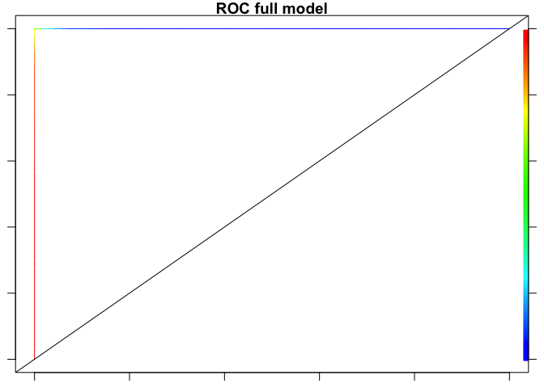
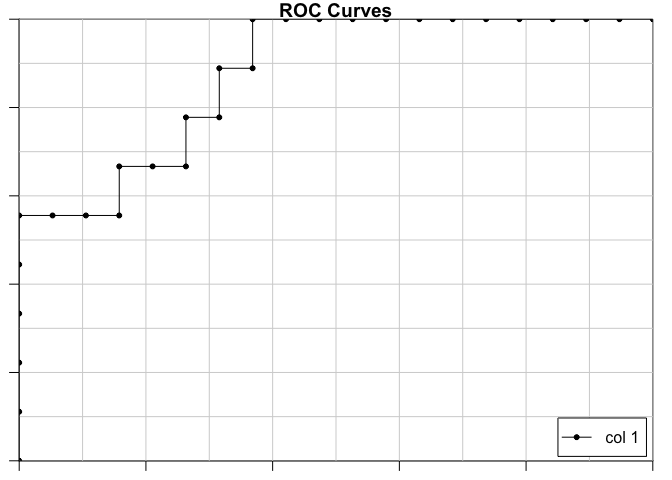

multiclass\_classification
================
Ilya
10/25/2019

\#\#based on code here: <https://rpubs.com/mharris/multiclass_xgboost>

\#\#\#\#\#install packages

    ## Loading required package: lattice

    ## Loading required package: ggplot2

    ## 
    ## Attaching package: 'dplyr'

    ## The following object is masked from 'package:xgboost':
    ## 
    ##     slice

    ## The following objects are masked from 'package:stats':
    ## 
    ##     filter, lag

    ## The following objects are masked from 'package:base':
    ## 
    ##     intersect, setdiff, setequal, union

    ## randomForest 4.6-14

    ## Type rfNews() to see new features/changes/bug fixes.

    ## 
    ## Attaching package: 'randomForest'

    ## The following object is masked from 'package:dplyr':
    ## 
    ##     combine

    ## The following object is masked from 'package:ggplot2':
    ## 
    ##     margin

    ## Loaded gbm 2.1.5

    ## Loading required package: gplots

    ## 
    ## Attaching package: 'gplots'

    ## The following object is masked from 'package:stats':
    ## 
    ##     lowess

    ## Loading required package: rquery

    ## 
    ## Attaching package: 'rquery'

    ## The following object is masked from 'package:ggplot2':
    ## 
    ##     arrow

    ## Loading required package: Matrix

    ## Loading required package: foreach

    ## Loaded glmnet 2.0-18

\#\#\#load and merge the 1) rodent trait data and 2) rodent - disease
data 3) disease – tx mode data 4) climate data

``` r
traits = read.csv("dfPanRodent_imputed.csv")
names(traits)
```

    ##  [1] "X"                             "X5.1_AdultBodyMass_g"         
    ##  [3] "X13.1_AdultHeadBodyLen_mm"     "X2.1_AgeatEyeOpening_d"       
    ##  [5] "X18.1_BasalMetRate_mLO2hr"     "X9.1_GestationLen_d"          
    ##  [7] "X22.1_HomeRange_km2"           "X15.1_LitterSize"             
    ##  [9] "X16.1_LittersPerYear"          "X5.3_NeonateBodyMass_g"       
    ## [11] "X21.1_PopulationDensity_n.km2" "X23.1_SexualMaturityAge_d"    
    ## [13] "X24.1_TeatNumber"              "X25.1_WeaningAge_d"           
    ## [15] "X26.1_GR_Area_km2"             "MSW05_Order"                  
    ## [17] "MSW05_Family"                  "MSW05_Genus"                  
    ## [19] "MSW05_Species"                 "MSW05_Binomial"

``` r
traits$Pan = paste(traits$MSW05_Genus,
                   traits$MSW05_Species,
                   sep = "_")

#host - rodent-disease pairs from GIDEON.csv
dx_host = read.csv("host - rodent-disease pairs from GIDEON.csv")

dx_host_traits = merge(traits, dx_host)

#host - rodent-disease transmission modes_20190413.csv
modes = read.csv("host - rodent-disease transmission modes_20191107 - data.csv")
names(modes)[names(modes)=="Zoonoses.with.rodent.reservoirs"]="Matches"
modes = modes[,c("Matches", "Pathogen.type",
                 # "foodborne","waterborne",
                 # "mosquito.borne","tick.borne",
                 "transmission.mode.to.humans.simplified")]

dx_modes_host_traits = merge(dx_host_traits,
                             modes, by = "Matches")

dx_modes_host_traits$Pan = str_replace(string = dx_modes_host_traits$Pan,pattern = "_",
            replacement = " ")

load("climate_envelope.rdata")

#these are the same length
length(intersect(xclim_all$binomial,dx_modes_host_traits$Pan))
```

    ## [1] 134

``` r
length(intersect(xclim_all$IUCN_binom,dx_modes_host_traits$Pan))
```

    ## [1] 134

``` r
names(xclim_all)[names(xclim_all)=="binomial"]="Pan"

dx_modes_host_traits_climate = merge(dx_modes_host_traits,xclim_all)
#remove fields no longer needed
rm = c( "Pan", "X",
       "MSW05_Order", "MSW05_Family","MSW05_Genus",                           
 "MSW05_Species","MSW05_Binomial","Flag" , "IUCN_binom")
keep = setdiff(names(dx_modes_host_traits_climate),rm)
dat = dx_modes_host_traits_climate[,keep]
save(dat, file = "dat.Rdata")
```

\#\#\#convert to 0\_1 the info we have on pathogen type

``` r
load("dat.Rdata")

dat$Pathogen.type.protozoa = 0
dat$Pathogen.type.bacteria = 0
dat$Pathogen.type.helminth = 0
dat$Pathogen.type.virus = 0
dat$Pathogen.type.fungus = 0
i = which(dat$Pathogen.type == "Bacteria")
dat$Pathogen.type.bacteria[i]=1

i = which(dat$Pathogen.type == "Virus")
dat$Pathogen.type.virus[i]=1

i = which(dat$Pathogen.type == "Protozoa")
dat$Pathogen.type.protozoa[i]=1

i = which(dat$Pathogen.type == "Fungus")
dat$Pathogen.type.fungus[i]=1

i = which(dat$Pathogen.type == "Helminth")
dat$Pathogen.type.helminth[i]=1
rm = "Pathogen.type"
keep = setdiff(names(dat), rm)
dat= dat[,keep]
save(dat, file = "dat.Rdata")
```

\#\#change classes from 0 to n-1– rodents

``` r
load("dat.Rdata")
dat$transmission.mode.to.humans.simplified.numeric = as.numeric(factor(dat$transmission.mode.to.humans.simplified))
#direct: 1
#environmental: 2
#vector: 3
rm = c("transmission.mode.to.humans.simplified")
keep = setdiff(names(dat), rm)
dat = dat[,keep]
dat <- dat %>%
  mutate(transmission.mode.to.humans.simplified.numeric =  transmission.mode.to.humans.simplified.numeric- 1)

#summary(dat)
#direct: 0
#environmental: 1
#vector: 2

save(dat, file = "dat.Rdata")
```

\#\#\#prepare data with vtreat

``` r
load("dat.Rdata")
rm = "Matches"
keep = setdiff(names(dat), rm)
dat = dat[,keep]


dat$random = factor(sample(c(0,1), size = dim(dat)[1], replace = TRUE))
transform_design = vtreat::mkCrossFrameMExperiment(
    d = dat,                                         # data to learn transform from
    vars = setdiff(colnames(dat), c('transmission.mode.to.humans.simplified.numeric')),     # columns to transform
    y_name = 'transmission.mode.to.humans.simplified.numeric'# outcome variable
)
transform <- transform_design$treat_m
d_prepared <- transform_design$cross_frame
score_frame <- transform_design$score_frame
score_frame$recommended <- score_frame$varMoves & (score_frame$sig < 1/nrow(score_frame))

knitr::kable(score_frame)
```

| varName                           | varMoves |       rsq |       sig | outcome\_level | needsSplit | extraModelDegrees | origName                        | code  | recommended |
| :-------------------------------- | :------- | --------: | --------: | :------------- | :--------- | ----------------: | :------------------------------ | :---- | :---------- |
| lst\_Apr                          | TRUE     | 0.0005599 | 0.8214041 | 0              | FALSE      |                 0 | lst\_Apr                        | clean | FALSE       |
| lst\_Apr\_isBAD                   | TRUE     | 0.0018091 | 0.6849109 | 0              | FALSE      |                 0 | lst\_Apr                        | isBAD | FALSE       |
| lst\_Aug                          | TRUE     | 0.0053915 | 0.4836137 | 0              | FALSE      |                 0 | lst\_Aug                        | clean | FALSE       |
| lst\_Aug\_isBAD                   | TRUE     | 0.0018091 | 0.6849109 | 0              | FALSE      |                 0 | lst\_Aug                        | isBAD | FALSE       |
| lst\_Dec                          | TRUE     | 0.0000563 | 0.9429331 | 0              | FALSE      |                 0 | lst\_Dec                        | clean | FALSE       |
| lst\_Dec\_isBAD                   | TRUE     | 0.0018091 | 0.6849109 | 0              | FALSE      |                 0 | lst\_Dec                        | isBAD | FALSE       |
| lst\_Feb                          | TRUE     | 0.0000106 | 0.9752381 | 0              | FALSE      |                 0 | lst\_Feb                        | clean | FALSE       |
| lst\_Feb\_isBAD                   | TRUE     | 0.0018091 | 0.6849109 | 0              | FALSE      |                 0 | lst\_Feb                        | isBAD | FALSE       |
| lst\_Jan                          | TRUE     | 0.0003436 | 0.8596256 | 0              | FALSE      |                 0 | lst\_Jan                        | clean | FALSE       |
| lst\_Jan\_isBAD                   | TRUE     | 0.0018091 | 0.6849109 | 0              | FALSE      |                 0 | lst\_Jan                        | isBAD | FALSE       |
| lst\_Jul                          | TRUE     | 0.0037460 | 0.5592911 | 0              | FALSE      |                 0 | lst\_Jul                        | clean | FALSE       |
| lst\_Jul\_isBAD                   | TRUE     | 0.0036297 | 0.5654527 | 0              | FALSE      |                 0 | lst\_Jul                        | isBAD | FALSE       |
| lst\_Jun                          | TRUE     | 0.0027726 | 0.6154287 | 0              | FALSE      |                 0 | lst\_Jun                        | clean | FALSE       |
| lst\_Jun\_isBAD                   | TRUE     | 0.0018091 | 0.6849109 | 0              | FALSE      |                 0 | lst\_Jun                        | isBAD | FALSE       |
| lst\_Mar                          | TRUE     | 0.0002047 | 0.8914348 | 0              | FALSE      |                 0 | lst\_Mar                        | clean | FALSE       |
| lst\_Mar\_isBAD                   | TRUE     | 0.0018091 | 0.6849109 | 0              | FALSE      |                 0 | lst\_Mar                        | isBAD | FALSE       |
| lst\_max                          | TRUE     | 0.0049592 | 0.5016907 | 0              | FALSE      |                 0 | lst\_max                        | clean | FALSE       |
| lst\_max\_isBAD                   | TRUE     | 0.0018091 | 0.6849109 | 0              | FALSE      |                 0 | lst\_max                        | isBAD | FALSE       |
| lst\_May                          | TRUE     | 0.0016869 | 0.6951815 | 0              | FALSE      |                 0 | lst\_May                        | clean | FALSE       |
| lst\_May\_isBAD                   | TRUE     | 0.0018091 | 0.6849109 | 0              | FALSE      |                 0 | lst\_May                        | isBAD | FALSE       |
| lst\_mean                         | TRUE     | 0.0011563 | 0.7456275 | 0              | FALSE      |                 0 | lst\_mean                       | clean | FALSE       |
| lst\_mean\_isBAD                  | TRUE     | 0.0018091 | 0.6849109 | 0              | FALSE      |                 0 | lst\_mean                       | isBAD | FALSE       |
| lst\_min                          | TRUE     | 0.0004266 | 0.8437990 | 0              | FALSE      |                 0 | lst\_min                        | clean | FALSE       |
| lst\_min\_isBAD                   | TRUE     | 0.0018091 | 0.6849109 | 0              | FALSE      |                 0 | lst\_min                        | isBAD | FALSE       |
| lst\_Nov                          | TRUE     | 0.0001742 | 0.8998103 | 0              | FALSE      |                 0 | lst\_Nov                        | clean | FALSE       |
| lst\_Nov\_isBAD                   | TRUE     | 0.0018091 | 0.6849109 | 0              | FALSE      |                 0 | lst\_Nov                        | isBAD | FALSE       |
| lst\_Oct                          | TRUE     | 0.0045228 | 0.5211389 | 0              | FALSE      |                 0 | lst\_Oct                        | clean | FALSE       |
| lst\_Oct\_isBAD                   | TRUE     | 0.0018091 | 0.6849109 | 0              | FALSE      |                 0 | lst\_Oct                        | isBAD | FALSE       |
| lst\_Sep                          | TRUE     | 0.0105122 | 0.3280056 | 0              | FALSE      |                 0 | lst\_Sep                        | clean | FALSE       |
| lst\_Sep\_isBAD                   | TRUE     | 0.0018091 | 0.6849109 | 0              | FALSE      |                 0 | lst\_Sep                        | isBAD | FALSE       |
| Pathogen\_type\_bacteria          | TRUE     | 0.2642459 | 0.0000009 | 0              | FALSE      |                 0 | Pathogen.type.bacteria          | clean | TRUE        |
| Pathogen\_type\_fungus            | TRUE     | 0.0073061 | 0.4148161 | 0              | FALSE      |                 0 | Pathogen.type.fungus            | clean | FALSE       |
| Pathogen\_type\_helminth          | TRUE     | 0.0205597 | 0.1713360 | 0              | FALSE      |                 0 | Pathogen.type.helminth          | clean | FALSE       |
| Pathogen\_type\_protozoa          | TRUE     | 0.1031377 | 0.0021854 | 0              | FALSE      |                 0 | Pathogen.type.protozoa          | clean | FALSE       |
| Pathogen\_type\_virus             | TRUE     | 0.0284335 | 0.1076876 | 0              | FALSE      |                 0 | Pathogen.type.virus             | clean | FALSE       |
| random\_lev\_x\_0                 | TRUE     | 0.0050428 | 0.4981099 | 0              | FALSE      |                 0 | random                          | lev   | FALSE       |
| random\_lev\_x\_1                 | TRUE     | 0.0050428 | 0.4981099 | 0              | FALSE      |                 0 | random                          | lev   | FALSE       |
| rf\_Apr                           | TRUE     | 0.0047916 | 0.5090113 | 0              | FALSE      |                 0 | rf\_Apr                         | clean | FALSE       |
| rf\_Apr\_isBAD                    | TRUE     | 0.0018091 | 0.6849109 | 0              | FALSE      |                 0 | rf\_Apr                         | isBAD | FALSE       |
| rf\_Aug                           | TRUE     | 0.0142934 | 0.2540497 | 0              | FALSE      |                 0 | rf\_Aug                         | clean | FALSE       |
| rf\_Aug\_isBAD                    | TRUE     | 0.0018091 | 0.6849109 | 0              | FALSE      |                 0 | rf\_Aug                         | isBAD | FALSE       |
| rf\_Dec                           | TRUE     | 0.0546517 | 0.0257303 | 0              | FALSE      |                 0 | rf\_Dec                         | clean | FALSE       |
| rf\_Dec\_isBAD                    | TRUE     | 0.0018091 | 0.6849109 | 0              | FALSE      |                 0 | rf\_Dec                         | isBAD | FALSE       |
| rf\_Feb                           | TRUE     | 0.0345259 | 0.0762848 | 0              | FALSE      |                 0 | rf\_Feb                         | clean | FALSE       |
| rf\_Feb\_isBAD                    | TRUE     | 0.0018091 | 0.6849109 | 0              | FALSE      |                 0 | rf\_Feb                         | isBAD | FALSE       |
| rf\_Jan                           | TRUE     | 0.0516675 | 0.0301196 | 0              | FALSE      |                 0 | rf\_Jan                         | clean | FALSE       |
| rf\_Jan\_isBAD                    | TRUE     | 0.0018091 | 0.6849109 | 0              | FALSE      |                 0 | rf\_Jan                         | isBAD | FALSE       |
| rf\_Jul                           | TRUE     | 0.0159149 | 0.2287737 | 0              | FALSE      |                 0 | rf\_Jul                         | clean | FALSE       |
| rf\_Jun                           | TRUE     | 0.0157980 | 0.2304897 | 0              | FALSE      |                 0 | rf\_Jun                         | clean | FALSE       |
| rf\_Jun\_isBAD                    | TRUE     | 0.0018091 | 0.6849109 | 0              | FALSE      |                 0 | rf\_Jun                         | isBAD | FALSE       |
| rf\_Mar                           | TRUE     | 0.0144956 | 0.2507190 | 0              | FALSE      |                 0 | rf\_Mar                         | clean | FALSE       |
| rf\_Mar\_isBAD                    | TRUE     | 0.0018091 | 0.6849109 | 0              | FALSE      |                 0 | rf\_Mar                         | isBAD | FALSE       |
| rf\_max                           | TRUE     | 0.0316723 | 0.0895409 | 0              | FALSE      |                 0 | rf\_max                         | clean | FALSE       |
| rf\_May                           | TRUE     | 0.0102811 | 0.3333805 | 0              | FALSE      |                 0 | rf\_May                         | clean | FALSE       |
| rf\_May\_isBAD                    | TRUE     | 0.0018091 | 0.6849109 | 0              | FALSE      |                 0 | rf\_May                         | isBAD | FALSE       |
| rf\_mean                          | TRUE     | 0.0339613 | 0.0787292 | 0              | FALSE      |                 0 | rf\_mean                        | clean | FALSE       |
| rf\_min                           | TRUE     | 0.0349356 | 0.0745622 | 0              | FALSE      |                 0 | rf\_min                         | clean | FALSE       |
| rf\_Nov                           | TRUE     | 0.0267724 | 0.1185291 | 0              | FALSE      |                 0 | rf\_Nov                         | clean | FALSE       |
| rf\_Nov\_isBAD                    | TRUE     | 0.0018091 | 0.6849109 | 0              | FALSE      |                 0 | rf\_Nov                         | isBAD | FALSE       |
| rf\_Oct                           | TRUE     | 0.0187434 | 0.1915177 | 0              | FALSE      |                 0 | rf\_Oct                         | clean | FALSE       |
| rf\_Oct\_isBAD                    | TRUE     | 0.0018091 | 0.6849109 | 0              | FALSE      |                 0 | rf\_Oct                         | isBAD | FALSE       |
| rf\_Sep                           | TRUE     | 0.0241705 | 0.1380245 | 0              | FALSE      |                 0 | rf\_Sep                         | clean | FALSE       |
| rf\_Sep\_isBAD                    | TRUE     | 0.0018091 | 0.6849109 | 0              | FALSE      |                 0 | rf\_Sep                         | isBAD | FALSE       |
| sh\_Apr                           | TRUE     | 0.0005662 | 0.8204241 | 0              | FALSE      |                 0 | sh\_Apr                         | clean | FALSE       |
| sh\_Apr\_isBAD                    | TRUE     | 0.0167098 | 0.2174958 | 0              | FALSE      |                 0 | sh\_Apr                         | isBAD | FALSE       |
| sh\_Aug                           | TRUE     | 0.0178719 | 0.2021755 | 0              | FALSE      |                 0 | sh\_Aug                         | clean | FALSE       |
| sh\_Aug\_isBAD                    | TRUE     | 0.0167098 | 0.2174958 | 0              | FALSE      |                 0 | sh\_Aug                         | isBAD | FALSE       |
| sh\_Dec                           | TRUE     | 0.0041109 | 0.5407514 | 0              | FALSE      |                 0 | sh\_Dec                         | clean | FALSE       |
| sh\_Dec\_isBAD                    | TRUE     | 0.0167098 | 0.2174958 | 0              | FALSE      |                 0 | sh\_Dec                         | isBAD | FALSE       |
| sh\_Feb                           | TRUE     | 0.0019636 | 0.6724811 | 0              | FALSE      |                 0 | sh\_Feb                         | clean | FALSE       |
| sh\_Feb\_isBAD                    | TRUE     | 0.0167098 | 0.2174958 | 0              | FALSE      |                 0 | sh\_Feb                         | isBAD | FALSE       |
| sh\_Jan                           | TRUE     | 0.0042181 | 0.5355194 | 0              | FALSE      |                 0 | sh\_Jan                         | clean | FALSE       |
| sh\_Jan\_isBAD                    | TRUE     | 0.0167098 | 0.2174958 | 0              | FALSE      |                 0 | sh\_Jan                         | isBAD | FALSE       |
| sh\_Jul                           | TRUE     | 0.0181886 | 0.1982236 | 0              | FALSE      |                 0 | sh\_Jul                         | clean | FALSE       |
| sh\_Jul\_isBAD                    | TRUE     | 0.0167098 | 0.2174958 | 0              | FALSE      |                 0 | sh\_Jul                         | isBAD | FALSE       |
| sh\_Jun                           | TRUE     | 0.0134807 | 0.2680046 | 0              | FALSE      |                 0 | sh\_Jun                         | clean | FALSE       |
| sh\_Jun\_isBAD                    | TRUE     | 0.0167098 | 0.2174958 | 0              | FALSE      |                 0 | sh\_Jun                         | isBAD | FALSE       |
| sh\_Mar                           | TRUE     | 0.0006333 | 0.8102740 | 0              | FALSE      |                 0 | sh\_Mar                         | clean | FALSE       |
| sh\_Mar\_isBAD                    | TRUE     | 0.0167098 | 0.2174958 | 0              | FALSE      |                 0 | sh\_Mar                         | isBAD | FALSE       |
| sh\_max                           | TRUE     | 0.0099925 | 0.3402586 | 0              | FALSE      |                 0 | sh\_max                         | clean | FALSE       |
| sh\_max\_isBAD                    | TRUE     | 0.0167098 | 0.2174958 | 0              | FALSE      |                 0 | sh\_max                         | isBAD | FALSE       |
| sh\_May                           | TRUE     | 0.0041989 | 0.5364516 | 0              | FALSE      |                 0 | sh\_May                         | clean | FALSE       |
| sh\_May\_isBAD                    | TRUE     | 0.0167098 | 0.2174958 | 0              | FALSE      |                 0 | sh\_May                         | isBAD | FALSE       |
| sh\_mean                          | TRUE     | 0.0066217 | 0.4375639 | 0              | FALSE      |                 0 | sh\_mean                        | clean | FALSE       |
| sh\_mean\_isBAD                   | TRUE     | 0.0167098 | 0.2174958 | 0              | FALSE      |                 0 | sh\_mean                        | isBAD | FALSE       |
| sh\_min                           | TRUE     | 0.0043268 | 0.5303105 | 0              | FALSE      |                 0 | sh\_min                         | clean | FALSE       |
| sh\_min\_isBAD                    | TRUE     | 0.0167098 | 0.2174958 | 0              | FALSE      |                 0 | sh\_min                         | isBAD | FALSE       |
| sh\_Nov                           | TRUE     | 0.0029130 | 0.6066247 | 0              | FALSE      |                 0 | sh\_Nov                         | clean | FALSE       |
| sh\_Nov\_isBAD                    | TRUE     | 0.0167098 | 0.2174958 | 0              | FALSE      |                 0 | sh\_Nov                         | isBAD | FALSE       |
| sh\_Oct                           | TRUE     | 0.0071458 | 0.4199809 | 0              | FALSE      |                 0 | sh\_Oct                         | clean | FALSE       |
| sh\_Oct\_isBAD                    | TRUE     | 0.0167098 | 0.2174958 | 0              | FALSE      |                 0 | sh\_Oct                         | isBAD | FALSE       |
| sh\_Sep                           | TRUE     | 0.0137819 | 0.2627241 | 0              | FALSE      |                 0 | sh\_Sep                         | clean | FALSE       |
| sh\_Sep\_isBAD                    | TRUE     | 0.0167098 | 0.2174958 | 0              | FALSE      |                 0 | sh\_Sep                         | isBAD | FALSE       |
| sm\_Apr                           | TRUE     | 0.0117712 | 0.3006433 | 0              | FALSE      |                 0 | sm\_Apr                         | clean | FALSE       |
| sm\_Apr\_isBAD                    | TRUE     | 0.0167098 | 0.2174958 | 0              | FALSE      |                 0 | sm\_Apr                         | isBAD | FALSE       |
| sm\_Aug                           | TRUE     | 0.0312175 | 0.0918747 | 0              | FALSE      |                 0 | sm\_Aug                         | clean | FALSE       |
| sm\_Aug\_isBAD                    | TRUE     | 0.0167098 | 0.2174958 | 0              | FALSE      |                 0 | sm\_Aug                         | isBAD | FALSE       |
| sm\_Dec                           | TRUE     | 0.0519203 | 0.0297193 | 0              | FALSE      |                 0 | sm\_Dec                         | clean | FALSE       |
| sm\_Dec\_isBAD                    | TRUE     | 0.0167098 | 0.2174958 | 0              | FALSE      |                 0 | sm\_Dec                         | isBAD | FALSE       |
| sm\_Feb                           | TRUE     | 0.0459470 | 0.0408601 | 0              | FALSE      |                 0 | sm\_Feb                         | clean | FALSE       |
| sm\_Feb\_isBAD                    | TRUE     | 0.0167098 | 0.2174958 | 0              | FALSE      |                 0 | sm\_Feb                         | isBAD | FALSE       |
| sm\_Jan                           | TRUE     | 0.0635761 | 0.0161516 | 0              | FALSE      |                 0 | sm\_Jan                         | clean | FALSE       |
| sm\_Jan\_isBAD                    | TRUE     | 0.0167098 | 0.2174958 | 0              | FALSE      |                 0 | sm\_Jan                         | isBAD | FALSE       |
| sm\_Jul                           | TRUE     | 0.0328670 | 0.0837104 | 0              | FALSE      |                 0 | sm\_Jul                         | clean | FALSE       |
| sm\_Jul\_isBAD                    | TRUE     | 0.0167098 | 0.2174958 | 0              | FALSE      |                 0 | sm\_Jul                         | isBAD | FALSE       |
| sm\_Jun                           | TRUE     | 0.0282822 | 0.1086283 | 0              | FALSE      |                 0 | sm\_Jun                         | clean | FALSE       |
| sm\_Jun\_isBAD                    | TRUE     | 0.0167098 | 0.2174958 | 0              | FALSE      |                 0 | sm\_Jun                         | isBAD | FALSE       |
| sm\_Mar                           | TRUE     | 0.0273819 | 0.1144167 | 0              | FALSE      |                 0 | sm\_Mar                         | clean | FALSE       |
| sm\_Mar\_isBAD                    | TRUE     | 0.0167098 | 0.2174958 | 0              | FALSE      |                 0 | sm\_Mar                         | isBAD | FALSE       |
| sm\_max                           | TRUE     | 0.0461672 | 0.0403800 | 0              | FALSE      |                 0 | sm\_max                         | clean | FALSE       |
| sm\_max\_isBAD                    | TRUE     | 0.0167098 | 0.2174958 | 0              | FALSE      |                 0 | sm\_max                         | isBAD | FALSE       |
| sm\_May                           | TRUE     | 0.0160549 | 0.2267366 | 0              | FALSE      |                 0 | sm\_May                         | clean | FALSE       |
| sm\_May\_isBAD                    | TRUE     | 0.0167098 | 0.2174958 | 0              | FALSE      |                 0 | sm\_May                         | isBAD | FALSE       |
| sm\_mean                          | TRUE     | 0.0461672 | 0.0403800 | 0              | FALSE      |                 0 | sm\_mean                        | clean | FALSE       |
| sm\_mean\_isBAD                   | TRUE     | 0.0167098 | 0.2174958 | 0              | FALSE      |                 0 | sm\_mean                        | isBAD | FALSE       |
| sm\_min                           | TRUE     | 0.0315594 | 0.0901138 | 0              | FALSE      |                 0 | sm\_min                         | clean | FALSE       |
| sm\_min\_isBAD                    | TRUE     | 0.0167098 | 0.2174958 | 0              | FALSE      |                 0 | sm\_min                         | isBAD | FALSE       |
| sm\_Nov                           | TRUE     | 0.0305645 | 0.0953417 | 0              | FALSE      |                 0 | sm\_Nov                         | clean | FALSE       |
| sm\_Nov\_isBAD                    | TRUE     | 0.0167098 | 0.2174958 | 0              | FALSE      |                 0 | sm\_Nov                         | isBAD | FALSE       |
| sm\_Oct                           | TRUE     | 0.0279918 | 0.1104591 | 0              | FALSE      |                 0 | sm\_Oct                         | clean | FALSE       |
| sm\_Oct\_isBAD                    | TRUE     | 0.0167098 | 0.2174958 | 0              | FALSE      |                 0 | sm\_Oct                         | isBAD | FALSE       |
| sm\_Sep                           | TRUE     | 0.0294323 | 0.1016961 | 0              | FALSE      |                 0 | sm\_Sep                         | clean | FALSE       |
| sm\_Sep\_isBAD                    | TRUE     | 0.0167098 | 0.2174958 | 0              | FALSE      |                 0 | sm\_Sep                         | isBAD | FALSE       |
| tair\_Apr                         | TRUE     | 0.0027187 | 0.6188860 | 0              | FALSE      |                 0 | tair\_Apr                       | clean | FALSE       |
| tair\_Apr\_isBAD                  | TRUE     | 0.0167098 | 0.2174958 | 0              | FALSE      |                 0 | tair\_Apr                       | isBAD | FALSE       |
| tair\_Aug                         | TRUE     | 0.0025618 | 0.6291896 | 0              | FALSE      |                 0 | tair\_Aug                       | clean | FALSE       |
| tair\_Aug\_isBAD                  | TRUE     | 0.0167098 | 0.2174958 | 0              | FALSE      |                 0 | tair\_Aug                       | isBAD | FALSE       |
| tair\_Dec                         | TRUE     | 0.0044244 | 0.5257074 | 0              | FALSE      |                 0 | tair\_Dec                       | clean | FALSE       |
| tair\_Dec\_isBAD                  | TRUE     | 0.0167098 | 0.2174958 | 0              | FALSE      |                 0 | tair\_Dec                       | isBAD | FALSE       |
| tair\_Feb                         | TRUE     | 0.0032969 | 0.5838421 | 0              | FALSE      |                 0 | tair\_Feb                       | clean | FALSE       |
| tair\_Feb\_isBAD                  | TRUE     | 0.0167098 | 0.2174958 | 0              | FALSE      |                 0 | tair\_Feb                       | isBAD | FALSE       |
| tair\_Jan                         | TRUE     | 0.0048277 | 0.5074170 | 0              | FALSE      |                 0 | tair\_Jan                       | clean | FALSE       |
| tair\_Jan\_isBAD                  | TRUE     | 0.0167098 | 0.2174958 | 0              | FALSE      |                 0 | tair\_Jan                       | isBAD | FALSE       |
| tair\_Jul                         | TRUE     | 0.0015047 | 0.7113382 | 0              | FALSE      |                 0 | tair\_Jul                       | clean | FALSE       |
| tair\_Jul\_isBAD                  | TRUE     | 0.0167098 | 0.2174958 | 0              | FALSE      |                 0 | tair\_Jul                       | isBAD | FALSE       |
| tair\_Jun                         | TRUE     | 0.0024048 | 0.6399045 | 0              | FALSE      |                 0 | tair\_Jun                       | clean | FALSE       |
| tair\_Jun\_isBAD                  | TRUE     | 0.0167098 | 0.2174958 | 0              | FALSE      |                 0 | tair\_Jun                       | isBAD | FALSE       |
| tair\_Mar                         | TRUE     | 0.0027947 | 0.6140245 | 0              | FALSE      |                 0 | tair\_Mar                       | clean | FALSE       |
| tair\_Mar\_isBAD                  | TRUE     | 0.0167098 | 0.2174958 | 0              | FALSE      |                 0 | tair\_Mar                       | isBAD | FALSE       |
| tair\_max                         | TRUE     | 0.0099925 | 0.3402586 | 0              | FALSE      |                 0 | tair\_max                       | clean | FALSE       |
| tair\_max\_isBAD                  | TRUE     | 0.0167098 | 0.2174958 | 0              | FALSE      |                 0 | tair\_max                       | isBAD | FALSE       |
| tair\_May                         | TRUE     | 0.0025274 | 0.6314998 | 0              | FALSE      |                 0 | tair\_May                       | clean | FALSE       |
| tair\_May\_isBAD                  | TRUE     | 0.0167098 | 0.2174958 | 0              | FALSE      |                 0 | tair\_May                       | isBAD | FALSE       |
| tair\_mean                        | TRUE     | 0.0066217 | 0.4375639 | 0              | FALSE      |                 0 | tair\_mean                      | clean | FALSE       |
| tair\_mean\_isBAD                 | TRUE     | 0.0167098 | 0.2174958 | 0              | FALSE      |                 0 | tair\_mean                      | isBAD | FALSE       |
| tair\_min                         | TRUE     | 0.0043268 | 0.5303105 | 0              | FALSE      |                 0 | tair\_min                       | clean | FALSE       |
| tair\_min\_isBAD                  | TRUE     | 0.0167098 | 0.2174958 | 0              | FALSE      |                 0 | tair\_min                       | isBAD | FALSE       |
| tair\_Nov                         | TRUE     | 0.0050128 | 0.4993906 | 0              | FALSE      |                 0 | tair\_Nov                       | clean | FALSE       |
| tair\_Nov\_isBAD                  | TRUE     | 0.0167098 | 0.2174958 | 0              | FALSE      |                 0 | tair\_Nov                       | isBAD | FALSE       |
| tair\_Oct                         | TRUE     | 0.0041142 | 0.5405891 | 0              | FALSE      |                 0 | tair\_Oct                       | clean | FALSE       |
| tair\_Oct\_isBAD                  | TRUE     | 0.0167098 | 0.2174958 | 0              | FALSE      |                 0 | tair\_Oct                       | isBAD | FALSE       |
| tair\_Sep                         | TRUE     | 0.0028655 | 0.6095693 | 0              | FALSE      |                 0 | tair\_Sep                       | clean | FALSE       |
| tair\_Sep\_isBAD                  | TRUE     | 0.0167098 | 0.2174958 | 0              | FALSE      |                 0 | tair\_Sep                       | isBAD | FALSE       |
| X13\_1\_AdultHeadBodyLen\_mm      | TRUE     | 0.0001514 | 0.9065673 | 0              | FALSE      |                 0 | X13.1\_AdultHeadBodyLen\_mm     | clean | FALSE       |
| X15\_1\_LitterSize                | TRUE     | 0.0208895 | 0.1679407 | 0              | FALSE      |                 0 | X15.1\_LitterSize               | clean | FALSE       |
| X16\_1\_LittersPerYear            | TRUE     | 0.0049648 | 0.5014522 | 0              | FALSE      |                 0 | X16.1\_LittersPerYear           | clean | FALSE       |
| X18\_1\_BasalMetRate\_mLO2hr      | TRUE     | 0.0015997 | 0.7027816 | 0              | FALSE      |                 0 | X18.1\_BasalMetRate\_mLO2hr     | clean | FALSE       |
| X2\_1\_AgeatEyeOpening\_d         | TRUE     | 0.0105977 | 0.3260475 | 0              | FALSE      |                 0 | X2.1\_AgeatEyeOpening\_d        | clean | FALSE       |
| X21\_1\_PopulationDensity\_n\_km2 | TRUE     | 0.0000002 | 0.9970197 | 0              | FALSE      |                 0 | X21.1\_PopulationDensity\_n.km2 | clean | FALSE       |
| X22\_1\_HomeRange\_km2            | TRUE     | 0.0158168 | 0.2302129 | 0              | FALSE      |                 0 | X22.1\_HomeRange\_km2           | clean | FALSE       |
| X23\_1\_SexualMaturityAge\_d      | TRUE     | 0.0003618 | 0.8560029 | 0              | FALSE      |                 0 | X23.1\_SexualMaturityAge\_d     | clean | FALSE       |
| X24\_1\_TeatNumber                | TRUE     | 0.0002843 | 0.8721972 | 0              | FALSE      |                 0 | X24.1\_TeatNumber               | clean | FALSE       |
| X25\_1\_WeaningAge\_d             | TRUE     | 0.0260787 | 0.1234087 | 0              | FALSE      |                 0 | X25.1\_WeaningAge\_d            | clean | FALSE       |
| X26\_1\_GR\_Area\_km2             | TRUE     | 0.0052612 | 0.4889457 | 0              | FALSE      |                 0 | X26.1\_GR\_Area\_km2            | clean | FALSE       |
| X5\_1\_AdultBodyMass\_g           | TRUE     | 0.0049159 | 0.5035647 | 0              | FALSE      |                 0 | X5.1\_AdultBodyMass\_g          | clean | FALSE       |
| X5\_3\_NeonateBodyMass\_g         | TRUE     | 0.0052832 | 0.4880400 | 0              | FALSE      |                 0 | X5.3\_NeonateBodyMass\_g        | clean | FALSE       |
| X9\_1\_GestationLen\_d            | TRUE     | 0.0000046 | 0.9836183 | 0              | FALSE      |                 0 | X9.1\_GestationLen\_d           | clean | FALSE       |
| lst\_Apr                          | TRUE     | 0.0251976 | 0.0167781 | 1              | FALSE      |                 0 | lst\_Apr                        | clean | FALSE       |
| lst\_Apr\_isBAD                   | TRUE     | 0.0070986 | 0.2043145 | 1              | FALSE      |                 0 | lst\_Apr                        | isBAD | FALSE       |
| lst\_Aug                          | TRUE     | 0.0520178 | 0.0005900 | 1              | FALSE      |                 0 | lst\_Aug                        | clean | TRUE        |
| lst\_Aug\_isBAD                   | TRUE     | 0.0070986 | 0.2043145 | 1              | FALSE      |                 0 | lst\_Aug                        | isBAD | FALSE       |
| lst\_Dec                          | TRUE     | 0.0031326 | 0.3990979 | 1              | FALSE      |                 0 | lst\_Dec                        | clean | FALSE       |
| lst\_Dec\_isBAD                   | TRUE     | 0.0070986 | 0.2043145 | 1              | FALSE      |                 0 | lst\_Dec                        | isBAD | FALSE       |
| lst\_Feb                          | TRUE     | 0.0034510 | 0.3761237 | 1              | FALSE      |                 0 | lst\_Feb                        | clean | FALSE       |
| lst\_Feb\_isBAD                   | TRUE     | 0.0070986 | 0.2043145 | 1              | FALSE      |                 0 | lst\_Feb                        | isBAD | FALSE       |
| lst\_Jan                          | TRUE     | 0.0027296 | 0.4312056 | 1              | FALSE      |                 0 | lst\_Jan                        | clean | FALSE       |
| lst\_Jan\_isBAD                   | TRUE     | 0.0070986 | 0.2043145 | 1              | FALSE      |                 0 | lst\_Jan                        | isBAD | FALSE       |
| lst\_Jul                          | TRUE     | 0.0502836 | 0.0007291 | 1              | FALSE      |                 0 | lst\_Jul                        | clean | TRUE        |
| lst\_Jul\_isBAD                   | TRUE     | 0.0142641 | 0.0719604 | 1              | FALSE      |                 0 | lst\_Jul                        | isBAD | FALSE       |
| lst\_Jun                          | TRUE     | 0.0482007 | 0.0009407 | 1              | FALSE      |                 0 | lst\_Jun                        | clean | TRUE        |
| lst\_Jun\_isBAD                   | TRUE     | 0.0070986 | 0.2043145 | 1              | FALSE      |                 0 | lst\_Jun                        | isBAD | FALSE       |
| lst\_Mar                          | TRUE     | 0.0100212 | 0.1315042 | 1              | FALSE      |                 0 | lst\_Mar                        | clean | FALSE       |
| lst\_Mar\_isBAD                   | TRUE     | 0.0070986 | 0.2043145 | 1              | FALSE      |                 0 | lst\_Mar                        | isBAD | FALSE       |
| lst\_max                          | TRUE     | 0.0478988 | 0.0009761 | 1              | FALSE      |                 0 | lst\_max                        | clean | TRUE        |
| lst\_max\_isBAD                   | TRUE     | 0.0070986 | 0.2043145 | 1              | FALSE      |                 0 | lst\_max                        | isBAD | FALSE       |
| lst\_May                          | TRUE     | 0.0468707 | 0.0011073 | 1              | FALSE      |                 0 | lst\_May                        | clean | TRUE        |
| lst\_May\_isBAD                   | TRUE     | 0.0070986 | 0.2043145 | 1              | FALSE      |                 0 | lst\_May                        | isBAD | FALSE       |
| lst\_mean                         | TRUE     | 0.0288907 | 0.0104430 | 1              | FALSE      |                 0 | lst\_mean                       | clean | FALSE       |
| lst\_mean\_isBAD                  | TRUE     | 0.0070986 | 0.2043145 | 1              | FALSE      |                 0 | lst\_mean                       | isBAD | FALSE       |
| lst\_min                          | TRUE     | 0.0082180 | 0.1720075 | 1              | FALSE      |                 0 | lst\_min                        | clean | FALSE       |
| lst\_min\_isBAD                   | TRUE     | 0.0070986 | 0.2043145 | 1              | FALSE      |                 0 | lst\_min                        | isBAD | FALSE       |
| lst\_Nov                          | TRUE     | 0.0086157 | 0.1619811 | 1              | FALSE      |                 0 | lst\_Nov                        | clean | FALSE       |
| lst\_Nov\_isBAD                   | TRUE     | 0.0070986 | 0.2043145 | 1              | FALSE      |                 0 | lst\_Nov                        | isBAD | FALSE       |
| lst\_Oct                          | TRUE     | 0.0296722 | 0.0094533 | 1              | FALSE      |                 0 | lst\_Oct                        | clean | FALSE       |
| lst\_Oct\_isBAD                   | TRUE     | 0.0070986 | 0.2043145 | 1              | FALSE      |                 0 | lst\_Oct                        | isBAD | FALSE       |
| lst\_Sep                          | TRUE     | 0.0550069 | 0.0004101 | 1              | FALSE      |                 0 | lst\_Sep                        | clean | TRUE        |
| lst\_Sep\_isBAD                   | TRUE     | 0.0070986 | 0.2043145 | 1              | FALSE      |                 0 | lst\_Sep                        | isBAD | FALSE       |
| Pathogen\_type\_bacteria          | TRUE     | 0.2042278 | 0.0000000 | 1              | FALSE      |                 0 | Pathogen.type.bacteria          | clean | TRUE        |
| Pathogen\_type\_fungus            | TRUE     | 0.0213292 | 0.0277846 | 1              | FALSE      |                 0 | Pathogen.type.fungus            | clean | FALSE       |
| Pathogen\_type\_helminth          | TRUE     | 0.0604820 | 0.0002112 | 1              | FALSE      |                 0 | Pathogen.type.helminth          | clean | TRUE        |
| Pathogen\_type\_protozoa          | TRUE     | 0.1290565 | 0.0000001 | 1              | FALSE      |                 0 | Pathogen.type.protozoa          | clean | TRUE        |
| Pathogen\_type\_virus             | TRUE     | 0.2850344 | 0.0000000 | 1              | FALSE      |                 0 | Pathogen.type.virus             | clean | TRUE        |
| random\_lev\_x\_0                 | TRUE     | 0.0076802 | 0.1867221 | 1              | FALSE      |                 0 | random                          | lev   | FALSE       |
| random\_lev\_x\_1                 | TRUE     | 0.0076802 | 0.1867221 | 1              | FALSE      |                 0 | random                          | lev   | FALSE       |
| rf\_Apr                           | TRUE     | 0.0255072 | 0.0161201 | 1              | FALSE      |                 0 | rf\_Apr                         | clean | FALSE       |
| rf\_Apr\_isBAD                    | TRUE     | 0.0052653 | 0.2742977 | 1              | FALSE      |                 0 | rf\_Apr                         | isBAD | FALSE       |
| rf\_Aug                           | TRUE     | 0.0150125 | 0.0648967 | 1              | FALSE      |                 0 | rf\_Aug                         | clean | FALSE       |
| rf\_Aug\_isBAD                    | TRUE     | 0.0052653 | 0.2742977 | 1              | FALSE      |                 0 | rf\_Aug                         | isBAD | FALSE       |
| rf\_Dec                           | TRUE     | 0.0415145 | 0.0021427 | 1              | FALSE      |                 0 | rf\_Dec                         | clean | FALSE       |
| rf\_Dec\_isBAD                    | TRUE     | 0.0052653 | 0.2742977 | 1              | FALSE      |                 0 | rf\_Dec                         | isBAD | FALSE       |
| rf\_Feb                           | TRUE     | 0.0352071 | 0.0046999 | 1              | FALSE      |                 0 | rf\_Feb                         | clean | FALSE       |
| rf\_Feb\_isBAD                    | TRUE     | 0.0052653 | 0.2742977 | 1              | FALSE      |                 0 | rf\_Feb                         | isBAD | FALSE       |
| rf\_Jan                           | TRUE     | 0.0412671 | 0.0022093 | 1              | FALSE      |                 0 | rf\_Jan                         | clean | FALSE       |
| rf\_Jan\_isBAD                    | TRUE     | 0.0052653 | 0.2742977 | 1              | FALSE      |                 0 | rf\_Jan                         | isBAD | FALSE       |
| rf\_Jul                           | TRUE     | 0.0178194 | 0.0443100 | 1              | FALSE      |                 0 | rf\_Jul                         | clean | FALSE       |
| rf\_Jun                           | TRUE     | 0.0164921 | 0.0530148 | 1              | FALSE      |                 0 | rf\_Jun                         | clean | FALSE       |
| rf\_Jun\_isBAD                    | TRUE     | 0.0052653 | 0.2742977 | 1              | FALSE      |                 0 | rf\_Jun                         | isBAD | FALSE       |
| rf\_Mar                           | TRUE     | 0.0324360 | 0.0066600 | 1              | FALSE      |                 0 | rf\_Mar                         | clean | FALSE       |
| rf\_Mar\_isBAD                    | TRUE     | 0.0052653 | 0.2742977 | 1              | FALSE      |                 0 | rf\_Mar                         | isBAD | FALSE       |
| rf\_max                           | TRUE     | 0.0446318 | 0.0014582 | 1              | FALSE      |                 0 | rf\_max                         | clean | TRUE        |
| rf\_May                           | TRUE     | 0.0199492 | 0.0333416 | 1              | FALSE      |                 0 | rf\_May                         | clean | FALSE       |
| rf\_May\_isBAD                    | TRUE     | 0.0052653 | 0.2742977 | 1              | FALSE      |                 0 | rf\_May                         | isBAD | FALSE       |
| rf\_mean                          | TRUE     | 0.0411554 | 0.0022401 | 1              | FALSE      |                 0 | rf\_mean                        | clean | FALSE       |
| rf\_min                           | TRUE     | 0.0237404 | 0.0202677 | 1              | FALSE      |                 0 | rf\_min                         | clean | FALSE       |
| rf\_Nov                           | TRUE     | 0.0298534 | 0.0092379 | 1              | FALSE      |                 0 | rf\_Nov                         | clean | FALSE       |
| rf\_Nov\_isBAD                    | TRUE     | 0.0052653 | 0.2742977 | 1              | FALSE      |                 0 | rf\_Nov                         | isBAD | FALSE       |
| rf\_Oct                           | TRUE     | 0.0262285 | 0.0146885 | 1              | FALSE      |                 0 | rf\_Oct                         | clean | FALSE       |
| rf\_Oct\_isBAD                    | TRUE     | 0.0052653 | 0.2742977 | 1              | FALSE      |                 0 | rf\_Oct                         | isBAD | FALSE       |
| rf\_Sep                           | TRUE     | 0.0171050 | 0.0487900 | 1              | FALSE      |                 0 | rf\_Sep                         | clean | FALSE       |
| rf\_Sep\_isBAD                    | TRUE     | 0.0052653 | 0.2742977 | 1              | FALSE      |                 0 | rf\_Sep                         | isBAD | FALSE       |
| sh\_Apr                           | TRUE     | 0.0053912 | 0.2686340 | 1              | FALSE      |                 0 | sh\_Apr                         | clean | FALSE       |
| sh\_Apr\_isBAD                    | TRUE     | 0.0189451 | 0.0381070 | 1              | FALSE      |                 0 | sh\_Apr                         | isBAD | FALSE       |
| sh\_Aug                           | TRUE     | 0.0001750 | 0.8420113 | 1              | FALSE      |                 0 | sh\_Aug                         | clean | FALSE       |
| sh\_Aug\_isBAD                    | TRUE     | 0.0189451 | 0.0381070 | 1              | FALSE      |                 0 | sh\_Aug                         | isBAD | FALSE       |
| sh\_Dec                           | TRUE     | 0.0077178 | 0.1856476 | 1              | FALSE      |                 0 | sh\_Dec                         | clean | FALSE       |
| sh\_Dec\_isBAD                    | TRUE     | 0.0189451 | 0.0381070 | 1              | FALSE      |                 0 | sh\_Dec                         | isBAD | FALSE       |
| sh\_Feb                           | TRUE     | 0.0089157 | 0.1548587 | 1              | FALSE      |                 0 | sh\_Feb                         | clean | FALSE       |
| sh\_Feb\_isBAD                    | TRUE     | 0.0189451 | 0.0381070 | 1              | FALSE      |                 0 | sh\_Feb                         | isBAD | FALSE       |
| sh\_Jan                           | TRUE     | 0.0093737 | 0.1446602 | 1              | FALSE      |                 0 | sh\_Jan                         | clean | FALSE       |
| sh\_Jan\_isBAD                    | TRUE     | 0.0189451 | 0.0381070 | 1              | FALSE      |                 0 | sh\_Jan                         | isBAD | FALSE       |
| sh\_Jul                           | TRUE     | 0.0000294 | 0.9348600 | 1              | FALSE      |                 0 | sh\_Jul                         | clean | FALSE       |
| sh\_Jul\_isBAD                    | TRUE     | 0.0189451 | 0.0381070 | 1              | FALSE      |                 0 | sh\_Jul                         | isBAD | FALSE       |
| sh\_Jun                           | TRUE     | 0.0010609 | 0.6236304 | 1              | FALSE      |                 0 | sh\_Jun                         | clean | FALSE       |
| sh\_Jun\_isBAD                    | TRUE     | 0.0189451 | 0.0381070 | 1              | FALSE      |                 0 | sh\_Jun                         | isBAD | FALSE       |
| sh\_Mar                           | TRUE     | 0.0076693 | 0.1870366 | 1              | FALSE      |                 0 | sh\_Mar                         | clean | FALSE       |
| sh\_Mar\_isBAD                    | TRUE     | 0.0189451 | 0.0381070 | 1              | FALSE      |                 0 | sh\_Mar                         | isBAD | FALSE       |
| sh\_max                           | TRUE     | 0.0087520 | 0.1587010 | 1              | FALSE      |                 0 | sh\_max                         | clean | FALSE       |
| sh\_max\_isBAD                    | TRUE     | 0.0189451 | 0.0381070 | 1              | FALSE      |                 0 | sh\_max                         | isBAD | FALSE       |
| sh\_May                           | TRUE     | 0.0021121 | 0.4886857 | 1              | FALSE      |                 0 | sh\_May                         | clean | FALSE       |
| sh\_May\_isBAD                    | TRUE     | 0.0189451 | 0.0381070 | 1              | FALSE      |                 0 | sh\_May                         | isBAD | FALSE       |
| sh\_mean                          | TRUE     | 0.0037446 | 0.3565633 | 1              | FALSE      |                 0 | sh\_mean                        | clean | FALSE       |
| sh\_mean\_isBAD                   | TRUE     | 0.0189451 | 0.0381070 | 1              | FALSE      |                 0 | sh\_mean                        | isBAD | FALSE       |
| sh\_min                           | TRUE     | 0.0002066 | 0.8285704 | 1              | FALSE      |                 0 | sh\_min                         | clean | FALSE       |
| sh\_min\_isBAD                    | TRUE     | 0.0189451 | 0.0381070 | 1              | FALSE      |                 0 | sh\_min                         | isBAD | FALSE       |
| sh\_Nov                           | TRUE     | 0.0045142 | 0.3114163 | 1              | FALSE      |                 0 | sh\_Nov                         | clean | FALSE       |
| sh\_Nov\_isBAD                    | TRUE     | 0.0189451 | 0.0381070 | 1              | FALSE      |                 0 | sh\_Nov                         | isBAD | FALSE       |
| sh\_Oct                           | TRUE     | 0.0021738 | 0.4824019 | 1              | FALSE      |                 0 | sh\_Oct                         | clean | FALSE       |
| sh\_Oct\_isBAD                    | TRUE     | 0.0189451 | 0.0381070 | 1              | FALSE      |                 0 | sh\_Oct                         | isBAD | FALSE       |
| sh\_Sep                           | TRUE     | 0.0000003 | 0.9931356 | 1              | FALSE      |                 0 | sh\_Sep                         | clean | FALSE       |
| sh\_Sep\_isBAD                    | TRUE     | 0.0189451 | 0.0381070 | 1              | FALSE      |                 0 | sh\_Sep                         | isBAD | FALSE       |
| sm\_Apr                           | TRUE     | 0.0367259 | 0.0038863 | 1              | FALSE      |                 0 | sm\_Apr                         | clean | FALSE       |
| sm\_Apr\_isBAD                    | TRUE     | 0.0189451 | 0.0381070 | 1              | FALSE      |                 0 | sm\_Apr                         | isBAD | FALSE       |
| sm\_Aug                           | TRUE     | 0.0243596 | 0.0187012 | 1              | FALSE      |                 0 | sm\_Aug                         | clean | FALSE       |
| sm\_Aug\_isBAD                    | TRUE     | 0.0189451 | 0.0381070 | 1              | FALSE      |                 0 | sm\_Aug                         | isBAD | FALSE       |
| sm\_Dec                           | TRUE     | 0.0434441 | 0.0016881 | 1              | FALSE      |                 0 | sm\_Dec                         | clean | TRUE        |
| sm\_Dec\_isBAD                    | TRUE     | 0.0189451 | 0.0381070 | 1              | FALSE      |                 0 | sm\_Dec                         | isBAD | FALSE       |
| sm\_Feb                           | TRUE     | 0.0304057 | 0.0086118 | 1              | FALSE      |                 0 | sm\_Feb                         | clean | FALSE       |
| sm\_Feb\_isBAD                    | TRUE     | 0.0189451 | 0.0381070 | 1              | FALSE      |                 0 | sm\_Feb                         | isBAD | FALSE       |
| sm\_Jan                           | TRUE     | 0.0384125 | 0.0031491 | 1              | FALSE      |                 0 | sm\_Jan                         | clean | FALSE       |
| sm\_Jan\_isBAD                    | TRUE     | 0.0189451 | 0.0381070 | 1              | FALSE      |                 0 | sm\_Jan                         | isBAD | FALSE       |
| sm\_Jul                           | TRUE     | 0.0330948 | 0.0061289 | 1              | FALSE      |                 0 | sm\_Jul                         | clean | FALSE       |
| sm\_Jul\_isBAD                    | TRUE     | 0.0189451 | 0.0381070 | 1              | FALSE      |                 0 | sm\_Jul                         | isBAD | FALSE       |
| sm\_Jun                           | TRUE     | 0.0367223 | 0.0038880 | 1              | FALSE      |                 0 | sm\_Jun                         | clean | FALSE       |
| sm\_Jun\_isBAD                    | TRUE     | 0.0189451 | 0.0381070 | 1              | FALSE      |                 0 | sm\_Jun                         | isBAD | FALSE       |
| sm\_Mar                           | TRUE     | 0.0326819 | 0.0064565 | 1              | FALSE      |                 0 | sm\_Mar                         | clean | FALSE       |
| sm\_Mar\_isBAD                    | TRUE     | 0.0189451 | 0.0381070 | 1              | FALSE      |                 0 | sm\_Mar                         | isBAD | FALSE       |
| sm\_max                           | TRUE     | 0.0412668 | 0.0022094 | 1              | FALSE      |                 0 | sm\_max                         | clean | FALSE       |
| sm\_max\_isBAD                    | TRUE     | 0.0189451 | 0.0381070 | 1              | FALSE      |                 0 | sm\_max                         | isBAD | FALSE       |
| sm\_May                           | TRUE     | 0.0402138 | 0.0025174 | 1              | FALSE      |                 0 | sm\_May                         | clean | FALSE       |
| sm\_May\_isBAD                    | TRUE     | 0.0189451 | 0.0381070 | 1              | FALSE      |                 0 | sm\_May                         | isBAD | FALSE       |
| sm\_mean                          | TRUE     | 0.0412668 | 0.0022094 | 1              | FALSE      |                 0 | sm\_mean                        | clean | FALSE       |
| sm\_mean\_isBAD                   | TRUE     | 0.0189451 | 0.0381070 | 1              | FALSE      |                 0 | sm\_mean                        | isBAD | FALSE       |
| sm\_min                           | TRUE     | 0.0417842 | 0.0020723 | 1              | FALSE      |                 0 | sm\_min                         | clean | FALSE       |
| sm\_min\_isBAD                    | TRUE     | 0.0189451 | 0.0381070 | 1              | FALSE      |                 0 | sm\_min                         | isBAD | FALSE       |
| sm\_Nov                           | TRUE     | 0.0440368 | 0.0015691 | 1              | FALSE      |                 0 | sm\_Nov                         | clean | TRUE        |
| sm\_Nov\_isBAD                    | TRUE     | 0.0189451 | 0.0381070 | 1              | FALSE      |                 0 | sm\_Nov                         | isBAD | FALSE       |
| sm\_Oct                           | TRUE     | 0.0348797 | 0.0048969 | 1              | FALSE      |                 0 | sm\_Oct                         | clean | FALSE       |
| sm\_Oct\_isBAD                    | TRUE     | 0.0189451 | 0.0381070 | 1              | FALSE      |                 0 | sm\_Oct                         | isBAD | FALSE       |
| sm\_Sep                           | TRUE     | 0.0234675 | 0.0210006 | 1              | FALSE      |                 0 | sm\_Sep                         | clean | FALSE       |
| sm\_Sep\_isBAD                    | TRUE     | 0.0189451 | 0.0381070 | 1              | FALSE      |                 0 | sm\_Sep                         | isBAD | FALSE       |
| tair\_Apr                         | TRUE     | 0.0032433 | 0.3908853 | 1              | FALSE      |                 0 | tair\_Apr                       | clean | FALSE       |
| tair\_Apr\_isBAD                  | TRUE     | 0.0189451 | 0.0381070 | 1              | FALSE      |                 0 | tair\_Apr                       | isBAD | FALSE       |
| tair\_Aug                         | TRUE     | 0.0381466 | 0.0032551 | 1              | FALSE      |                 0 | tair\_Aug                       | clean | FALSE       |
| tair\_Aug\_isBAD                  | TRUE     | 0.0189451 | 0.0381070 | 1              | FALSE      |                 0 | tair\_Aug                       | isBAD | FALSE       |
| tair\_Dec                         | TRUE     | 0.0001296 | 0.8638008 | 1              | FALSE      |                 0 | tair\_Dec                       | clean | FALSE       |
| tair\_Dec\_isBAD                  | TRUE     | 0.0189451 | 0.0381070 | 1              | FALSE      |                 0 | tair\_Dec                       | isBAD | FALSE       |
| tair\_Feb                         | TRUE     | 0.0000918 | 0.8852433 | 1              | FALSE      |                 0 | tair\_Feb                       | clean | FALSE       |
| tair\_Feb\_isBAD                  | TRUE     | 0.0189451 | 0.0381070 | 1              | FALSE      |                 0 | tair\_Feb                       | isBAD | FALSE       |
| tair\_Jan                         | TRUE     | 0.0000274 | 0.9371556 | 1              | FALSE      |                 0 | tair\_Jan                       | clean | FALSE       |
| tair\_Jan\_isBAD                  | TRUE     | 0.0189451 | 0.0381070 | 1              | FALSE      |                 0 | tair\_Jan                       | isBAD | FALSE       |
| tair\_Jul                         | TRUE     | 0.0415935 | 0.0021218 | 1              | FALSE      |                 0 | tair\_Jul                       | clean | FALSE       |
| tair\_Jul\_isBAD                  | TRUE     | 0.0189451 | 0.0381070 | 1              | FALSE      |                 0 | tair\_Jul                       | isBAD | FALSE       |
| tair\_Jun                         | TRUE     | 0.0346983 | 0.0050096 | 1              | FALSE      |                 0 | tair\_Jun                       | clean | FALSE       |
| tair\_Jun\_isBAD                  | TRUE     | 0.0189451 | 0.0381070 | 1              | FALSE      |                 0 | tair\_Jun                       | isBAD | FALSE       |
| tair\_Mar                         | TRUE     | 0.0007578 | 0.6783424 | 1              | FALSE      |                 0 | tair\_Mar                       | clean | FALSE       |
| tair\_Mar\_isBAD                  | TRUE     | 0.0189451 | 0.0381070 | 1              | FALSE      |                 0 | tair\_Mar                       | isBAD | FALSE       |
| tair\_max                         | TRUE     | 0.0087520 | 0.1587010 | 1              | FALSE      |                 0 | tair\_max                       | clean | FALSE       |
| tair\_max\_isBAD                  | TRUE     | 0.0189451 | 0.0381070 | 1              | FALSE      |                 0 | tair\_max                       | isBAD | FALSE       |
| tair\_May                         | TRUE     | 0.0182625 | 0.0417502 | 1              | FALSE      |                 0 | tair\_May                       | clean | FALSE       |
| tair\_May\_isBAD                  | TRUE     | 0.0189451 | 0.0381070 | 1              | FALSE      |                 0 | tair\_May                       | isBAD | FALSE       |
| tair\_mean                        | TRUE     | 0.0037446 | 0.3565633 | 1              | FALSE      |                 0 | tair\_mean                      | clean | FALSE       |
| tair\_mean\_isBAD                 | TRUE     | 0.0189451 | 0.0381070 | 1              | FALSE      |                 0 | tair\_mean                      | isBAD | FALSE       |
| tair\_min                         | TRUE     | 0.0002066 | 0.8285704 | 1              | FALSE      |                 0 | tair\_min                       | clean | FALSE       |
| tair\_min\_isBAD                  | TRUE     | 0.0189451 | 0.0381070 | 1              | FALSE      |                 0 | tair\_min                       | isBAD | FALSE       |
| tair\_Nov                         | TRUE     | 0.0015075 | 0.5585690 | 1              | FALSE      |                 0 | tair\_Nov                       | clean | FALSE       |
| tair\_Nov\_isBAD                  | TRUE     | 0.0189451 | 0.0381070 | 1              | FALSE      |                 0 | tair\_Nov                       | isBAD | FALSE       |
| tair\_Oct                         | TRUE     | 0.0080959 | 0.1752281 | 1              | FALSE      |                 0 | tair\_Oct                       | clean | FALSE       |
| tair\_Oct\_isBAD                  | TRUE     | 0.0189451 | 0.0381070 | 1              | FALSE      |                 0 | tair\_Oct                       | isBAD | FALSE       |
| tair\_Sep                         | TRUE     | 0.0256962 | 0.0157317 | 1              | FALSE      |                 0 | tair\_Sep                       | clean | FALSE       |
| tair\_Sep\_isBAD                  | TRUE     | 0.0189451 | 0.0381070 | 1              | FALSE      |                 0 | tair\_Sep                       | isBAD | FALSE       |
| X13\_1\_AdultHeadBodyLen\_mm      | TRUE     | 0.0000844 | 0.8898878 | 1              | FALSE      |                 0 | X13.1\_AdultHeadBodyLen\_mm     | clean | FALSE       |
| X15\_1\_LitterSize                | TRUE     | 0.0018548 | 0.5164295 | 1              | FALSE      |                 0 | X15.1\_LitterSize               | clean | FALSE       |
| X16\_1\_LittersPerYear            | TRUE     | 0.0000219 | 0.9438450 | 1              | FALSE      |                 0 | X16.1\_LittersPerYear           | clean | FALSE       |
| X18\_1\_BasalMetRate\_mLO2hr      | TRUE     | 0.0021552 | 0.4842894 | 1              | FALSE      |                 0 | X18.1\_BasalMetRate\_mLO2hr     | clean | FALSE       |
| X2\_1\_AgeatEyeOpening\_d         | TRUE     | 0.0001986 | 0.8318749 | 1              | FALSE      |                 0 | X2.1\_AgeatEyeOpening\_d        | clean | FALSE       |
| X21\_1\_PopulationDensity\_n\_km2 | TRUE     | 0.0003768 | 0.7699296 | 1              | FALSE      |                 0 | X21.1\_PopulationDensity\_n.km2 | clean | FALSE       |
| X22\_1\_HomeRange\_km2            | TRUE     | 0.0092248 | 0.1478891 | 1              | FALSE      |                 0 | X22.1\_HomeRange\_km2           | clean | FALSE       |
| X23\_1\_SexualMaturityAge\_d      | TRUE     | 0.0070465 | 0.2059837 | 1              | FALSE      |                 0 | X23.1\_SexualMaturityAge\_d     | clean | FALSE       |
| X24\_1\_TeatNumber                | TRUE     | 0.0119639 | 0.0993702 | 1              | FALSE      |                 0 | X24.1\_TeatNumber               | clean | FALSE       |
| X25\_1\_WeaningAge\_d             | TRUE     | 0.0000997 | 0.8804360 | 1              | FALSE      |                 0 | X25.1\_WeaningAge\_d            | clean | FALSE       |
| X26\_1\_GR\_Area\_km2             | TRUE     | 0.0032866 | 0.3877472 | 1              | FALSE      |                 0 | X26.1\_GR\_Area\_km2            | clean | FALSE       |
| X5\_1\_AdultBodyMass\_g           | TRUE     | 0.0138003 | 0.0767485 | 1              | FALSE      |                 0 | X5.1\_AdultBodyMass\_g          | clean | FALSE       |
| X5\_3\_NeonateBodyMass\_g         | TRUE     | 0.0027648 | 0.4282463 | 1              | FALSE      |                 0 | X5.3\_NeonateBodyMass\_g        | clean | FALSE       |
| X9\_1\_GestationLen\_d            | TRUE     | 0.0080075 | 0.1776019 | 1              | FALSE      |                 0 | X9.1\_GestationLen\_d           | clean | FALSE       |
| lst\_Apr                          | TRUE     | 0.0253369 | 0.0189265 | 2              | FALSE      |                 0 | lst\_Apr                        | clean | FALSE       |
| lst\_Apr\_isBAD                   | TRUE     | 0.0092021 | 0.1572418 | 2              | FALSE      |                 0 | lst\_Apr                        | isBAD | FALSE       |
| lst\_Aug                          | TRUE     | 0.0445999 | 0.0018466 | 2              | FALSE      |                 0 | lst\_Aug                        | clean | TRUE        |
| lst\_Aug\_isBAD                   | TRUE     | 0.0092021 | 0.1572418 | 2              | FALSE      |                 0 | lst\_Aug                        | isBAD | FALSE       |
| lst\_Dec                          | TRUE     | 0.0038288 | 0.3615830 | 2              | FALSE      |                 0 | lst\_Dec                        | clean | FALSE       |
| lst\_Dec\_isBAD                   | TRUE     | 0.0092021 | 0.1572418 | 2              | FALSE      |                 0 | lst\_Dec                        | isBAD | FALSE       |
| lst\_Feb                          | TRUE     | 0.0040048 | 0.3507757 | 2              | FALSE      |                 0 | lst\_Feb                        | clean | FALSE       |
| lst\_Feb\_isBAD                   | TRUE     | 0.0092021 | 0.1572418 | 2              | FALSE      |                 0 | lst\_Feb                        | isBAD | FALSE       |
| lst\_Jan                          | TRUE     | 0.0038443 | 0.3606128 | 2              | FALSE      |                 0 | lst\_Jan                        | clean | FALSE       |
| lst\_Jan\_isBAD                   | TRUE     | 0.0092021 | 0.1572418 | 2              | FALSE      |                 0 | lst\_Jan                        | isBAD | FALSE       |
| lst\_Jul                          | TRUE     | 0.0451345 | 0.0017335 | 2              | FALSE      |                 0 | lst\_Jul                        | clean | TRUE        |
| lst\_Jul\_isBAD                   | TRUE     | 0.0185014 | 0.0449038 | 2              | FALSE      |                 0 | lst\_Jul                        | isBAD | FALSE       |
| lst\_Jun                          | TRUE     | 0.0444078 | 0.0018890 | 2              | FALSE      |                 0 | lst\_Jun                        | clean | TRUE        |
| lst\_Jun\_isBAD                   | TRUE     | 0.0092021 | 0.1572418 | 2              | FALSE      |                 0 | lst\_Jun                        | isBAD | FALSE       |
| lst\_Mar                          | TRUE     | 0.0101733 | 0.1369679 | 2              | FALSE      |                 0 | lst\_Mar                        | clean | FALSE       |
| lst\_Mar\_isBAD                   | TRUE     | 0.0092021 | 0.1572418 | 2              | FALSE      |                 0 | lst\_Mar                        | isBAD | FALSE       |
| lst\_max                          | TRUE     | 0.0407974 | 0.0028998 | 2              | FALSE      |                 0 | lst\_max                        | clean | FALSE       |
| lst\_max\_isBAD                   | TRUE     | 0.0092021 | 0.1572418 | 2              | FALSE      |                 0 | lst\_max                        | isBAD | FALSE       |
| lst\_May                          | TRUE     | 0.0448196 | 0.0017992 | 2              | FALSE      |                 0 | lst\_May                        | clean | TRUE        |
| lst\_May\_isBAD                   | TRUE     | 0.0092021 | 0.1572418 | 2              | FALSE      |                 0 | lst\_May                        | isBAD | FALSE       |
| lst\_mean                         | TRUE     | 0.0281652 | 0.0133421 | 2              | FALSE      |                 0 | lst\_mean                       | clean | FALSE       |
| lst\_mean\_isBAD                  | TRUE     | 0.0092021 | 0.1572418 | 2              | FALSE      |                 0 | lst\_mean                       | isBAD | FALSE       |
| lst\_min                          | TRUE     | 0.0107677 | 0.1260155 | 2              | FALSE      |                 0 | lst\_min                        | clean | FALSE       |
| lst\_min\_isBAD                   | TRUE     | 0.0092021 | 0.1572418 | 2              | FALSE      |                 0 | lst\_min                        | isBAD | FALSE       |
| lst\_Nov                          | TRUE     | 0.0087366 | 0.1681505 | 2              | FALSE      |                 0 | lst\_Nov                        | clean | FALSE       |
| lst\_Nov\_isBAD                   | TRUE     | 0.0092021 | 0.1572418 | 2              | FALSE      |                 0 | lst\_Nov                        | isBAD | FALSE       |
| lst\_Oct                          | TRUE     | 0.0248350 | 0.0201461 | 2              | FALSE      |                 0 | lst\_Oct                        | clean | FALSE       |
| lst\_Oct\_isBAD                   | TRUE     | 0.0092021 | 0.1572418 | 2              | FALSE      |                 0 | lst\_Oct                        | isBAD | FALSE       |
| lst\_Sep                          | TRUE     | 0.0427679 | 0.0022942 | 2              | FALSE      |                 0 | lst\_Sep                        | clean | FALSE       |
| lst\_Sep\_isBAD                   | TRUE     | 0.0092021 | 0.1572418 | 2              | FALSE      |                 0 | lst\_Sep                        | isBAD | FALSE       |
| Pathogen\_type\_bacteria          | TRUE     | 0.0486480 | 0.0011455 | 2              | FALSE      |                 0 | Pathogen.type.bacteria          | clean | TRUE        |
| Pathogen\_type\_fungus            | TRUE     | 0.0172516 | 0.0527908 | 2              | FALSE      |                 0 | Pathogen.type.fungus            | clean | FALSE       |
| Pathogen\_type\_helminth          | TRUE     | 0.0488073 | 0.0011243 | 2              | FALSE      |                 0 | Pathogen.type.helminth          | clean | TRUE        |
| Pathogen\_type\_protozoa          | TRUE     | 0.2161424 | 0.0000000 | 2              | FALSE      |                 0 | Pathogen.type.protozoa          | clean | TRUE        |
| Pathogen\_type\_virus             | TRUE     | 0.2579054 | 0.0000000 | 2              | FALSE      |                 0 | Pathogen.type.virus             | clean | TRUE        |
| random\_lev\_x\_0                 | TRUE     | 0.0140127 | 0.0809166 | 2              | FALSE      |                 0 | random                          | lev   | FALSE       |
| random\_lev\_x\_1                 | TRUE     | 0.0140127 | 0.0809166 | 2              | FALSE      |                 0 | random                          | lev   | FALSE       |
| rf\_Apr                           | TRUE     | 0.0210013 | 0.0326179 | 2              | FALSE      |                 0 | rf\_Apr                         | clean | FALSE       |
| rf\_Apr\_isBAD                    | TRUE     | 0.0042625 | 0.3357267 | 2              | FALSE      |                 0 | rf\_Apr                         | isBAD | FALSE       |
| rf\_Aug                           | TRUE     | 0.0077219 | 0.1950909 | 2              | FALSE      |                 0 | rf\_Aug                         | clean | FALSE       |
| rf\_Aug\_isBAD                    | TRUE     | 0.0042625 | 0.3357267 | 2              | FALSE      |                 0 | rf\_Aug                         | isBAD | FALSE       |
| rf\_Dec                           | TRUE     | 0.0189656 | 0.0423001 | 2              | FALSE      |                 0 | rf\_Dec                         | clean | FALSE       |
| rf\_Dec\_isBAD                    | TRUE     | 0.0042625 | 0.3357267 | 2              | FALSE      |                 0 | rf\_Dec                         | isBAD | FALSE       |
| rf\_Feb                           | TRUE     | 0.0186833 | 0.0438641 | 2              | FALSE      |                 0 | rf\_Feb                         | clean | FALSE       |
| rf\_Feb\_isBAD                    | TRUE     | 0.0042625 | 0.3357267 | 2              | FALSE      |                 0 | rf\_Feb                         | isBAD | FALSE       |
| rf\_Jan                           | TRUE     | 0.0198317 | 0.0378566 | 2              | FALSE      |                 0 | rf\_Jan                         | clean | FALSE       |
| rf\_Jan\_isBAD                    | TRUE     | 0.0042625 | 0.3357267 | 2              | FALSE      |                 0 | rf\_Jan                         | isBAD | FALSE       |
| rf\_Jul                           | TRUE     | 0.0094486 | 0.1517915 | 2              | FALSE      |                 0 | rf\_Jul                         | clean | FALSE       |
| rf\_Jun                           | TRUE     | 0.0085007 | 0.1740082 | 2              | FALSE      |                 0 | rf\_Jun                         | clean | FALSE       |
| rf\_Jun\_isBAD                    | TRUE     | 0.0042625 | 0.3357267 | 2              | FALSE      |                 0 | rf\_Jun                         | isBAD | FALSE       |
| rf\_Mar                           | TRUE     | 0.0221658 | 0.0281494 | 2              | FALSE      |                 0 | rf\_Mar                         | clean | FALSE       |
| rf\_Mar\_isBAD                    | TRUE     | 0.0042625 | 0.3357267 | 2              | FALSE      |                 0 | rf\_Mar                         | isBAD | FALSE       |
| rf\_max                           | TRUE     | 0.0255741 | 0.0183769 | 2              | FALSE      |                 0 | rf\_max                         | clean | FALSE       |
| rf\_May                           | TRUE     | 0.0130227 | 0.0924514 | 2              | FALSE      |                 0 | rf\_May                         | clean | FALSE       |
| rf\_May\_isBAD                    | TRUE     | 0.0042625 | 0.3357267 | 2              | FALSE      |                 0 | rf\_May                         | isBAD | FALSE       |
| rf\_mean                          | TRUE     | 0.0223423 | 0.0275299 | 2              | FALSE      |                 0 | rf\_mean                        | clean | FALSE       |
| rf\_min                           | TRUE     | 0.0104103 | 0.1324782 | 2              | FALSE      |                 0 | rf\_min                         | clean | FALSE       |
| rf\_Nov                           | TRUE     | 0.0156982 | 0.0646917 | 2              | FALSE      |                 0 | rf\_Nov                         | clean | FALSE       |
| rf\_Nov\_isBAD                    | TRUE     | 0.0042625 | 0.3357267 | 2              | FALSE      |                 0 | rf\_Nov                         | isBAD | FALSE       |
| rf\_Oct                           | TRUE     | 0.0150462 | 0.0705116 | 2              | FALSE      |                 0 | rf\_Oct                         | clean | FALSE       |
| rf\_Oct\_isBAD                    | TRUE     | 0.0042625 | 0.3357267 | 2              | FALSE      |                 0 | rf\_Oct                         | isBAD | FALSE       |
| rf\_Sep                           | TRUE     | 0.0072705 | 0.2086714 | 2              | FALSE      |                 0 | rf\_Sep                         | clean | FALSE       |
| rf\_Sep\_isBAD                    | TRUE     | 0.0042625 | 0.3357267 | 2              | FALSE      |                 0 | rf\_Sep                         | isBAD | FALSE       |
| sh\_Apr                           | TRUE     | 0.0047332 | 0.3103919 | 2              | FALSE      |                 0 | sh\_Apr                         | clean | FALSE       |
| sh\_Apr\_isBAD                    | TRUE     | 0.0304368 | 0.0101008 | 2              | FALSE      |                 0 | sh\_Apr                         | isBAD | FALSE       |
| sh\_Aug                           | TRUE     | 0.0037566 | 0.3661489 | 2              | FALSE      |                 0 | sh\_Aug                         | clean | FALSE       |
| sh\_Aug\_isBAD                    | TRUE     | 0.0304368 | 0.0101008 | 2              | FALSE      |                 0 | sh\_Aug                         | isBAD | FALSE       |
| sh\_Dec                           | TRUE     | 0.0048323 | 0.3053781 | 2              | FALSE      |                 0 | sh\_Dec                         | clean | FALSE       |
| sh\_Dec\_isBAD                    | TRUE     | 0.0304368 | 0.0101008 | 2              | FALSE      |                 0 | sh\_Dec                         | isBAD | FALSE       |
| sh\_Feb                           | TRUE     | 0.0069830 | 0.2179059 | 2              | FALSE      |                 0 | sh\_Feb                         | clean | FALSE       |
| sh\_Feb\_isBAD                    | TRUE     | 0.0304368 | 0.0101008 | 2              | FALSE      |                 0 | sh\_Feb                         | isBAD | FALSE       |
| sh\_Jan                           | TRUE     | 0.0061943 | 0.2458642 | 2              | FALSE      |                 0 | sh\_Jan                         | clean | FALSE       |
| sh\_Jan\_isBAD                    | TRUE     | 0.0304368 | 0.0101008 | 2              | FALSE      |                 0 | sh\_Jan                         | isBAD | FALSE       |
| sh\_Jul                           | TRUE     | 0.0017697 | 0.5350765 | 2              | FALSE      |                 0 | sh\_Jul                         | clean | FALSE       |
| sh\_Jul\_isBAD                    | TRUE     | 0.0304368 | 0.0101008 | 2              | FALSE      |                 0 | sh\_Jul                         | isBAD | FALSE       |
| sh\_Jun                           | TRUE     | 0.0000471 | 0.9194144 | 2              | FALSE      |                 0 | sh\_Jun                         | clean | FALSE       |
| sh\_Jun\_isBAD                    | TRUE     | 0.0304368 | 0.0101008 | 2              | FALSE      |                 0 | sh\_Jun                         | isBAD | FALSE       |
| sh\_Mar                           | TRUE     | 0.0069299 | 0.2196613 | 2              | FALSE      |                 0 | sh\_Mar                         | clean | FALSE       |
| sh\_Mar\_isBAD                    | TRUE     | 0.0304368 | 0.0101008 | 2              | FALSE      |                 0 | sh\_Mar                         | isBAD | FALSE       |
| sh\_max                           | TRUE     | 0.0038604 | 0.3596107 | 2              | FALSE      |                 0 | sh\_max                         | clean | FALSE       |
| sh\_max\_isBAD                    | TRUE     | 0.0304368 | 0.0101008 | 2              | FALSE      |                 0 | sh\_max                         | isBAD | FALSE       |
| sh\_May                           | TRUE     | 0.0006352 | 0.7101786 | 2              | FALSE      |                 0 | sh\_May                         | clean | FALSE       |
| sh\_May\_isBAD                    | TRUE     | 0.0304368 | 0.0101008 | 2              | FALSE      |                 0 | sh\_May                         | isBAD | FALSE       |
| sh\_mean                          | TRUE     | 0.0012421 | 0.6033049 | 2              | FALSE      |                 0 | sh\_mean                        | clean | FALSE       |
| sh\_mean\_isBAD                   | TRUE     | 0.0304368 | 0.0101008 | 2              | FALSE      |                 0 | sh\_mean                        | isBAD | FALSE       |
| sh\_min                           | TRUE     | 0.0000685 | 0.9028437 | 2              | FALSE      |                 0 | sh\_min                         | clean | FALSE       |
| sh\_min\_isBAD                    | TRUE     | 0.0304368 | 0.0101008 | 2              | FALSE      |                 0 | sh\_min                         | isBAD | FALSE       |
| sh\_Nov                           | TRUE     | 0.0026349 | 0.4491355 | 2              | FALSE      |                 0 | sh\_Nov                         | clean | FALSE       |
| sh\_Nov\_isBAD                    | TRUE     | 0.0304368 | 0.0101008 | 2              | FALSE      |                 0 | sh\_Nov                         | isBAD | FALSE       |
| sh\_Oct                           | TRUE     | 0.0003507 | 0.7824462 | 2              | FALSE      |                 0 | sh\_Oct                         | clean | FALSE       |
| sh\_Oct\_isBAD                    | TRUE     | 0.0304368 | 0.0101008 | 2              | FALSE      |                 0 | sh\_Oct                         | isBAD | FALSE       |
| sh\_Sep                           | TRUE     | 0.0016919 | 0.5441939 | 2              | FALSE      |                 0 | sh\_Sep                         | clean | FALSE       |
| sh\_Sep\_isBAD                    | TRUE     | 0.0304368 | 0.0101008 | 2              | FALSE      |                 0 | sh\_Sep                         | isBAD | FALSE       |
| sm\_Apr                           | TRUE     | 0.0259220 | 0.0176003 | 2              | FALSE      |                 0 | sm\_Apr                         | clean | FALSE       |
| sm\_Apr\_isBAD                    | TRUE     | 0.0304368 | 0.0101008 | 2              | FALSE      |                 0 | sm\_Apr                         | isBAD | FALSE       |
| sm\_Aug                           | TRUE     | 0.0100323 | 0.1397189 | 2              | FALSE      |                 0 | sm\_Aug                         | clean | FALSE       |
| sm\_Aug\_isBAD                    | TRUE     | 0.0304368 | 0.0101008 | 2              | FALSE      |                 0 | sm\_Aug                         | isBAD | FALSE       |
| sm\_Dec                           | TRUE     | 0.0177029 | 0.0497861 | 2              | FALSE      |                 0 | sm\_Dec                         | clean | FALSE       |
| sm\_Dec\_isBAD                    | TRUE     | 0.0304368 | 0.0101008 | 2              | FALSE      |                 0 | sm\_Dec                         | isBAD | FALSE       |
| sm\_Feb                           | TRUE     | 0.0111834 | 0.1189345 | 2              | FALSE      |                 0 | sm\_Feb                         | clean | FALSE       |
| sm\_Feb\_isBAD                    | TRUE     | 0.0304368 | 0.0101008 | 2              | FALSE      |                 0 | sm\_Feb                         | isBAD | FALSE       |
| sm\_Jan                           | TRUE     | 0.0127928 | 0.0953782 | 2              | FALSE      |                 0 | sm\_Jan                         | clean | FALSE       |
| sm\_Jan\_isBAD                    | TRUE     | 0.0304368 | 0.0101008 | 2              | FALSE      |                 0 | sm\_Jan                         | isBAD | FALSE       |
| sm\_Jul                           | TRUE     | 0.0155581 | 0.0658975 | 2              | FALSE      |                 0 | sm\_Jul                         | clean | FALSE       |
| sm\_Jul\_isBAD                    | TRUE     | 0.0304368 | 0.0101008 | 2              | FALSE      |                 0 | sm\_Jul                         | isBAD | FALSE       |
| sm\_Jun                           | TRUE     | 0.0191989 | 0.0410515 | 2              | FALSE      |                 0 | sm\_Jun                         | clean | FALSE       |
| sm\_Jun\_isBAD                    | TRUE     | 0.0304368 | 0.0101008 | 2              | FALSE      |                 0 | sm\_Jun                         | isBAD | FALSE       |
| sm\_Mar                           | TRUE     | 0.0168474 | 0.0556446 | 2              | FALSE      |                 0 | sm\_Mar                         | clean | FALSE       |
| sm\_Mar\_isBAD                    | TRUE     | 0.0304368 | 0.0101008 | 2              | FALSE      |                 0 | sm\_Mar                         | isBAD | FALSE       |
| sm\_max                           | TRUE     | 0.0171200 | 0.0537025 | 2              | FALSE      |                 0 | sm\_max                         | clean | FALSE       |
| sm\_max\_isBAD                    | TRUE     | 0.0304368 | 0.0101008 | 2              | FALSE      |                 0 | sm\_max                         | isBAD | FALSE       |
| sm\_May                           | TRUE     | 0.0264806 | 0.0164236 | 2              | FALSE      |                 0 | sm\_May                         | clean | FALSE       |
| sm\_May\_isBAD                    | TRUE     | 0.0304368 | 0.0101008 | 2              | FALSE      |                 0 | sm\_May                         | isBAD | FALSE       |
| sm\_mean                          | TRUE     | 0.0171200 | 0.0537025 | 2              | FALSE      |                 0 | sm\_mean                        | clean | FALSE       |
| sm\_mean\_isBAD                   | TRUE     | 0.0304368 | 0.0101008 | 2              | FALSE      |                 0 | sm\_mean                        | isBAD | FALSE       |
| sm\_min                           | TRUE     | 0.0227019 | 0.0263113 | 2              | FALSE      |                 0 | sm\_min                         | clean | FALSE       |
| sm\_min\_isBAD                    | TRUE     | 0.0304368 | 0.0101008 | 2              | FALSE      |                 0 | sm\_min                         | isBAD | FALSE       |
| sm\_Nov                           | TRUE     | 0.0238116 | 0.0228919 | 2              | FALSE      |                 0 | sm\_Nov                         | clean | FALSE       |
| sm\_Nov\_isBAD                    | TRUE     | 0.0304368 | 0.0101008 | 2              | FALSE      |                 0 | sm\_Nov                         | isBAD | FALSE       |
| sm\_Oct                           | TRUE     | 0.0180305 | 0.0477189 | 2              | FALSE      |                 0 | sm\_Oct                         | clean | FALSE       |
| sm\_Oct\_isBAD                    | TRUE     | 0.0304368 | 0.0101008 | 2              | FALSE      |                 0 | sm\_Oct                         | isBAD | FALSE       |
| sm\_Sep                           | TRUE     | 0.0097680 | 0.1450465 | 2              | FALSE      |                 0 | sm\_Sep                         | clean | FALSE       |
| sm\_Sep\_isBAD                    | TRUE     | 0.0304368 | 0.0101008 | 2              | FALSE      |                 0 | sm\_Sep                         | isBAD | FALSE       |
| tair\_Apr                         | TRUE     | 0.0062933 | 0.2421253 | 2              | FALSE      |                 0 | tair\_Apr                       | clean | FALSE       |
| tair\_Apr\_isBAD                  | TRUE     | 0.0304368 | 0.0101008 | 2              | FALSE      |                 0 | tair\_Apr                       | isBAD | FALSE       |
| tair\_Aug                         | TRUE     | 0.0517346 | 0.0007974 | 2              | FALSE      |                 0 | tair\_Aug                       | clean | TRUE        |
| tair\_Aug\_isBAD                  | TRUE     | 0.0304368 | 0.0101008 | 2              | FALSE      |                 0 | tair\_Aug                       | isBAD | FALSE       |
| tair\_Dec                         | TRUE     | 0.0013337 | 0.5902547 | 2              | FALSE      |                 0 | tair\_Dec                       | clean | FALSE       |
| tair\_Dec\_isBAD                  | TRUE     | 0.0304368 | 0.0101008 | 2              | FALSE      |                 0 | tair\_Dec                       | isBAD | FALSE       |
| tair\_Feb                         | TRUE     | 0.0009734 | 0.6455061 | 2              | FALSE      |                 0 | tair\_Feb                       | clean | FALSE       |
| tair\_Feb\_isBAD                  | TRUE     | 0.0304368 | 0.0101008 | 2              | FALSE      |                 0 | tair\_Feb                       | isBAD | FALSE       |
| tair\_Jan                         | TRUE     | 0.0009677 | 0.6464714 | 2              | FALSE      |                 0 | tair\_Jan                       | clean | FALSE       |
| tair\_Jan\_isBAD                  | TRUE     | 0.0304368 | 0.0101008 | 2              | FALSE      |                 0 | tair\_Jan                       | isBAD | FALSE       |
| tair\_Jul                         | TRUE     | 0.0539699 | 0.0006140 | 2              | FALSE      |                 0 | tair\_Jul                       | clean | TRUE        |
| tair\_Jul\_isBAD                  | TRUE     | 0.0304368 | 0.0101008 | 2              | FALSE      |                 0 | tair\_Jul                       | isBAD | FALSE       |
| tair\_Jun                         | TRUE     | 0.0466506 | 0.0014493 | 2              | FALSE      |                 0 | tair\_Jun                       | clean | TRUE        |
| tair\_Jun\_isBAD                  | TRUE     | 0.0304368 | 0.0101008 | 2              | FALSE      |                 0 | tair\_Jun                       | isBAD | FALSE       |
| tair\_Mar                         | TRUE     | 0.0023524 | 0.4745284 | 2              | FALSE      |                 0 | tair\_Mar                       | clean | FALSE       |
| tair\_Mar\_isBAD                  | TRUE     | 0.0304368 | 0.0101008 | 2              | FALSE      |                 0 | tair\_Mar                       | isBAD | FALSE       |
| tair\_max                         | TRUE     | 0.0038604 | 0.3596107 | 2              | FALSE      |                 0 | tair\_max                       | clean | FALSE       |
| tair\_max\_isBAD                  | TRUE     | 0.0304368 | 0.0101008 | 2              | FALSE      |                 0 | tair\_max                       | isBAD | FALSE       |
| tair\_May                         | TRUE     | 0.0259736 | 0.0174881 | 2              | FALSE      |                 0 | tair\_May                       | clean | FALSE       |
| tair\_May\_isBAD                  | TRUE     | 0.0304368 | 0.0101008 | 2              | FALSE      |                 0 | tair\_May                       | isBAD | FALSE       |
| tair\_mean                        | TRUE     | 0.0012421 | 0.6033049 | 2              | FALSE      |                 0 | tair\_mean                      | clean | FALSE       |
| tair\_mean\_isBAD                 | TRUE     | 0.0304368 | 0.0101008 | 2              | FALSE      |                 0 | tair\_mean                      | isBAD | FALSE       |
| tair\_min                         | TRUE     | 0.0000685 | 0.9028437 | 2              | FALSE      |                 0 | tair\_min                       | clean | FALSE       |
| tair\_min\_isBAD                  | TRUE     | 0.0304368 | 0.0101008 | 2              | FALSE      |                 0 | tair\_min                       | isBAD | FALSE       |
| tair\_Nov                         | TRUE     | 0.0045321 | 0.3208986 | 2              | FALSE      |                 0 | tair\_Nov                       | clean | FALSE       |
| tair\_Nov\_isBAD                  | TRUE     | 0.0304368 | 0.0101008 | 2              | FALSE      |                 0 | tair\_Nov                       | isBAD | FALSE       |
| tair\_Oct                         | TRUE     | 0.0142250 | 0.0786521 | 2              | FALSE      |                 0 | tair\_Oct                       | clean | FALSE       |
| tair\_Oct\_isBAD                  | TRUE     | 0.0304368 | 0.0101008 | 2              | FALSE      |                 0 | tair\_Oct                       | isBAD | FALSE       |
| tair\_Sep                         | TRUE     | 0.0361065 | 0.0050831 | 2              | FALSE      |                 0 | tair\_Sep                       | clean | FALSE       |
| tair\_Sep\_isBAD                  | TRUE     | 0.0304368 | 0.0101008 | 2              | FALSE      |                 0 | tair\_Sep                       | isBAD | FALSE       |
| X13\_1\_AdultHeadBodyLen\_mm      | TRUE     | 0.0000279 | 0.9379539 | 2              | FALSE      |                 0 | X13.1\_AdultHeadBodyLen\_mm     | clean | FALSE       |
| X15\_1\_LitterSize                | TRUE     | 0.0101031 | 0.1383312 | 2              | FALSE      |                 0 | X15.1\_LitterSize               | clean | FALSE       |
| X16\_1\_LittersPerYear            | TRUE     | 0.0004677 | 0.7498177 | 2              | FALSE      |                 0 | X16.1\_LittersPerYear           | clean | FALSE       |
| X18\_1\_BasalMetRate\_mLO2hr      | TRUE     | 0.0012366 | 0.6041047 | 2              | FALSE      |                 0 | X18.1\_BasalMetRate\_mLO2hr     | clean | FALSE       |
| X2\_1\_AgeatEyeOpening\_d         | TRUE     | 0.0005285 | 0.7346347 | 2              | FALSE      |                 0 | X2.1\_AgeatEyeOpening\_d        | clean | FALSE       |
| X21\_1\_PopulationDensity\_n\_km2 | TRUE     | 0.0004340 | 0.7587271 | 2              | FALSE      |                 0 | X21.1\_PopulationDensity\_n.km2 | clean | FALSE       |
| X22\_1\_HomeRange\_km2            | TRUE     | 0.0041293 | 0.3433967 | 2              | FALSE      |                 0 | X22.1\_HomeRange\_km2           | clean | FALSE       |
| X23\_1\_SexualMaturityAge\_d      | TRUE     | 0.0064964 | 0.2346692 | 2              | FALSE      |                 0 | X23.1\_SexualMaturityAge\_d     | clean | FALSE       |
| X24\_1\_TeatNumber                | TRUE     | 0.0153054 | 0.0681333 | 2              | FALSE      |                 0 | X24.1\_TeatNumber               | clean | FALSE       |
| X25\_1\_WeaningAge\_d             | TRUE     | 0.0031450 | 0.4083054 | 2              | FALSE      |                 0 | X25.1\_WeaningAge\_d            | clean | FALSE       |
| X26\_1\_GR\_Area\_km2             | TRUE     | 0.0013052 | 0.5942570 | 2              | FALSE      |                 0 | X26.1\_GR\_Area\_km2            | clean | FALSE       |
| X5\_1\_AdultBodyMass\_g           | TRUE     | 0.0104194 | 0.1323101 | 2              | FALSE      |                 0 | X5.1\_AdultBodyMass\_g          | clean | FALSE       |
| X5\_3\_NeonateBodyMass\_g         | TRUE     | 0.0010019 | 0.6407044 | 2              | FALSE      |                 0 | X5.3\_NeonateBodyMass\_g        | clean | FALSE       |
| X9\_1\_GestationLen\_d            | TRUE     | 0.0087818 | 0.1670548 | 2              | FALSE      |                 0 | X9.1\_GestationLen\_d           | clean | FALSE       |
| X0\_random\_catB                  | TRUE     | 0.0222571 | 0.1546578 | 0              | TRUE       |                 1 | random                          | catB  | FALSE       |
| X1\_random\_catB                  | TRUE     | 0.0053032 | 0.2725745 | 1              | TRUE       |                 1 | random                          | catB  | FALSE       |
| X2\_random\_catB                  | TRUE     | 0.0127165 | 0.0963711 | 2              | TRUE       |                 1 | random                          | catB  | FALSE       |

\#\#examining
variables

``` r
good_new_variables = unique(score_frame[score_frame[['recommended']], 'varName', drop = TRUE])
good_new_variables
```

    ##  [1] "Pathogen_type_bacteria" "lst_Aug"               
    ##  [3] "lst_Jul"                "lst_Jun"               
    ##  [5] "lst_max"                "lst_May"               
    ##  [7] "lst_Sep"                "Pathogen_type_helminth"
    ##  [9] "Pathogen_type_protozoa" "Pathogen_type_virus"   
    ## [11] "rf_max"                 "sm_Dec"                
    ## [13] "sm_Nov"                 "tair_Aug"              
    ## [15] "tair_Jul"               "tair_Jun"

\#\#\#Using the Prepared Data in a Model

``` r
d_prepared %.>%
  head(.) %.>%
  knitr::kable(.)
```

| X5\_1\_AdultBodyMass\_g | X13\_1\_AdultHeadBodyLen\_mm | X2\_1\_AgeatEyeOpening\_d | X18\_1\_BasalMetRate\_mLO2hr | X9\_1\_GestationLen\_d | X22\_1\_HomeRange\_km2 | X15\_1\_LitterSize | X16\_1\_LittersPerYear | X5\_3\_NeonateBodyMass\_g | X21\_1\_PopulationDensity\_n\_km2 | X23\_1\_SexualMaturityAge\_d | X24\_1\_TeatNumber | X25\_1\_WeaningAge\_d | X26\_1\_GR\_Area\_km2 |    rf\_Jan | rf\_Jan\_isBAD |    rf\_Feb | rf\_Feb\_isBAD |    rf\_Mar | rf\_Mar\_isBAD |    rf\_Apr | rf\_Apr\_isBAD |   rf\_May | rf\_May\_isBAD |   rf\_Jun | rf\_Jun\_isBAD |   rf\_Jul |   rf\_Aug | rf\_Aug\_isBAD |   rf\_Sep | rf\_Sep\_isBAD |    rf\_Oct | rf\_Oct\_isBAD |    rf\_Nov | rf\_Nov\_isBAD |    rf\_Dec | rf\_Dec\_isBAD |   rf\_min |    rf\_max |  rf\_mean | lst\_Jan | lst\_Jan\_isBAD | lst\_Feb | lst\_Feb\_isBAD | lst\_Mar | lst\_Mar\_isBAD | lst\_Apr | lst\_Apr\_isBAD |  lst\_May | lst\_May\_isBAD |  lst\_Jun | lst\_Jun\_isBAD |  lst\_Jul | lst\_Jul\_isBAD | lst\_Aug | lst\_Aug\_isBAD | lst\_Sep | lst\_Sep\_isBAD | lst\_Oct | lst\_Oct\_isBAD | lst\_Nov | lst\_Nov\_isBAD | lst\_Dec | lst\_Dec\_isBAD |  lst\_min | lst\_min\_isBAD | lst\_max | lst\_max\_isBAD | lst\_mean | lst\_mean\_isBAD |   sh\_Jan | sh\_Jan\_isBAD |   sh\_Feb | sh\_Feb\_isBAD |   sh\_Mar | sh\_Mar\_isBAD |   sh\_Apr | sh\_Apr\_isBAD |   sh\_May | sh\_May\_isBAD |   sh\_Jun | sh\_Jun\_isBAD |   sh\_Jul | sh\_Jul\_isBAD |   sh\_Aug | sh\_Aug\_isBAD |   sh\_Sep | sh\_Sep\_isBAD |   sh\_Oct | sh\_Oct\_isBAD |   sh\_Nov | sh\_Nov\_isBAD |   sh\_Dec | sh\_Dec\_isBAD |   sh\_min | sh\_min\_isBAD |   sh\_max | sh\_max\_isBAD |  sh\_mean | sh\_mean\_isBAD | tair\_Jan | tair\_Jan\_isBAD | tair\_Feb | tair\_Feb\_isBAD | tair\_Mar | tair\_Mar\_isBAD | tair\_Apr | tair\_Apr\_isBAD | tair\_May | tair\_May\_isBAD | tair\_Jun | tair\_Jun\_isBAD | tair\_Jul | tair\_Jul\_isBAD | tair\_Aug | tair\_Aug\_isBAD | tair\_Sep | tair\_Sep\_isBAD | tair\_Oct | tair\_Oct\_isBAD | tair\_Nov | tair\_Nov\_isBAD | tair\_Dec | tair\_Dec\_isBAD | tair\_min | tair\_min\_isBAD | tair\_max | tair\_max\_isBAD | tair\_mean | tair\_mean\_isBAD |  sm\_Jan | sm\_Jan\_isBAD |  sm\_Feb | sm\_Feb\_isBAD |  sm\_Mar | sm\_Mar\_isBAD |   sm\_Apr | sm\_Apr\_isBAD |   sm\_May | sm\_May\_isBAD |   sm\_Jun | sm\_Jun\_isBAD |   sm\_Jul | sm\_Jul\_isBAD |   sm\_Aug | sm\_Aug\_isBAD |  sm\_Sep | sm\_Sep\_isBAD |   sm\_Oct | sm\_Oct\_isBAD |  sm\_Nov | sm\_Nov\_isBAD |  sm\_Dec | sm\_Dec\_isBAD |   sm\_min | sm\_min\_isBAD |  sm\_max | sm\_max\_isBAD | sm\_mean | sm\_mean\_isBAD | Pathogen\_type\_protozoa | Pathogen\_type\_bacteria | Pathogen\_type\_helminth | Pathogen\_type\_virus | Pathogen\_type\_fungus | random\_lev\_x\_0 | random\_lev\_x\_1 | X0\_random\_catB | X1\_random\_catB | X2\_random\_catB | transmission.mode.to.humans.simplified.numeric |
| ----------------------: | ---------------------------: | ------------------------: | ---------------------------: | ---------------------: | ---------------------: | -----------------: | ---------------------: | ------------------------: | --------------------------------: | ---------------------------: | -----------------: | --------------------: | --------------------: | ---------: | -------------: | ---------: | -------------: | ---------: | -------------: | ---------: | -------------: | --------: | -------------: | --------: | -------------: | --------: | --------: | -------------: | --------: | -------------: | ---------: | -------------: | ---------: | -------------: | ---------: | -------------: | --------: | ---------: | --------: | -------: | --------------: | -------: | --------------: | -------: | --------------: | -------: | --------------: | --------: | --------------: | --------: | --------------: | --------: | --------------: | -------: | --------------: | -------: | --------------: | -------: | --------------: | -------: | --------------: | -------: | --------------: | --------: | --------------: | -------: | --------------: | --------: | ---------------: | --------: | -------------: | --------: | -------------: | --------: | -------------: | --------: | -------------: | --------: | -------------: | --------: | -------------: | --------: | -------------: | --------: | -------------: | --------: | -------------: | --------: | -------------: | --------: | -------------: | --------: | -------------: | --------: | -------------: | --------: | -------------: | --------: | --------------: | --------: | ---------------: | --------: | ---------------: | --------: | ---------------: | --------: | ---------------: | --------: | ---------------: | --------: | ---------------: | --------: | ---------------: | --------: | ---------------: | --------: | ---------------: | --------: | ---------------: | --------: | ---------------: | --------: | ---------------: | --------: | ---------------: | --------: | ---------------: | ---------: | ----------------: | -------: | -------------: | -------: | -------------: | -------: | -------------: | --------: | -------------: | --------: | -------------: | --------: | -------------: | --------: | -------------: | --------: | -------------: | -------: | -------------: | --------: | -------------: | -------: | -------------: | -------: | -------------: | --------: | -------------: | -------: | -------------: | -------: | --------------: | -----------------------: | -----------------------: | -----------------------: | --------------------: | ---------------------: | ----------------: | ----------------: | ---------------: | ---------------: | ---------------: | :--------------------------------------------- |
|                   24.52 |                      96.6900 |                   17.5442 |                      49.1900 |                21.7695 |              0.0004480 |             5.3400 |                 2.0000 |                    1.8463 |                         3211.8100 |                     170.3800 |               7.59 |               26.2705 |              915499.4 |  28.310821 |              0 |  27.723485 |              0 |  34.271434 |              0 |  44.128143 |              0 | 66.951189 |              0 | 73.531295 |              0 | 62.098096 | 56.526708 |              0 | 38.720682 |              0 |  37.599996 |              0 |  31.717838 |              0 |  30.775334 |              0 | 27.723485 |  73.531295 | 44.362918 | 28.58598 |               0 | 26.91947 |               0 | 21.58503 |               0 | 14.88231 |               0 |  8.715245 |               0 |  4.515011 |               0 |  4.111697 |               0 |  7.13683 |               0 | 13.47646 |               0 | 19.46592 |               0 | 24.45991 |               0 | 27.37648 |               0 |  4.111697 |               0 | 28.58598 |               0 |  16.76919 |                0 |  5.519149 |              0 |  5.697453 |              0 |  5.384407 |              0 |  4.884469 |              0 |  4.573697 |              0 |  4.114451 |              0 |  3.908027 |              0 |  3.987334 |              0 |  4.174561 |              0 |  4.407915 |              0 |  4.648671 |              0 |  5.110917 |              0 |  3.908027 |              0 |  5.697453 |              0 |  4.715466 |               0 |  14.55520 |                0 |  14.29700 |                0 |  12.01976 |                0 |  8.640507 |                0 |  5.501658 |                0 |  3.103671 |                0 |  2.341873 |                0 |  3.339478 |                0 |  5.492649 |                0 |  8.108782 |                0 |  10.47671 |                0 |  12.99943 |                0 |  3.908027 |                0 |  5.697453 |                0 |   4.715466 |                 0 | 19.20338 |              0 | 19.71329 |              0 | 20.81875 |              0 | 23.668562 |              0 | 27.048926 |              0 | 30.571245 |              0 | 32.505922 |              0 | 32.318945 |              0 | 29.18584 |              0 | 26.112100 |              0 | 23.00708 |              0 | 20.54002 |              0 | 19.203377 |              0 | 32.50592 |              0 | 32.50592 |               0 |                        1 |                        0 |                        0 |                     0 |                      0 |                 1 |                 0 |      \-0.3988876 |      \-0.4259426 |        0.1410450 | 2                                              |
|                   41.16 |                     129.4835 |                    7.0000 |                      76.1088 |                38.5400 |              0.0008800 |             2.4300 |                 7.6000 |                    5.4900 |                         2366.2200 |                      51.9000 |               4.18 |               14.0000 |              953090.6 |   4.510398 |              0 |   3.396998 |              0 |   3.547269 |              0 |   2.721337 |              0 |  2.963665 |              0 |  2.755717 |              0 |  6.731563 |  8.487593 |              0 |  4.313338 |              0 |   3.907098 |              0 |   3.367504 |              0 |   4.490426 |              0 |  2.721337 |   8.487593 |  4.266076 | 25.75200 |               0 | 29.26015 |               0 | 35.01957 |               0 | 40.49921 |               0 | 44.582051 |               0 | 46.638938 |               0 | 47.327528 |               0 | 46.90289 |               0 | 44.99456 |               0 | 40.54782 |               0 | 33.31473 |               0 | 27.11571 |               0 | 25.751995 |               0 | 47.32753 |               0 |  38.49626 |                0 |  4.819705 |              0 |  4.650600 |              0 |  4.639783 |              0 |  5.025986 |              0 |  5.687618 |              0 |  6.390770 |              0 |  7.443556 |              0 |  8.229801 |              0 |  7.735112 |              0 |  7.196746 |              0 |  6.246359 |              0 |  5.440028 |              0 |  4.639783 |              0 |  8.229801 |              0 |  6.169689 |               0 |  14.19034 |                0 |  16.27666 |                0 |  19.87423 |                0 | 23.910294 |                0 | 27.308270 |                0 | 29.832780 |                0 | 30.879108 |                0 | 30.803490 |                0 | 28.964620 |                0 | 24.924336 |                0 |  19.56829 |                0 |  15.45807 |                0 |  4.639783 |                0 |  8.229801 |                0 |   6.169689 |                 0 | 11.97160 |              0 | 11.69213 |              0 | 10.63167 |              0 |  9.701764 |              0 |  9.165511 |              0 |  8.604463 |              0 |  8.525281 |              0 |  9.336274 |              0 |  9.47305 |              0 |  9.786980 |              0 | 10.23573 |              0 | 11.49168 |              0 |  8.525281 |              0 | 11.97160 |              0 | 11.97160 |               0 |                        0 |                        1 |                        0 |                     0 |                      0 |                 1 |                 0 |      \-0.1847807 |      \-0.0431631 |        0.1410450 | 0                                              |
|                 2829.50 |                     565.7687 |                    0.0000 |                    1877.3555 |               110.5333 |              0.5412771 |             1.6137 |                 1.8908 |                  336.6737 |                           24.1184 |                     510.6760 |               6.08 |              136.5090 |             3325550.3 |   9.223750 |              0 |   7.489283 |              0 |   9.085730 |              0 |   5.617738 |              0 |  3.017250 |              0 |  2.104062 |              0 |  3.043558 |  3.949642 |              0 |  1.332755 |              0 |   2.356264 |              0 |   5.221854 |              0 |   6.813192 |              0 |  1.332755 |   9.223750 |  4.937923 | 28.20398 |               0 | 31.71826 |               0 | 37.33633 |               0 | 42.43161 |               0 | 46.645516 |               0 | 47.704967 |               0 | 46.985238 |               0 | 47.39723 |               0 | 46.89395 |               0 | 43.18612 |               0 | 35.90956 |               0 | 29.86042 |               0 | 28.203976 |               0 | 47.70497 |               0 |  40.35610 |                0 |  6.147237 |              0 |  5.987151 |              0 |  6.266517 |              0 |  6.904232 |              0 |  7.377973 |              0 |  7.646688 |              0 |  9.260465 |              0 |  9.985638 |              0 |  8.643908 |              0 |  7.293791 |              0 |  7.128724 |              0 |  6.350327 |              0 |  5.987151 |              0 |  9.985638 |              0 |  7.497532 |               0 |  16.18861 |                0 |  18.27081 |                0 |  21.73687 |                0 | 25.760599 |                0 | 29.605409 |                0 | 31.741909 |                0 | 32.193576 |                0 | 31.913751 |                0 | 29.885090 |                0 | 26.095114 |                0 |  21.20912 |                0 |  17.52866 |                0 |  5.987151 |                0 |  9.985638 |                0 |   7.497532 |                 0 | 15.04361 |              0 | 14.50310 |              0 | 13.30863 |              0 | 13.230848 |              0 | 11.948826 |              0 | 10.280960 |              0 | 10.029693 |              0 | 10.905736 |              0 | 10.26370 |              0 |  9.867668 |              0 | 11.96622 |              0 | 14.50156 |              0 |  9.867668 |              0 | 15.04361 |              0 | 15.04361 |               0 |                        0 |                        0 |                        1 |                     0 |                      0 |                 1 |                 0 |      \-0.3988876 |      \-0.4259426 |        0.3198634 | 1                                              |
|                   25.27 |                      93.6229 |                   13.8374 |                      39.9500 |                23.0000 |              0.0023669 |             4.5900 |                 1.2500 |                    1.7304 |                         7679.6500 |                      61.8700 |               7.55 |               14.4400 |             1071237.3 | 113.840458 |              0 | 119.704953 |              0 | 119.125311 |              0 | 115.958810 |              0 | 74.882904 |              0 | 54.659143 |              0 | 52.513019 | 53.435588 |              0 | 73.488271 |              0 | 113.645333 |              0 | 112.256458 |              0 | 114.586686 |              0 | 52.513019 | 119.704953 | 93.174745 | 32.98679 |               0 | 30.13573 |               0 | 27.26056 |               0 | 22.74485 |               0 | 17.386291 |               0 | 13.650089 |               0 | 13.346165 |               0 | 17.01557 |               0 | 21.81574 |               0 | 26.24403 |               0 | 30.73434 |               0 | 32.93935 |               0 | 13.346165 |               0 | 32.98679 |               0 |  23.85496 |                0 | 11.176039 |              0 | 11.609481 |              0 | 10.880545 |              0 |  9.343283 |              0 |  7.918394 |              0 |  6.836218 |              0 |  6.434379 |              0 |  6.820314 |              0 |  7.294557 |              0 |  8.801712 |              0 |  9.283485 |              0 | 10.189930 |              0 |  6.434379 |              0 | 11.609481 |              0 |  8.902300 |               0 |  24.82721 |                0 |  23.91221 |                0 |  21.56786 |                0 | 17.855692 |                0 | 14.026568 |                0 | 11.821396 |                0 | 11.156670 |                0 | 13.045397 |                0 | 14.807975 |                0 | 17.832505 |                0 |  20.45378 |                0 |  23.23807 |                0 |  6.434379 |                0 | 11.609481 |                0 |   8.902300 |                 0 | 23.39150 |              0 | 24.66699 |              0 | 25.33715 |              0 | 26.702064 |              0 | 27.235136 |              0 | 27.674811 |              0 | 28.021763 |              0 | 27.513391 |              0 | 27.45799 |              0 | 27.838227 |              0 | 26.03877 |              0 | 23.78591 |              0 | 23.391504 |              0 | 28.02176 |              0 | 28.02176 |               0 |                        0 |                        0 |                        0 |                     1 |                      0 |                 1 |                 0 |      \-0.0501954 |      \-0.0491547 |        0.2819839 | 1                                              |
|                   39.84 |                     105.0425 |                   13.9150 |                      53.1377 |                24.2746 |              0.0021985 |             3.4965 |                 2.7275 |                    2.3447 |                          442.8800 |                      77.6343 |               5.71 |               25.0823 |             1450284.1 | 181.927028 |              0 | 123.563358 |              0 | 135.822533 |              0 |  81.411104 |              0 | 61.068214 |              0 | 48.565488 |              0 | 43.472220 | 36.218955 |              0 | 56.636942 |              0 |  86.888544 |              0 | 149.816904 |              0 | 187.424542 |              0 | 36.218955 | 187.424542 | 99.401319 | 29.61312 |               0 | 29.24225 |               0 | 28.35204 |               0 | 26.91959 |               0 | 24.690873 |               0 | 23.383038 |               0 | 23.455310 |               0 | 25.92489 |               0 | 29.11978 |               0 | 31.58378 |               0 | 30.93892 |               0 | 30.17739 |               0 | 23.383038 |               0 | 31.58378 |               0 |  27.78342 |                0 | 15.253551 |              0 | 15.218111 |              0 | 15.186534 |              0 | 14.176742 |              0 | 12.446706 |              0 | 11.593683 |              0 | 10.802654 |              0 | 10.620593 |              0 | 11.371256 |              0 | 12.774451 |              0 | 14.129207 |              0 | 15.028975 |              0 | 10.620593 |              0 | 15.253551 |              0 | 13.176901 |               0 |  22.86748 |                0 |  23.01250 |                0 |  22.52131 |                0 | 21.427845 |                0 | 19.457962 |                0 | 18.554038 |                0 | 18.198185 |                0 | 19.240473 |                0 | 20.652976 |                0 | 21.977138 |                0 |  22.03052 |                0 |  22.68594 |                0 | 10.620593 |                0 | 15.253551 |                0 |  13.176901 |                 0 | 30.59439 |              0 | 29.52644 |              0 | 29.84110 |              0 | 28.553504 |              0 | 26.579101 |              0 | 25.007858 |              0 | 23.238689 |              0 | 20.814964 |              0 | 21.04566 |              0 | 23.661946 |              0 | 28.36437 |              0 | 30.56520 |              0 | 20.814964 |              0 | 30.59439 |              0 | 30.59439 |               0 |                        0 |                        0 |                        0 |                     1 |                      0 |                 0 |                 1 |        0.0665332 |        0.6867122 |      \-0.3432490 | 1                                              |
|                   32.99 |                     113.5422 |                   15.1897 |                      67.1249 |                23.0000 |              0.0011945 |             3.7700 |                 5.6809 |                    2.9400 |                         4294.5151 |                      28.0700 |               6.35 |               26.0000 |              139180.2 |  54.817648 |              0 |  51.487822 |              0 |  58.090691 |              0 |  46.221657 |              0 | 28.741644 |              0 | 21.902471 |              0 | 20.747185 | 20.235605 |              0 | 30.494461 |              0 |  48.744764 |              0 |  43.943359 |              0 |  48.245397 |              0 | 20.235605 |  58.090691 | 39.472725 | 39.11428 |               0 | 35.13561 |               0 | 29.94465 |               0 | 21.86327 |               0 | 14.605812 |               0 | 10.181797 |               0 | 10.095315 |               0 | 14.65974 |               0 | 22.11152 |               0 | 28.48289 |               0 | 35.20299 |               0 | 38.61890 |               0 | 10.095315 |               0 | 39.11428 |               0 |  25.00140 |                0 |  6.813742 |              0 |  7.341666 |              0 |  6.940662 |              0 |  6.016681 |              0 |  5.430431 |              0 |  4.348466 |              0 |  4.120788 |              0 |  4.203281 |              0 |  4.430351 |              0 |  5.268101 |              0 |  5.468820 |              0 |  5.962599 |              0 |  4.120788 |              0 |  7.341666 |              0 |  5.557717 |               0 |  24.42841 |                0 |  23.09359 |                0 |  20.37397 |                0 | 15.565086 |                0 | 11.507261 |                0 |  8.939542 |                0 |  8.235375 |                0 | 10.044128 |                0 | 12.665910 |                0 | 16.042906 |                0 |  19.61574 |                0 |  22.86590 |                0 |  4.120788 |                0 |  7.341666 |                0 |   5.557717 |                 0 | 15.96000 |              0 | 17.64192 |              0 | 18.35239 |              0 | 19.842953 |              0 | 21.117921 |              0 | 22.200074 |              0 | 22.634197 |              0 | 21.851585 |              0 | 20.58712 |              0 | 20.240094 |              0 | 17.48120 |              0 | 15.67617 |              0 | 15.676172 |              0 | 22.63420 |              0 | 22.63420 |               0 |                        1 |                        0 |                        0 |                     0 |                      0 |                 0 |                 1 |        0.3483130 |        0.6867122 |      \-0.3432490 | 2                                              |

``` r
model_vars <- score_frame$varName[score_frame$recommended]

model <- glmnet(x = as.matrix(d_prepared[, model_vars, drop=FALSE]), 
               y = d_prepared[['transmission.mode.to.humans.simplified.numeric']],
               family = 'multinomial')
```

# convenience functions for predicting and adding predictions to original data frame

``` r
# convenience functions for predicting and adding predictions to original data frame

add_predictions <- function(d_prepared, model_vars, model) {
  preds <- predict(
    model, 
    newx = as.matrix(d_prepared[, model_vars, drop=FALSE]),
    s = min(model$lambda),  # in practice we would cross-validated for a good s
    type = 'response')
  preds <- as.data.frame(preds[, , 1])
  preds$prob_on_predicted_class <- apply(preds, 1, max)
  preds$predict <- NA_character_
  for(col in colnames(preds)) {
    alter = is.na(preds$predict) & preds[[col]] >= preds$prob_on_predicted_class
    preds$predict[alter] <- col
  }
  d_prepared <- cbind(d_prepared, preds)
  d_prepared
}

add_value_by_column <- function(d_prepared, name_column, new_column) {
  vals = unique(d_prepared[[name_column]])
  d_prepared[[new_column]] <- NA_real_
  for(col in vals) {
    match <- d_prepared[[name_column]] == col
    d_prepared[[new_column]][match] <- d_prepared[match, col, drop=TRUE]
  }
  d_prepared
}
```

``` r
# now predict
d_prepared <- add_predictions(d_prepared, model_vars, model)

# name_column = 'transmission.mode.to.humans.simplified.numeric'
# vals = unique(d_prepared[[name_column]])
# d_prepared[[new_column]] <- NA_real_
#   for(col in vals) {
#     match <- d_prepared[[name_column]] == col
#     d_prepared[[new_column]][match] <- d_prepared[match, col, drop=TRUE]
#   }
# 


d_prepared <- add_value_by_column(d_prepared, 'transmission.mode.to.humans.simplified.numeric', 'prob_on_correct_class')

to_print <- c('transmission.mode.to.humans.simplified.numeric', 'predict', 'large','liminal','small', 'prob_on_predicted_class', 'prob_on_correct_class')
# d_prepared[, to_print, drop = FALSE] %.>%
#   head(.) %.>%
#   knitr::kable(.)

table(truth = d_prepared$transmission.mode.to.humans.simplified.numeric, prediction = d_prepared$predict)
```

    ##      prediction
    ## truth  0  1  2
    ##     0 10  2  1
    ##     1  0 84  7
    ##     2  2  6 53

\#\#\#randomForest with all classes

``` r
load("dat.Rdata")
#remove rows which have empty values
row.has.na <- apply(dat, 1, function(x){any(is.na(x))})
predictors_no_NA <- dat[!row.has.na, ]
dat = predictors_no_NA
dat$transmission.mode.to.humans.simplified.numeric=factor(dat$transmission.mode.to.humans.simplified.numeric)


# get the feature real names
label_col = which(names(dat)== "transmission.mode.to.humans.simplified.numeric")

disease_col = which(names(dat) == "Matches")
names <-  colnames(dat[,-c(label_col, disease_col)])
y_col = label_col


model<-as.formula(paste(colnames(dat)[y_col], "~",
                        paste(names,collapse = "+"),
                        sep = ""))

#get train and test
DP =createDataPartition(y = dat$transmission.mode.to.humans.simplified.numeric, 
                        p = 0.8,
                        list = FALSE)
Train = dat[DP,]
Test = dat[-DP,]

model.rf = randomForest(model, data=Train, ntree=5000, mtry=15, importance=TRUE)
print(model.rf)
```

    ## 
    ## Call:
    ##  randomForest(formula = model, data = Train, ntree = 5000, mtry = 15,      importance = TRUE) 
    ##                Type of random forest: classification
    ##                      Number of trees: 5000
    ## No. of variables tried at each split: 15
    ## 
    ##         OOB estimate of  error rate: 14.17%
    ## Confusion matrix:
    ##   0  1  2 class.error
    ## 0 2  2  7  0.81818182
    ## 1 0 70  2  0.02777778
    ## 2 0  7 37  0.15909091

``` r
#get predicted
Test$pred = predict(model.rf, Test, type="response")

table(Test$transmission.mode.to.humans.simplified.numeric, 
      Test$pred)
```

    ##    
    ##      0  1  2
    ##   0  1  0  1
    ##   1  0 16  1
    ##   2  0  4  6

``` r
varImpPlot(model.rf,type=2, n.var = 20)
```

<!-- -->

``` r
inds_test_0_wrong = which(Test$transmission.mode.to.humans.simplified.numeric == 0 &
                            (Test$pred == 1 | Test$pred == 2))
diseases_0_wrong = Test$Matches[inds_test_0_wrong]
```

\#\#\#randomForest with all classes, classwt proportional

``` r
load("dat.Rdata")
#remove rows which have empty values
row.has.na <- apply(dat, 1, function(x){any(is.na(x))})
predictors_no_NA <- dat[!row.has.na, ]
dat = predictors_no_NA
dat$transmission.mode.to.humans.simplified.numeric=factor(dat$transmission.mode.to.humans.simplified.numeric)


tab = table(dat$transmission.mode.to.humans.simplified.numeric)
tab_frac = tab/dim(dat)[1]
tab_frac= c(tab_frac)

# get the feature real names
label_col = which(names(dat)== "transmission.mode.to.humans.simplified.numeric")

disease_col = which(names(dat) == "Matches")
names <-  colnames(dat[,-c(label_col, disease_col)])
y_col = label_col


model<-as.formula(paste(colnames(dat)[y_col], "~",
                        paste(names,collapse = "+"),
                        sep = ""))

#get train and test
DP =createDataPartition(y = dat$transmission.mode.to.humans.simplified.numeric, 
                        p = 0.8,
                        list = FALSE)
Train = dat[DP,]
Test = dat[-DP,]

model.rf = randomForest(model, data=Train, ntree=5000, mtry=15,
                        classwt = tab_frac,
                        importance=TRUE)
print(model.rf)
```

    ## 
    ## Call:
    ##  randomForest(formula = model, data = Train, ntree = 5000, mtry = 15,      classwt = tab_frac, importance = TRUE) 
    ##                Type of random forest: classification
    ##                      Number of trees: 5000
    ## No. of variables tried at each split: 15
    ## 
    ##         OOB estimate of  error rate: 18.9%
    ## Confusion matrix:
    ##   0  1  2 class.error
    ## 0 1  6  4  0.90909091
    ## 1 0 69  3  0.04166667
    ## 2 0 11 33  0.25000000

``` r
#get predicted
Test$pred = predict(model.rf, Test, type="response")

table(Test$transmission.mode.to.humans.simplified.numeric, 
      Test$pred)
```

    ##    
    ##      0  1  2
    ##   0  1  0  1
    ##   1  0 16  1
    ##   2  0  4  6

``` r
varImpPlot(model.rf,type=2, n.var = 20)
```

<!-- -->

``` r
inds_test_0_wrong = which(Test$transmission.mode.to.humans.simplified.numeric == 0 &
                            (Test$pred == 1 | Test$pred == 2))
diseases_0_wrong = Test$Matches[inds_test_0_wrong]
diseases_0_wrong
```

    ## [1] Bartonellosis - other systemic
    ## 347 Levels:  ... Whitewater Arroyo virus infection

\#\#\#randomForest with all classes, classwt inversely proportional

``` r
load("dat.Rdata")
#remove rows which have empty values
row.has.na <- apply(dat, 1, function(x){any(is.na(x))})
predictors_no_NA <- dat[!row.has.na, ]
dat = predictors_no_NA
dat$transmission.mode.to.humans.simplified.numeric=factor(dat$transmission.mode.to.humans.simplified.numeric)


tab = table(dat$transmission.mode.to.humans.simplified.numeric)
tab_frac = tab/dim(dat)[1]
tab_frac= c(tab_frac)

# get the feature real names
label_col = which(names(dat)== "transmission.mode.to.humans.simplified.numeric")

disease_col = which(names(dat) == "Matches")
names <-  colnames(dat[,-c(label_col, disease_col)])
y_col = label_col


model<-as.formula(paste(colnames(dat)[y_col], "~",
                        paste(names,collapse = "+"),
                        sep = ""))

#get train and test
DP =createDataPartition(y = dat$transmission.mode.to.humans.simplified.numeric, 
                        p = 0.8,
                        list = FALSE)
Train = dat[DP,]
Test = dat[-DP,]

model.rf = randomForest(model, data=Train, ntree=5000, mtry=15,
                        classwt = c(tab_frac[3], tab_frac[2], tab_frac[1]),
                        importance=TRUE)
print(model.rf)
```

    ## 
    ## Call:
    ##  randomForest(formula = model, data = Train, ntree = 5000, mtry = 15,      classwt = c(tab_frac[3], tab_frac[2], tab_frac[1]), importance = TRUE) 
    ##                Type of random forest: classification
    ##                      Number of trees: 5000
    ## No. of variables tried at each split: 15
    ## 
    ##         OOB estimate of  error rate: 21.26%
    ## Confusion matrix:
    ##   0  1  2 class.error
    ## 0 1  4  6  0.90909091
    ## 1 0 67  5  0.06944444
    ## 2 0 12 32  0.27272727

``` r
#get predicted
Test$pred = predict(model.rf, Test, type="response")

table(Test$transmission.mode.to.humans.simplified.numeric, 
      Test$pred)
```

    ##    
    ##      0  1  2
    ##   0  1  0  1
    ##   1  0 15  2
    ##   2  0  0 10

``` r
varImpPlot(model.rf,type=2, n.var = 20)
```

<!-- -->

``` r
#direct: 0
#environmental: 1
#vector: 2

inds_test_0_wrong = which(Test$transmission.mode.to.humans.simplified.numeric == 0 &
                            (Test$pred == 1 | Test$pred == 2))
diseases_0_wrong = Test$Matches[inds_test_0_wrong]
diseases_0_wrong
```

    ## [1] Bartonellosis - other systemic
    ## 347 Levels:  ... Whitewater Arroyo virus infection

\#\#XGB Here is where we:

The XGBoost algorithm requires that the class labels (Site names) start
at 0 and increase sequentially to the maximum number of classes. This is
a bit of an inconvenience as you need to keep track of what Site name
goes with which label. Also, you need to be very careful when you add or
remove a 1 to go from the zero based labels to the 1 based labels.

\#\#\#\#train and test split– rodents \#\#need to remove disease (field
“Matches”)

``` r
load("dat.Rdata")
rm = "Matches"
keep = setdiff(names(dat), rm)
dat = dat[,keep]
# Make split index
train_index <- sample(1:nrow(dat), nrow(dat)*0.6)
# Full data set
label_col = which(names(dat)== "transmission.mode.to.humans.simplified.numeric")
data_variables <- as.matrix(dat[,-label_col])
data_label <- dat[,"transmission.mode.to.humans.simplified.numeric"]
data_matrix <- xgb.DMatrix(data = as.matrix(dat), label = data_label)
# split train data and make xgb.DMatrix
train_data   <- data_variables[train_index,]
train_label  <- data_label[train_index]
train_matrix <- xgb.DMatrix(data = train_data, label = train_label)
# split test data and make xgb.DMatrix
test_data  <- data_variables[-train_index,]
test_label <- data_label[-train_index]
test_matrix <- xgb.DMatrix(data = test_data, label = test_label)
```

\#\#\#\#K-folds Cross-validation to Estimate Error– rodents set the
objective to multi:softprob and the eval\_metric to mlogloss. These two
parameters tell the XGBoost algorithm that we want to to probabilistic
classification and use a multiclass logloss as our evaluation metric.
Use of the multi:softprob objective also requires that we tell is the
number of classes we have with
num\_class

``` r
numberOfClasses <- length(unique(dat$transmission.mode.to.humans.simplified.numeric))
xgb_params <- list("objective" = "multi:softprob",
                   "eval_metric" = "mlogloss",
                   "num_class" = numberOfClasses)
nround    <- 50 # number of XGBoost rounds
cv.nfold  <- 5

# Fit cv.nfold * cv.nround XGB models and save OOF predictions
cv_model <- xgb.cv(params = xgb_params,
                   data = train_matrix, 
                   nrounds = nround,
                   nfold = cv.nfold,
                   verbose = FALSE,
                   prediction = TRUE)
```

\#\#\#\#Assess Out-of-Fold Prediction Error– rodents

``` r
OOF_prediction <- data.frame(cv_model$pred) %>%
  mutate(max_prob = max.col(., ties.method = "last"),
         label = train_label + 1)
head(OOF_prediction)
```

    ##            X1         X2          X3 max_prob label
    ## 1 0.004611074 0.06398589 0.931403041        3     2
    ## 2 0.004202024 0.97155881 0.024239138        2     2
    ## 3 0.001014306 0.99267781 0.006307825        2     2
    ## 4 0.004295013 0.98913038 0.006574560        2     2
    ## 5 0.017662201 0.84348887 0.138848931        2     2
    ## 6 0.006123129 0.92218381 0.071693078        2     2

#### confusion matrix– rodents

``` r
# confusion matrix
confusionMatrix(factor(OOF_prediction$max_prob),
                factor(OOF_prediction$label),
                mode = "everything")
```

    ## Confusion Matrix and Statistics
    ## 
    ##           Reference
    ## Prediction  1  2  3
    ##          1  2  0  2
    ##          2  1 50  8
    ##          3  4  6 26
    ## 
    ## Overall Statistics
    ##                                           
    ##                Accuracy : 0.7879          
    ##                  95% CI : (0.6942, 0.8636)
    ##     No Information Rate : 0.5657          
    ##     P-Value [Acc > NIR] : 3.015e-06       
    ##                                           
    ##                   Kappa : 0.5981          
    ##                                           
    ##  Mcnemar's Test P-Value : 0.5823          
    ## 
    ## Statistics by Class:
    ## 
    ##                      Class: 1 Class: 2 Class: 3
    ## Sensitivity           0.28571   0.8929   0.7222
    ## Specificity           0.97826   0.7907   0.8413
    ## Pos Pred Value        0.50000   0.8475   0.7222
    ## Neg Pred Value        0.94737   0.8500   0.8413
    ## Precision             0.50000   0.8475   0.7222
    ## Recall                0.28571   0.8929   0.7222
    ## F1                    0.36364   0.8696   0.7222
    ## Prevalence            0.07071   0.5657   0.3636
    ## Detection Rate        0.02020   0.5051   0.2626
    ## Detection Prevalence  0.04040   0.5960   0.3636
    ## Balanced Accuracy     0.63199   0.8418   0.7817

\#\#\#Train Full Model and Assess Test Set Error– rodents

``` r
bst_model <- xgb.train(params = xgb_params,
                       data = train_matrix,
                       nrounds = nround)

# Predict hold-out test set
test_pred <- predict(bst_model, newdata = test_matrix)
test_prediction <- matrix(test_pred, nrow = numberOfClasses,
                          ncol=length(test_pred)/numberOfClasses) %>%
  t() %>%
  data.frame() %>%
  mutate(label = test_label + 1,
         max_prob = max.col(., "last"))
# confusion matrix of test set
confusionMatrix(factor(test_prediction$max_prob),
                factor(test_prediction$label),
                mode = "everything")
```

    ## Confusion Matrix and Statistics
    ## 
    ##           Reference
    ## Prediction  1  2  3
    ##          1  3  1  3
    ##          2  2 28  6
    ##          3  1  6 16
    ## 
    ## Overall Statistics
    ##                                          
    ##                Accuracy : 0.7121         
    ##                  95% CI : (0.5875, 0.817)
    ##     No Information Rate : 0.5303         
    ##     P-Value [Acc > NIR] : 0.001976       
    ##                                          
    ##                   Kappa : 0.4942         
    ##                                          
    ##  Mcnemar's Test P-Value : 0.721233       
    ## 
    ## Statistics by Class:
    ## 
    ##                      Class: 1 Class: 2 Class: 3
    ## Sensitivity           0.50000   0.8000   0.6400
    ## Specificity           0.93333   0.7419   0.8293
    ## Pos Pred Value        0.42857   0.7778   0.6957
    ## Neg Pred Value        0.94915   0.7667   0.7907
    ## Precision             0.42857   0.7778   0.6957
    ## Recall                0.50000   0.8000   0.6400
    ## F1                    0.46154   0.7887   0.6667
    ## Prevalence            0.09091   0.5303   0.3788
    ## Detection Rate        0.04545   0.4242   0.2424
    ## Detection Prevalence  0.10606   0.5455   0.3485
    ## Balanced Accuracy     0.71667   0.7710   0.7346

\#\#\#Variable Importance– rodents

``` r
# get the feature real names
label_col = which(names(dat)== "transmission.mode.to.humans.simplified.numeric")
names <-  colnames(dat[,-label_col])
# compute feature importance matrix
importance_matrix = xgb.importance(feature_names = names, model = bst_model)
head(importance_matrix)
```

    ##                   Feature       Gain      Cover   Frequency
    ## 1:    Pathogen.type.virus 0.19028310 0.10036623 0.061320755
    ## 2: Pathogen.type.bacteria 0.13271360 0.14166469 0.073113208
    ## 3:               tair_Jul 0.10212520 0.08928591 0.044811321
    ## 4: Pathogen.type.protozoa 0.07557133 0.05169132 0.037735849
    ## 5: Pathogen.type.helminth 0.05822592 0.02492669 0.009433962
    ## 6:   X5.1_AdultBodyMass_g 0.05041476 0.03618220 0.030660377

``` r
# plot
gp = xgb.ggplot.importance(importance_matrix, top_n = 20)
print(gp) 
```

<!-- -->

\#\#\#GBM with two most common classes

``` r
load("dat.Rdata")
dat = subset(dat, transmission.mode.to.humans.simplified.numeric!=0)
dim(dat)
```

    ## [1] 152  96

``` r
# inds_inf = which(dat$sm_mean == Inf)
# dat = do.call(data.frame,lapply(dat, function(x) replace(x, is.infinite(x),NA)))

# do.call(data.frame,lapply(dat, function(x) replace(x, NaN,NA)))


inds1 = which(is.infinite(dat$sm_mean))
# dat$sm_mean[inds]=NA
# 
inds2 = which(is.na(dat$sm_Dec))
inds1 == inds2#there are some rows that are NA all across
```

    ## [1] TRUE TRUE TRUE TRUE TRUE TRUE TRUE TRUE TRUE

``` r
dat = subset(dat, !is.infinite(dat$sm_mean))#remove rows with infinite values (also removes rows with NA values)
ind1 = which(dat$transmission.mode.to.humans.simplified.numeric==1)
dat$transmission.mode.to.humans.simplified.numeric[ind1]=0

ind2 = which(dat$transmission.mode.to.humans.simplified.numeric==2)
dat$transmission.mode.to.humans.simplified.numeric[ind2]=1

# get the feature real names
label_col = which(names(dat)== "transmission.mode.to.humans.simplified.numeric")

disease_col = which(names(dat) == "Matches")
names <-  colnames(dat[,-c(label_col, disease_col)])
y_col = label_col


model<-as.formula(paste(colnames(dat)[y_col], "~",
                        paste(names,collapse = "+"),
                        sep = ""))
model
```

    ## transmission.mode.to.humans.simplified.numeric ~ X5.1_AdultBodyMass_g + 
    ##     X13.1_AdultHeadBodyLen_mm + X2.1_AgeatEyeOpening_d + X18.1_BasalMetRate_mLO2hr + 
    ##     X9.1_GestationLen_d + X22.1_HomeRange_km2 + X15.1_LitterSize + 
    ##     X16.1_LittersPerYear + X5.3_NeonateBodyMass_g + X21.1_PopulationDensity_n.km2 + 
    ##     X23.1_SexualMaturityAge_d + X24.1_TeatNumber + X25.1_WeaningAge_d + 
    ##     X26.1_GR_Area_km2 + rf_Jan + rf_Feb + rf_Mar + rf_Apr + rf_May + 
    ##     rf_Jun + rf_Jul + rf_Aug + rf_Sep + rf_Oct + rf_Nov + rf_Dec + 
    ##     rf_min + rf_max + rf_mean + lst_Jan + lst_Feb + lst_Mar + 
    ##     lst_Apr + lst_May + lst_Jun + lst_Jul + lst_Aug + lst_Sep + 
    ##     lst_Oct + lst_Nov + lst_Dec + lst_min + lst_max + lst_mean + 
    ##     sh_Jan + sh_Feb + sh_Mar + sh_Apr + sh_May + sh_Jun + sh_Jul + 
    ##     sh_Aug + sh_Sep + sh_Oct + sh_Nov + sh_Dec + sh_min + sh_max + 
    ##     sh_mean + tair_Jan + tair_Feb + tair_Mar + tair_Apr + tair_May + 
    ##     tair_Jun + tair_Jul + tair_Aug + tair_Sep + tair_Oct + tair_Nov + 
    ##     tair_Dec + tair_min + tair_max + tair_mean + sm_Jan + sm_Feb + 
    ##     sm_Mar + sm_Apr + sm_May + sm_Jun + sm_Jul + sm_Aug + sm_Sep + 
    ##     sm_Oct + sm_Nov + sm_Dec + sm_min + sm_max + sm_mean + Pathogen.type.protozoa + 
    ##     Pathogen.type.bacteria + Pathogen.type.helminth + Pathogen.type.virus + 
    ##     Pathogen.type.fungus

``` r
#get train and test
dat$transmission.mode.to.humans.simplified.numeric = as.numeric(as.character(dat$transmission.mode.to.humans.simplified.numeric))
# set.seed(1234)#always use same split
DP =createDataPartition(y = dat$transmission.mode.to.humans.simplified.numeric, 
                        p = 0.8,
                        list = FALSE)
Train = dat[DP,]
Test = dat[-DP,]

ptm<-proc.time()

n.trees = 15000
shrinkage = 0.001#final version should be 0.001
cv.folds = 10#final version should be 10
gbmtest<- gbm(model,
              data=Train,
              distribution="bernoulli",
              n.trees=n.trees,
              shrinkage=shrinkage,
              interaction.depth=3,
              bag.fraction=0.50,
              train.fraction=1,
              n.minobsinnode=5,
              cv.folds=cv.folds,
              keep.data=TRUE,
              verbose=TRUE,
              n.cores=NULL)
```

    ## Iter   TrainDeviance   ValidDeviance   StepSize   Improve
    ##      1        1.3374             nan     0.0010    0.0005
    ##      2        1.3362             nan     0.0010    0.0005
    ##      3        1.3349             nan     0.0010    0.0005
    ##      4        1.3342             nan     0.0010    0.0002
    ##      5        1.3331             nan     0.0010    0.0004
    ##      6        1.3320             nan     0.0010    0.0004
    ##      7        1.3307             nan     0.0010    0.0005
    ##      8        1.3293             nan     0.0010    0.0006
    ##      9        1.3280             nan     0.0010    0.0006
    ##     10        1.3266             nan     0.0010    0.0006
    ##     20        1.3148             nan     0.0010    0.0004
    ##     40        1.2930             nan     0.0010    0.0001
    ##     60        1.2709             nan     0.0010    0.0004
    ##     80        1.2494             nan     0.0010    0.0004
    ##    100        1.2289             nan     0.0010    0.0004
    ##    120        1.2088             nan     0.0010    0.0003
    ##    140        1.1895             nan     0.0010    0.0003
    ##    160        1.1719             nan     0.0010    0.0001
    ##    180        1.1543             nan     0.0010    0.0004
    ##    200        1.1353             nan     0.0010    0.0004
    ##    220        1.1175             nan     0.0010    0.0003
    ##    240        1.0997             nan     0.0010    0.0002
    ##    260        1.0833             nan     0.0010    0.0003
    ##    280        1.0672             nan     0.0010    0.0004
    ##    300        1.0520             nan     0.0010    0.0003
    ##    320        1.0359             nan     0.0010    0.0004
    ##    340        1.0211             nan     0.0010    0.0003
    ##    360        1.0071             nan     0.0010    0.0001
    ##    380        0.9922             nan     0.0010    0.0002
    ##    400        0.9783             nan     0.0010    0.0003
    ##    420        0.9644             nan     0.0010    0.0004
    ##    440        0.9521             nan     0.0010    0.0003
    ##    460        0.9399             nan     0.0010    0.0002
    ##    480        0.9277             nan     0.0010    0.0001
    ##    500        0.9155             nan     0.0010    0.0000
    ##    520        0.9043             nan     0.0010    0.0002
    ##    540        0.8925             nan     0.0010    0.0001
    ##    560        0.8811             nan     0.0010    0.0004
    ##    580        0.8713             nan     0.0010    0.0002
    ##    600        0.8603             nan     0.0010    0.0002
    ##    620        0.8495             nan     0.0010    0.0002
    ##    640        0.8389             nan     0.0010    0.0002
    ##    660        0.8298             nan     0.0010   -0.0000
    ##    680        0.8202             nan     0.0010    0.0002
    ##    700        0.8113             nan     0.0010    0.0003
    ##    720        0.8027             nan     0.0010    0.0001
    ##    740        0.7933             nan     0.0010    0.0002
    ##    760        0.7848             nan     0.0010    0.0001
    ##    780        0.7761             nan     0.0010    0.0002
    ##    800        0.7676             nan     0.0010    0.0002
    ##    820        0.7594             nan     0.0010    0.0000
    ##    840        0.7512             nan     0.0010    0.0002
    ##    860        0.7435             nan     0.0010    0.0000
    ##    880        0.7352             nan     0.0010    0.0002
    ##    900        0.7276             nan     0.0010    0.0001
    ##    920        0.7194             nan     0.0010    0.0001
    ##    940        0.7118             nan     0.0010    0.0002
    ##    960        0.7037             nan     0.0010    0.0001
    ##    980        0.6969             nan     0.0010    0.0001
    ##   1000        0.6899             nan     0.0010   -0.0000
    ##   1020        0.6836             nan     0.0010    0.0001
    ##   1040        0.6768             nan     0.0010    0.0001
    ##   1060        0.6704             nan     0.0010    0.0002
    ##   1080        0.6646             nan     0.0010    0.0001
    ##   1100        0.6581             nan     0.0010    0.0000
    ##   1120        0.6520             nan     0.0010   -0.0000
    ##   1140        0.6462             nan     0.0010    0.0001
    ##   1160        0.6402             nan     0.0010    0.0000
    ##   1180        0.6343             nan     0.0010   -0.0001
    ##   1200        0.6287             nan     0.0010    0.0000
    ##   1220        0.6231             nan     0.0010    0.0000
    ##   1240        0.6173             nan     0.0010    0.0001
    ##   1260        0.6121             nan     0.0010    0.0001
    ##   1280        0.6067             nan     0.0010    0.0000
    ##   1300        0.6010             nan     0.0010    0.0001
    ##   1320        0.5954             nan     0.0010    0.0001
    ##   1340        0.5898             nan     0.0010    0.0001
    ##   1360        0.5848             nan     0.0010   -0.0000
    ##   1380        0.5799             nan     0.0010    0.0000
    ##   1400        0.5746             nan     0.0010    0.0001
    ##   1420        0.5696             nan     0.0010    0.0001
    ##   1440        0.5649             nan     0.0010    0.0000
    ##   1460        0.5604             nan     0.0010   -0.0000
    ##   1480        0.5555             nan     0.0010    0.0000
    ##   1500        0.5504             nan     0.0010    0.0000
    ##   1520        0.5455             nan     0.0010   -0.0000
    ##   1540        0.5410             nan     0.0010    0.0001
    ##   1560        0.5366             nan     0.0010    0.0001
    ##   1580        0.5324             nan     0.0010    0.0000
    ##   1600        0.5278             nan     0.0010    0.0000
    ##   1620        0.5239             nan     0.0010    0.0000
    ##   1640        0.5194             nan     0.0010   -0.0000
    ##   1660        0.5159             nan     0.0010    0.0000
    ##   1680        0.5118             nan     0.0010    0.0000
    ##   1700        0.5074             nan     0.0010    0.0001
    ##   1720        0.5029             nan     0.0010   -0.0000
    ##   1740        0.4988             nan     0.0010    0.0001
    ##   1760        0.4952             nan     0.0010    0.0001
    ##   1780        0.4911             nan     0.0010    0.0000
    ##   1800        0.4871             nan     0.0010    0.0000
    ##   1820        0.4837             nan     0.0010    0.0000
    ##   1840        0.4799             nan     0.0010    0.0001
    ##   1860        0.4763             nan     0.0010   -0.0000
    ##   1880        0.4725             nan     0.0010   -0.0000
    ##   1900        0.4688             nan     0.0010    0.0000
    ##   1920        0.4649             nan     0.0010    0.0000
    ##   1940        0.4614             nan     0.0010   -0.0000
    ##   1960        0.4579             nan     0.0010    0.0000
    ##   1980        0.4543             nan     0.0010    0.0000
    ##   2000        0.4509             nan     0.0010   -0.0001
    ##   2020        0.4479             nan     0.0010    0.0000
    ##   2040        0.4445             nan     0.0010    0.0000
    ##   2060        0.4406             nan     0.0010    0.0001
    ##   2080        0.4369             nan     0.0010   -0.0000
    ##   2100        0.4334             nan     0.0010    0.0000
    ##   2120        0.4300             nan     0.0010    0.0000
    ##   2140        0.4268             nan     0.0010    0.0001
    ##   2160        0.4236             nan     0.0010   -0.0000
    ##   2180        0.4205             nan     0.0010    0.0000
    ##   2200        0.4174             nan     0.0010    0.0000
    ##   2220        0.4148             nan     0.0010   -0.0000
    ##   2240        0.4119             nan     0.0010    0.0000
    ##   2260        0.4091             nan     0.0010    0.0000
    ##   2280        0.4062             nan     0.0010   -0.0000
    ##   2300        0.4033             nan     0.0010    0.0000
    ##   2320        0.4006             nan     0.0010    0.0001
    ##   2340        0.3979             nan     0.0010   -0.0000
    ##   2360        0.3949             nan     0.0010    0.0000
    ##   2380        0.3922             nan     0.0010    0.0000
    ##   2400        0.3892             nan     0.0010    0.0000
    ##   2420        0.3866             nan     0.0010    0.0000
    ##   2440        0.3837             nan     0.0010    0.0000
    ##   2460        0.3810             nan     0.0010    0.0000
    ##   2480        0.3787             nan     0.0010    0.0000
    ##   2500        0.3762             nan     0.0010   -0.0000
    ##   2520        0.3735             nan     0.0010    0.0000
    ##   2540        0.3708             nan     0.0010    0.0000
    ##   2560        0.3682             nan     0.0010   -0.0000
    ##   2580        0.3655             nan     0.0010   -0.0000
    ##   2600        0.3628             nan     0.0010    0.0000
    ##   2620        0.3604             nan     0.0010    0.0000
    ##   2640        0.3578             nan     0.0010    0.0000
    ##   2660        0.3553             nan     0.0010    0.0000
    ##   2680        0.3529             nan     0.0010   -0.0000
    ##   2700        0.3506             nan     0.0010   -0.0000
    ##   2720        0.3482             nan     0.0010   -0.0000
    ##   2740        0.3459             nan     0.0010   -0.0000
    ##   2760        0.3437             nan     0.0010   -0.0001
    ##   2780        0.3416             nan     0.0010    0.0000
    ##   2800        0.3392             nan     0.0010   -0.0000
    ##   2820        0.3371             nan     0.0010   -0.0000
    ##   2840        0.3350             nan     0.0010   -0.0000
    ##   2860        0.3329             nan     0.0010    0.0000
    ##   2880        0.3307             nan     0.0010   -0.0000
    ##   2900        0.3284             nan     0.0010   -0.0000
    ##   2920        0.3264             nan     0.0010   -0.0000
    ##   2940        0.3243             nan     0.0010    0.0000
    ##   2960        0.3222             nan     0.0010   -0.0000
    ##   2980        0.3201             nan     0.0010   -0.0000
    ##   3000        0.3180             nan     0.0010   -0.0000
    ##   3020        0.3159             nan     0.0010   -0.0000
    ##   3040        0.3140             nan     0.0010   -0.0000
    ##   3060        0.3122             nan     0.0010   -0.0000
    ##   3080        0.3103             nan     0.0010   -0.0000
    ##   3100        0.3084             nan     0.0010   -0.0000
    ##   3120        0.3064             nan     0.0010   -0.0000
    ##   3140        0.3046             nan     0.0010   -0.0000
    ##   3160        0.3028             nan     0.0010   -0.0000
    ##   3180        0.3010             nan     0.0010    0.0000
    ##   3200        0.2989             nan     0.0010    0.0000
    ##   3220        0.2969             nan     0.0010   -0.0000
    ##   3240        0.2948             nan     0.0010    0.0000
    ##   3260        0.2929             nan     0.0010    0.0000
    ##   3280        0.2912             nan     0.0010   -0.0000
    ##   3300        0.2891             nan     0.0010   -0.0000
    ##   3320        0.2872             nan     0.0010    0.0000
    ##   3340        0.2851             nan     0.0010    0.0000
    ##   3360        0.2834             nan     0.0010   -0.0000
    ##   3380        0.2816             nan     0.0010   -0.0000
    ##   3400        0.2798             nan     0.0010    0.0000
    ##   3420        0.2780             nan     0.0010    0.0000
    ##   3440        0.2763             nan     0.0010    0.0000
    ##   3460        0.2746             nan     0.0010    0.0000
    ##   3480        0.2729             nan     0.0010    0.0000
    ##   3500        0.2713             nan     0.0010   -0.0000
    ##   3520        0.2698             nan     0.0010   -0.0000
    ##   3540        0.2680             nan     0.0010   -0.0000
    ##   3560        0.2662             nan     0.0010    0.0000
    ##   3580        0.2645             nan     0.0010   -0.0000
    ##   3600        0.2628             nan     0.0010   -0.0000
    ##   3620        0.2611             nan     0.0010    0.0000
    ##   3640        0.2595             nan     0.0010    0.0000
    ##   3660        0.2579             nan     0.0010   -0.0001
    ##   3680        0.2564             nan     0.0010   -0.0000
    ##   3700        0.2549             nan     0.0010    0.0000
    ##   3720        0.2533             nan     0.0010    0.0000
    ##   3740        0.2518             nan     0.0010   -0.0000
    ##   3760        0.2504             nan     0.0010   -0.0000
    ##   3780        0.2489             nan     0.0010    0.0000
    ##   3800        0.2472             nan     0.0010    0.0000
    ##   3820        0.2456             nan     0.0010    0.0000
    ##   3840        0.2442             nan     0.0010    0.0000
    ##   3860        0.2425             nan     0.0010   -0.0000
    ##   3880        0.2410             nan     0.0010   -0.0000
    ##   3900        0.2394             nan     0.0010    0.0000
    ##   3920        0.2380             nan     0.0010   -0.0000
    ##   3940        0.2364             nan     0.0010   -0.0000
    ##   3960        0.2350             nan     0.0010    0.0000
    ##   3980        0.2337             nan     0.0010    0.0000
    ##   4000        0.2322             nan     0.0010    0.0000
    ##   4020        0.2310             nan     0.0010    0.0000
    ##   4040        0.2296             nan     0.0010   -0.0000
    ##   4060        0.2283             nan     0.0010   -0.0000
    ##   4080        0.2270             nan     0.0010   -0.0000
    ##   4100        0.2255             nan     0.0010   -0.0000
    ##   4120        0.2240             nan     0.0010   -0.0000
    ##   4140        0.2228             nan     0.0010   -0.0000
    ##   4160        0.2216             nan     0.0010   -0.0000
    ##   4180        0.2204             nan     0.0010   -0.0000
    ##   4200        0.2190             nan     0.0010   -0.0000
    ##   4220        0.2177             nan     0.0010   -0.0000
    ##   4240        0.2164             nan     0.0010   -0.0000
    ##   4260        0.2152             nan     0.0010   -0.0000
    ##   4280        0.2140             nan     0.0010   -0.0000
    ##   4300        0.2128             nan     0.0010   -0.0000
    ##   4320        0.2116             nan     0.0010   -0.0000
    ##   4340        0.2104             nan     0.0010   -0.0000
    ##   4360        0.2093             nan     0.0010    0.0000
    ##   4380        0.2082             nan     0.0010   -0.0000
    ##   4400        0.2070             nan     0.0010    0.0000
    ##   4420        0.2058             nan     0.0010   -0.0000
    ##   4440        0.2047             nan     0.0010   -0.0000
    ##   4460        0.2036             nan     0.0010    0.0000
    ##   4480        0.2024             nan     0.0010    0.0000
    ##   4500        0.2013             nan     0.0010   -0.0000
    ##   4520        0.2001             nan     0.0010   -0.0000
    ##   4540        0.1989             nan     0.0010    0.0000
    ##   4560        0.1978             nan     0.0010    0.0000
    ##   4580        0.1967             nan     0.0010   -0.0000
    ##   4600        0.1955             nan     0.0010   -0.0000
    ##   4620        0.1943             nan     0.0010    0.0000
    ##   4640        0.1933             nan     0.0010    0.0000
    ##   4660        0.1922             nan     0.0010   -0.0000
    ##   4680        0.1910             nan     0.0010    0.0000
    ##   4700        0.1899             nan     0.0010    0.0000
    ##   4720        0.1888             nan     0.0010    0.0000
    ##   4740        0.1878             nan     0.0010   -0.0000
    ##   4760        0.1867             nan     0.0010   -0.0000
    ##   4780        0.1856             nan     0.0010   -0.0000
    ##   4800        0.1846             nan     0.0010    0.0000
    ##   4820        0.1836             nan     0.0010   -0.0000
    ##   4840        0.1827             nan     0.0010    0.0000
    ##   4860        0.1818             nan     0.0010   -0.0000
    ##   4880        0.1808             nan     0.0010   -0.0000
    ##   4900        0.1798             nan     0.0010   -0.0000
    ##   4920        0.1789             nan     0.0010   -0.0000
    ##   4940        0.1779             nan     0.0010   -0.0000
    ##   4960        0.1769             nan     0.0010    0.0000
    ##   4980        0.1758             nan     0.0010   -0.0000
    ##   5000        0.1750             nan     0.0010   -0.0000
    ##   5020        0.1740             nan     0.0010   -0.0000
    ##   5040        0.1731             nan     0.0010   -0.0000
    ##   5060        0.1721             nan     0.0010   -0.0000
    ##   5080        0.1712             nan     0.0010   -0.0000
    ##   5100        0.1704             nan     0.0010   -0.0000
    ##   5120        0.1694             nan     0.0010   -0.0000
    ##   5140        0.1685             nan     0.0010   -0.0000
    ##   5160        0.1676             nan     0.0010   -0.0000
    ##   5180        0.1666             nan     0.0010   -0.0000
    ##   5200        0.1657             nan     0.0010   -0.0000
    ##   5220        0.1648             nan     0.0010   -0.0000
    ##   5240        0.1639             nan     0.0010   -0.0000
    ##   5260        0.1630             nan     0.0010   -0.0000
    ##   5280        0.1622             nan     0.0010    0.0000
    ##   5300        0.1613             nan     0.0010   -0.0000
    ##   5320        0.1605             nan     0.0010   -0.0000
    ##   5340        0.1596             nan     0.0010   -0.0000
    ##   5360        0.1587             nan     0.0010   -0.0000
    ##   5380        0.1579             nan     0.0010   -0.0000
    ##   5400        0.1570             nan     0.0010   -0.0000
    ##   5420        0.1563             nan     0.0010    0.0000
    ##   5440        0.1555             nan     0.0010    0.0000
    ##   5460        0.1547             nan     0.0010   -0.0000
    ##   5480        0.1539             nan     0.0010   -0.0000
    ##   5500        0.1530             nan     0.0010   -0.0000
    ##   5520        0.1522             nan     0.0010    0.0000
    ##   5540        0.1513             nan     0.0010   -0.0000
    ##   5560        0.1506             nan     0.0010   -0.0000
    ##   5580        0.1499             nan     0.0010    0.0000
    ##   5600        0.1491             nan     0.0010   -0.0000
    ##   5620        0.1484             nan     0.0010   -0.0000
    ##   5640        0.1476             nan     0.0010   -0.0000
    ##   5660        0.1469             nan     0.0010   -0.0000
    ##   5680        0.1461             nan     0.0010   -0.0000
    ##   5700        0.1451             nan     0.0010   -0.0000
    ##   5720        0.1444             nan     0.0010   -0.0000
    ##   5740        0.1435             nan     0.0010    0.0000
    ##   5760        0.1428             nan     0.0010    0.0000
    ##   5780        0.1419             nan     0.0010   -0.0000
    ##   5800        0.1411             nan     0.0010    0.0000
    ##   5820        0.1404             nan     0.0010   -0.0000
    ##   5840        0.1397             nan     0.0010   -0.0000
    ##   5860        0.1389             nan     0.0010    0.0000
    ##   5880        0.1381             nan     0.0010    0.0000
    ##   5900        0.1373             nan     0.0010   -0.0000
    ##   5920        0.1367             nan     0.0010   -0.0000
    ##   5940        0.1359             nan     0.0010   -0.0000
    ##   5960        0.1352             nan     0.0010   -0.0000
    ##   5980        0.1344             nan     0.0010   -0.0000
    ##   6000        0.1338             nan     0.0010    0.0000
    ##   6020        0.1330             nan     0.0010   -0.0000
    ##   6040        0.1323             nan     0.0010   -0.0000
    ##   6060        0.1316             nan     0.0010   -0.0000
    ##   6080        0.1310             nan     0.0010   -0.0000
    ##   6100        0.1303             nan     0.0010   -0.0000
    ##   6120        0.1296             nan     0.0010   -0.0000
    ##   6140        0.1289             nan     0.0010   -0.0000
    ##   6160        0.1283             nan     0.0010   -0.0000
    ##   6180        0.1276             nan     0.0010   -0.0000
    ##   6200        0.1270             nan     0.0010   -0.0000
    ##   6220        0.1264             nan     0.0010   -0.0000
    ##   6240        0.1257             nan     0.0010    0.0000
    ##   6260        0.1250             nan     0.0010    0.0000
    ##   6280        0.1244             nan     0.0010   -0.0000
    ##   6300        0.1238             nan     0.0010   -0.0000
    ##   6320        0.1232             nan     0.0010   -0.0000
    ##   6340        0.1227             nan     0.0010    0.0000
    ##   6360        0.1221             nan     0.0010   -0.0000
    ##   6380        0.1214             nan     0.0010    0.0000
    ##   6400        0.1208             nan     0.0010   -0.0000
    ##   6420        0.1202             nan     0.0010    0.0000
    ##   6440        0.1195             nan     0.0010   -0.0000
    ##   6460        0.1189             nan     0.0010   -0.0000
    ##   6480        0.1184             nan     0.0010   -0.0000
    ##   6500        0.1176             nan     0.0010   -0.0000
    ##   6520        0.1170             nan     0.0010    0.0000
    ##   6540        0.1163             nan     0.0010   -0.0000
    ##   6560        0.1158             nan     0.0010    0.0000
    ##   6580        0.1152             nan     0.0010   -0.0000
    ##   6600        0.1146             nan     0.0010   -0.0000
    ##   6620        0.1139             nan     0.0010   -0.0000
    ##   6640        0.1134             nan     0.0010   -0.0000
    ##   6660        0.1129             nan     0.0010   -0.0000
    ##   6680        0.1123             nan     0.0010    0.0000
    ##   6700        0.1117             nan     0.0010   -0.0000
    ##   6720        0.1111             nan     0.0010   -0.0000
    ##   6740        0.1105             nan     0.0010   -0.0000
    ##   6760        0.1100             nan     0.0010   -0.0000
    ##   6780        0.1095             nan     0.0010   -0.0000
    ##   6800        0.1090             nan     0.0010   -0.0000
    ##   6820        0.1084             nan     0.0010    0.0000
    ##   6840        0.1079             nan     0.0010   -0.0000
    ##   6860        0.1073             nan     0.0010   -0.0000
    ##   6880        0.1068             nan     0.0010   -0.0000
    ##   6900        0.1062             nan     0.0010   -0.0000
    ##   6920        0.1057             nan     0.0010   -0.0000
    ##   6940        0.1052             nan     0.0010   -0.0000
    ##   6960        0.1047             nan     0.0010    0.0000
    ##   6980        0.1041             nan     0.0010   -0.0000
    ##   7000        0.1036             nan     0.0010    0.0000
    ##   7020        0.1031             nan     0.0010    0.0000
    ##   7040        0.1027             nan     0.0010    0.0000
    ##   7060        0.1021             nan     0.0010   -0.0000
    ##   7080        0.1016             nan     0.0010   -0.0000
    ##   7100        0.1011             nan     0.0010   -0.0000
    ##   7120        0.1007             nan     0.0010   -0.0000
    ##   7140        0.1002             nan     0.0010   -0.0000
    ##   7160        0.0998             nan     0.0010   -0.0000
    ##   7180        0.0993             nan     0.0010   -0.0000
    ##   7200        0.0988             nan     0.0010   -0.0000
    ##   7220        0.0983             nan     0.0010   -0.0000
    ##   7240        0.0978             nan     0.0010   -0.0000
    ##   7260        0.0973             nan     0.0010   -0.0000
    ##   7280        0.0968             nan     0.0010   -0.0000
    ##   7300        0.0964             nan     0.0010   -0.0000
    ##   7320        0.0958             nan     0.0010   -0.0000
    ##   7340        0.0953             nan     0.0010   -0.0000
    ##   7360        0.0948             nan     0.0010   -0.0000
    ##   7380        0.0944             nan     0.0010   -0.0000
    ##   7400        0.0939             nan     0.0010    0.0000
    ##   7420        0.0934             nan     0.0010   -0.0000
    ##   7440        0.0930             nan     0.0010   -0.0000
    ##   7460        0.0925             nan     0.0010   -0.0000
    ##   7480        0.0921             nan     0.0010   -0.0000
    ##   7500        0.0916             nan     0.0010   -0.0000
    ##   7520        0.0911             nan     0.0010    0.0000
    ##   7540        0.0907             nan     0.0010   -0.0000
    ##   7560        0.0902             nan     0.0010   -0.0000
    ##   7580        0.0898             nan     0.0010   -0.0000
    ##   7600        0.0894             nan     0.0010   -0.0000
    ##   7620        0.0890             nan     0.0010   -0.0000
    ##   7640        0.0885             nan     0.0010   -0.0000
    ##   7660        0.0881             nan     0.0010    0.0000
    ##   7680        0.0877             nan     0.0010   -0.0000
    ##   7700        0.0873             nan     0.0010   -0.0000
    ##   7720        0.0868             nan     0.0010   -0.0000
    ##   7740        0.0863             nan     0.0010    0.0000
    ##   7760        0.0859             nan     0.0010   -0.0000
    ##   7780        0.0854             nan     0.0010   -0.0000
    ##   7800        0.0850             nan     0.0010    0.0000
    ##   7820        0.0845             nan     0.0010    0.0000
    ##   7840        0.0841             nan     0.0010   -0.0000
    ##   7860        0.0837             nan     0.0010   -0.0000
    ##   7880        0.0833             nan     0.0010   -0.0000
    ##   7900        0.0829             nan     0.0010   -0.0000
    ##   7920        0.0825             nan     0.0010   -0.0000
    ##   7940        0.0822             nan     0.0010   -0.0000
    ##   7960        0.0819             nan     0.0010   -0.0000
    ##   7980        0.0814             nan     0.0010   -0.0000
    ##   8000        0.0810             nan     0.0010   -0.0000
    ##   8020        0.0806             nan     0.0010   -0.0000
    ##   8040        0.0802             nan     0.0010   -0.0000
    ##   8060        0.0797             nan     0.0010   -0.0000
    ##   8080        0.0794             nan     0.0010   -0.0000
    ##   8100        0.0791             nan     0.0010   -0.0000
    ##   8120        0.0787             nan     0.0010   -0.0000
    ##   8140        0.0783             nan     0.0010   -0.0000
    ##   8160        0.0779             nan     0.0010   -0.0000
    ##   8180        0.0775             nan     0.0010   -0.0000
    ##   8200        0.0771             nan     0.0010   -0.0000
    ##   8220        0.0768             nan     0.0010   -0.0000
    ##   8240        0.0764             nan     0.0010    0.0000
    ##   8260        0.0761             nan     0.0010   -0.0000
    ##   8280        0.0757             nan     0.0010   -0.0000
    ##   8300        0.0754             nan     0.0010   -0.0000
    ##   8320        0.0750             nan     0.0010   -0.0000
    ##   8340        0.0747             nan     0.0010    0.0000
    ##   8360        0.0743             nan     0.0010   -0.0000
    ##   8380        0.0739             nan     0.0010    0.0000
    ##   8400        0.0735             nan     0.0010   -0.0000
    ##   8420        0.0732             nan     0.0010   -0.0000
    ##   8440        0.0729             nan     0.0010   -0.0000
    ##   8460        0.0725             nan     0.0010    0.0000
    ##   8480        0.0722             nan     0.0010   -0.0000
    ##   8500        0.0718             nan     0.0010   -0.0000
    ##   8520        0.0715             nan     0.0010   -0.0000
    ##   8540        0.0712             nan     0.0010   -0.0000
    ##   8560        0.0708             nan     0.0010   -0.0000
    ##   8580        0.0705             nan     0.0010   -0.0000
    ##   8600        0.0701             nan     0.0010   -0.0000
    ##   8620        0.0698             nan     0.0010   -0.0000
    ##   8640        0.0695             nan     0.0010   -0.0000
    ##   8660        0.0691             nan     0.0010   -0.0000
    ##   8680        0.0688             nan     0.0010   -0.0000
    ##   8700        0.0685             nan     0.0010   -0.0000
    ##   8720        0.0682             nan     0.0010    0.0000
    ##   8740        0.0679             nan     0.0010   -0.0000
    ##   8760        0.0676             nan     0.0010   -0.0000
    ##   8780        0.0673             nan     0.0010    0.0000
    ##   8800        0.0670             nan     0.0010   -0.0000
    ##   8820        0.0666             nan     0.0010   -0.0000
    ##   8840        0.0663             nan     0.0010   -0.0000
    ##   8860        0.0660             nan     0.0010   -0.0000
    ##   8880        0.0657             nan     0.0010   -0.0000
    ##   8900        0.0654             nan     0.0010   -0.0000
    ##   8920        0.0651             nan     0.0010   -0.0000
    ##   8940        0.0648             nan     0.0010    0.0000
    ##   8960        0.0645             nan     0.0010   -0.0000
    ##   8980        0.0642             nan     0.0010   -0.0000
    ##   9000        0.0639             nan     0.0010   -0.0000
    ##   9020        0.0636             nan     0.0010   -0.0000
    ##   9040        0.0633             nan     0.0010   -0.0000
    ##   9060        0.0630             nan     0.0010   -0.0000
    ##   9080        0.0628             nan     0.0010   -0.0000
    ##   9100        0.0625             nan     0.0010   -0.0000
    ##   9120        0.0622             nan     0.0010   -0.0000
    ##   9140        0.0619             nan     0.0010   -0.0000
    ##   9160        0.0616             nan     0.0010   -0.0000
    ##   9180        0.0613             nan     0.0010   -0.0000
    ##   9200        0.0611             nan     0.0010   -0.0000
    ##   9220        0.0608             nan     0.0010   -0.0000
    ##   9240        0.0604             nan     0.0010   -0.0000
    ##   9260        0.0601             nan     0.0010   -0.0000
    ##   9280        0.0599             nan     0.0010   -0.0000
    ##   9300        0.0596             nan     0.0010   -0.0000
    ##   9320        0.0593             nan     0.0010   -0.0000
    ##   9340        0.0590             nan     0.0010   -0.0000
    ##   9360        0.0587             nan     0.0010   -0.0000
    ##   9380        0.0584             nan     0.0010   -0.0000
    ##   9400        0.0581             nan     0.0010    0.0000
    ##   9420        0.0579             nan     0.0010   -0.0000
    ##   9440        0.0576             nan     0.0010   -0.0000
    ##   9460        0.0573             nan     0.0010   -0.0000
    ##   9480        0.0571             nan     0.0010   -0.0000
    ##   9500        0.0568             nan     0.0010   -0.0000
    ##   9520        0.0565             nan     0.0010   -0.0000
    ##   9540        0.0563             nan     0.0010   -0.0000
    ##   9560        0.0560             nan     0.0010   -0.0000
    ##   9580        0.0558             nan     0.0010   -0.0000
    ##   9600        0.0555             nan     0.0010   -0.0000
    ##   9620        0.0553             nan     0.0010   -0.0000
    ##   9640        0.0550             nan     0.0010   -0.0000
    ##   9660        0.0547             nan     0.0010   -0.0000
    ##   9680        0.0544             nan     0.0010   -0.0000
    ##   9700        0.0542             nan     0.0010   -0.0000
    ##   9720        0.0539             nan     0.0010   -0.0000
    ##   9740        0.0536             nan     0.0010   -0.0000
    ##   9760        0.0534             nan     0.0010   -0.0000
    ##   9780        0.0532             nan     0.0010    0.0000
    ##   9800        0.0529             nan     0.0010   -0.0000
    ##   9820        0.0527             nan     0.0010    0.0000
    ##   9840        0.0524             nan     0.0010   -0.0000
    ##   9860        0.0522             nan     0.0010   -0.0000
    ##   9880        0.0520             nan     0.0010   -0.0000
    ##   9900        0.0517             nan     0.0010    0.0000
    ##   9920        0.0515             nan     0.0010   -0.0000
    ##   9940        0.0512             nan     0.0010   -0.0000
    ##   9960        0.0510             nan     0.0010    0.0000
    ##   9980        0.0507             nan     0.0010   -0.0000
    ##  10000        0.0505             nan     0.0010   -0.0000
    ##  10020        0.0503             nan     0.0010   -0.0000
    ##  10040        0.0500             nan     0.0010   -0.0000
    ##  10060        0.0498             nan     0.0010    0.0000
    ##  10080        0.0496             nan     0.0010   -0.0000
    ##  10100        0.0493             nan     0.0010    0.0000
    ##  10120        0.0491             nan     0.0010   -0.0000
    ##  10140        0.0488             nan     0.0010   -0.0000
    ##  10160        0.0486             nan     0.0010   -0.0000
    ##  10180        0.0483             nan     0.0010    0.0000
    ##  10200        0.0481             nan     0.0010   -0.0000
    ##  10220        0.0479             nan     0.0010    0.0000
    ##  10240        0.0477             nan     0.0010   -0.0000
    ##  10260        0.0474             nan     0.0010   -0.0000
    ##  10280        0.0472             nan     0.0010    0.0000
    ##  10300        0.0470             nan     0.0010   -0.0000
    ##  10320        0.0468             nan     0.0010   -0.0000
    ##  10340        0.0466             nan     0.0010   -0.0000
    ##  10360        0.0463             nan     0.0010   -0.0000
    ##  10380        0.0461             nan     0.0010   -0.0000
    ##  10400        0.0459             nan     0.0010    0.0000
    ##  10420        0.0457             nan     0.0010    0.0000
    ##  10440        0.0455             nan     0.0010   -0.0000
    ##  10460        0.0453             nan     0.0010   -0.0000
    ##  10480        0.0451             nan     0.0010    0.0000
    ##  10500        0.0449             nan     0.0010   -0.0000
    ##  10520        0.0447             nan     0.0010   -0.0000
    ##  10540        0.0445             nan     0.0010   -0.0000
    ##  10560        0.0442             nan     0.0010    0.0000
    ##  10580        0.0440             nan     0.0010   -0.0000
    ##  10600        0.0438             nan     0.0010   -0.0000
    ##  10620        0.0436             nan     0.0010   -0.0000
    ##  10640        0.0435             nan     0.0010   -0.0000
    ##  10660        0.0432             nan     0.0010   -0.0000
    ##  10680        0.0430             nan     0.0010   -0.0000
    ##  10700        0.0428             nan     0.0010   -0.0000
    ##  10720        0.0426             nan     0.0010   -0.0000
    ##  10740        0.0424             nan     0.0010   -0.0000
    ##  10760        0.0422             nan     0.0010   -0.0000
    ##  10780        0.0420             nan     0.0010   -0.0000
    ##  10800        0.0418             nan     0.0010   -0.0000
    ##  10820        0.0417             nan     0.0010   -0.0000
    ##  10840        0.0414             nan     0.0010   -0.0000
    ##  10860        0.0412             nan     0.0010   -0.0000
    ##  10880        0.0411             nan     0.0010   -0.0000
    ##  10900        0.0409             nan     0.0010   -0.0000
    ##  10920        0.0407             nan     0.0010    0.0000
    ##  10940        0.0405             nan     0.0010   -0.0000
    ##  10960        0.0403             nan     0.0010   -0.0000
    ##  10980        0.0402             nan     0.0010   -0.0000
    ##  11000        0.0400             nan     0.0010   -0.0000
    ##  11020        0.0398             nan     0.0010   -0.0000
    ##  11040        0.0396             nan     0.0010   -0.0000
    ##  11060        0.0395             nan     0.0010   -0.0000
    ##  11080        0.0393             nan     0.0010   -0.0000
    ##  11100        0.0391             nan     0.0010   -0.0000
    ##  11120        0.0389             nan     0.0010   -0.0000
    ##  11140        0.0387             nan     0.0010   -0.0000
    ##  11160        0.0385             nan     0.0010   -0.0000
    ##  11180        0.0384             nan     0.0010   -0.0000
    ##  11200        0.0382             nan     0.0010    0.0000
    ##  11220        0.0380             nan     0.0010   -0.0000
    ##  11240        0.0379             nan     0.0010   -0.0000
    ##  11260        0.0377             nan     0.0010   -0.0000
    ##  11280        0.0375             nan     0.0010   -0.0000
    ##  11300        0.0374             nan     0.0010   -0.0000
    ##  11320        0.0372             nan     0.0010   -0.0000
    ##  11340        0.0370             nan     0.0010   -0.0000
    ##  11360        0.0369             nan     0.0010   -0.0000
    ##  11380        0.0367             nan     0.0010   -0.0000
    ##  11400        0.0365             nan     0.0010   -0.0000
    ##  11420        0.0364             nan     0.0010   -0.0000
    ##  11440        0.0362             nan     0.0010   -0.0000
    ##  11460        0.0361             nan     0.0010   -0.0000
    ##  11480        0.0359             nan     0.0010   -0.0000
    ##  11500        0.0358             nan     0.0010   -0.0000
    ##  11520        0.0356             nan     0.0010   -0.0000
    ##  11540        0.0354             nan     0.0010   -0.0000
    ##  11560        0.0353             nan     0.0010   -0.0000
    ##  11580        0.0351             nan     0.0010   -0.0000
    ##  11600        0.0350             nan     0.0010    0.0000
    ##  11620        0.0348             nan     0.0010   -0.0000
    ##  11640        0.0347             nan     0.0010   -0.0000
    ##  11660        0.0345             nan     0.0010   -0.0000
    ##  11680        0.0344             nan     0.0010   -0.0000
    ##  11700        0.0342             nan     0.0010   -0.0000
    ##  11720        0.0341             nan     0.0010   -0.0000
    ##  11740        0.0339             nan     0.0010   -0.0000
    ##  11760        0.0337             nan     0.0010   -0.0000
    ##  11780        0.0336             nan     0.0010   -0.0000
    ##  11800        0.0334             nan     0.0010   -0.0000
    ##  11820        0.0333             nan     0.0010   -0.0000
    ##  11840        0.0332             nan     0.0010   -0.0000
    ##  11860        0.0330             nan     0.0010   -0.0000
    ##  11880        0.0328             nan     0.0010   -0.0000
    ##  11900        0.0327             nan     0.0010   -0.0000
    ##  11920        0.0325             nan     0.0010    0.0000
    ##  11940        0.0324             nan     0.0010    0.0000
    ##  11960        0.0322             nan     0.0010   -0.0000
    ##  11980        0.0321             nan     0.0010   -0.0000
    ##  12000        0.0320             nan     0.0010   -0.0000
    ##  12020        0.0318             nan     0.0010   -0.0000
    ##  12040        0.0317             nan     0.0010   -0.0000
    ##  12060        0.0315             nan     0.0010   -0.0000
    ##  12080        0.0314             nan     0.0010   -0.0000
    ##  12100        0.0313             nan     0.0010   -0.0000
    ##  12120        0.0311             nan     0.0010   -0.0000
    ##  12140        0.0310             nan     0.0010   -0.0000
    ##  12160        0.0308             nan     0.0010    0.0000
    ##  12180        0.0307             nan     0.0010   -0.0000
    ##  12200        0.0306             nan     0.0010   -0.0000
    ##  12220        0.0304             nan     0.0010   -0.0000
    ##  12240        0.0303             nan     0.0010   -0.0000
    ##  12260        0.0302             nan     0.0010    0.0000
    ##  12280        0.0300             nan     0.0010   -0.0000
    ##  12300        0.0299             nan     0.0010    0.0000
    ##  12320        0.0298             nan     0.0010    0.0000
    ##  12340        0.0296             nan     0.0010   -0.0000
    ##  12360        0.0295             nan     0.0010   -0.0000
    ##  12380        0.0294             nan     0.0010   -0.0000
    ##  12400        0.0292             nan     0.0010   -0.0000
    ##  12420        0.0291             nan     0.0010   -0.0000
    ##  12440        0.0290             nan     0.0010   -0.0000
    ##  12460        0.0288             nan     0.0010   -0.0000
    ##  12480        0.0287             nan     0.0010   -0.0000
    ##  12500        0.0286             nan     0.0010   -0.0000
    ##  12520        0.0285             nan     0.0010   -0.0000
    ##  12540        0.0284             nan     0.0010   -0.0000
    ##  12560        0.0282             nan     0.0010   -0.0000
    ##  12580        0.0281             nan     0.0010   -0.0000
    ##  12600        0.0280             nan     0.0010   -0.0000
    ##  12620        0.0279             nan     0.0010   -0.0000
    ##  12640        0.0278             nan     0.0010   -0.0000
    ##  12660        0.0276             nan     0.0010   -0.0000
    ##  12680        0.0275             nan     0.0010    0.0000
    ##  12700        0.0274             nan     0.0010   -0.0000
    ##  12720        0.0273             nan     0.0010   -0.0000
    ##  12740        0.0272             nan     0.0010   -0.0000
    ##  12760        0.0271             nan     0.0010   -0.0000
    ##  12780        0.0270             nan     0.0010    0.0000
    ##  12800        0.0268             nan     0.0010    0.0000
    ##  12820        0.0267             nan     0.0010   -0.0000
    ##  12840        0.0266             nan     0.0010   -0.0000
    ##  12860        0.0265             nan     0.0010   -0.0000
    ##  12880        0.0264             nan     0.0010   -0.0000
    ##  12900        0.0263             nan     0.0010   -0.0000
    ##  12920        0.0261             nan     0.0010   -0.0000
    ##  12940        0.0260             nan     0.0010   -0.0000
    ##  12960        0.0259             nan     0.0010    0.0000
    ##  12980        0.0258             nan     0.0010   -0.0000
    ##  13000        0.0257             nan     0.0010   -0.0000
    ##  13020        0.0256             nan     0.0010    0.0000
    ##  13040        0.0254             nan     0.0010   -0.0000
    ##  13060        0.0253             nan     0.0010    0.0000
    ##  13080        0.0252             nan     0.0010   -0.0000
    ##  13100        0.0251             nan     0.0010   -0.0000
    ##  13120        0.0250             nan     0.0010   -0.0000
    ##  13140        0.0249             nan     0.0010    0.0000
    ##  13160        0.0248             nan     0.0010   -0.0000
    ##  13180        0.0247             nan     0.0010   -0.0000
    ##  13200        0.0246             nan     0.0010   -0.0000
    ##  13220        0.0245             nan     0.0010   -0.0000
    ##  13240        0.0244             nan     0.0010   -0.0000
    ##  13260        0.0243             nan     0.0010   -0.0000
    ##  13280        0.0241             nan     0.0010   -0.0000
    ##  13300        0.0240             nan     0.0010   -0.0000
    ##  13320        0.0239             nan     0.0010   -0.0000
    ##  13340        0.0238             nan     0.0010   -0.0000
    ##  13360        0.0237             nan     0.0010   -0.0000
    ##  13380        0.0236             nan     0.0010   -0.0000
    ##  13400        0.0235             nan     0.0010   -0.0000
    ##  13420        0.0234             nan     0.0010   -0.0000
    ##  13440        0.0233             nan     0.0010   -0.0000
    ##  13460        0.0232             nan     0.0010    0.0000
    ##  13480        0.0231             nan     0.0010   -0.0000
    ##  13500        0.0230             nan     0.0010   -0.0000
    ##  13520        0.0229             nan     0.0010   -0.0000
    ##  13540        0.0228             nan     0.0010   -0.0000
    ##  13560        0.0227             nan     0.0010   -0.0000
    ##  13580        0.0226             nan     0.0010   -0.0000
    ##  13600        0.0225             nan     0.0010   -0.0000
    ##  13620        0.0224             nan     0.0010   -0.0000
    ##  13640        0.0222             nan     0.0010   -0.0000
    ##  13660        0.0222             nan     0.0010   -0.0000
    ##  13680        0.0221             nan     0.0010   -0.0000
    ##  13700        0.0220             nan     0.0010    0.0000
    ##  13720        0.0219             nan     0.0010   -0.0000
    ##  13740        0.0218             nan     0.0010   -0.0000
    ##  13760        0.0217             nan     0.0010   -0.0000
    ##  13780        0.0216             nan     0.0010   -0.0000
    ##  13800        0.0215             nan     0.0010   -0.0000
    ##  13820        0.0214             nan     0.0010   -0.0000
    ##  13840        0.0213             nan     0.0010   -0.0000
    ##  13860        0.0212             nan     0.0010   -0.0000
    ##  13880        0.0211             nan     0.0010    0.0000
    ##  13900        0.0210             nan     0.0010   -0.0000
    ##  13920        0.0209             nan     0.0010   -0.0000
    ##  13940        0.0208             nan     0.0010   -0.0000
    ##  13960        0.0207             nan     0.0010   -0.0000
    ##  13980        0.0206             nan     0.0010   -0.0000
    ##  14000        0.0206             nan     0.0010   -0.0000
    ##  14020        0.0205             nan     0.0010   -0.0000
    ##  14040        0.0204             nan     0.0010   -0.0000
    ##  14060        0.0203             nan     0.0010   -0.0000
    ##  14080        0.0202             nan     0.0010   -0.0000
    ##  14100        0.0201             nan     0.0010   -0.0000
    ##  14120        0.0200             nan     0.0010   -0.0000
    ##  14140        0.0199             nan     0.0010   -0.0000
    ##  14160        0.0198             nan     0.0010   -0.0000
    ##  14180        0.0198             nan     0.0010   -0.0000
    ##  14200        0.0197             nan     0.0010    0.0000
    ##  14220        0.0196             nan     0.0010   -0.0000
    ##  14240        0.0195             nan     0.0010   -0.0000
    ##  14260        0.0194             nan     0.0010   -0.0000
    ##  14280        0.0193             nan     0.0010   -0.0000
    ##  14300        0.0192             nan     0.0010   -0.0000
    ##  14320        0.0192             nan     0.0010   -0.0000
    ##  14340        0.0191             nan     0.0010    0.0000
    ##  14360        0.0190             nan     0.0010   -0.0000
    ##  14380        0.0189             nan     0.0010   -0.0000
    ##  14400        0.0188             nan     0.0010    0.0000
    ##  14420        0.0187             nan     0.0010   -0.0000
    ##  14440        0.0187             nan     0.0010   -0.0000
    ##  14460        0.0186             nan     0.0010   -0.0000
    ##  14480        0.0185             nan     0.0010   -0.0000
    ##  14500        0.0184             nan     0.0010    0.0000
    ##  14520        0.0183             nan     0.0010   -0.0000
    ##  14540        0.0183             nan     0.0010   -0.0000
    ##  14560        0.0182             nan     0.0010   -0.0000
    ##  14580        0.0181             nan     0.0010   -0.0000
    ##  14600        0.0180             nan     0.0010   -0.0000
    ##  14620        0.0179             nan     0.0010   -0.0000
    ##  14640        0.0179             nan     0.0010   -0.0000
    ##  14660        0.0178             nan     0.0010   -0.0000
    ##  14680        0.0177             nan     0.0010   -0.0000
    ##  14700        0.0176             nan     0.0010   -0.0000
    ##  14720        0.0176             nan     0.0010   -0.0000
    ##  14740        0.0175             nan     0.0010   -0.0000
    ##  14760        0.0174             nan     0.0010    0.0000
    ##  14780        0.0173             nan     0.0010   -0.0000
    ##  14800        0.0173             nan     0.0010   -0.0000
    ##  14820        0.0172             nan     0.0010   -0.0000
    ##  14840        0.0171             nan     0.0010   -0.0000
    ##  14860        0.0171             nan     0.0010   -0.0000
    ##  14880        0.0170             nan     0.0010   -0.0000
    ##  14900        0.0169             nan     0.0010   -0.0000
    ##  14920        0.0168             nan     0.0010   -0.0000
    ##  14940        0.0168             nan     0.0010   -0.0000
    ##  14960        0.0167             nan     0.0010   -0.0000
    ##  14980        0.0166             nan     0.0010   -0.0000
    ##  15000        0.0165             nan     0.0010    0.0000

``` r
save(gbmtest, file = "gbmtest.Rdata")
#check performance using 5-fold cross-validation
best.iter <- gbm.perf(gbmtest,method="cv",plot.it=FALSE) #this gives you the optimal number of trees based on cv performance, other methods will over or under predict
print(best.iter)
```

    ## [1] 7152

``` r
gbm_error = data.frame(train.error = gbmtest$train.error,
                       trees = seq(1,n.trees))
plot <- ggplot(gbm_error, aes(x = trees, y = train.error))+
  geom_line()
plot
```

<!-- -->

``` r
ggsave(filename = "deviance_enviro_vector.jpg",
       plot = plot)
```

    ## Saving 7 x 5 in image

``` r
#Stop the clock
(proc.time()-ptm)/60
```

    ##        user      system     elapsed 
    ## 0.140166667 0.004966667 0.562416667

``` r
load("gbmtest.Rdata")
best.iter <- gbm.perf(gbmtest,method="cv",plot.it=FALSE) #this gives you the optimal number of trees based on cv performance, other methods 
# output predictions on the TRAINING SET
output<-predict(gbmtest, 
                newdata=Train, 
                n.trees=best.iter, 
                type="response") 

output<-cbind(output,Train$transmission.mode.to.humans.simplified.numeric)
colnames(output)<-c("output","data")
rownames(output)<-rownames(Train)
output<-output[order(-output[,1]),]

# # AUC for Bernoulli distributed responses
par(mar = c(1,1,1,1))
auc=colAUC(output[,1],output[,2],
           plotROC = TRUE)
```

<!-- -->

``` r
print(auc)
```

    ##         [,1]
    ## 0 vs. 1    1

``` r
pred<-prediction(output[,1],output[,2])
perf<-performance(pred,"tpr","fpr")

par(mar = c(1,1,1,1))
plot(perf,colorize=TRUE,main="ROC full model")
abline(a=0, b= 1)
```

<!-- -->

``` r
# output predictions on the Test SET
output<-predict(gbmtest,
                newdata=Test,
                n.trees=best.iter,
                type="response")
Test$pred = round(output)

output<-cbind(output,Test$transmission.mode.to.humans.simplified.numeric)
colnames(output)<-c("output","data")
rownames(output)<-rownames(Test)
output<-output[order(-output[,1]),]

# # AUC for Bernoulli distributed responses
par(mar = c(1,1,1,1))
auc=colAUC(output[,1],output[,2],
           plotROC = TRUE)
```

<!-- -->

``` r
print(auc)
```

    ##             [,1]
    ## 0 vs. 1 0.877193

``` r
pred<-prediction(output[,1],output[,2])
perf<-performance(pred,"tpr","fpr")

par(mar = c(1,1,1,1))
plot(perf,colorize=TRUE,main="ROC full model test data")
```

<!-- -->

``` r
# abline(a=0, b= 1)
```

#### confusion matrix– rodents – GBM

``` r
# confusion matrix -- Test set
confusionMatrix(data = factor(Test$pred),
                factor(Test$transmission.mode.to.humans.simplified.numeric),
                mode = "everything")
```

    ## Confusion Matrix and Statistics
    ## 
    ##           Reference
    ## Prediction  0  1
    ##          0 17  4
    ##          1  2  5
    ##                                          
    ##                Accuracy : 0.7857         
    ##                  95% CI : (0.5905, 0.917)
    ##     No Information Rate : 0.6786         
    ##     P-Value [Acc > NIR] : 0.1556         
    ##                                          
    ##                   Kappa : 0.4783         
    ##                                          
    ##  Mcnemar's Test P-Value : 0.6831         
    ##                                          
    ##             Sensitivity : 0.8947         
    ##             Specificity : 0.5556         
    ##          Pos Pred Value : 0.8095         
    ##          Neg Pred Value : 0.7143         
    ##               Precision : 0.8095         
    ##                  Recall : 0.8947         
    ##                      F1 : 0.8500         
    ##              Prevalence : 0.6786         
    ##          Detection Rate : 0.6071         
    ##    Detection Prevalence : 0.7500         
    ##       Balanced Accuracy : 0.7251         
    ##                                          
    ##        'Positive' Class : 0              
    ## 

``` r
inds_observed_1_predicted_0 = which(Test$transmission.mode.to.humans.simplified.numeric == 1 & Test$pred ==0)

Test$Matches[inds_observed_1_predicted_0]
```

    ## [1] Tick-borne encephalitis   Trypanosomiasis - African
    ## [3] Leishmaniasis - cutaneous West Nile fever          
    ## 347 Levels:  ... Whitewater Arroyo virus infection

``` r
inds_observed_0_predicted_1 = which(Test$transmission.mode.to.humans.simplified.numeric == 0 & Test$pred ==1)
Test$Matches[inds_observed_0_predicted_1]
```

    ## [1] Fascioliasis      Cryptosporidiosis
    ## 347 Levels:  ... Whitewater Arroyo virus infection

``` r
# output predictions on the Train SET
output<-predict(gbmtest,
                newdata=Train,
                n.trees=best.iter,
                type="response")
Train$pred = round(output)
# confusion matrix
confusionMatrix(data = factor(Train$pred),
                factor(Train$transmission.mode.to.humans.simplified.numeric),
                mode = "everything")
```

    ## Confusion Matrix and Statistics
    ## 
    ##           Reference
    ## Prediction  0  1
    ##          0 70  0
    ##          1  0 45
    ##                                      
    ##                Accuracy : 1          
    ##                  95% CI : (0.9684, 1)
    ##     No Information Rate : 0.6087     
    ##     P-Value [Acc > NIR] : < 2.2e-16  
    ##                                      
    ##                   Kappa : 1          
    ##                                      
    ##  Mcnemar's Test P-Value : NA         
    ##                                      
    ##             Sensitivity : 1.0000     
    ##             Specificity : 1.0000     
    ##          Pos Pred Value : 1.0000     
    ##          Neg Pred Value : 1.0000     
    ##               Precision : 1.0000     
    ##                  Recall : 1.0000     
    ##                      F1 : 1.0000     
    ##              Prevalence : 0.6087     
    ##          Detection Rate : 0.6087     
    ##    Detection Prevalence : 0.6087     
    ##       Balanced Accuracy : 1.0000     
    ##                                      
    ##        'Positive' Class : 0          
    ## 

\#\#\#permute labels and find AUC – bootstrap

``` r
load("dat.Rdata")
dat = subset(dat, transmission.mode.to.humans.simplified.numeric!=0)
dim(dat)
```

    ## [1] 152  96

``` r
dat = subset(dat, !is.infinite(dat$sm_mean))#remove rows with infinite values (also removes rows with NA 
# inds_inf = which(dat$sm_mean == Inf)
# do.call(data.frame,lapply(dat, function(x) replace(x, is.infinite(x),NA)))
# 
# do.call(data.frame,lapply(dat, function(x) replace(x, NaN,NA)))
# 
# inds = which(is.infinite(dat$sm_mean))
# dat = subset(dat, !is.infinite(dat$sm_mean))#remove rows with infinite values
ind1 = which(dat$transmission.mode.to.humans.simplified.numeric==1)
dat$transmission.mode.to.humans.simplified.numeric[ind1]=0

ind2 = which(dat$transmission.mode.to.humans.simplified.numeric==2)
dat$transmission.mode.to.humans.simplified.numeric[ind2]=1

#Start the clock
ptm<-proc.time()

permutedAUC<-c()

word = "binomail"
best.iter.list = c()

i=1
while (i <= 50) {
  # for permutation loop
  
  ## random permutation of Label
  randomLabel<-sample(dat$transmission.mode.to.humans.simplified.numeric)

  pan2<-cbind(randomLabel,dat)
  #remove previous label
  rm = "X.application_interaction.risk_assessment.pathogenicity_human."
  keep = setdiff(names(pan2),rm)
  pan2 = pan2[,keep]
  
  pan2[,1]<-sapply(pan2[,1],as.character)
  
  ## create training and test sets
  intrain2<-createDataPartition(y=pan2$randomLabel,
                                p=0.8,
                                list=FALSE)
  
  test2<-pan2[-intrain2,]
  training2<-pan2[intrain2,]
  
  check<-1-is.na(training2)*1
  checksum<-apply(check,2,sum)
  if(length(which(checksum>=2))==dim(training2)[2]){#this makes sure we don't get any columns with all zeros. Should be == to the number of columns
 
  
    ## random permutation of Labels ~ traits
    y_col = 1
    x_col = c(2:dim(pan2)[2])
    
    model<-as.formula(paste(colnames(pan2)[y_col], "~",
                            paste(colnames(pan2)[x_col],collapse = "+"),
                            sep = ""))
    
    
    gbm2<- gbm(model,
                   data=training2, 
                   distribution="bernoulli",
                   n.trees=15000,
                   shrinkage=0.001,
                   interaction.depth=3,
                   bag.fraction=0.50,
                   train.fraction=1,
                   n.minobsinnode=3,
                   cv.folds=10,
                   keep.data=TRUE)
    # verbose=TRUE)
    
    #check performance using 5-fold cross-validation
    best.iter2 <- gbm.perf(gbm2,method="cv",plot.it=FALSE) #OOB method under predicts
    best.iter.list=c(best.iter.list, best.iter2)

        #   batsum2<-summary.gbm(gbm2,n.trees=best.iter,method=relative.influence,plotit=FALSE)
    
    ## LABEL
    ## predictions on the TRAINING SET
    output2<-predict(gbm2, newdata=training2, n.trees=best.iter2, type="response") 
    output2<-cbind(output2,as.numeric(training2$randomLabel))
    #   colnames(output2)<-c("output","label")
    #   output2<-output2[order(-as.numeric(output2[,1])),]
    
    # # training AUC for Bernoulli distributed responses
    auc2=colAUC(output2[,1],output2[,2])
    
    # Predictions on the TEST set
    output.test2<-predict(gbm2, newdata=test2, n.trees=best.iter2, type="response") 
    output.test2<-cbind(output.test2,as.numeric(test2$randomLabel))
    # colnames(output.test2)<-c("output","label")
    # output.test2<-output.test2[order(-output.test2[,1]),]
    # plot(output.test)
    
    ## test AUC for Bernoulli distributed responses
    auctest2=colAUC(output.test2[,1],output.test2[,2])
    
    permutedAUC[i]<-auctest2
    print(auctest2)
    i=i+1
    print(i)#check where we are in bootstrap
  } else i=i
}
```

    ##              [,1]
    ## 0 vs. 1 0.5294118
    ## [1] 2
    ##              [,1]
    ## 0 vs. 1 0.5617647
    ## [1] 3
    ##              [,1]
    ## 0 vs. 1 0.5647059
    ## [1] 4
    ##              [,1]
    ## 0 vs. 1 0.5764706
    ## [1] 5
    ##              [,1]
    ## 0 vs. 1 0.5411765
    ## [1] 6
    ##              [,1]
    ## 0 vs. 1 0.7058824
    ## [1] 7
    ##              [,1]
    ## 0 vs. 1 0.5882353
    ## [1] 8
    ##              [,1]
    ## 0 vs. 1 0.5764706
    ## [1] 9
    ##              [,1]
    ## 0 vs. 1 0.5117647
    ## [1] 10
    ##              [,1]
    ## 0 vs. 1 0.5529412
    ## [1] 11
    ##              [,1]
    ## 0 vs. 1 0.6705882
    ## [1] 12
    ##              [,1]
    ## 0 vs. 1 0.5647059
    ## [1] 13
    ##              [,1]
    ## 0 vs. 1 0.5352941
    ## [1] 14
    ##              [,1]
    ## 0 vs. 1 0.5852941
    ## [1] 15
    ##              [,1]
    ## 0 vs. 1 0.5705882
    ## [1] 16
    ##              [,1]
    ## 0 vs. 1 0.5794118
    ## [1] 17
    ##              [,1]
    ## 0 vs. 1 0.6823529
    ## [1] 18
    ##              [,1]
    ## 0 vs. 1 0.6294118
    ## [1] 19
    ##              [,1]
    ## 0 vs. 1 0.5529412
    ## [1] 20
    ##              [,1]
    ## 0 vs. 1 0.5705882
    ## [1] 21
    ##              [,1]
    ## 0 vs. 1 0.7470588
    ## [1] 22
    ##              [,1]
    ## 0 vs. 1 0.5058824
    ## [1] 23
    ##              [,1]
    ## 0 vs. 1 0.5294118
    ## [1] 24
    ##              [,1]
    ## 0 vs. 1 0.6529412
    ## [1] 25
    ##              [,1]
    ## 0 vs. 1 0.6529412
    ## [1] 26
    ##              [,1]
    ## 0 vs. 1 0.6705882
    ## [1] 27
    ##              [,1]
    ## 0 vs. 1 0.5647059
    ## [1] 28
    ##              [,1]
    ## 0 vs. 1 0.7411765
    ## [1] 29
    ##              [,1]
    ## 0 vs. 1 0.7911765
    ## [1] 30
    ##              [,1]
    ## 0 vs. 1 0.5294118
    ## [1] 31
    ##              [,1]
    ## 0 vs. 1 0.6411765
    ## [1] 32
    ##         [,1]
    ## 0 vs. 1  0.5
    ## [1] 33
    ##              [,1]
    ## 0 vs. 1 0.5117647
    ## [1] 34
    ##              [,1]
    ## 0 vs. 1 0.6058824
    ## [1] 35
    ##              [,1]
    ## 0 vs. 1 0.5588235
    ## [1] 36
    ##              [,1]
    ## 0 vs. 1 0.5352941
    ## [1] 37
    ##              [,1]
    ## 0 vs. 1 0.6705882
    ## [1] 38
    ##              [,1]
    ## 0 vs. 1 0.5794118
    ## [1] 39
    ##              [,1]
    ## 0 vs. 1 0.5823529
    ## [1] 40
    ##              [,1]
    ## 0 vs. 1 0.5058824
    ## [1] 41
    ##              [,1]
    ## 0 vs. 1 0.6470588
    ## [1] 42
    ##              [,1]
    ## 0 vs. 1 0.5117647
    ## [1] 43
    ##              [,1]
    ## 0 vs. 1 0.5205882
    ## [1] 44
    ##              [,1]
    ## 0 vs. 1 0.6411765
    ## [1] 45
    ##              [,1]
    ## 0 vs. 1 0.6176471
    ## [1] 46
    ##              [,1]
    ## 0 vs. 1 0.5058824
    ## [1] 47
    ##              [,1]
    ## 0 vs. 1 0.5470588
    ## [1] 48
    ##              [,1]
    ## 0 vs. 1 0.5764706
    ## [1] 49
    ##              [,1]
    ## 0 vs. 1 0.6088235
    ## [1] 50
    ##              [,1]
    ## 0 vs. 1 0.7323529
    ## [1] 51

``` r
sum(is.na(permutedAUC)*1) #how many NAs
```

    ## [1] 0

``` r
permutedAUC2<-na.omit(permutedAUC)
mean(permutedAUC2)
```

    ## [1] 0.5927059

``` r
sd(permutedAUC2)
```

    ## [1] 0.0714934

``` r
#Stop the clock
(proc.time()-ptm)/60
```

    ##      user    system   elapsed 
    ##  6.277467  0.128900 28.994700

``` r
write.csv(best.iter.list, file = paste0("best.iter.list.","AUC.", word, ".csv"))
```

\#\#\#plot relative influence

``` r
load("gbmtest.Rdata")
x = summary(gbmtest)
```

<!-- -->

``` r
# 
x.df= data.frame(variable = x$var,
                 relative.influence = x$rel.inf)

x.df.0 = subset(x.df, relative.influence==0)
dim(x.df.0)[1]
```

    ## [1] 5

``` r
x.df = subset(x.df, relative.influence>=1)#take only interesting variables

x.df$variable = factor(x.df$variable, levels = x.df$variable[order(x.df$relative.influence)])
save(x.df, file = "x.df.Rdata")
ggplot(data = x.df, aes(x = variable, y =relative.influence))+
  ylab("relative influence (%)")+
  xlab("variable")+
  geom_bar(stat="identity")+
  coord_flip()
```

<!-- -->

``` r
# 
ggsave("Figure.relative.influence.jpg")
```

    ## Saving 7 x 5 in image
